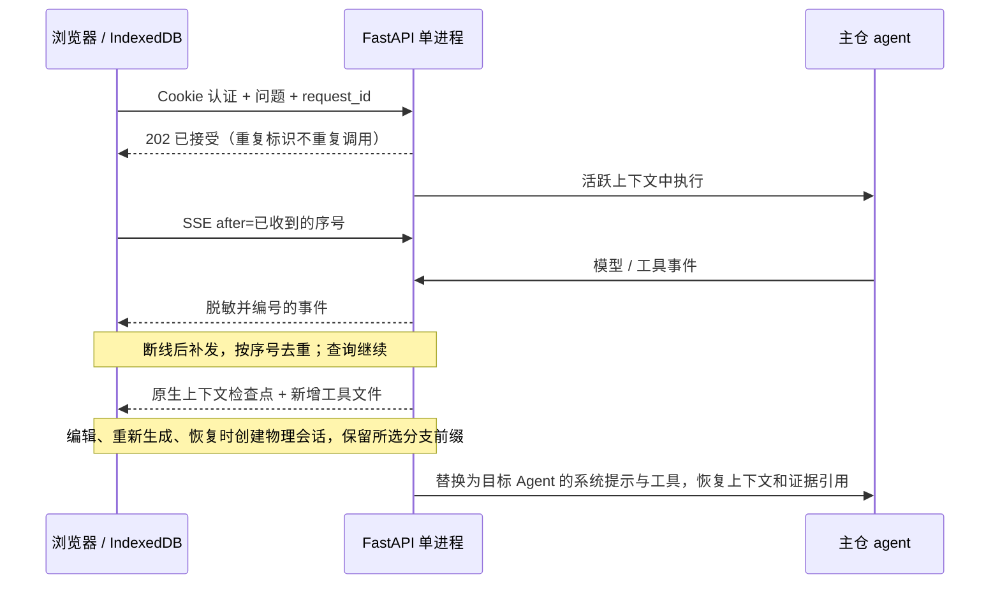

# 循迹 · Agent Chat

独立的 React / TypeScript / Vite 页面与 FastAPI 服务，直接使用主仓 `gh-puller[search]`。
前端组件和样式位于本目录，不依赖 `ui/`、实验 TUI 或研究归档。

## 本地运行

从主仓的 `apps/agent-chat/` 执行：

```bash
uv sync --frozen
cd web
npm ci
npm run build
cd ..
read -rs -p '私人访问口令（至少 12 字符）: ' CHAT_ACCESS_PASSWORD
export CHAT_ACCESS_PASSWORD
CHAT_SECURE_COOKIE=false uv run --frozen uvicorn agent_chat.app:application \
  --factory --host 127.0.0.1 --port 8000 --workers 1 --no-access-log
```

打开 `http://127.0.0.1:8000`。访问口令在终端静默输入，模型与平台密钥在页面设置中输入。
前端开发时另开终端，在 `web/` 执行 `npm run dev`，Vite 将 `/api` 转发到本机 8000 端口。
应用不自动读取任何 `.env`。`CHAT_SECURE_COOKIE=false` 仅用于本机 HTTP；公网保持 `true`。

Python 依赖锁在 `uv.lock`，前端依赖锁在 `web/package-lock.json`。本地的主包来源是 `../..`，
修改主仓源码会直接反映到本地应用。`gh-puller[search]` 的 agent 依赖包含 Codex 和 Claude SDK；
它们的发行包自带 CLI，因此首次同步下载量较大。本应用查询使用 HTTP 模型适配器。

## 使用与数据生命周期

- 新会话默认 GitHub / REST，切换到 GitCode 也默认 REST；第一条问题生成简短标题。
  Agent、模型和思考强度的选择保存在浏览器中；会话中也可切换 Agent。
  新建会话先进入未选中历史的空白页，首次提交问题才创建浏览器会话记录。
- GitHub 支持 REST、DSL、GraphQL、Split；GitCode 支持 REST、DSL；Web 提供搜索和下载。
  PTC A/B 需要服务端 Node；Code 需要显式配置 Docker 容器连接，免费部署中显示为不可用。
- 设置默认沿用实验的模型地址与 `deepseek-v4.1-flash`；模型名和思考强度在输入框底栏调整。
  主包默认不限步数，输出 token 限制为 0 时不向供应商发送限额；供应商仍可能有自身限制。
  Brave 需要密钥，也可选择 Auto / DuckDuckGo。模型供应商须支持所选 thinking / reasoning 参数。
- Enter 发送，Shift+Enter 换行。执行区域显示实际模型、reasoning 与工具事件。停止会取消服务端任务；关闭页面或 SSE 断线不会取消任务。
- GitHub DSL 首次初始化在共享后台线程完成，期间仍可停止查询或访问健康检查。
- 设置分为模型、Agent、工具三页，固定面板内独立滚动，输入即保存。Agent 配置分别保留；工具配置与凭据在使用者之间共享。
  Agent 与工具标题显示可用性圆点，说明通过悬停查看。缺少主包声明的必填凭据时，依赖工具的 Agent 在输入框中禁用；
  判断同时计入当前页面和该会话仍保留在服务端的凭据。选用无需密钥的搜索后端后，相应要求自动解除。
  模型默认发送工具返回的图片，若请求被拒绝，在未输出内容时以 `<image>` 占位重试一次。
- 右上角切换深浅主题。思考与工具按实际事件顺序展示，可展开查看。
- 同一浏览器的历史、事件与非敏感设置保存在 IndexedDB。搜索、重命名、删除与 JSON 导入导出均可在侧栏操作。
  支持直接导入 events.json。编辑问题、重新生成答案会创建分支，版本箭头可返回旧分支。
- 模型和平台密钥只在页面与活跃服务端会话内存中保留。刷新不回填密钥；服务端上下文仍存在时可继续使用。
  新建会话需要重新提供刷新后丢失的密钥。
- 页面导出 `events_<逻辑会话 ID>.json`，历史导出 `chat-history.json`。服务端临时记录为脱敏 JSONL，保留必要 ToolStorage 文件，
  不保存源码快照、原始模型流或研究归档。提供的密钥及跨分片的完整密钥值会被脱敏。
- 空闲会话 60 分钟后释放，运行中不按空闲时间回收。退出会删除该浏览器的服务端会话；删除活跃会话会先停止任务。
  服务重启、清理或免费实例休眠后，可从浏览器检查点继续提问；需要重新输入丢失的密钥。



服务限制为全局最多 8 个活跃会话、2 个同时运行的问题；每次最长 15 分钟，每会话最多 100 次提问、
16 MiB 事件记录与 64 MiB 临时工具文件。超限会给出明确状态，导出后新建会话。
模型 URL 只接受公网 HTTP(S) 地址、80/443 端口，无 URL 凭据；每次连接检查 DNS 并固定实际地址。
Markdown 不执行原始 HTML，远程图片显示为链接。

## 配置从主包发现

主包的 `@register` 收集 agent 的 `defaults`、`runtime_defaults` 与 `tool_configs`。
普通默认值自动推断类型，`option()` 只补充枚举、依赖、可空类型及运行环境绑定。
工具模块中的 `ToolConfig` 定义共享配置和凭据名称，实际密钥始终由调用者提供。

```python
@register
class ResearchAgent(CommonAgent):
    name = "research"
    defaults = {"strategy": option("fast", choices=("fast", "deep")), "candidates": 20}
    tool_configs = (WEB_CONFIG,)
```

`/api/catalog` 直接读取注册目录；设置提交为通用 `options` 字典，由主包校验和构造运行配置。
App 不重复声明 Agent 能力、默认值、枚举或凭据清单。`web/src/ui-model.ts` 是 UI 展示策略的唯一入口，
维护字段标签、数值范围、条件显示与工具描述；未知字段仍可通用渲染。可空的工具结果配置显示主包实际策略值，
但未编辑时仍保留继承语义。
新增配置通常只改主包声明；新增独立 agent 模块还需由主包导入，使装饰器执行。
`concurrency` 属于 agent，是提供给各工具执行器的并发预算；搜索工具另有自己的并发与间隔。
容器连接等操作环境由部署提供，不能通过浏览器任意指定宿主路径。

浏览器仅把用户实际修改的偏好保存为覆盖值；未修改项跟随主包默认值。
旧版平面设置迁移保留模型与共享工具偏好，agent 选项从主包重新取默认值。
已发生的历史事件不因配置改变而改写；后续提问使用当前设置。

## 模型发现与会话恢复

模型 API Key 粘贴或失焦后，应用通过同源 `/api/models` 查询供应商的 `/models` 接口，
返回模型 ID 下拉列表。测试连接按钮使用同一接口，不发起付费推理；接口成功不保证每个模型都支持工具或思考参数。
列表缓存在浏览器，密钥不缓存；不支持 `/models` 的供应商会显示明确错误，保留已选模型。
模型设置可切换中文和英文，密码输入均可显隐。模型及平台 Key 都可测试连接；GitHub／GitCode 检查登录接口，
Brave 测试会消耗一次搜索请求（按钮悬停提示）。所有 API Key 在粘贴或失焦时自动测试一次，输入过程中不发送请求，
相同值粘贴后再失焦不会重复测试；仍可点击测试按钮主动重试。底部支持重置、导入和导出非敏感配置。

浏览器中的逻辑会话包含所选事件时间线与历史分支；物理会话是服务端运行与 SSE 的隔离单位。
每次提问从所选分支创建一个物理会话，复制仍存活会话的内存凭据，然后释放旧执行会话。
新问题沿用完整历史；编辑和重新生成只取目标问题之前的前缀。分支和事件替换使用串行 IndexedDB 事务。
只切换 Agent 不写事件，因此 A → B → A 不会重复历史、叠加系统提示或修改旧时间戳。

`context/checkpoint` 记录原生用户／模型／工具消息、工具结果保留策略与引用、提供方证据索引以及新增临时文件。
恢复时验证 JSON、事件序号、消息配对、文件路径与大小；只写入新会话专属目录。
系统提示和工具定义始终取自目标主包 Agent。GitHub／GitCode／Web 的已保存证据可以继续读取；
模型与平台密钥不属于检查点。Code 的外部容器、运行中命令与第三方 MCP 会话不属于可携带状态。

旧版记录只有展示事件，缺少原生图片与工具文件。此类历史也能继续提问，界面与模型上下文都会明确说明
证据缺失，需要时重新读取来源。中断时尚未收到的服务端输出无法从浏览器凭空恢复。
检查点计入事件保留上限；大附件或很长上下文超限时会显示检查点失败，不宣称完整恢复。
历史／事件导入文件上限为 32 MiB；设置导入上限为 1 MiB。

## 镜像

在主仓根目录构建。Git 提交同时标识应用和 `gh-puller` 源码，依赖使用锁文件：

```bash
docker build -f apps/agent-chat/Dockerfile \
  --build-arg APP_REVISION="$(git rev-parse HEAD)" -t agent-chat:local .
read -rs -p '私人访问口令（至少 12 字符）: ' CHAT_ACCESS_PASSWORD
export CHAT_ACCESS_PASSWORD
docker run --rm --name agent-chat-local --memory=512m -p 127.0.0.1:8000:10000 \
  -e CHAT_ACCESS_PASSWORD -e CHAT_SECURE_COOKIE=false agent-chat:local
```

多阶段构建分别产出前端与 Python wheels，运行层采用非 root 用户、一个 Uvicorn worker。
源码包在安装时强制重新构建，避免 uv 的 wheel 缓存沿用旧源码；第三方依赖仍复用缓存。
Dockerfile 专属 ignore 文件仅允许主包、应用代码与构建元数据进入上下文，不包含实验目录、本机 `.env`、
宿主机虚拟环境、浏览器历史或测试替身。Node 仅用于 PTC；镜像不配置 Docker daemon。
`APP_REVISION` 用于本机镜像，Render 运行时优先读取 `RENDER_GIT_COMMIT`。

环境变量：

| 变量 | 用途 |
| --- | --- |
| `CHAT_ACCESS_PASSWORD` | 必填，至少 12 字符的私人访问口令 |
| `CHAT_SECURE_COOKIE` | 默认 `true`；本机 HTTP 才设 `false` |
| `PORT` | 镜像监听端口，默认 10000 |
| `CHAT_STATIC_DIR` | 前端构建产物位置，镜像已配置 |
| `CHAT_CODE_CONTAINER` / `CHAT_CODE_WORKDIR` | 可选，仅在自行提供 Docker CLI 与容器连接时启用 Code |

## Render 免费部署

根目录 [render.yaml](../../render.yaml) 定义一个新加坡区域的 Free Docker Web Service，单实例，无数据库、磁盘、
付费附加服务或自动升级。源码仓库为 `Delva0/gh-puller`，部署分支 `agent-chat`；构建上下文是主仓根目录，
Dockerfile 是 `apps/agent-chat/Dockerfile`，健康检查 `/api/health`，自动部署关闭。

当前公网地址：[循迹 Agent Chat](https://agent-chat-pdl4.onrender.com)。
服务管理页：[Render Dashboard](https://dashboard.render.com/web/srv-dasjnn8473hc738kgnk0)。
可复用的部署、持续交付和运维流程见 [agent-chat-render 技能](../../.agents/skills/agent-chat-render/SKILL.md)。

1. 将验证过的应用提交推送到 `agent-chat` 分支。
2. 在 Render 的 **My Workspace → New → Blueprint** 连接 `Delva0/gh-puller`，选择 `agent-chat` 分支和根目录 `render.yaml`。
3. 在 Blueprint 提示中填写 `CHAT_ACCESS_PASSWORD`，确认服务方案为 **Free**，应用配置。
4. 部署完成后打开服务的 `https://…onrender.com` 地址。在登录页输入访问口令，在设置中输入模型与平台密钥。
5. 后续部署选择已验证的具体提交；对照 `/api/health` 的 `revision` 与 Render deploy 的 commit SHA。

当前 Render 插件的服务创建工具不支持完整 Docker 配置，因此首次 Blueprint 创建需要 Dashboard。
创建后可通过插件检查部署、日志和指标。Schema 验证使用 [Render 官方 JSON Schema](https://render.com/schema/render.yaml.json)。

### 后续更新

在主仓 `/home/delva/projects/gh-puller` 修改代码，完成下文的相关验证并提交，再推送部署分支：

```bash
git -C /home/delva/projects/gh-puller push origin HEAD:agent-chat
```

当前推送不会自动发布。在服务管理页选择 **Manual Deploy → Deploy latest commit**，或通过 Render 插件触发部署。
部署结束后确认状态为 `Live`，并核对 `/api/health` 的 `revision` 与本次提交相同。服务地址保持不变。
Graphub 是独立实验仓，其提交不会自动进入此部署分支。

如需推送后自动部署，先确认 Render 已连接 GitHub，再将 `render.yaml` 中的 `autoDeployTrigger: "off"`
改为 `autoDeployTrigger: commit` 并同步 Blueprint；之后推送 `agent-chat` 即触发构建。
参见 [Render 部署说明](https://render.com/docs/deploys)。

[Render Free](https://render.com/docs/free) 有休眠、冷启动、资源及月度额度限制；空闲 15 分钟可能休眠，唤醒通常约一分钟，
内存与临时文件不能跨重启保留。Free 实例内存 512 MB，不适合大量并发或无限历史上下文。
托管按 Free 方案配置；模型和收费搜索 API 的调用费由各供应商收取。

## 验证

```bash
# apps/agent-chat/
uv run --frozen pytest -q
uv run --frozen ruff check agent_chat tests
cd web
npm run build
npx playwright install chromium --only-shell
npm test
```

浏览器测试启动真实 FastAPI 服务和主仓 agent，仅替换外部模型 / 来源 HTTP 传输。覆盖登录、密钥设置、流式输出、
工具展开、复制、会话切换和搜索、刷新继续、停止、历史导入导出、会话恢复、上下文跨 Agent 迁移、分支编辑与再生成、配置导入导出、模型发现、双语和侧栏缩放，以及移动端长代码、表格和历史列表。
测试报告与截图保存在 `web/playwright-report/` 和 `web/test-results/`，不会提交。

公网验收必须另行在真实 HTTPS 服务上执行 GitHub、GitCode、Web 的真实查询，并检查刷新、停止、事件导出和内存。
自动模拟测试通过不代表公网验收完成。

真实浏览器验收脚本是 `web/scripts/live-acceptance.mjs`。在进程环境中提供 `CHAT_TEST_URL`、
`CHAT_ACCESS_PASSWORD`、`OPENAI_API_KEY`、`GH_TOKEN`、`GITCODE_TOKEN`、`BRAVE_SEARCH_API_KEY`，
然后从 `web/` 执行 `node scripts/live-acceptance.mjs`。可选 `OPENAI_BASE_URL` 和 `CHAT_TEST_MODEL` 覆盖模型设置。
脚本不启用浏览器 trace、不输出密钥；脱敏事件与截图保存到忽略的 `verification/live-browser/`。
该脚本会发生真实供应商调用费用；验收使用主包默认配置和页面模型设置，每条查询最多等待 240 秒；结束后退出并释放测试会话。
