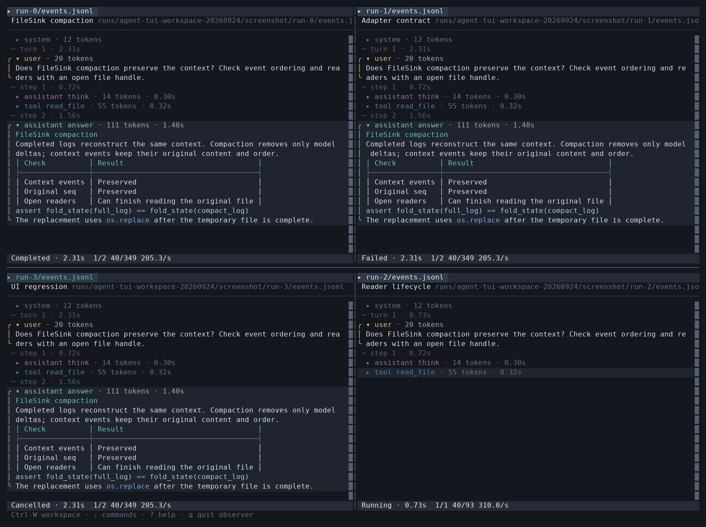
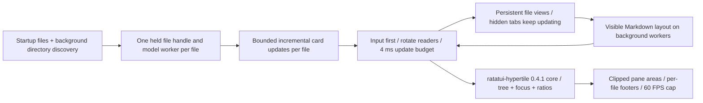

# Agent TUI

Read-only Rust + Ratatui observer for canonical Agent JSONL files. One process monitors
multiple files in a dockable workspace. It requires no credentials, model calls, WebSocket
service, or Python runtime. It never starts or stops agents. The existing Graphub `tui`
entry point is unchanged.

This application owns its Cargo build, dependencies and terminal interface. The canonical
event contract, adapters and FileSink remain in `gh_puller/agent/`; JSONL is their boundary
with this observer. The sibling `apps/agent-monitor/` provides the Web interface.

## Build and run

From the gh-puller repository, with a Rust toolchain and a native C linker installed:

```bash
cargo build --release --locked --manifest-path apps/agent-tui/Cargo.toml
cargo install --locked --path apps/agent-tui
agent-tui /path/to/monitor/session.jsonl
agent-tui first.jsonl second.jsonl
agent-tui --watch ./sessions
agent-tui first.jsonl --watch ./sessions --watch ./other-sessions
```

The locked build was verified with Rust 1.98.1 on Linux. Cargo installs into
`~/.cargo/bin`; include that directory in `PATH`. A missing file is awaited. The observer
opens the file once and retains its handle until `session/end`, including across the
FileSink's atomic compaction. Partial JSON lines and split UTF-8 are buffered. At session
end it stops reading and freezes event clocks while keeping the browser open. An open
session is **Running** until its end event is received. An empty file waits for a session;
opening a file does not determine the session state.
Malformed complete records stop reconstruction at the valid prefix and display the error.

Sources are fixed by the startup command. `--watch` scans existing and new `.jsonl` files
recursively every second in a background worker, without following directory symlinks.
Missing files and directories are awaited. Overlapping sources and file symlinks are
coalesced by normalized path; each file has one reader and one persistent reading view.
A file error stops only that reader and remains visible in its footer and the session list.

Every launch starts with one pane and multiple tabs. Layout is not saved. Newly discovered
files join the current pane as background tabs without changing the active file. Closing a
tab hides its view while monitoring continues. `Ctrl-W f` lists every monitored file,
including hidden ones; type to filter and press Enter to open or move that file here.
After all tabs close, the session list stays open and monitoring continues. Sources cannot
be added from inside the workspace.



## Workspace

Press `Ctrl-W`, release it, then press one key below. The temporary hint shows the choices;
Esc cancels the prefix. These keys also work while a file popup is open.

| Following key | Action |
|---|---|
| `h/j/k/l` or arrows | Focus the pane to the left / below / above / right |
| `n/p` | Next / previous tab in this pane |
| `v/s` | Split left-right / top-bottom; the new pane shows the session list |
| `H/J/K/L` or Shift+arrow | Move the current tab in that direction; create a split if needed |
| `c` | Close the current tab; keep consuming that file |
| `z` | Maximize / restore the focused pane |
| `f` | List monitored sessions, including hidden tabs |
| `r` | Resize mode: arrows move a divider; Enter or Esc finishes |

Drag a tab along a tab bar to reorder it, or onto another tab bar to move that one tab.
Drop in the center of another pane to merge the entire source tab group. Drop at a pane's
left, right, top or bottom edge to split. The outlined preview shows the destination;
Esc cancels a drag. Drag a divider to resize it. Click to focus a pane. The wheel acts on
the pane under the pointer without moving keyboard focus. Text selection, scrollbars and
tabs capture their own drags so crossing a pane boundary cannot manipulate another file.

Each file retains its fold choices, search, scroll, selection and follow state as it moves
or hides. Every visible pane has its own file footer; statistics are never combined.
If any pane would be smaller than 32 columns or 8 rows, only the focused pane is displayed
until there is room again. This does not modify the split tree or its ratios. `Ctrl-W`
directional focus still works in this temporary view and while maximized.

All workspace actions appear in `:` / Ctrl-P / `m`, including tab reordering, merging,
individual divider adjustments, and all four split directions. Commands are labeled
**File** or **Workspace**. File commands keep the file selected when the palette opened,
even if focus subsequently changes. Workspace layout commands keep their opening pane.
Theme (`t`), help, and quit are global. `q`, `quit`, and Ctrl-C exit the entire observer;
agents keep running. Inside search, the session filter, or the palette, `q` is text.
Ctrl-P and Ctrl-C remain available in those inputs.

## File interaction

These actions affect the active file in the focused pane. In particular, `1/2/3` never
change another file, `y` copies this file’s latest answer, and Tab / Shift-Tab navigate
cards, not tabs.

| Action | Key / mouse |
|---|---|
| Scroll / page | `j/k`, arrows, PgUp/PgDn, wheel |
| Top / bottom and follow | Home / End |
| Next / previous card | Tab / Shift-Tab |
| Toggle card | Enter, Space, click title |
| Collapse all | `1` |
| Expand only user and assistant answer | `2` |
| Expand all | `3` |
| Toggle line wrapping | `w`, or `wrap` in the command palette |
| Browse long lines with wrapping off | `h/l`, left/right |
| Select text | Drag over body; selection survives valid updates and resize |
| Copy selection or full focused card | `c`, right click |
| Copy latest assistant answer | `y` |
| Search body and tool names | `/`, then `n/N` |
| Next / previous turn | `]` / `[` |
| Next / previous step | `}` / `{` |
| Next error | `!` |
| Detailed token statistics | `s` |
| Commands / temporary menu / help | `:` or Ctrl-P / `m` / `?` |
| Cycle dark themes | `t` |
| Open a link by its label | Ctrl+left click (terminal link handling) |
| Open focused card's first HTTP(S) Markdown link | `o` |
| Close popup / clear selection and search | Esc |
| Exit | `q`, Ctrl-C |

Copy uses OSC 52, with tmux passthrough when `TMUX` is set. Delivery to the desktop
clipboard depends on terminal permissions; tmux may need `set -g allow-passthrough on`.
Markdown links show their labels. OSC 8 carries their targets for the terminal's native
link handling, including Ctrl+click. The `o` shortcut opens the first link in the focused
card using `xdg-open` on Linux or `open` on macOS. The observer never executes tool calls
or writes the input log.

The default **Conversation** view expands only user and assistant answer cards. `1`, `2`
and `3` select **Collapsed**, **Conversation** and **Expanded**. The command palette offers
`collapse`, `conversation` and `expand` and shows the current view. Manual toggles and search
reveal cards individually; the view reads **Custom** when the result differs from all three
presets. Returning to a matching preset restores its name. New cards follow the active
preset, or the last preset while Custom; existing choices survive matching context updates.

Every collapsed card occupies one line with no border and a dimmer title. Expanding a tool shows its formatted
arguments and **context result**, with long tool output wrapped instead of clipped.
When a context update changes a result, the card also retains the output from its original
context append under **Recorded result**. Both versions are searchable and copyable;
counts and folded state still follow current context. Activity never replaces context results.
Tool headers show `Failed` on errors and omit successful completion labels and error payloads.
Expanded cards end on their last content row. Focus uses a subtle card background; selected
text has a stronger background. Search matches use an amber background, including tool names
and matches across Markdown formatting or wrapped rows. Selection takes priority over search
highlighting. Turn and step separators use dim text on the page background.
All card bodies share Markdown rendering and preserve soft newlines; literal `\n` text is
not decoded a second time. Canonical `tool_defs` parts show tool names and descriptions as
text, preserving description newlines, with input schemas in JSON code blocks. Other fields
remain visible as structured data. Links, code and tables retain their formatting. Wrapping
is on by default and applies to all content, including code and tables. `w` toggles wrapping
without changing text, selection or link targets; the command palette shows its current state.

Every card header includes tokens and any recorded time. Tool time covers execution. Think and answer
time sums observed output phases within the request: each phase starts at its first nonempty
delta and ends at the next output part, response, error or turn end. Interleaved parts accumulate
their own intervals. First-output waits and tool execution are excluded from these output
times. These are adapter receipt intervals, not server generation measurements. A context
commit or matching replacement retains the timing. When phase timing is unavailable, including
compact history, think and answer cards show `request 1.56s`, measured from `model/request` to
`model/response` or `model/error` using `elapsedMs`. This is the total request duration shared
by its output cards, so it must not be summed across cards. Untimed cards, including user/system
content, omit the time field. An unfinished output phase with no recorded boundary remains unknown.
Scrolling up pauses automatic following; incoming events still update the cards. End returns
to the bottom and resumes following an open session. User-expanded
cards stay expanded. Each pane shows its tab bar, session title and path; file popups stay inside their pane.

The footer combines status and statistics on one line, for example
`Running · 1.24s  1/2 40/349 —/s` or `Completed · 2.31s  1/2 40/349 —/s`. Duration sums
completed turns plus the current open turn, including model and tool waits. The open turn
heading also updates during execution. Between events, the reader advances the display clock
every 100 ms, anchored to recorded `elapsedMs` and `ts` when available, then using a local
monotonic clock. Recorded boundaries calibrate and freeze the durations. Time before,
between and after turns is excluded. Missing or incomplete final turn timing displays `—`; the observer
does not substitute the session's recorded lifetime. Longer durations use hours and minutes,
such as `6h 10m 41s`. The numbers are
`turn/steps-in-turn input/output speed/s`. Input is frozen at the first
request in the turn. Output includes reasoning and is corrected by `usage.output`.
Speed covers first nonempty delta through model completion for each request, excluding
tool waits and first-output waits. Compact history has no deltas, so its speed is `—`.
Values at or above 1000 use two decimal places with `K`, including millions.

`s` explains card timing, the local `o200k_base` counts, per-Item framing estimate, 1024-token image
placeholder, input-usage calibration, and known/unknown usage counters. Context composition,
latest request, current turn, session totals and cache reads are separate. Local counts are
estimates of model-visible content, not provider billing. Images display metadata only;
embedded base64 is neither rendered nor counted as text.

## Data and performance contracts



Only `context/append` and the four canonical role append events extend Context;
`context/set` replaces it. `agent/set` and single-segment agent facets follow Python
`fold_state()`. Backend configuration and v5 metadata never invent turn/step markers.
Unmarked content remains ungrouped current context. Model requests contribute to statistics
without adding visible headings. Only recorded `turn` and `step` events create headings.

Deltas are provisional cards, responses reconcile them, and Context commits reuse their
identities. Tools pair on `call_id`. Context replacement uses Item IDs, call IDs and exact
content identities (with duplicate occurrence tracking) to preserve recognizable cards.
Activity without a Context fact stays visibly provisional. Opaque/unknown typed content
is displayed without inventing hidden text.

The reader and tokenizer cannot block terminal input. Changes are batched through a bounded
channel. Sends are cancellable even when a queue is full. The UI services input first,
then consumes at most one batch per file per pass with a 4 ms pass budget, rotating the
starting file across passes. Card heights use an incremental prefix index. Only visible
expanded cards request Markdown layout. Hidden tabs do not render or enqueue body layout jobs. Clean visible panes reuse
their last rendered cells; focus changes and workspace overlays do not re-render their cards.
The cache is invalidated by file updates, reading actions, geometry or theme changes.
Collapsed card contents are not parsed. Layout results are cached
by card revision, width and expansion; selection uses text byte offsets rather than screen
coordinates. Idle sessions do not redraw the body. All event clocks come from the log.

## Verify and reproduce

```bash
cargo test --locked --manifest-path apps/agent-tui/Cargo.toml
cargo clippy --locked --all-targets --manifest-path apps/agent-tui/Cargo.toml -- -D warnings
uv run --frozen pytest tests/agent -q
```

Offline tools require an explicit new output directory and preserve prior runs:

```bash
uv run --frozen python apps/agent-tui/tools/verify_adapters.py \
  --binary apps/agent-tui/target/release/agent-tui --output /tmp/agent-tui-parity-new
uv run --frozen python apps/agent-tui/tools/benchmark.py \
  --binary apps/agent-tui/target/release/agent-tui --output /tmp/agent-tui-benchmark-new
uv run --frozen python apps/agent-tui/tools/workspace_benchmark.py \
  --binary apps/agent-tui/target/release/agent-tui --output /tmp/agent-tui-workspace-new
uv run --frozen python apps/agent-tui/tools/demo.py > /tmp/agent-tui-demo.jsonl
agent-tui /tmp/agent-tui-demo.jsonl
```

The parity tool records existing **offline** adapter unit tests and compares every Rust
prefix to Python `fold_state()`, then checks compact replay. The benchmark uses Linux PTYs,
100,000 historical events, 200 appended events/s/window, one and four simultaneous windows,
and 100 key-to-render samples per process. CPU is a percentage of one logical core;
RSS includes the tokenizer, full current Context and projected cards. Its end-to-end
latency includes PTY delivery, event handling and terminal frame flush, but excludes a GUI
terminal emulator's display/compositor. `all_single_input_frames` must be true for timestamp
pairing to be valid. The benchmark is synthetic, not a bound on arbitrary giant records.

`--fold FILE`, `--prefixes FILE`, and `--inspect FILE` provide deterministic JSON output.
`--snapshot FILE cells.json` captures the original 120×42 single-file TestBackend view.
`--workspace-snapshot cells.json FILE...` renders a 160×54 workspace with up to four panes;
extra files remain background tabs. `tools/screenshot.py` converts its real cells to PNG with Pillow and optional CJK fonts; it does not generate a
mockup. Runtime logs, benchmark fixtures, traces and build output stay outside Git.

Rendering uses [Ratatui](https://ratatui.rs/tutorials/counter-app/basic-app/),
[pulldown-cmark](https://github.com/pulldown-cmark/pulldown-cmark), and the bundled
[tiktoken-rs](https://github.com/zurawiki/tiktoken-rs) `o200k_base` vocabulary.

The workspace benchmark measures one process with one file, eight files with one visible,
and eight files with four visible. Every file has 100,000 historical records and receives
200 appended records/s for 10 seconds. It records CPU, peak sampled RSS, all per-file event
counts, actual visible file IDs, and 100 input-to-flush samples on `CLOCK_MONOTONIC`.
Each sample retains its send and frame timestamps. It rejects invalid timestamp
pairing and checks that every hidden file catches up. [Measured results](docs/workspace-performance.md)
include the previous single-file release baseline on the same machine.

The tiling tree, rectangles, directional focus and ratios are owned by the pinned
[ratatui-hypertile 0.4.1 core](https://docs.rs/ratatui-hypertile/0.4.1/ratatui_hypertile/).
The application owns tabs, docking previews, selectors, modal routing and mouse capture;
it does not use the extras runtime or its layout/content modes.
