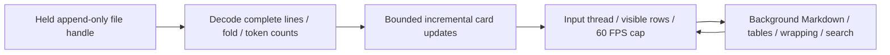

# Agent TUI

Read-only Rust + Ratatui observer for one canonical Agent JSONL file. It requires no
credentials, model calls, WebSocket service, or Python runtime. Each agent gets a separate
terminal or tmux window. The existing Graphub `tui` entry point is unchanged.

This application owns its Cargo build, dependencies and terminal interface. The canonical
event contract, adapters and FileSink remain in `gh_puller/agent/`; JSONL is their boundary
with this observer. The sibling `apps/agent-monitor/` provides the Web interface.

## Build and run

From the gh-puller repository, with a Rust toolchain and a native C linker installed:

```bash
cargo build --release --locked --manifest-path apps/agent-tui/Cargo.toml
cargo install --locked --path apps/agent-tui
agent-tui /path/to/monitor/session.jsonl
```

The locked build was verified with Rust 1.98.1 on Linux. Cargo installs into
`~/.cargo/bin`; include that directory in `PATH`. A missing file is awaited. The observer
opens the file once and retains its handle until `session/end`, including across the
FileSink's atomic compaction. Partial JSON lines and split UTF-8 are buffered. At session
end it stops reading and freezes event clocks while keeping the browser open. An EOF
without an end event is labeled **End not recorded**, including when watching a historical file.
Malformed complete records stop reconstruction at the valid prefix and display the error.

## Interaction

| Action | Key / mouse |
|---|---|
| Scroll / page | `j/k`, arrows, PgUp/PgDn, wheel |
| Top / bottom and follow | Home / End |
| Next / previous card | Tab / Shift-Tab |
| Toggle card | Enter, Space, click title |
| Expand / collapse all | `e` / `E` |
| Browse wide code or tables | `h/l`, left/right |
| Select text | Drag over body; selection survives valid updates and resize |
| Copy selection or full focused card | `c`, right click |
| Copy latest assistant answer | `y` |
| Search body and tool names | `/`, then `n/N` |
| Next / previous turn | `]` / `[` |
| Next / previous step | `}` / `{` |
| Next error | `!` |
| Detailed token statistics | `s` |
| Commands / temporary menu / help | `:` or Ctrl-P / `m` / `?` |
| Cycle dark themes | `t` |
| Open a link by its label | Ctrl+left click (terminal link handling) |
| Open focused card's first HTTP(S) Markdown link | `o` |
| Close popup / clear selection | Esc |
| Exit | `q`, Ctrl-C |

Copy uses OSC 52, with tmux passthrough when `TMUX` is set. Delivery to the desktop
clipboard depends on terminal permissions; tmux may need `set -g allow-passthrough on`.
Markdown links show their labels. OSC 8 carries their targets for the terminal's native
link handling, including Ctrl+click. The `o` shortcut opens the first link in the focused
card using `xdg-open` on Linux or `open` on macOS. The observer never executes tool calls
or writes the input log.

Thought, system and tool cards start collapsed, answers and user cards expanded. Every
collapsed card occupies one line with no border. Expanding a tool shows its formatted
arguments and **context result**, with long tool output wrapped instead of clipped.
When a context update changes a result, the card also retains the output from its original
context append under **Recorded result**. Both versions are searchable and copyable;
counts and folded state still follow current context. Activity never replaces context results.
Tool headers show `Failed` on errors and omit successful completion labels and error payloads.
Expanded cards end on their last content row. User/system/thought/answer cards do not
acquire timestamps or stream spans.
Scrolling up pauses automatic following; End clears the new-event indicator. User-expanded
cards stay expanded. Top chrome contains only session title and path; panels are temporary.

The footer combines status and statistics on one line, for example
`Completed · 2.31s  1/2 40/349 —/s`. Duration sums the session's `turn/start`–`turn/end`
intervals using `elapsedMs`, including model and tool waits. It excludes idle time before,
between and after turns. Missing or incomplete turn timing displays `—`; the observer
does not substitute the session's recorded lifetime. Longer durations use hours and minutes,
such as `6h 10m 41s`. The numbers are
`turn/steps-in-turn input/output speed/s`. Input is frozen at the first
request in the turn. Output includes reasoning and is corrected by `usage.output`.
Speed covers first nonempty delta through model completion for each request, excluding
tool waits and first-output waits. Compact history has no deltas, so its speed is `—`.
Values at or above 1000 use two decimal places with `K`, including millions.

`s` explains the local `o200k_base` counts, per-Item framing estimate, 1024-token image
placeholder, input-usage calibration, and known/unknown usage counters. Context composition,
latest request, current turn, session totals and cache reads are separate. Local counts are
estimates of model-visible content, not provider billing. Images display metadata only;
embedded base64 is neither rendered nor counted as text.

## Data and performance contracts



Only `context/append` and the four canonical role append events extend Context;
`context/set` replaces it. `agent/set` and single-segment agent facets follow Python
`fold_state()`. Backend configuration and v5 metadata never invent turn/step markers.
Unmarked content remains ungrouped current context. Model requests contribute to statistics
without adding visible headings. Only recorded `turn` and `step` events create headings.

Deltas are provisional cards, responses reconcile them, and Context commits reuse their
identities. Tools pair on `call_id`. Context replacement uses Item IDs, call IDs and exact
content identities (with duplicate occurrence tracking) to preserve recognizable cards.
Activity without a Context fact stays visibly provisional. Opaque/unknown typed content
is displayed without inventing hidden text.

The reader and tokenizer cannot block terminal input. Changes are batched through a bounded
channel; card heights use an incremental prefix index. Only visible expanded cards request
Markdown layout. Collapsed card contents are not parsed. Layout results are cached
by card revision, width and expansion; selection uses text byte offsets rather than screen
coordinates. Idle sessions do not redraw the body. All event clocks come from the log.

## Verify and reproduce

```bash
cargo test --locked --manifest-path apps/agent-tui/Cargo.toml
cargo clippy --locked --all-targets --manifest-path apps/agent-tui/Cargo.toml -- -D warnings
uv run --frozen pytest tests/agent -q
```

Offline tools require an explicit new output directory and preserve prior runs:

```bash
uv run --frozen python apps/agent-tui/tools/verify_adapters.py \
  --binary apps/agent-tui/target/release/agent-tui --output /tmp/agent-tui-parity-new
uv run --frozen python apps/agent-tui/tools/benchmark.py \
  --binary apps/agent-tui/target/release/agent-tui --output /tmp/agent-tui-benchmark-new
uv run --frozen python apps/agent-tui/tools/demo.py > /tmp/agent-tui-demo.jsonl
agent-tui /tmp/agent-tui-demo.jsonl
```

The parity tool records existing **offline** adapter unit tests and compares every Rust
prefix to Python `fold_state()`, then checks compact replay. The benchmark uses Linux PTYs,
100,000 historical events, 200 appended events/s/window, one and four simultaneous windows,
and 100 key-to-render samples per process. CPU is a percentage of one logical core;
RSS includes the tokenizer, full current Context and projected cards. Its end-to-end
latency includes PTY delivery, event handling and terminal frame flush, but excludes a GUI
terminal emulator's display/compositor. `all_single_input_frames` must be true for timestamp
pairing to be valid. The benchmark is synthetic, not a bound on arbitrary giant records.

`--fold FILE`, `--prefixes FILE`, and `--inspect FILE` provide deterministic JSON output.
`--snapshot FILE cells.json` captures a 120×42 Ratatui TestBackend frame. `tools/screenshot.py`
converts its real cells to PNG with Pillow and optional CJK fonts; it does not generate a
mockup. Runtime logs, benchmark fixtures, traces and build output stay outside Git.

Rendering uses [Ratatui](https://ratatui.rs/tutorials/counter-app/basic-app/),
[pulldown-cmark](https://github.com/pulldown-cmark/pulldown-cmark), and the bundled
[tiktoken-rs](https://github.com/zurawiki/tiktoken-rs) `o200k_base` vocabulary.
