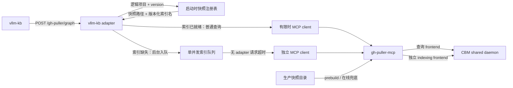

# vllm-kb adapter

面向 [vllm-kb 对接清单][vllm-kb-checklist]的版本化 MCP 转发层。它公开
`/gh-puller/graph` 单端点，并只暴露 `search_graph`、
`search_code`、`trace_path`、`query_graph`、`get_architecture`、`detect_changes`。

本文件是该组件对接契约、生产快照布局和运维步骤的维护入口。`archive/` 只保留原始材料，
不作为当前配置依据；生产约定变化时更新本文件。

实现入口分别是：[快照与版本路由](vllm_kb_adapter/snapshots.py)、
[六工具适配](vllm_kb_adapter/adapter.py)、[在线索引状态机](vllm_kb_adapter/indexing.py)、
[预构建与绑定审计](vllm_kb_adapter/prebuild.py)；长索引的查询流隔离位于
[gh-puller-mcp backend](../gh-puller-mcp/gh_puller_mcp/backend.py)。

## 运行模型



`prebuild` 是主路径：发布前尽量构建全部 vLLM 与 vLLM Ascend 版本。服务启动时审计索引名与
源码根目录；索引已存在但绑定错误时拒绝启动，单纯缺失则允许启动。缺失版本的首个图请求只把
`index_repository(mode="full")` 放入后台队列并立即返回状态，不等待大仓建图完成。队列按内部
索引名 singleflight，整个进程同时只构建一个索引；普通查询和建索引使用不同的持久 frontend，
长时间建图不会占住 gh-puller-mcp 的查询流。

## 生产快照布局

生产主机使用 `/home/xxx` 下两个仓库专属的固定布局，不是同一仓库的两种可选格式：

```text
/home/xxx/
├── snapshots-vllm/
│   └── <version>/
│       └── vllm-<version>/
└── snapshots-vllm-ascend/
    └── v<version>/
        └── vllm-ascend-<version>/
```

例如：

```text
/home/xxx/snapshots-vllm/0.23.0/vllm-0.23.0
/home/xxx/snapshots-vllm-ascend/v0.23.0rc1/vllm-ascend-0.23.0rc1
```

Ascend 的外层版本目录带 `v`，内层源码目录不带；普通 vLLM 的两层版本字段都不带 `v`。
注册表把版本按 PEP 440 归一化，并生成以下路由：

| 客户端 `project` | 源码目录 | CBM 内部索引名 | 省略 `version` 时当前选择 |
|---|---|---|---|
| `vllm-project/vllm` | `/home/xxx/snapshots-vllm/<version>/vllm-<version>` | `vllm-kb-vllm-<normalized-version>` | `0.23.0` |
| `vllm-project/vllm-ascend` | `/home/xxx/snapshots-vllm-ascend/v<version>/vllm-ascend-<version>` | `vllm-kb-vllm-ascend-<normalized-version>` | `0.25.1rc1` |

<details>
<summary>当前生产版本目录</summary>

`snapshots-vllm`：

```text
0.7.1, 0.7.3, 0.8.4, 0.8.5, 0.9.0, 0.9.1, 0.9.2,
0.10.0, 0.10.1, 0.10.2, 0.11.0, 0.12.0, 0.13.0, 0.14.0,
0.15.0, 0.16.0, 0.17.0, 0.18.0, 0.19.1, 0.20.2, 0.22.1, 0.23.0
```

`snapshots-vllm-ascend`：

```text
v0.7.1rc1, v0.7.3rc1, v0.7.3rc2, v0.7.3, v0.7.3.post1,
v0.8.4rc1, v0.8.4rc2, v0.8.5rc1,
v0.9.0rc1, v0.9.0rc2, v0.9.1rc1, v0.9.1rc2, v0.9.1rc3,
v0.9.1, v0.9.2rc1,
v0.10.0rc1, v0.10.1rc1, v0.10.2rc1,
v0.11.0rc0, v0.11.0rc1, v0.11.0rc2, v0.11.0rc3, v0.11.0,
v0.12.0rc1, v0.13.0rc1, v0.13.0rc2, v0.13.0rc3, v0.13.0,
v0.14.0rc1, v0.15.0rc1, v0.16.0rc1, v0.17.0rc1,
v0.18.0rc1, v0.18.0, v0.19.1rc1, v0.20.2rc1, v0.21.0rc1,
v0.22.1rc1, v0.23.0rc1, v0.23.0, v0.24.0rc1, v0.25.1rc1
```

</details>

可在生产主机核对实际目录；新增或下线快照时同时更新上面的清单并重新执行 `prebuild`：

```bash
find /home/xxx/snapshots-vllm \
  /home/xxx/snapshots-vllm-ascend \
  -mindepth 2 -maxdepth 2 -type d | sort -V
```

两个根目录都必须存在且非空。每个直接子目录都会被视为版本：目录名必须是合法 PEP 440
版本，且对应的内层源码目录必须存在；无关目录也会使注册表构建失败。vLLM 与 vLLM Ascend
各自选择版本，不推断两者的配套关系。

## 版本与 qn 路由契约

所有公开工具都接受可选 `version`。显式版本必须命中快照，可带前导 `v`；省略或传空值时，
选择该逻辑项目中 PEP 440 顺序最高的版本。adapter 选定快照后移除 `version`，把逻辑项目改写
为内部索引名，再调用 gh-puller-mcp。例如：

```text
project=vllm-project/vllm, version=v0.23.0
    -> /home/xxx/snapshots-vllm/0.23.0/vllm-0.23.0
    -> project=vllm-kb-vllm-0.23.0
```

调用方只有在 `params.arguments.version` 中显式传值，才能选择历史版本；
`repo_project_map` 只把仓库简名映射为逻辑项目，不负责选择版本。需要按部署版本检索时，
调用方必须在每个独立请求中传同一 `version`。

CBM v0.10.8 同时接受短函数名和 `search_graph` 返回的完整 qn。完整 qn 的
`<project>.` 前缀属于规范标识，必须原样传给 `trace_path`，不能剥成 module-relative 名：

```text
vllm-kb-vllm-0.23.0.tests.utils.do_auth        # valid complete qn
tests.utils.do_auth                             # not the same identifier
```

精确追踪必须满足：

```text
forwarded trace_path.project == selected snapshot.index_name
trace_path.function_name starts with selected snapshot.index_name + "."
```

完整 qn 被拒绝时，应依次检查 CBM 是否至少为 v0.10.8、adapter 实际选择的 `version`、转发后的
`project` 和搜索结果 qn 是否来自同一快照；不要通过删除 qn 前缀规避版本或路由错配。短名可以
传给 `trace_path`，但可能返回同名候选；需要确定性追踪和 cursor 翻页时使用完整 qn，并保持参数不变。

## 部署

以下命令均从 gh-puller 仓库根目录运行。先以默认 `all` 工具档位启动 gh-puller-mcp；
`prebuild` 需要 `list_projects` 和 `index_repository`：

```bash
uv --directory apps/gh-puller-mcp run python -m gh_puller_mcp \
  --http --host 127.0.0.1 --port 8788 --path /mcp
```

HTTP 服务会在监听端口前初始化常驻查询 frontend，第一次在线建索引时再初始化独立的 indexing
frontend。adapter 的启动审计不重试，因此应先用实际 MCP `tools/list` 确认上游已经可用：

```bash
curl -fsS http://127.0.0.1:8788/mcp \
  -H 'Accept: application/json' \
  -H 'Content-Type: application/json' \
  -d '{"jsonrpc":"2.0","id":1,"method":"tools/list","params":{}}' \
  | uv --directory apps/vllm-kb-adapter run python -m json.tool
```

发布时优先构建全部 vLLM 与 vLLM Ascend 快照；已正确绑定的索引会跳过：

```bash
uv --directory apps/vllm-kb-adapter run vllm-kb-adapter prebuild
```

随后启动适配层。若预构建仍有缺失，启动审计会保留这些版本供在线兜底；已存在但路径错绑的
索引仍会阻止启动：

```bash
uv --directory apps/vllm-kb-adapter run vllm-kb-adapter serve \
  --host 0.0.0.0 --port 8787
```

用公开端点确认六个工具可见：

```bash
curl -fsS http://127.0.0.1:8787/gh-puller/graph \
  -H 'Accept: application/json' \
  -H 'Content-Type: application/json' \
  -d '{"jsonrpc":"2.0","id":1,"method":"tools/list","params":{}}' \
  | uv --directory apps/vllm-kb-adapter run python -m json.tool
```

若 gh-puller-mcp 地址或快照根目录不同，公共选项需放在子命令之前：

```bash
uv --directory apps/vllm-kb-adapter run vllm-kb-adapter \
  --upstream-url http://127.0.0.1:8788/mcp \
  --vllm-root /srv/snapshots-vllm \
  --vllm-ascend-root /srv/snapshots-vllm-ascend \
  prebuild
```

可用环境变量：

| 变量 | 默认值 |
|---|---|
| `VLLM_KB_ADAPTER_UPSTREAM_URL` | `http://127.0.0.1:8788/mcp` |
| `VLLM_KB_ADAPTER_VLLM_ROOT` | `<service-home>/snapshots-vllm` |
| `VLLM_KB_ADAPTER_VLLM_ASCEND_ROOT` | `<service-home>/snapshots-vllm-ascend` |
| `VLLM_KB_ADAPTER_HOST` | `127.0.0.1` |
| `VLLM_KB_ADAPTER_PORT` | `8787` |
| `VLLM_KB_ADAPTER_PATH` | `/gh-puller/graph` |
| `VLLM_KB_ADAPTER_UPSTREAM_TIMEOUT` | `25` 秒（启动审计与普通查询；后台建索引不使用该超时） |

vllm-kb 配置指向适配层，而不是内部 gh-puller-mcp：

```json
{
  "code_graph": {
    "enabled": true,
    "base_url": "http://adapter-host:8787",
    "path": "/gh-puller/graph",
    "timeout_seconds": 30,
    "max_retries": 1,
    "repo_project_map": {
      "vllm-ascend": "vllm-project/vllm-ascend",
      "vllm": "vllm-project/vllm"
    }
  }
}
```

`timeout_seconds: 30` 是 vllm-kb 的单次 HTTP 等待上限，不是建索引时限。缺失索引的工具调用会
在该时限内返回 `queued`、`running` 或 `verifying`；后台任务继续运行，调用方重复原工具请求即可
观察状态并在就绪后得到原工具结果。gh-puller-mcp 启动时不要为 `--timeout` 配置短于大仓建图耗时
的值；默认不设原生工具调用时限。

## 接口语义

- `tools/list` 仅返回六个清单工具，并在其参数结构中加入可选 `version`；
  `detect_changes` 另外要求 `diff`。
- 除 `detect_changes(scope="files")` 外，工具都会在访问图前确认目标版本的内部索引就绪。
  适配层把搜索、追踪、查询与架构结果中的
  `cols`/`rows`/`groups` 压缩表展开成对象行。
- `trace_path(mode="calls")` 在调用方未显式传 `edge_types` 时识别 property 节点，并使用
  `CALLS`、`USAGE`、`WRITES` 联合追踪；显式边类型和其他 mode 原样转发。
- `get_architecture(aspects=["file_tree"])` 返回物理目录/文件树，`layers` 返回架构角色分层；
  CBM v0.10.8 没有 `hierarchy` aspect，adapter 也不把它作为别名。
- `detect_changes(scope="files")` 只解析 unified Git diff。
- `detect_changes(scope="impact")` 用 diff 的旧侧文件和行号选择基准快照中的符号，按固定 hop
  遍历 `CALLS` 边，并排除所有变更 seed。`inbound` 表示调用方影响面，`outbound` 表示依赖面，
  `both` 为并集。
- diff 始终作为数据处理，不会写入源码目录，也不会调用 Git。

影响查询最多处理 128 个变更文件，`depth` 范围为 1–10，`limit` 范围为 1–5000；达到文件、
查询行数或展示上限时，响应中的 `truncated` 为 `true`。新增文件在基准快照中没有可选 seed，
仍会出现在 `changed_files` 中。

### 在线索引状态

在线索引不增加第七个公开工具，也不返回 job ID 或 `retry_after_seconds`。调用方始终重复原来的
六工具请求：

| 状态 | `isError` | 当前请求语义 |
|---|---:|---|
| `queued` | `false` | 已按版本化索引名入队；同一索引不会重复入队 |
| `running` | `false` | 后台正在执行原生 `index_repository` |
| `verifying` | `false` | 建图已返回，正在用 `list_projects` 校验索引名与快照路径 |
| `failed` | `true` | 返回本轮错误，同时为下一次轮询重新入队 |
| 已就绪 | 由原工具决定 | 不包装 `ready`，直接返回原业务工具结果 |

非失败状态的结构化响应如下；`project` 保持 vllm-kb 的逻辑项目名，`version` 是 PEP 440
归一化版本：

```json
{
  "kind": "index_repository",
  "state": "running",
  "project": "vllm-project/vllm",
  "version": "0.23.0"
}
```

队列状态只存在于 adapter 进程内；进程重启后重新审计 CBM 已发布的绑定，尚未发布的索引会在
下一次图请求时重新入队。

## 验证

```bash
uv --directory apps/vllm-kb-adapter run ruff check .
uv --directory apps/vllm-kb-adapter run pytest -q
uv --directory apps/gh-puller-mcp run pytest -q tests/test_backend.py
```

[vllm-kb-checklist]: https://github.com/Mitchellax/vllm-kb/blob/main/docs/gh-puller-integration-checklist.md
