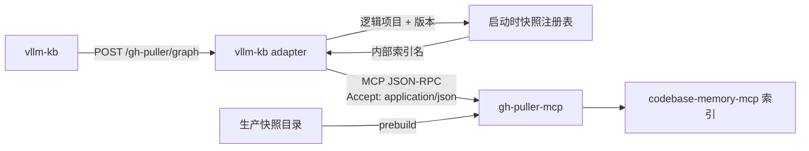

# vllm-kb adapter

面向 vllm-kb 的版本化 MCP 转发层。它不修改 `apps/gh-puller-mcp`，公开
`/gh-puller/graph` 单端点，并只暴露清单中的 `search_graph`、`search_code`、
`trace_path`、`query_graph`、`get_architecture`、`detect_changes`。

## 运行模型



在线服务不触发索引。生产发布先执行 `prebuild`，服务启动时再审计每个快照是否存在索引、
且索引绑定的源码根目录是否完全一致；审计不通过则拒绝启动。

支持的逻辑项目与目录约定如下：

| `project` | 快照目录 | 默认版本 |
|---|---|---|
| `vllm-project/vllm` | `/home/w30071576/snapshots-vllm/<version>/vllm-<version>` | 语义版本最高者 |
| `vllm-project/vllm-ascend` | `/home/w30071576/snapshots-vllm-ascend/v<version>/vllm-ascend-<version>` | 语义版本最高者 |

显式 `version` 必须命中快照，可带前导 `v`。缺省值通过 PEP 440 语义顺序计算，RC、post
等版本共同参与排序。vLLM 与 vLLM Ascend 的配套关系不参与接口路由。

## 部署

先启动未改动的 gh-puller-mcp。预构建需要默认的 `all` 工具档位，因为它会调用
`list_projects` 和 `index_repository`：

```bash
uv --directory apps/gh-puller-mcp run python -m gh_puller_mcp \
  --http --host 127.0.0.1 --port 8788 --path /mcp
```

构建全部 vLLM 与 vLLM Ascend 快照。已正确绑定的索引会跳过：

```bash
uv --directory apps/vllm-kb-adapter run vllm-kb-adapter prebuild
```

随后启动适配层：

```bash
uv --directory apps/vllm-kb-adapter run vllm-kb-adapter serve \
  --host 0.0.0.0 --port 8787
```

若 gh-puller-mcp 地址或快照根目录不同，公共选项需放在子命令之前：

```bash
uv --directory apps/vllm-kb-adapter run vllm-kb-adapter \
  --upstream-url http://127.0.0.1:8788/mcp \
  --vllm-root /srv/snapshots-vllm \
  --vllm-ascend-root /srv/snapshots-vllm-ascend \
  prebuild
```

可用环境变量：

| 变量 | 默认值 |
|---|---|
| `VLLM_KB_ADAPTER_UPSTREAM_URL` | `http://127.0.0.1:8788/mcp` |
| `VLLM_KB_ADAPTER_VLLM_ROOT` | `/home/w30071576/snapshots-vllm` |
| `VLLM_KB_ADAPTER_VLLM_ASCEND_ROOT` | `/home/w30071576/snapshots-vllm-ascend` |
| `VLLM_KB_ADAPTER_HOST` | `127.0.0.1` |
| `VLLM_KB_ADAPTER_PORT` | `8787` |
| `VLLM_KB_ADAPTER_PATH` | `/gh-puller/graph` |
| `VLLM_KB_ADAPTER_UPSTREAM_TIMEOUT` | `25` 秒 |

vllm-kb 配置指向适配层，而不是内部 gh-puller-mcp：

```json
{
  "code_graph": {
    "enabled": true,
    "base_url": "http://adapter-host:8787",
    "path": "/gh-puller/graph",
    "timeout_seconds": 30,
    "max_retries": 1,
    "repo_project_map": {
      "vllm-ascend": "vllm-project/vllm-ascend",
      "vllm": "vllm-project/vllm"
    }
  }
}
```

## 接口语义

- `tools/list` 仅返回六个清单工具，并在其参数结构中加入可选 `version`；
  `detect_changes` 另外要求 `diff`。
- 六个工具都会绑定目标版本的内部索引。适配层把搜索、追踪、查询与架构结果中的
  `cols`/`rows`/`groups` 压缩表展开成对象行。
- `detect_changes(scope="files")` 只解析 unified Git diff。
- `detect_changes(scope="impact")` 用 diff 的旧侧文件和行号选择基准快照中的符号，按固定 hop
  遍历 `CALLS` 边，并排除所有变更 seed。`inbound` 表示调用方影响面，`outbound` 表示依赖面，
  `both` 为并集。
- diff 始终作为数据处理，不会写入源码目录，也不会调用 Git。

影响查询最多处理 128 个变更文件，`depth` 范围为 1–10，`limit` 范围为 1–5000；达到文件、
查询行数或展示上限时，响应中的 `truncated` 为 `true`。新增文件在基准快照中没有可选 seed，
仍会出现在 `changed_files` 中。

## 验证

```bash
uv --directory apps/vllm-kb-adapter run ruff check .
uv --directory apps/vllm-kb-adapter run pytest -q
```
