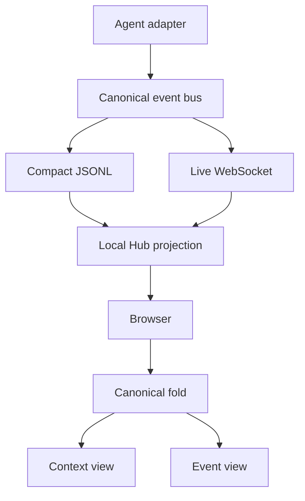

<details>
<summary>Relevant sources</summary>

The following source packages and files were used as context for this document:

- [gh_puller/agent/](../gh_puller/agent/)
- [apps/agent-monitor/server/](../apps/agent-monitor/server/)
- [apps/agent-monitor/web/](../apps/agent-monitor/web/)
- [tests/test_event_taxonomy.py](../tests/test_event_taxonomy.py)
- [tests/test_agent.py](../tests/test_agent.py)
- [tests/test_agent_real.py](../tests/test_agent_real.py)

</details>

# Agent observation and monitor

`gh_puller.agent` translates heterogeneous Agents into one ordered semantic event
language. Its fold reconstructs everything the adapter can assert about Agent control
state and model-visible Context at every event prefix. Model and tool execution remain
correlated activity rather than implicit state mutations.

## Canonical state

The replayable state is:

```text
State = Agent × Context
```

| Operation | Fold effect |
| --- | --- |
| `agent/set` | Replace Agent identity and its complete opaque configuration. |
| `agent/set/<facet>` | Replace one explicitly observed configuration facet. |
| `context/set` | Replace the complete ordered Context. |
| `context/append[/<role>]` | Append one message. |

`agent/set` records the configuration supplied to an Agent without interpreting its
fields. Facet routes such as `agent/set/model` and `agent/set/mode` are open extension
points; they are emitted only when an adapter observes that control change explicitly.

Context is an ordered sequence of message-like objects. `system`, `user`, `assistant`,
and `tool` have short append routes; any other role uses `context/append` with `role` in
the payload. Content blocks are open objects identified by `type`. A context rewrite or
compression emits one `context/set` containing the resulting complete sequence.

Configuration and semantic effect are separate facts. For example, CC may receive a
`system_prompt` inside its opaque configuration and then append the applied instruction
as `context/append/system`. Only that adapter knows the mapping; the recorder, fold, and
monitor never infer Context by inspecting configuration keys. If a black-box backend
does not expose an internal prompt, the adapter does not invent it. “Complete Context”
therefore means the logical model-visible Context that the adapter can confirm.

Sources: [gh_puller/agent/](../gh_puller/agent/); [tests/test_event_taxonomy.py](../tests/test_event_taxonomy.py)

## Correlated activity

Each `model/request` introduces a `requestId`. Its deltas and response carry the same
identifier, so model calls may overlap or interleave. Request payloads may include
facts such as the effective model when the adapter actually observes them; no model,
provider, or credential field is assumed globally. `model/response` records the model
output, while `context/append/assistant` records what the Agent committed. Multi-model
Agents may make those facts differ.

A model-produced tool call is an assistant content block:

```json
{
  "role": "assistant",
  "content": [{
    "type": "tool_call",
    "callId": "c1",
    "name": "read_file",
    "arguments": {"path": "a.py"}
  }]
}
```

`tool/start` and `tool/end` describe local execution through `callId`. When the result
becomes model-visible, it is also committed as a tool Context message. This separates
the Agent's conversation state from execution timing without losing either fact.

`session/*`, `turn/*`, and `step/*` are semantic markers. The expected convention uses
a turn for one user-level interaction and a step for one context preparation, model
invocation, and related tool work. Their placement never changes the canonical fold.

Sources: [gh_puller/agent/](../gh_puller/agent/); [tests/test_agent.py](../tests/test_agent.py)

## Adapters

`BaseAgent` owns session lifetime only. It emits the opaque initial `agent/set` and does
not inspect configuration. Concrete adapters translate the context, model, and tool
facts they can observe. One session supports repeated `stream` and `result` calls.

```python
from gh_puller.agent import AGENTS


agent = AGENTS["codex"]({"cwd": "/workspace/project"})
async with agent.session(session_name="example"):
    answer = await agent.result("Explain this repository.")
```

Mock-backed contract tests cover multi-turn behavior for every adapter. Opt-in
real-backend tests exercise the same persisted event boundary.

Sources: [gh_puller/agent/](../gh_puller/agent/); [tests/test_agent.py](../tests/test_agent.py); [tests/test_agent_real.py](../tests/test_agent_real.py)

## Monitor flow



JSONL is the durable source. Compact files omit only `model/delta/*`, which cannot
change canonical state. Sink backlogs may shed those deltas, but retain every compact
event in order. The FastAPI sidecar scans the files, maintains session leases, and
forwards live events; it does not own another Agent event model. The browser merges
history and live sequence numbers, then derives Agent, Context, model activity, and
tool activity from its canonical fold. Multiple open model requests are rendered
independently.

The views use vendored DSH visual primitives for Markdown, JSON, menus, and theme
tokens only. Event semantics and rendering decisions belong to the monitor's own
`events/` and `views/` modules.

Sources: [apps/agent-monitor/server/](../apps/agent-monitor/server/); [apps/agent-monitor/web/](../apps/agent-monitor/web/)

## Run and verify

```bash
pnpm install
pnpm --dir apps/agent-monitor/web build
uv --directory apps/agent-monitor/server run uvicorn app:app --port 8765
```

```bash
uv run pytest -q tests/test_event_taxonomy.py tests/test_agent.py
uv --directory apps/agent-monitor/server run pytest -q
pnpm --dir apps/agent-monitor/web typecheck
pnpm --dir apps/agent-monitor/web test
```

Set `GH_PULLER_REAL_TESTS=1` to include `tests/test_agent_real.py`. Event histories
contain the complete observed Agent configuration, prompts, outputs, and tool data;
protect the history directory and WebSocket endpoint accordingly.

Sources: [tests/test_event_taxonomy.py](../tests/test_event_taxonomy.py); [tests/test_agent.py](../tests/test_agent.py); [tests/test_agent_real.py](../tests/test_agent_real.py); [apps/agent-monitor/server/](../apps/agent-monitor/server/); [apps/agent-monitor/web/](../apps/agent-monitor/web/)
