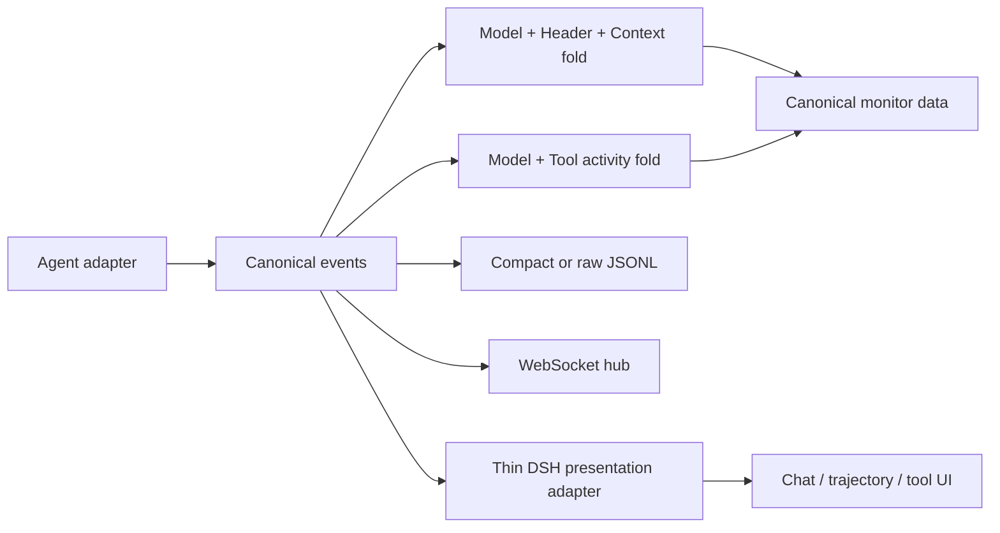

<details>
<summary>Relevant sources</summary>

- [Canonical event model](../gh_puller/agent/events.py)
- [Generator contract](../gh_puller/agent/generators/base.py)
- [Observation sinks](../gh_puller/agent/sinks.py)
- [Monitor hub](../apps/agent-monitor/server/hub.py)
- [Browser state fold](../apps/agent-monitor/web/src/dashboard/monitor-data/context.ts)
- [Browser activity fold](../apps/agent-monitor/web/src/dashboard/monitor-data/fold.ts)
- [DSH presentation adapter](../apps/agent-monitor/web/src/dashboard/vendor/dsh/bridge/dsh-events.ts)

</details>

# Agent events and monitor

The event stream has one correctness property: replaying any ordered prefix recovers
the model, header, and message context that the agent has established at that point.
Streaming activity enriches observation but cannot change this request state.



The protocol is defined and validated in
[events.py](../gh_puller/agent/events.py). Every event has `session`, session-local
`seq`, `ts`, `type`, and `data`.

## Replayable state

State is the product `Model × Header × Context`. Its operations are replacements or
ordered message appends:

| Event | Payload | Fold |
| --- | --- | --- |
| `model/set` | `{model, provider?, parameters}` | Replace Model |
| `header/set` | `{instructions, tools}` | Replace Header |
| `context/set` | `{messages}` | Replace Context |
| `context/append` | `{role, content, ...}` | Append a generic-role message |
| `context/append/user` | `{content, ...}` | Append with role `user` |
| `context/append/assistant` | `{content, ...}` | Append with role `assistant` |
| `context/append/tool` | `{content, ...}` | Append with role `tool` |

A message is JSON with a `role`, a `content` array, and optional agent-specific
fields. Every content block has a string `type`; other fields are open. A native tool
call can therefore remain directly inspectable:

```json
{
  "type": "context/append/assistant",
  "data": {
    "content": [
      {
        "type": "tool_call",
        "callId": "c1",
        "name": "read_file",
        "arguments": {"path": "a.py"}
      }
    ]
  }
}
```

The generic append form is the fallback for custom roles. Specialized forms make the
common role visible in the event type without changing the message algebra. The
Python fold and browser fold implement the same rules in
[events.py](../gh_puller/agent/events.py) and
[context.ts](../apps/agent-monitor/web/src/dashboard/monitor-data/context.ts).

## Activity and semantic markers

Model activity is correlated by `requestId`:

- `model/request`: `{requestId}`
- `model/delta/text`: `{requestId, index, text}`
- `model/delta/reasoning`: `{requestId, index, text}`
- `model/delta/tool-call`: `{requestId, index, callId, name?, argumentsDelta}`
- `model/response`: `{requestId, message, usage?, stopReason?}`

Tool execution is correlated independently by `callId`:

- `tool/start`: `{callId, name, arguments}`
- `tool/end`: `{callId, result}` or `{callId, error}`

A model response and a tool result record facts. The agent commits their
model-visible forms separately with context events. This distinction lets observers
compare generated or executed data with the actual next-request context. The browser
keeps these folds separate in
[fold.ts](../apps/agent-monitor/web/src/dashboard/monitor-data/fold.ts).

`turn/start`, `turn/end`, `step/start`, and `step/end` are optional semantic markers.
The expected convention is that a turn describes one agent-level user interaction,
while a step surrounds preparation, one model generation, and related tool work.
Agents may use different boundaries. Replay, correlation, and session correctness do
not depend on marker placement.

## Generators and persistence

One generator session may perform repeated `stream` or `result` calls. Claude Code,
Codex, OpenCode, OpenAI-compatible HTTP, and DSH all publish the same canonical
language; DSH retains a native-input adapter because its SDK emits its own event
model. See the shared lifecycle in
[base.py](../gh_puller/agent/generators/base.py) and the per-provider modules beside
it.

The file sink always stores one JSONL file per session. Compact mode omits only the
three `model/delta/*` types, so compact and raw logs fold to identical request state.
The hub merges persisted compact history with raw live events, derives coarse session
lease state, and does not fold model context. See
[sinks.py](../gh_puller/agent/sinks.py) and
[hub.py](../apps/agent-monitor/server/hub.py).

The browser owns canonical state and activity folds. Existing DSH-derived components
remain presentation code behind
[dsh-events.ts](../apps/agent-monitor/web/src/dashboard/vendor/dsh/bridge/dsh-events.ts),
which generates only the UI vocabulary needed by those components.

## Run the monitor

```bash
pnpm install
pnpm --dir apps/agent-monitor/web build
uv --directory apps/agent-monitor/server run uvicorn hub:app --port 8765
```

Useful verification commands:

```bash
uv run --no-sync pytest -q tests/test_event_taxonomy.py tests/test_agent.py tests/test_agent_real.py
uv --directory apps/agent-monitor/server run pytest -q
pnpm --dir apps/agent-monitor/web typecheck
pnpm --dir apps/agent-monitor/web test
```

Real-provider coverage is retained in
[test_agent_real.py](../tests/test_agent_real.py) and is enabled with
`GH_PULLER_REAL_TESTS=1`. Logs contain prompts, model output, and tool data; treat the
file directory and WebSocket endpoint as sensitive boundaries.
