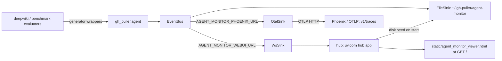
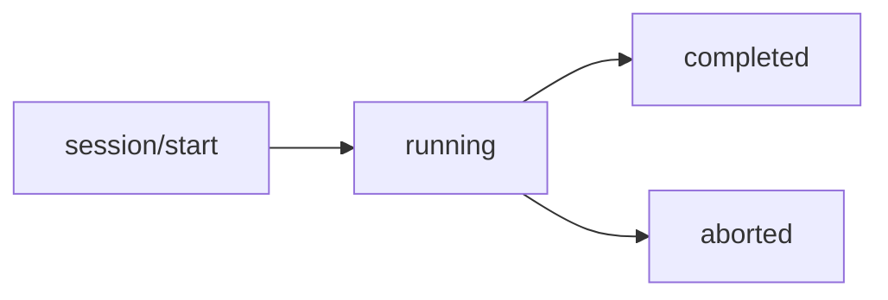

<details>
<summary>Relevant source files</summary>

The following files were used as context for generating this wiki page:

- [gh_puller/agent/generators/](gh_puller/agent/generators/)
- [gh_puller/agent/events.py](gh_puller/agent/events.py)
- [gh_puller/agent/sinks.py](gh_puller/agent/sinks.py)
- [gh_puller/envs.py](gh_puller/envs.py)
- [apps/agent-monitor/web/src/](apps/agent-monitor/web/src/)
- [ui/src/](ui/src/)
- [apps/agent-monitor/server/tests/test_hub.py](apps/agent-monitor/server/tests/test_hub.py)
</details>

# Agent Streaming Monitor: Event-Sourced Log + Web/WS Hub

Every LLM call in this repository — Claude Code generator calls (the single streaming funnel that `deepwiki` and the claude judge previously drilled directly into the SDK) and OpenAI-compatible calls (the `OpenAI` adapter, used by the benchmark evaluator) — flows through the wrappers in `gh_puller/agent/`. Callers keep their exact signature and semantics (same `RuntimeError` wording, same fallback order, same text chunks); the monitor is invisible to them. In exchange, every call is observed on **three channels**: a **file sink** (on by default), the internal **Web/WS hub** (agent-monitor; on when its endpoint is reachable), and an **OTel trace export** (Phoenix-compatible backends; on when endpoint reachable + opentelemetry importable). Sources: [gh_puller/agent/generators/]()

The observation model is **event-sourcing**: a single lossless append-only event log per run, aligned with the deepseek-harness invariant — the LLM `messages` context is *derived* by a surface fold, not snapshotted. The event log splits into two granularities:

- **流式事件流 (agent event flow, full taxonomy)** — every atomic unit including `assistant/chunk` typing deltas; restores the *real-time* context (character granularity). Carried by the WS/OTel channels.
- **非流式事件流** — full taxonomy *minus* `assistant/chunk`; restores the *message-granularity* context (the surface fold contract does not need chunks). **FileSink 缺省只落此级 (日志防膨胀)**; file `seq` therefore has **holes** (hole = skipped chunk), and readers must only sort/compare `seq` — never assume density (contract: [gh_puller/agent/events.py]()). 选 `AGENT_MONITOR_FILE_RAW=1` 时 FileSink 落**原始事件流**(含 `assistant/chunk`,seq 稠密)。

- **Event log** — the raw atomic units (`session/start` → `turn/start` → `step/start` → `user/message` → `request/header` → `assistant/chunk` → `assistant/message` (`tool/call` / `tool/result`) → `step/end` → `end`), normalized by per-provider adapters into plain dicts with a per-session monotonic `seq` (from 0, contiguous within the streaming flow) and published to a single asyncio `EventBus`; `publish` is `put_nowait` only and never blocks the caller. Source: [gh_puller/agent/events.py:TAXONOMY]()
- **Surface fold (derived)** — `user/message` / `assistant/message` / `tool/result` full messages act as *surface nodes* (each carries `surfaceOp: append | {op:'replace',start,end}`); the fold of any log prefix yields the exact `messages` context that moment, and `request/header` (a snapshot of config/system/tools; `partial:true` for the cc path, since the SDK never exposes the rendered request) pinpoints the full request payload at every `step`. Context injection is just a non-user-source `user/message`; modifications shell as `replace`. `context/inject` / `context/modify` are *log-only* explanation records (ignorable; they never move the fold) — this contract is shared with the viewer (single implementation in [ui/src/monitor/surface.ts]()) and contract-tested in [tests/test_event_taxonomy.py](). Sources: [gh_puller/agent/events.py:SURFACE_TYPES](), [ui/src/monitor/surface.ts]()



## 1. Session Model



One `session` = one adapter call (one JSONL), id = `<ns>/<uuid4>` — `ns` (业务分类命名空间)由上层业务决定(显式 `session_ns=` → `run_id` → `session_name` → `"agent"`),so grepping `session/start` tells you the source; `run_id` links the task-level family (`chat:<repo>`, `codemap:<repo>`, `<type>_<owner>_<repo>` for wiki runs). `session/end` carries `state` (`completed` / `aborted`), `ok`, `duration_ms`, `num_steps`, usage and reason. While running, the producer emits `session/heartbeat` **silence fillers**: only when ≥ `AGENT_MONITOR_HEARTBEAT_SECS` pass with no event that lands on disk (non-chunk; `assistant/chunk` typing deltas are streaming-only, they don't count) — it keeps the JSONL mtime moving so the hub can tell "alive but quiet" from "process dead" (lease, §2/§3). The event is `ignorable` and never folds. Sources: [gh_puller/agent/events.py:EventRecorder]()

## 2. File Sink (default on, flat layout + implicit classification)

```
$AGENT_MONITOR_DIR/      # 会话 jsonl 落盘根(扁平,无 sessions 子层)
└── <uuid>.jsonl                       # one flat file per session (uuid part of session id),
                                       # 只含非流式事件流(taxonomy − assistant/chunk)
```

**分类学是隐式的,不在目录名里**:completed/aborted = 有终态行、state 在事件 data 里;running = 无终态行且文件 mtime 新鲜;无终态行但文件 mtime 静止超租约(AGENT_MONITOR_LEASE_SECS,见 §3)= 孤儿,监控侧派生为 aborted(纯内存判,不写盘);会话来源 = `session/start` 的 `session` 字段(`<ns>/<uuid4>`)。用户直接 grep 而非翻目录:

```bash
# 查终态(completed / aborted 由 data.state 区分)
grep '"type":"session/end"' "$AGENT_MONITOR_DIR"/*.jsonl
# 查错误
grep '"type":"error"' "$AGENT_MONITOR_DIR"/*.jsonl
# 查会话来源(业务命名空间),watch 实时
grep '"type":"session/start"' "$AGENT_MONITOR_DIR"/*.jsonl
tail -f "$AGENT_MONITOR_DIR"/*.jsonl
```

Each JSONL line is one raw event (full content — no truncation anywhere in the log; only OTel previews truncate). By default `assistant/chunk` is **skipped** (non-stream projection, log inflation), so the file `seq` has holes (hole == skipped chunk); the fold contract only compares `seq` — readers never assume density. With `AGENT_MONITOR_FILE_RAW=1` the file carries the **full raw event flow** incl. `assistant/chunk` (seq dense — the same stream the WS/OTel channels carry). Writes happen in the sink worker (queue drain), bounded at 5000 events drop-oldest; a slow or full disk never blocks the LLM call. A crash leaves a file **without** `session/end` (residue; hub 按"无终态行 + mtime 静止超租约"派生为 aborted,见 §3 —— 运行期静默补发的 `session/heartbeat` 行同样落盘,活会话的 mtime 不会停,读者以租约区分"活但静默"与"进程已死";残留文件即排查素材)。 **v1 迁移**:旧格式(LLM 聚合行)与本格式互不兼容,首次升级请在 hub 未启动/可停止时清理旧格式文件(即 `$AGENT_MONITOR_DIR` 下无 `seq` 的 `*.jsonl`,hub 会把它们整件跳过并日志)。Sources: [gh_puller/agent/sinks.py:FileSink]()

## 3. Web/WS Hub (opt-in via monitor)

### Run

```bash
uv --directory apps/agent-monitor/server run uvicorn hub:app --port 8765   # 默认端口 8765,由 uvicorn CLI --port 指定
# in another terminal, run any LLM work (ws sink auto-enables when hub reachable;
# override the default target with AGENT_MONITOR_WEBUI_URL, comma-separated for multiple hubs):
AGENT_MONITOR_WEBUI_URL=ws://localhost:8765/ws uv run benchmark ...
```

The hub seeds in-memory state from `AGENT_MONITOR_DIR/*.jsonl` (flat layout) at startup — **the full (non-streaming) event log loads, so history replay works for disk-seeded sessions too** (the old "seeded event view is empty" limitation is gone). Session key = the `session` field of each file's `session/start` (not the filename); state is implicit (has `session/end` → completed/aborted by `data.state`, else running). While serving, `index` requests re-check running sessions whose file mtime changed (heal crash residue / missed end frames). A continuous **lease scanner** (lifespan task, tick ≈ lease/4) flips a running session to `aborted` when its file has no `session/end` **and** its mtime has been still longer than `AGENT_MONITOR_LEASE_SECS` (orphan derivation only: in-memory, no synthetic rows written; if the file moves again the session self-heals to `running`), and broadcasts the new `index` exactly once per flip. `GET /` (and `/viewer`) serves the built viewer `static/agent_monitor_viewer.html`; anything else 404s. The viewer no longer ships in the wheel; when missing the hub logs `viewer 未构建:请运行仓库根 pnpm build` and falls back to a plain `viewer 文件缺失` page.

### WS protocol (one JSON object per frame)

| Direction | Message | Response |
|---|---|---|
| producer → hub | `{"type":"evt","event":{...}}` | broadcast to the session's subscribers (live, seq-carrying) |
| viewer → hub | `{"type":"index"}` | `{"type":"index","sessions":[{session,run_id,label,provider,model,state,ts,last_ts,num_events}]}` |
| viewer → hub | `{"type":"history","session":id,"beforeSeq"?,"max"?}` | `{"type":"history","session":id,"events":[...],"hasMore":bool,"nextBeforeSeq":n\|null}` — merged disk+memory page, ascending seq, `beforeSeq` omitted reads the tail |
| viewer → hub | `{"type":"subscribe","session":id}` | `{"type":"evt_ready","session":id,"lastSeq":n}` then live `{"type":"evt","event":{...}}` frames; single-subscription view (new subscribe replaces the old session) |
| anyone → hub | `{"type":"ping"}` | `{"type":"pong"}` |

One connection is one role, decided by its first frame: `evt` → producer loop, anything else → viewer loop. The client maintains a `RunFold` (seq-guarded): live frames at `seq == next` fold in; `seq > next` → request `history({beforeSeq: next})` and re-fold after a merge; `seq < next` dedups. Reconnect refetches the tail and re-subscribes. Sources: [apps/agent-monitor/server/hub.py]()

### Viewer page (`apps/agent-monitor/server/static/agent_monitor_viewer.html`)

React app built from the `apps/agent-monitor/web` project into a single inline HTML (repo-root pnpm workspace):

```bash
pnpm install && pnpm -r build   # → server/static/agent_monitor_viewer.html
```

- `ui` — shared component package (`@gh-puller/ui`, own package.json at `ui/`, workspace member, source in `ui/src/`): the existing `Markdown`/`ThemeToggle`/`StateBadge`/`LanguageProvider` plus a new **monitor data layer** (`ui/src/monitor/*`: surface fold, per-session `RunFold`, snapshot builder, trajectory layout/timeline/search, context provenance, hub frame types — pure TS, unit-tested with vitest) and the **conversation/trajectory components** (`MonitorSessionList`, `MonitorConversation` tabs 对话/轨迹, `MonitorChatView` nodes, `MonitorTrajectoryView` with 4-mode timeline + range selection + search + collapse-all). Components are theme-agnostic (CSS-variable tokens), bilingual.
- `apps/agent-monitor/web` — the shell: sidebar (search/state filter/run_id-grouped session list) + main panel (stats chips + 对话/轨迹 tabs via `MonitorConversation`) + status bar; `useMonitorSocket` handles hub protocol v2 (subscribe/history stitch), `useMonitorSession` is a `useSyncExternalStore`-based store over `RunFold`.

## 4. OTel / Phoenix (auto-enabled when reachable)

```bash
# Phoenix local (default target is http://localhost:6006/):
docker run --rm -p 6006:6006 -i ghcr.io/axiomhq/phoenix:latest  # 或 Axiom Phoenix 其他方式,OTLP 端口 6006
# 然后正常跑任意 LLM 工作即可:OTel sink 在首次事件时探测端口可达才注册
```

`AGENT_MONITOR_PHOENIX_URL` 默认 `http://localhost:6006/`(基底地址无路径时封装层自动补 `v1/traces`;完整 OTLP URL 如 `.../api/public/otel/v1/traces` 原样使用)。每个进程首次构建总线时对每个地址做一次 TCP 探活:opentelemetry 可导入且端口可达才注册 OtelSink(任一失败记一条 `[agent-monitor]` 日志并跳过;运行中 Phoenix 掉线只影响导出,不影响调用)。置空字符串完全关闭;逗号分隔多个地址 → 每地址一个 OtelSink 实例。新增后端(Langfuse 等)= `gh_puller/envs.py` 一个常量 + `sinks._OTEL_BACKENDS` 表一条。spans:`session/start` → 根 span,`step/start→end` 一次 LLM 请求 span(文本/思考只累加属性),`tool/call`/`tool/result` 子 span,usage/错误/上下文事件挂根。Sources: [gh_puller/agent/sinks.py:ensure_bus]()

## 5. Configuration

Runtime override via `agent.configure(file_dir=..., ws_urls=..., otel_urls=..., raw=...)`(file sink **恒开**,无开关;`file_dir` 为测试/嵌入的隔离/重定向手段);`ws_urls`/`otel_urls` 接受 URL 列表或逗号分隔字符串,`None` → 重读 env 常量;`raw` 为文件 sink 的原始事件流开关(`None` → 重读 `AGENT_MONITOR_FILE_RAW`);defaults come from env at import time ([gh_puller/envs.py](gh_puller/envs.py)). `ensure_bus()` 为惰性构建总线的公开入口(每 URL 一个 sink 实例):

| Variable | Default | Meaning |
|---|---|---|
| `AGENT_MONITOR_DIR` | envs.py 缺省 | file sink root,即会话 jsonl 落盘根(无 sessions 子层) |
| `AGENT_MONITOR_FILE_RAW` | `0` | file sink granularity: `0` = non-stream projection only (default, `assistant/chunk` skipped); `1` = full raw event flow incl. `assistant/chunk` (dense seq) |
| `AGENT_MONITOR_WEBUI_URL` | `ws://localhost:8765/ws` | ws sink targets, comma-separated (one WsSink each); empty → ws sink off |
| `AGENT_MONITOR_HEARTBEAT_SECS` | `30` | producer heartbeat interval: silence (no non-chunk event) ≥ this gets one `session/heartbeat` filler row (activity periods get none) |
| `AGENT_MONITOR_LEASE_SECS` | `150` | hub orphan lease (hub 侧消费,缺省在 apps/agent-monitor/server/hub.py `_DEFAULT_LEASE_SECS`): no `session/end` + file mtime still > this → session derived `aborted`; keep ≥ 3–5× HEARTBEAT (0 heartbeat = pure event-mtime semantics) |
| `AGENT_MONITOR_PHOENIX_URL` | `http://localhost:6006/` | OTLP backend base URL (auto appends `/v1/traces` when path empty); empty → off; only registered when reachable + opentelemetry importable |

File sink is **always on** — the `AGENT_MONITOR_FILE` env and the runtime `configure(file=...)` switch have both been removed (convention code-enforced); tests/embedding isolate only via the `configure(file_dir=...)` redirect.

## 6. Loopback tests

- `tests/test_event_taxonomy.py` — taxonomy/envelope, plus the **fold-spec oracle**: fake contiguous event sequences → `messages_at(seq)` equals the expected contexts for every prefix (append & replace), empty-content skips, seq-gap and unknown-required-type errors.
- `tests/test_agent.py` — bus fanout/drop-oldest, `_Run` start/step/finish ordering, adapters (chunk/tool.call/tool.result full-content mapping, raw arguments strings, step boundaries), FileSink raw-event lines + state move, WsSink envelope passthrough, OtelSink span tree (InMemorySpanExporter), failure isolation, config/URL gating, heartbeat silence-fill (quiet gap / busy absence / aborted run cancels the task).
- `apps/agent-monitor/server/tests/test_hub.py` — hub protocol v2 via FastAPI `TestClient` (zero network egress): index + two-viewer live broadcast, subscribe/`evt_ready(lastSeq)`, history pagination (tail/older/missing session), disk+memory merge, **disk-seeded session history replay (regression: old limitation)**, old-format/corrupt-line skip, `GET /` vs 404, ping/pong, lease orphan flip / fresh-keep / self-heal / broadcast-once, session/heartbeat feed tolerance.
- `ui/src/monitor/__tests__/` — vitest: surface fold contract, RunFold gap/repair, snapshot builder, timeline modes + range selection, layout grouping, search index, provenance.
