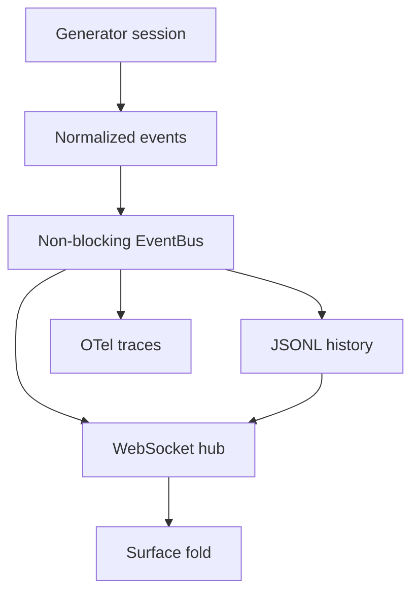

<details>
<summary>Relevant sources</summary>

The following source packages were used as context for this document:

- [gh_puller/agent/](../gh_puller/agent/)
- [apps/agent-monitor/](../apps/agent-monitor/)
</details>

# Agent Monitor：同一事件流的三种投影

Agent Monitor 没有为日志、实时界面和链路追踪分别建立一套观察逻辑。生成器先把一次会话归一化为事件流，再由文件、WebSocket 和 OTel 各自投影。这条边界让监控系统可以解释调用，却不接管 provider 的调用语义。

## 事件流是稳定边界

一个 session 表示一段生成器会话，其中每个 step 对应一次 LLM 请求。事件只表达已经发生的事实：完整消息决定对话表面，流式 chunk 只补充实时过程；单调递增的 `seq` 定义顺序，但消费者不能假设它连续。



`EventBus` 为每个 sink 使用独立的有界队列。慢速或失效的观察端会丢失自身队列中的旧事件，而不会阻塞生成器；这里的设计取舍是让可观测性降级，而不是改变模型调用的时序和结果。

Sources: [gh_puller/agent/](../gh_puller/agent/)

## 三种投影回答不同问题

文件投影是持久记录。它始终启用，按 session 追加 JSONL；默认省略 `assistant/chunk`，保留能够重建消息上下文的完整事件。因此日志中的 `seq` 可能有间隔，这不是数据损坏，而是持久层主动舍弃了仅服务实时体验的粒度。

Hub 把磁盘历史与 WebSocket 实时事件合并成可查询的会话视图。`session/end` 给出明确终态；尚无终态的会话通过文件 mtime 表示存活，Hub 超过租约后只在内存中将其判为中止。保活因此属于存储元数据，不会向事件流注入虚假的业务事件。

Viewer 再按 `seq` 折叠 `user/message`、`assistant/message` 和 `tool/result`。订阅时，它先建立实时边界，再加载历史并合并期间缓存的新事件；重连也重新获取历史。实时观看和事后回放由此共享同一种对话语义，而不依赖两套状态模型。

OTel 投影则把 session、step 和 tool 关系映射为 spans，适合查看耗时、usage 与调用层级。它是追踪视图，不替代包含完整消息的文件记录。

Sources: [gh_puller/agent/](../gh_puller/agent/); [apps/agent-monitor/](../apps/agent-monitor/)

## 运行查看器

先构建单文件前端，再启动 Hub：

```bash
pnpm install
pnpm --dir apps/agent-monitor/web build
uv --directory apps/agent-monitor/server run uvicorn hub:app --port 8765
```

之后运行任意使用 `gh_puller.agent` 的任务即可。WebSocket 与 OTel sink 只在事件总线首次构建时探测并注册，因此应先启动观察端；若观察端启动较晚，需要重新配置或重启任务进程。文件投影不依赖这些服务。

日志包含完整消息和工具结果，Hub 也会把它们发送给查看器；生产环境应把日志目录与 WebSocket 端点视为敏感数据边界。

Sources: [gh_puller/agent/](../gh_puller/agent/); [apps/agent-monitor/](../apps/agent-monitor/)
