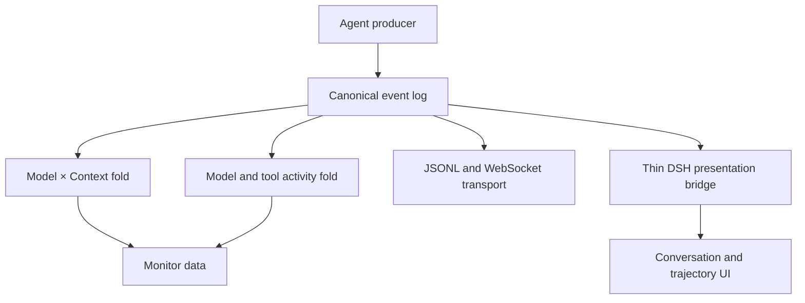

<details>
<summary>Relevant sources</summary>

The following source packages were used as context for this document:

- [gh_puller/agent/](../gh_puller/agent/)
- [apps/agent-monitor/server/](../apps/agent-monitor/server/)
- [apps/agent-monitor/web/src/dashboard/monitor-data/](../apps/agent-monitor/web/src/dashboard/monitor-data/)
- [apps/agent-monitor/web/src/dashboard/vendor/dsh/bridge/](../apps/agent-monitor/web/src/dashboard/vendor/dsh/bridge/)
- [tests/](../tests/)

</details>

# Agent events and monitor

An ordered prefix of the canonical event stream recovers the state the agent has
established at that point:

`State = Model × Context`

The same fold applies to streaming and non-streaming producers. Activity events expose
generation and local execution without mutating state.



Every envelope contains `session`, a session-local `seq`, `ts`, `type`, and `data`.
The agent package owns the validator and reference fold.

Sources: [gh_puller/agent/](../gh_puller/agent/);
[apps/agent-monitor/web/src/dashboard/monitor-data/](../apps/agent-monitor/web/src/dashboard/monitor-data/)

## Replayable state

State changes use two replacement operations and ordered context appends:

| Event | Payload | Fold |
| --- | --- | --- |
| `model/set` | `{model, provider?, parameters}` | Replace Model |
| `context/set` | `{messages}` | Replace Context |
| `context/append` | `{role, content, ...}` | Append a generic-role message |
| `context/append/user` | `{content, ...}` | Append with role `user` |
| `context/append/assistant` | `{content, ...}` | Append with role `assistant` |
| `context/append/tool` | `{content, ...}` | Append with role `tool` |

A message has a string `role`, an ordered `content` array, and optional producer fields.
Every content block has a string `type`; the remaining shape is open. Specialized append
types make common roles visible without changing this message algebra. Custom roles use
`context/append`.

Instructions are system or developer messages. Observable tool schemas use
`tool_definition` blocks in the same context:

```json
{
  "role": "system",
  "content": [
    {"type": "text", "text": "You are a repository assistant."},
    {
      "type": "tool_definition",
      "name": "read_file",
      "description": "Read one workspace file.",
      "inputSchema": {
        "type": "object",
        "properties": {"path": {"type": "string"}},
        "required": ["path"]
      }
    }
  ]
}
```

Agents use `context/set` when compression, replacement, or another non-append change
establishes a new complete context. A fold needs no provenance links to apply that
operation.

Model-produced tool calls keep their native structure inside an assistant append:

```json
{
  "type": "context/append/assistant",
  "data": {
    "content": [{
      "type": "tool_call",
      "callId": "c1",
      "name": "read_file",
      "arguments": {"path": "a.py"}
    }]
  }
}
```

Sources: [gh_puller/agent/](../gh_puller/agent/); [tests/](../tests/)

## Model and tool activity

Model activity is correlated by `requestId`:

- `model/request`: `{requestId}`
- `model/delta/text`: `{requestId, index, text}`
- `model/delta/reasoning`: `{requestId, index, text}`
- `model/delta/tool-call`: `{requestId, index, callId, name?, argumentsDelta}`
- `model/response`: `{requestId, message, usage?, stopReason?}`

Tool execution is correlated independently by `callId`:

- `tool/start`: `{callId, name, arguments}`
- `tool/end`: `{callId, result}` or `{callId, error}`

An assistant `tool_call` block is model output and becomes context through an assistant
append. Local execution produces `tool/start` and `tool/end`; the model-visible result is
then committed with `context/append/tool`. This separates observed activity from the
state used by the next request.

`turn/start`, `turn/end`, `step/start`, and `step/end` are optional semantic markers. The
expected convention treats a turn as one agent-level user interaction and a step as one
context preparation, model generation, and related tool work. Producers may choose other
boundaries; folding and correlation do not depend on them.

Sources: [gh_puller/agent/](../gh_puller/agent/);
[apps/agent-monitor/web/src/dashboard/monitor-data/](../apps/agent-monitor/web/src/dashboard/monitor-data/)

## Producer boundaries

One generator session supports repeated `stream` and `result` calls. Each producer emits
only model-visible state it can observe:

| Producer | Context projection |
| --- | --- |
| Claude Code | Configured system prompt plus observed user, assistant, and tool messages |
| Codex | Configured base and developer instructions plus observed thread messages |
| OpenCode | Configured instruction plus observed CLI messages and tool results |
| OpenAI-compatible HTTP | Complete request messages and supplied tool schemas |
| DSH | Native request header and surface operations folded into context |

Provider-hidden prompts and tool schemas are not inferred. HTTP headers, credentials,
timeouts, process settings, and other transport inputs stay outside Context. DSH
`request/header`, `surfaceOp`, and `sourceEventSeqs` are vendor-boundary terms. DSH
header and surface changes become canonical state operations; provenance stays inside
the DSH boundary.

Sources: [gh_puller/agent/](../gh_puller/agent/)

## Persistence and presentation

The file sink stores one JSONL file per session. Compact files omit only
`model/delta/*`; compact and raw logs therefore fold to identical state. The hub combines
persisted history with live raw events and derives session lease status without owning a
second context model.

The browser folds canonical Model and Context directly. At each `model/request`, the DSH
presentation bridge derives request inspection from current model state and
system/developer context, then maps messages and activity into the existing conversation
UI. DSH surface metadata exists only inside that bridge and its vendored presentation
code.

Sources: [gh_puller/agent/](../gh_puller/agent/);
[apps/agent-monitor/server/](../apps/agent-monitor/server/);
[apps/agent-monitor/web/src/dashboard/monitor-data/](../apps/agent-monitor/web/src/dashboard/monitor-data/);
[apps/agent-monitor/web/src/dashboard/vendor/dsh/bridge/](../apps/agent-monitor/web/src/dashboard/vendor/dsh/bridge/)

## Run and verify

```bash
pnpm install
pnpm --dir apps/agent-monitor/web build
uv --directory apps/agent-monitor/server run uvicorn hub:app --port 8765
```

```bash
uv run --no-sync pytest -q tests/test_event_taxonomy.py tests/test_agent.py tests/test_agent_real.py
uv --directory apps/agent-monitor/server run pytest -q
pnpm --dir apps/agent-monitor/web typecheck
pnpm --dir apps/agent-monitor/web test
```

Real-provider tests are selected with `GH_PULLER_REAL_TESTS=1`. Event logs contain prompts,
model output, and tool data, so the file directory and WebSocket endpoint are sensitive
boundaries.

Sources: [tests/](../tests/); [apps/agent-monitor/server/](../apps/agent-monitor/server/)
