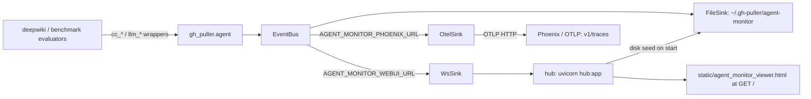
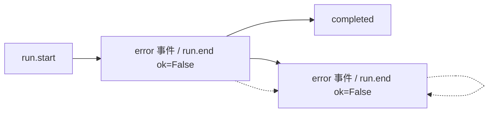

<details>
<summary>Relevant source files</summary>

The following files were used as context for generating this wiki page:

- [gh_puller/agent/adapters.py](gh_puller/agent/adapters.py)
- [gh_puller/agent/events.py](gh_puller/agent/events.py)
- [gh_puller/agent/sinks.py](gh_puller/agent/sinks.py)
- [gh_puller/envs.py](gh_puller/envs.py)
- [apps/agent-dashboard/web/src/](apps/agent-dashboard/web/src/)
- [ui/src/](ui/src/)
- [apps/agent-dashboard/server/tests/test_hub.py](apps/agent-dashboard/server/tests/test_hub.py)
</details>

# Agent Streaming Monitor: File Sink + Web/WS Hub

Every LLM call in this repository — Claude Code agent calls (`cc_stream` / `cc_text` / `cc_result`, the single streaming funnel that `deepwiki` and the claude judge previously drilled directly into the SDK) and plain OpenAI-compatible calls (`llm_complete` / `llm_stream`) — flows through the wrappers in `gh_puller/agent/`. Callers keep their exact signature and semantics (same `RuntimeError` wording, same fallback order, same text chunks); the monitor is invisible to them. In exchange, every call is observed on **three channels**: a **file sink** (on by default), the internal **Web/WS hub** (agent-dashboard; on when its endpoint is reachable), and an **OTel trace export** (Phoenix-compatible backends; on when endpoint reachable + opentelemetry importable). Sources: [gh_puller/agent/adapters.py:cc_stream/cc_text/cc_result/llm_complete/llm_stream]()

The observation model is two layers driven by **events**:

- **Event stream** — the atomic units that change the UI (`text.delta`, `block.start/stop`, `tool.use/result`, `error`, `run.end`…), normalized by per-provider adapters into plain dicts and published to a single asyncio `EventBus`; `publish` is `put_nowait` only and never blocks the caller. Sources: [gh_puller/agent/sinks.py:EventBus.publish](), [gh_puller/agent/events.py:KINDS]()
- **LLM stream** — the incremental aggregate of the event stream by round and block: all `thinking` chunks merge into one `thinking` block, all `content` chunks into one `content` block, tool blocks stay 1:1, one LLM call is one round, an agent loop is as many rounds as it takes until no tool calls remain. The aggregation is a pure function (`LlmAggregator`, dict in/dict out) implemented once and reused by the file sink, the hub, and (indirectly, via per-line frames) the viewer — which renders lines with zero aggregation logic of its own. Sources: [gh_puller/agent/events.py:LlmAggregator]()

**传输契约**:跨进程边界(agent → hub)只传原始事件帧 `{"type":"evt","event":{...}}`;`LlmAggregator` 只在消费端实例化(FileSink、hub 的 `_Session.agg`);两路流均增量 —— 事件流为原子事件,LLM 流行逐行 `block.delta` 只携带本块文本,从不重发累计全文,全文由查看端拼接(`StreamView`/`jq` 各一处)。



## 1. Session State Machine



`run.start` → `running`; `run.end ok=True` → `completed`; an `error` event or `run.end ok=False` → `aborted`. The aggregator attaches the `state` field, and the terminal state moves the session file into its final directory. Sources: [gh_puller/agent/events.py:LlmAggregator]()

## 2. File Sink (default on)

```
~/.gh-puller/agent-monitor/            # AGENT_MONITOR_DIR
└── sessions/
    ├── running/    <session>.jsonl    # created on run.start, live append+flush; tail -f works
    ├── aborted/    <session>.jsonl    # atomic os.replace on terminal state
    └── completed/  <session>.jsonl    # atomic os.replace on terminal state
```

The directory layout **is** the index — no separate `index.jsonl`. Each JSONL line is a self-describing LLM-stream line:

```bash
# replay a finished turn's text
jq -r 'select(.type=="block.delta")|.text' ~/.gh-puller/agent-monitor/sessions/completed/*.jsonl
# watch a live turn
tail -f ~/.gh-puller/agent-monitor/sessions/running/*.jsonl
```

Writes happen in the sink worker (queue drain), bounded at 5000 events drop-oldest; a slow or full disk never blocks the LLM call. A crash leaves the file in `running/` with its content intact (an artifact to inspect, not an invented terminal state). Sources: [gh_puller/agent/sinks.py:FileSink]()

## 3. Web/WS Hub (opt-in via monitor)

### Run

```bash
cd apps/agent-dashboard/server && uv run uvicorn hub:app --port 8765   # AGENT_MONITOR_PORT default 8765
# in another terminal, run any LLM work (ws sink auto-enables when hub reachable;
# override the default target with AGENT_MONITOR_WEBUI_URL, comma-separated for multiple hubs):
AGENT_MONITOR_WEBUI_URL=ws://localhost:8765/ws uv run benchmark ...
```

The hub seeds its in-memory LLM-stream cache from `AGENT_MONITOR_DIR/sessions/{running,completed,aborted}/*.jsonl` at startup, so after a hub restart history is still there (running sessions keep their state and continue on later events). `GET /` (and `/viewer`) serves the built viewer `static/agent_monitor_viewer.html`; anything else 404s. The viewer no longer ships in the wheel; when missing (e.g. a checkout that hasn't built it) the hub logs `viewer 未构建:请运行仓库根 pnpm build` and falls back to a plain `viewer 文件缺失` page. Sources: [apps/agent-dashboard/server/hub.py]()

### WS protocol (one JSON object per frame)

| Direction | Message | Response |
|---|---|---|
| producer → hub | `{"type":"evt","event":{...}}` | broadcast to the session's subscribers; event ring (≤1000/session) + aggregator → LLM stream lines appended |
| viewer → hub | `{"type":"index"}` | `{"type":"index","sessions":[{session,label,provider,model,state,ts,last_ts}]}` |
| viewer → hub | `{"type":"llm-subscribe","session":id}` | replay `{"type":"llm","session":id,"id":N,"line":{...}}` frames (monotonic per-session ids), then `{"type":"llm_ready","session":id}`; live lines follow |
| viewer → hub | `{"type":"evt-replay","session":id}` | `{"type":"evt","event":{...}}` frames, then `{"type":"evt_ready",...}` |
| viewer → hub | `{"type":"evt-subscribe","session":id}` | replay current in-memory events, then `{"type":"evt_ready","session":id}`; live `{"type":"evt","event":{...}}` frames follow |
| anyone → hub | `{"type":"ping"}` | `{"type":"pong"}` |

One connection is one role, decided by its first frame: `evt` → producer loop, anything else → viewer loop. The viewer keeps a single-subscription view (new subscribe replaces the old session). Live/replay frames carry per-line ids so clients dedup safely across reconnects. `evt-subscribe` was added for the event view: raw events live only in hub memory (the file sink persists the aggregated LLM-stream lines, not the events), so disk-seeded sessions from a hub restart replay `llm` lines but not `evt` — the client shows an empty event state for them. Sources: [apps/agent-dashboard/server/hub.py]()

### Viewer page (`apps/agent-dashboard/server/static/agent_monitor_viewer.html`)

React app built from the `apps/agent-dashboard/web` project into a single inline HTML (repo-root pnpm workspace; build happens in a normal workflow, `apps/agent-dashboard/web` checked out for local dev):

```bash
pnpm install && pnpm -r build   # → server/static/agent_monitor_viewer.html
```

- `ui` — shared component package (`@gh-puller/ui`, own package.json at `ui/`, workspace member, source in `ui/src/`) refined from `apps/deepwiki-webui/web`: `Markdown` (remark-gfm + katex, PrismLight with a registered language subset), `ThemeToggle`, `StateBadge`, plus a lightweight `LanguageProvider` (flat en/zh dicts, `localStorage` language, `t(key, vars)` interpolation) and `monitorWsUrl`.
- `apps/agent-dashboard/web` — the viewer: sidebar with search + state filter + session list; main panel with a stats bar (state/provider/model/duration/rounds/chars/token usage), two views — *stream* (LLM stream lines: thinking blocks collapsible, content blocks as markdown prose, tool blocks with name/input/result, errors in red) and *events* (raw event frames with kind filter and expandable JSON) — plus auto-scroll toggle and theme/language toggles.

Reconnect with 2s backoff; on reopen the hook re-sends `index` and re-subscribes to the current session. Sources: [apps/agent-dashboard/web/src/](apps/agent-dashboard/web/src/), [ui/src/](ui/src/)

## 4. OTel / Phoenix (auto-enabled when reachable)

```bash
# Phoenix local (default target is http://localhost:6006/):
docker run --rm -p 6006:6006 -i ghcr.io/axiomhq/phoenix:latest  # 或 Axiom Phoenix 其他方式,OTLP 端口 6006
# 然后正常跑任意 LLM 工作即可:OTel sink 在首次事件时探测端口可达才注册
```

`AGENT_MONITOR_PHOENIX_URL` 默认 `http://localhost:6006/`(基底地址无路径时封装层自动补 `v1/traces`;完整 OTLP URL 如 `.../api/public/otel/v1/traces` 原样使用)。每个进程首次构建总线时对每个地址做一次 TCP 探活:opentelemetry 可导入且端口可达才注册 OtelSink(任一失败记一条 `[agent-monitor]` 日志并跳过;运行中 Phoenix 掉线只影响导出,不影响调用)。置空字符串完全关闭;逗号分隔多个地址 → 每地址一个 OtelSink 实例。新增后端(Langfuse 等)= `gh_puller/envs.py` 一个常量 + `sinks._OTEL_BACKENDS` 表一条。Sources: [gh_puller/agent/sinks.py:ensure_bus]()

## 5. Configuration

Runtime override via `agent.configure(file=..., file_dir=..., ws_urls=..., otel_urls=...)`; `ws_urls`/`otel_urls` 接受 URL 列表或逗号分隔字符串,`None` → 重读 env 常量;defaults come from env at import time ([gh_puller/envs.py:38-46](gh_puller/envs.py:38-46)). `ensure_bus()` 为惰性构建总线的公开入口(每 URL 一个 sink 实例):

| Variable | Default | Meaning |
|---|---|---|
| `AGENT_MONITOR_DIR` | `~/.gh-puller/agent-monitor` | file sink root (mirrors the `~/.gh-puller/deepwiki` convention) |
| `AGENT_MONITOR_WEBUI_URL` | `ws://localhost:8765/ws` | ws sink targets, comma-separated (one WsSink each); empty → ws sink off |
| `AGENT_MONITOR_PORT` | `8765` | hub listen port |
| `AGENT_MONITOR_PHOENIX_URL` | `http://localhost:6006/` | OTLP backend base URL (auto appends `/v1/traces` when path empty); empty → off; only registered when reachable + opentelemetry importable |

File sink is **always on** (`AGENT_MONITOR_FILE` has been removed); runtime `configure(file=False)` can disable it for tests/embedding.

## 6. Loopback tests

`apps/agent-dashboard/server/tests/test_hub.py` covers the hub via FastAPI `TestClient` (zero network egress): index + two-viewer broadcast, `llm-subscribe` replay with ids then live, `evt-subscribe`/`evt-replay`, `ping`/pong, `GET /` vs 404, and disk-seed index/replay with running-state preservation.
