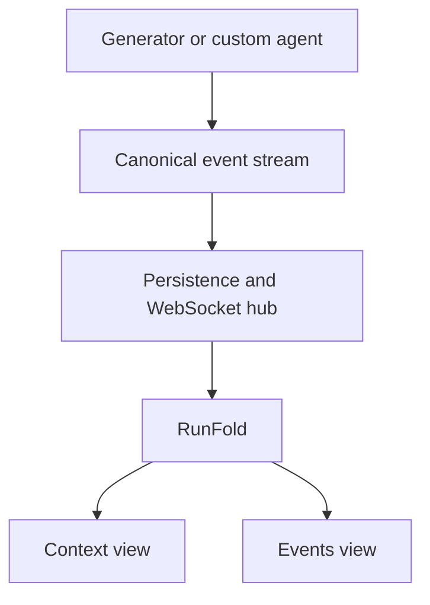

<details>
<summary>Relevant sources</summary>

The following source packages were used as context for this document:

- [gh_puller/agent/](../gh_puller/agent/)
- [apps/agent-monitor/server/](../apps/agent-monitor/server/)
- [apps/agent-monitor/web/](../apps/agent-monitor/web/)
- [tests/](../tests/)

</details>

# Agent events and monitor

The agent subsystem exposes one ordered event language. A complete prefix recovers the
model request state at that point, while separate activity events describe generation
and local execution. The monitor reads that language directly through one canonical
fold.

## State algebra

The replayable state is:

`State = Model × Context`

Only the following operations change it:

| Operation | Effect |
| --- | --- |
| `model/set` | Replace Model with `{model, provider?, parameters}` |
| `context/set` | Replace the complete ordered Context |
| `context/append` | Append a message carrying its own role |
| `context/append/<role>` | Append a message whose role is named by the event type |

The specialized roles are `user`, `assistant`, and `tool`. Other roles use generic
`context/append`. A message contains a role and an ordered array of open content blocks,
so producers can preserve provider-native information without selecting a provider API
as the canonical format.

Instructions and observable tool definitions are ordinary Context:

```json
{
  "role": "system",
  "content": [
    {"type": "text", "text": "You are a repository assistant."},
    {
      "type": "tool_definition",
      "name": "read_file",
      "description": "Read one workspace file.",
      "inputSchema": {"type": "object"}
    }
  ]
}
```

Compression or any other non-append context change emits `context/set` with the new
complete Context. Applying events in sequence therefore needs neither provenance links
nor presentation operations.

Sources: [gh_puller/agent/](../gh_puller/agent/); [tests/](../tests/)

## Activity and semantic markers

`model/request`, `model/delta/*`, and `model/response` describe one model invocation and
share a `requestId`. `tool/start` and `tool/end` describe local execution and share a
`callId`. Activity does not mutate Model or Context.

A model-produced tool call enters Context as an assistant `tool_call` block. Its
model-visible result enters Context as a tool message. The corresponding tool activity
can start earlier and finish independently, allowing the monitor to distinguish a
running local call from the state prepared for the next request.

`turn/*` and `step/*` are optional semantic markers. The expected convention uses a turn
for one agent-level interaction and a step for one context preparation, model invocation,
and related tool work. State recovery and activity correlation do not depend on their
placement.

Sources: [gh_puller/agent/](../gh_puller/agent/)

## Monitor data flow



The hub persists compact JSONL history and forwards live events. Compact history omits
only stream deltas, which cannot change replayable state. On session selection the
browser loads every compact history page, buffers concurrent live events, and publishes
one merged sequence to `RunFold`. That fold is the sole owner of current Model, Context,
model activity, and tool activity.

The Context view renders the current Model and every current Context message. Open model
activity is displayed separately until its `model/response`; only context operations
change the visible Context. Tool cards join Context blocks and activity by `callId`;
unknown roles and blocks retain a JSON fallback.

The Events view displays canonical state changes, activity boundaries, lifecycle events,
and semantic markers in sequence order. Token-level deltas are grouped under their
`model/request` row and remain individually inspectable. Each row exposes its raw payload,
and each request exposes the exact Model and Context captured when it began.

The browser owns these projections directly. Vendored visual primitives supply Markdown,
JSON inspection, menus, and theme tokens without owning event or session semantics.

Sources: [apps/agent-monitor/server/](../apps/agent-monitor/server/);
[apps/agent-monitor/web/](../apps/agent-monitor/web/)

## Producers

Every generator session supports repeated `stream` and `result` calls. Provider adapters
emit only state and activity they can observe; hidden prompts, HTTP credentials, process
settings, and transport metadata are not inferred as Context. Custom agents use the same
event recorder and fold contract.

Sources: [gh_puller/agent/](../gh_puller/agent/); [tests/](../tests/)

## Run and verify

```bash
pnpm install
pnpm --dir apps/agent-monitor/web build
uv --directory apps/agent-monitor/server run uvicorn hub:app --port 8765
```

```bash
uv run --no-sync pytest -q tests/test_event_taxonomy.py tests/test_agent.py tests/test_agent_real.py
uv --directory apps/agent-monitor/server run pytest -q
pnpm --dir apps/agent-monitor/web typecheck
pnpm --dir apps/agent-monitor/web test
```

Real-provider tests are selected with `GH_PULLER_REAL_TESTS=1`. Event logs contain
prompts, model output, and tool data, so both the history directory and WebSocket endpoint
are sensitive boundaries.

Sources: [tests/](../tests/); [apps/agent-monitor/server/](../apps/agent-monitor/server/);
[apps/agent-monitor/web/](../apps/agent-monitor/web/)
