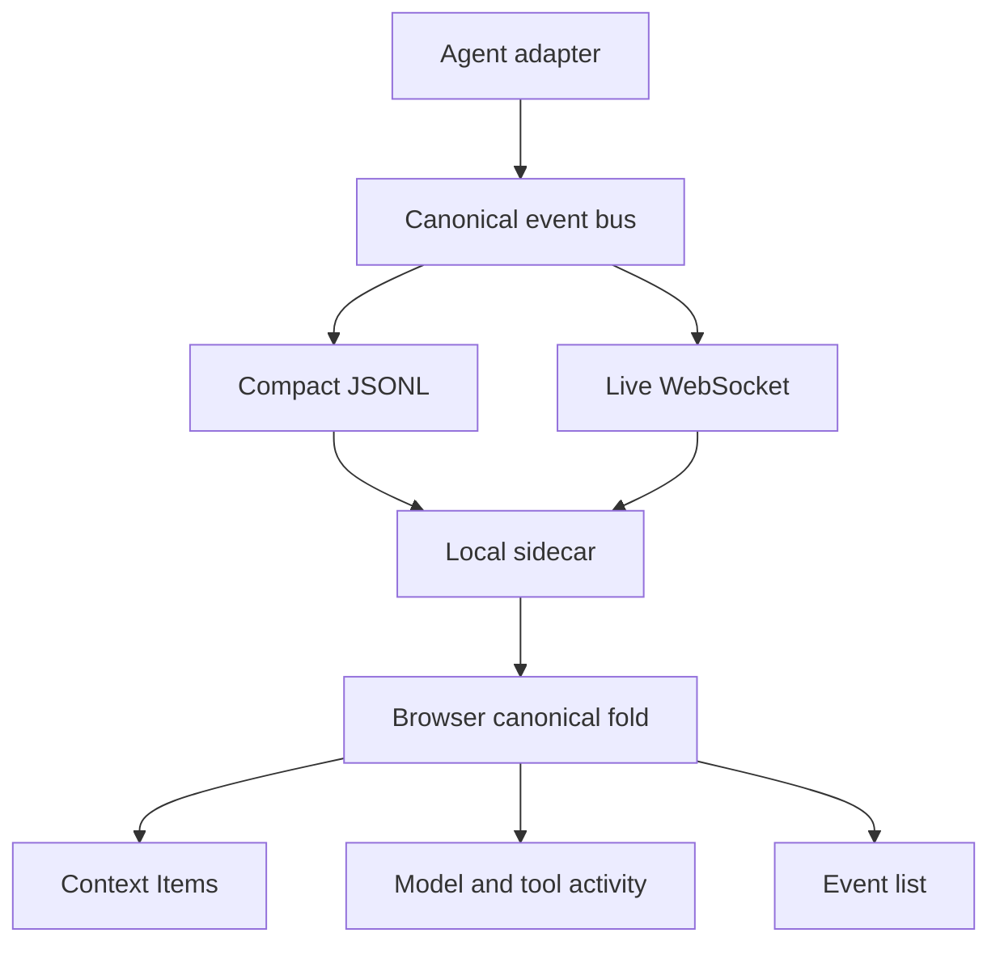

<details>
<summary>Relevant sources</summary>

The following source packages and files were used as context for this document:

- [gh_puller/agent/](../gh_puller/agent/)
- [apps/agent-monitor/server/](../apps/agent-monitor/server/)
- [apps/agent-monitor/web/](../apps/agent-monitor/web/)
- [tests/test_event_taxonomy.py](../tests/test_event_taxonomy.py)
- [tests/test_agent.py](../tests/test_agent.py)
- [tests/test_agent_real.py](../tests/test_agent_real.py)

</details>

# Agent observation and monitor

`gh_puller.agent` translates black-box Agents into one ordered semantic language. At
every event prefix, the canonical fold reconstructs the Agent controls and the complete
model-visible Context that an adapter can assert.

## State algebra

```text
State = Agent × Context
Context = Seq<Item>
```

| Operation | Payload | Fold effect |
| --- | --- | --- |
| `agent/set` | `{agent, config}` | Replace Agent identity and opaque configuration. |
| `agent/set/<facet>` | `{<facet>: value}` | Replace one explicitly observed control facet. |
| `context/set` | `{items}` | Replace the complete Item sequence. |
| `context/append[/<role>]` | `{items}` | Atomically append an Item sequence. |

The role-specialized append routes make common producers easy to identify. The generic
route accepts Items with any role or no role. Context compression and other rewrites
are ordinary `context/set` operations.

Agent configuration is recorded as supplied and is never opened to infer Context. An
adapter may therefore record `system_prompt` in `agent/set.config`, then separately
append a system message when it observes that instruction taking effect. Tools exposed
to a model are likewise Context content, not a separate state axis. Credential-shaped
configuration fields are replaced with `<redacted>` before any sink receives them.

Sources: [gh_puller/agent/](../gh_puller/agent/); [tests/test_event_taxonomy.py](../tests/test_event_taxonomy.py)

## Items and inference

Items use the vocabulary of the [OpenAI Responses API](https://developers.openai.com/api/reference/cli/resources/responses/methods/create), while remaining an observation format rather than a provider wire format. Typical Items are:

```json
{"type":"message","role":"user","content":[{"type":"input_text","text":"Read a.py"}]}
{"type":"reasoning","content":[{"type":"reasoning_text","text":"I should inspect it."}]}
{"type":"message","role":"assistant","content":[{"type":"output_text","text":"I will read it."}]}
{"type":"function_call","call_id":"c1","name":"read_file","arguments":"{\"path\":\"a.py\"}"}
{"type":"function_call_output","call_id":"c1","output":"file contents"}
```

One actual inference has this causal output shape:

```text
reasoning? → message? → function_call*
```

Its stream is `model/delta/*` zero or more times followed by exactly one
`model/response {requestId, output}`. Provider chunks and content-block boundaries are
adapter details. If the Agent commits the output, one
`context/append/assistant {items: output}` records that fact without conversion.

`tool/start` and `tool/end` describe local execution through `callId`. The corresponding
`function_call_output` enters Context only when the result becomes model-visible. Any
model output that depends on that result belongs to a new `model/request`.

A request or response may report an effective model or provider when the backend
exposes it. Neither field is required, and a single Agent session may use different
models across requests.

Sources: [gh_puller/agent/](../gh_puller/agent/); [tests/test_event_taxonomy.py](../tests/test_event_taxonomy.py); [tests/test_agent.py](../tests/test_agent.py)

## Semantic markers

`session/*`, `turn/*`, and `step/*` annotate the stream and never affect the fold. The
expected convention is one turn per user-level interaction and one step per context
preparation, inference, and related tool work. Adapters may place them differently when
the observed Agent uses another control flow.

`BaseAgent` owns session lifetime. Concrete adapters translate only the facts their
backends expose, and each supports repeated `stream` and `result` calls in one session.

```python
from gh_puller.agent import AGENTS


agent = AGENTS["codex"]({"cwd": "/workspace/project"})
async with agent.session(session_name="example"):
    answer = await agent.result("Explain this repository.")
```

Sources: [gh_puller/agent/](../gh_puller/agent/); [tests/test_agent.py](../tests/test_agent.py); [tests/test_agent_real.py](../tests/test_agent_real.py)

## Monitor flow



JSONL is the durable source. Compact files omit only `model/delta/*`; all state-changing
and terminal facts remain. The sidecar indexes files, maintains leases, and forwards
events without interpreting Item semantics. The browser folds `Item[]` directly and
uses the same Item renderer for committed Context and live delta projections.

The viewer reuses vendored DSH Markdown, JSON, menu, and theme primitives. Its event
fold and rendering policy are native monitor code.

Sources: [apps/agent-monitor/server/](../apps/agent-monitor/server/); [apps/agent-monitor/web/](../apps/agent-monitor/web/)

## Run and verify

```bash
pnpm install
pnpm --dir apps/agent-monitor/web build
uv --directory apps/agent-monitor/server run uvicorn app:app --port 8765
```

```bash
uv run pytest -q tests/test_event_taxonomy.py tests/test_agent.py
uv --directory apps/agent-monitor/server run pytest -q
pnpm --dir apps/agent-monitor/web typecheck
pnpm --dir apps/agent-monitor/web test
```

Set `GH_PULLER_REAL_TESTS=1` to include `tests/test_agent_real.py`. Histories retain
prompts, outputs, tool data, and non-credential configuration; protect the history
directory and WebSocket endpoint accordingly.

Sources: [tests/test_event_taxonomy.py](../tests/test_event_taxonomy.py); [tests/test_agent.py](../tests/test_agent.py); [tests/test_agent_real.py](../tests/test_agent_real.py); [apps/agent-monitor/server/](../apps/agent-monitor/server/); [apps/agent-monitor/web/](../apps/agent-monitor/web/)
