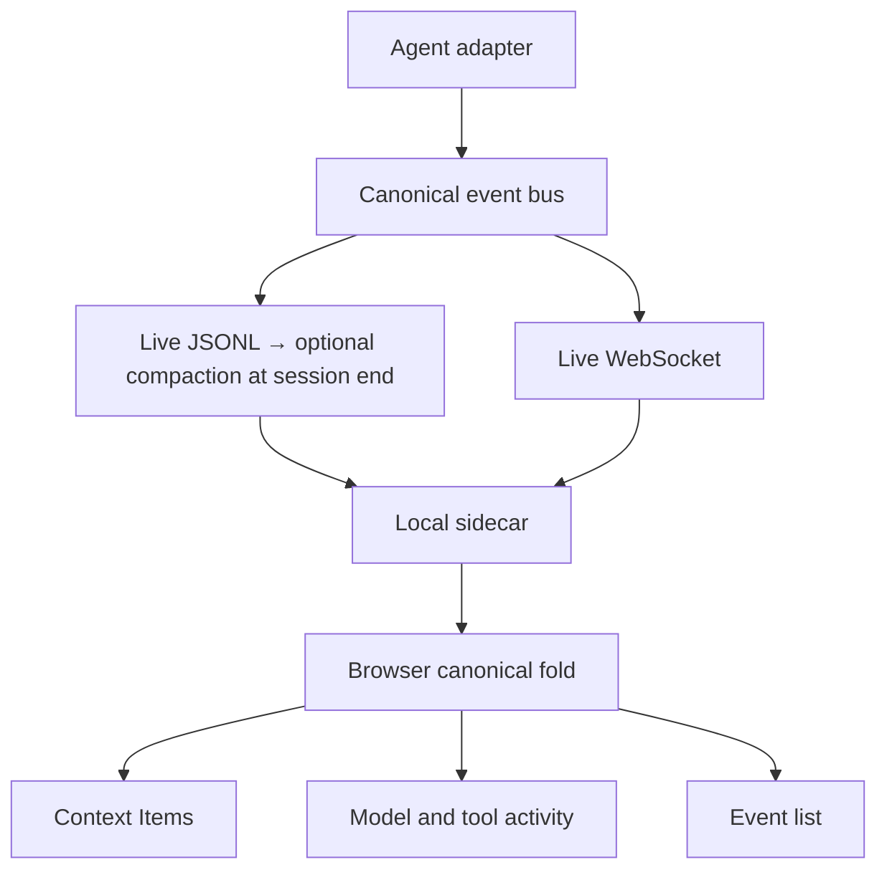

<details>
<summary>Relevant sources</summary>

- [gh_puller/agent/](../gh_puller/agent/)
- [apps/agent-monitor/server/](../apps/agent-monitor/server/)
- [apps/agent-monitor/web/](../apps/agent-monitor/web/)
- [tests/test_event_taxonomy.py](../tests/test_event_taxonomy.py)
- [tests/agent/](../tests/agent/)
- [tests/real/test_agent_backends.py](../tests/real/test_agent_backends.py)

</details>

# Agent observation and monitor

`gh_puller.agent` translates black-box Agents into one ordered semantic language. At
every event prefix, the canonical fold reconstructs the Agent controls and the complete
model-visible Context that an adapter can assert.

## State algebra

```text
State = Agent × Context
Context = Seq<Item>
```

| Operation | Payload | Fold effect |
| --- | --- | --- |
| `agent/set` | `{agent, config, instance?}` | Replace Agent identity and opaque configuration. |
| `agent/set/<facet>` | `{<facet>: value}` | Replace one explicitly observed control facet. |
| `context/set` | `{items}` | Replace the complete Item sequence. |
| `context/append[/<role>]` | `{items}` | Atomically append an Item sequence. |

The role-specialized append routes make common producers easy to identify. The generic
route accepts Items with any role or no role. Context compression and other rewrites
are ordinary `context/set` operations.

Agent configuration is recorded as supplied and is never interpreted by the recorder.
Each adapter separately projects the system inputs it knows took effect. Credential-shaped
configuration fields are replaced with `<redacted>` before any sink receives them.

Sources: [gh_puller/agent/](../gh_puller/agent/); [tests/test_event_taxonomy.py](../tests/test_event_taxonomy.py)

## System semantics

A system message contains an ordered, open sequence of content parts. The shared types
are conventions rather than a whitelist:

```json
{
  "type": "message",
  "role": "system",
  "content": [
    {"type": "instruction", "text": "Work inside the repository."},
    {
      "type": "tool_defs",
      "tools": [{"name": "Read"}]
    },
    {"type": "mcp", "name": "graph"},
    {"type": "skill_list", "skills": ["review"]}
  ]
}
```

`instruction` carries text at the granularity asserted by the adapter. A transparent
Agent may expose its complete rendered instruction, preserve structured parts, or define
its own content types for finer prompt behavior. The fold preserves every type, payload,
and position without parsing it; the monitor renders unknown types as structured data.

`"<opaque>"` is the shared reserved placeholder for a value known to exist whose content
or exact cardinality is unavailable. It may appear in standard or custom content parts.
Within a collection it represents at least one unknown member and may follow known
members.

`tool_defs.tools` is the observable tool collection. A missing `tools` field and
`tools: []` both mean an observed empty collection. An Agent with unenumerable built-in
tools uses `tools: [{"name": "<opaque>"}]`. Within a known tool, an omitted schema means
that no schema value was asserted, `{}` means an observed empty schema, and `"<opaque>"`
means that a schema exists but is unavailable. `mcp` keeps one MCP contribution atomic,
and `skill_list` records the catalog exposed to the Agent. Transport commands, credentials,
and other launch configuration remain Agent configuration rather than Context.

Sources: [gh_puller/agent/](../gh_puller/agent/); [tests/test_event_taxonomy.py](../tests/test_event_taxonomy.py); [tests/agent/](../tests/agent/)

## Inference Items

Model input and output Items follow the vocabulary of the [OpenAI Responses API](https://developers.openai.com/api/reference/cli/resources/responses/methods/create), while remaining an observation format rather than a provider wire format:

```json
{"type":"message","role":"user","content":[{"type":"input_text","text":"Read a.py"}]}
{"type":"reasoning","content":[{"type":"reasoning_text","text":"I should inspect it."}]}
{"type":"message","role":"assistant","content":[{"type":"output_text","text":"I will read it."}]}
{"type":"function_call","call_id":"c1","name":"read_file","arguments":"{\"path\":\"a.py\"}"}
{"type":"function_call_output","call_id":"c1","output":"file contents"}
```

One actual inference has this causal output shape:

```text
reasoning? → message? → function_call*
```

Its stream is `model/delta/*` zero or more times followed by exactly one
`model/response {requestId, output}`. Provider chunks and content-block boundaries are
adapter details. If the Agent commits the output, one
`context/append/assistant {items: output}` records that fact without conversion.

`tool/start` and `tool/end` describe local execution through `callId`. The corresponding
`function_call_output` enters Context only when the result becomes model-visible. Any
model output that depends on that result belongs to a new `model/request`.

A request or response may report an effective model or provider when the backend
exposes it. Neither field is required, and a single Agent session may use different
models across requests.

Sources: [gh_puller/agent/](../gh_puller/agent/); [tests/test_event_taxonomy.py](../tests/test_event_taxonomy.py); [tests/agent/](../tests/agent/)

## Semantic markers

`session/*`, `turn/*`, and `step/*` annotate the stream and never affect the fold. The
expected convention is one turn per user-level interaction and one step per context
preparation, inference, and related tool work. Adapters may place them differently when
the observed Agent uses another control flow.

`BaseAgent` owns session lifetime by default. A caller that replaces Agents in one log
can instead pass an open `EventRecorder` as `agent.session(recorder=recorder)` and finish
the recorder after the entire conversation. `EventRecorder.resume(events)` continues
an open persisted prefix; a completed log must be forked before its terminal event.
The lifecycle and instance contract is defined in `gh_puller.agent.events`.
Concrete adapters translate only the facts their
backends expose. Sequential `stream` and `result` calls may be repeated and mixed inside
one session; every call appends one user-level turn to the same native conversation.

```python
from gh_puller.agent import AGENTS


agent = AGENTS["llm"]({
    "model": "example-model",
    "base_url": "https://api.example.com/v1",
    "api_key": "example-key",
    "system_prompt": "Answer concisely.",
})
async with agent.session(session_name="example"):
    first = await agent.result("Remember the word bluebird.")
    second = await agent.result("Which word did I ask you to remember?")
```

Sources: [gh_puller/agent/](../gh_puller/agent/); [tests/agent/](../tests/agent/); [tests/real/test_agent_backends.py](../tests/real/test_agent_backends.py)

## Monitor flow


```mermaid
flowchart TD
    Adapter[Agent adapter] --> Bus[Canonical event bus]
    Bus --> File[Live JSONL → optional compaction at session end]
    Bus --> Live[Live WebSocket]
    File --> Hub[Local sidecar]
    Live --> Hub
    Hub --> Fold[Browser canonical fold]
    Fold --> Context[Context Items]
    Fold --> Activity[Model and tool activity]
    Fold --> Events[Event list]
```

JSONL is the durable source. File consumers use lossless queues and flush every event,
including all three canonical model delta types. With the default `save_delta=False`,
after flushing `session/end` the sink streams retained lines into a same-directory temporary
file and atomically replaces the log. Only `DELTA_TYPES` are removed; retained bytes, order
and sequence numbers stay intact.
Open readers can finish the full stream through their existing handles. New readers see
compact history. Sessions without an end event remain complete live logs; compaction
failures are reported and preserve the source. `save_delta=True` retains all events after
session end, including failed and cancelled sessions, without replacing the file.

Use `configure(file_path="runs/example/events.jsonl", save_delta=True)` to place one
session's log at an exact path. Parent directories are created automatically;
`session_path(session)` returns that configured path. An explicit file accepts one session
per configuration: choose a distinct path and reconfigure after flushing before starting
another session. The caller owns path uniqueness across processes and sink instances.
`file_dir` remains available for a directory of session-derived filenames and is mutually
exclusive with `file_path`. Omitting both uses `AGENT_MONITOR_DIR`. Calling `configure()`
resets the custom path and restores default delta compaction.

The [Rust terminal observer](../apps/agent-tui/README.md) tails one file and reconstructs
the canonical context without backend-specific inference.

The sidecar indexes files, maintains leases, and forwards
events without interpreting Item semantics. The browser folds `Item[]` directly and
uses the same Item renderer for committed Context and live delta projections.

The viewer reuses vendored DSH Markdown, JSON, menu, and theme primitives. Its event
fold and rendering policy are native monitor code.

Sources: [apps/agent-monitor/server/](../apps/agent-monitor/server/); [apps/agent-monitor/web/](../apps/agent-monitor/web/)

## Run and verify

```bash
pnpm install
pnpm --dir apps/agent-monitor/web build
uv --directory apps/agent-monitor/server run uvicorn app:app --port 8765
```

```bash
uv run pytest -q tests/test_event_taxonomy.py tests/agent
uv --directory apps/agent-monitor/server run pytest -q
pnpm --dir apps/agent-monitor/web typecheck
pnpm --dir apps/agent-monitor/web test
```

Run `GH_PULLER_REAL_TESTS=1 uv run pytest -q -m real tests/real` to include real
backend checks. Histories retain
prompts, outputs, tool data, and non-credential configuration; protect the history
directory and WebSocket endpoint accordingly.

Sources: [tests/test_event_taxonomy.py](../tests/test_event_taxonomy.py); [tests/agent/](../tests/agent/); [tests/real/test_agent_backends.py](../tests/real/test_agent_backends.py); [apps/agent-monitor/server/](../apps/agent-monitor/server/); [apps/agent-monitor/web/](../apps/agent-monitor/web/)
