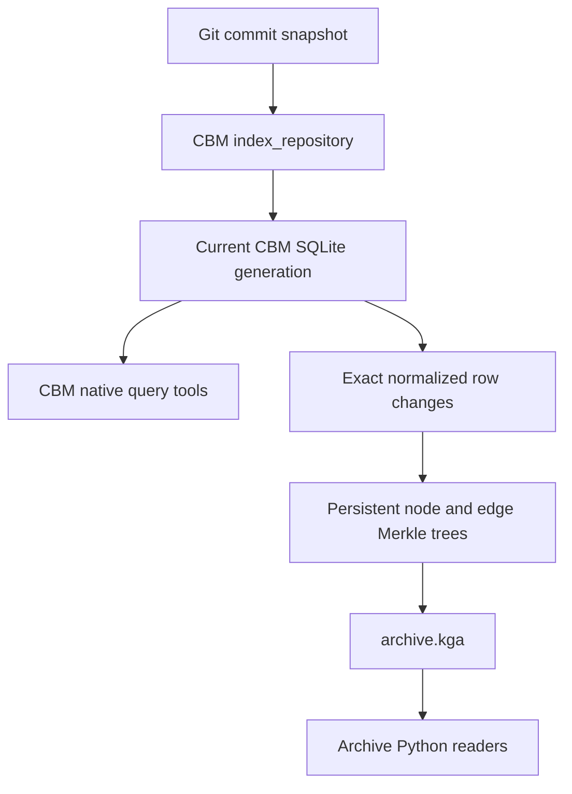

<details>
<summary>Relevant sources</summary>

- [gh_puller/codebase/](../gh_puller/codebase/)
- [tests/codebase/](../tests/codebase/)
- [DeusData/codebase-memory-mcp](https://github.com/DeusData/codebase-memory-mcp)
</details>

# Codebase Graphing: CBM Build, Query, and History Compression

`gh_puller.codebase` converts the commits reachable from Git `HEAD` into a recoverable,
random-access code graph archive. CBM interprets the source tree at one commit and publishes
the current graph. `gh_puller.codebase` records the exact row changes between consecutive
current graphs in a persistent Merkle structure, ultimately producing `archive.kga` and
`summary.json`.

The system has two distinct query boundaries. Native CBM MCP queries operate on the SQLite
project that CBM currently has open. KGA queries operate on historical commits and expose
normalized graph rows, snapshots that preserve parallel edges, and an aggregated NetworkX
view. KGA is not a complete CBM database and does not emulate every CBM query tool.

## From commits to current and historical graphs



| Layer | Owns | Does not own |
| --- | --- | --- |
| Git | Commits, parents, and complete file trees | Semantic relationships in source code |
| CBM | Nodes, edges, properties, and native query indexes for the current source tree | Historical versions across commits |
| Generation bridge | Stable, exact node and edge changes between CBM generations | Whether one CBM build route is equivalent to another |
| KGA | Graph roots for every commit, with unchanged pages shared between versions | A complete CBM SQLite database or Git source objects |
| `Archive` | Graphs and provenance for any archived commit | CBM semantic search or source-reading tools |

This boundary separates two forms of correctness. The archive layer preserves exactly the
nodes and edges that CBM published, but a CBM delta build is not necessarily row-for-row
identical to a fresh full build. The selected CBM route determines graph semantics; the
Merkle layer only determines how those results are versioned and verified.

Sources: [gh_puller/codebase/](../gh_puller/codebase/); [DeusData/codebase-memory-mcp](https://github.com/DeusData/codebase-memory-mcp)

## How CBM builds the current graph

### A complete source tree enters one long-lived engine

The builder selects commits reachable from `HEAD` in root-first topological order. It
materializes the complete file tree for each commit into the same scratch directory, then
passes that directory to CBM through the MCP `index_repository` tool. Full materialization
gives CBM a self-consistent repository snapshot. The Git changeset currently contributes
only the changed-file count; it is not part of the input protocol sent to CBM.

The default transport starts one long-lived CBM MCP process and sends every commit to it in
sequence. This preserves process-local initialization and CBM's preceding generation. The
`cli` transport remains available as a one-shot comparison path. Both transports send the
same indexing arguments: the source-tree path, project, graph-content mode, `force_full`,
and each delta control. `persistence=false` means that this pipeline does not ask CBM to
publish its separate team-shared graph artifact; the builder reads the atomically published
SQLite generation from CBM's cache.

Sources: [gh_puller/codebase/cbm_build.py](../gh_puller/codebase/cbm_build.py); [gh_puller/codebase/cbm_transport.py](../gh_puller/codebase/cbm_transport.py)

### Graph content and update routing are independent axes

| Axis | Interface | Effect |
| --- | --- | --- |
| Graph content | `mode` | Controls file filtering and whether derived content such as similarity and semantic data participates in the graph |
| Update route | `force_full` and delta controls | Selects full, no-op, closure-repair, or conservative fallback behavior for the current generation |
| Process lifetime | `cbm_transport` | Selects a long-lived MCP process or a one-shot CLI process without changing the intended graph semantics |

The default `--mode full` therefore does not mean "force a full build for every commit."
Only `--force-full` asks CBM to bypass no-op and delta routing. The builder checks
`index_execution.route` in the response and rejects a force-full request that CBM did not
confirm. Every other delta control is passed independently to CBM; the Python layer does
not combine them into a hidden policy.

Upstream CBM already has an incremental route, but the explicit `force_full`
control, granular `delta_*` controls, route reporting, and native change journal used by
`gh_puller.codebase` come from the
[Delva0/codebase-memory-mcp fork](https://github.com/Delva0/codebase-memory-mcp). These are
binary compatibility requirements, not part of the KGA format or the general graphing
design.

CBM's returned route, change size, and related execution data are stored in each commit
manifest and in `summary.json`. Every historical graph therefore records the route that
actually produced it instead of requiring readers to infer that route from duration or
graph size.

Sources: [gh_puller/codebase/incremental_config.py](../gh_puller/codebase/incremental_config.py); [gh_puller/codebase/cbm_transport.py](../gh_puller/codebase/cbm_transport.py); [tests/codebase/test_cbm_transport.py](../tests/codebase/test_cbm_transport.py)

### How source code becomes nodes and edges

CBM's stable responsibility can be summarized in four steps:

1. Discover supported source, manifest, and infrastructure files while applying ignore rules
   and mode filters.
2. Use structured front ends such as Tree-sitter to extract candidate definitions, scopes,
   imports, call sites, configuration, and routes.
3. Connect candidates into directed, typed relationships through cross-file name resolution,
   type information, and derived passes.
4. Publish nodes, edges, and the auxiliary indexes required by native queries as one SQLite
   generation.

A node is identified by a qualified name and carries a label, display name, file location,
and properties. An edge connects two nodes and is distinguished by at least
`(source, target, type, local_name)`. Distinct relationships and supported parallel
relationships between the same endpoints are therefore not collapsed before archival.
Common edges represent containment, definitions, imports, calls, types, configuration, data
flow, and similarity. The exact set depends on the CBM binary, mode, and source code.

Sources: [DeusData/codebase-memory-mcp](https://github.com/DeusData/codebase-memory-mcp); [gh_puller/codebase/store.py](../gh_puller/codebase/store.py)

## How CBM queries the current graph

CBM's MCP tools query the current project, not a historical root in KGA. The main query
forms are:

| Query form | Representative tools | Meaning |
| --- | --- | --- |
| Structured discovery | `search_graph` | Filters nodes by label, name, file, degree, and relationships |
| Relationship traversal | `trace_path` | Traverses callers, callees, and similar edges to a bounded depth |
| Graph patterns | `query_graph` | Runs read-only Cypher-like graph patterns and aggregations |
| Source and architecture | `get_code_snippet`, `get_architecture` | Reads code or summarizes structure using the current source tree and graph |
| Text and semantics | `search_code`, semantic queries | Searches auxiliary source, FTS, and vector state |

These capabilities explain why CBM produces more than nodes and edges: some queries also
depend on FTS, node vectors, token vectors, and source locations. `gh_puller.codebase`
removes its temporary CBM project after a build, and KGA archives only normalized nodes and
edges. KGA therefore preserves semantic relationships that became edges, but it does not
preserve the auxiliary tables and source contents required to reproduce every CBM query
result.

To query a historical commit today, read its graph through `Archive` and traverse it in
Python. A commit cannot be passed directly to `search_graph`, `trace_path`, or
`query_graph`. Supporting that behavior would require a KGA-to-CBM restoration protocol
and a rebuild of the auxiliary query indexes; neither is part of the current interface.

Sources: [DeusData/codebase-memory-mcp](https://github.com/DeusData/codebase-memory-mcp); [gh_puller/codebase/cbm_build.py](../gh_puller/codebase/cbm_build.py); [gh_puller/codebase/archive.py](../gh_puller/codebase/archive.py)

## Deriving exact changes between CBM generations

CBM's SQLite node and edge IDs belong to one generation and cannot serve directly as
cross-commit identities. `gh_puller.codebase` removes the project prefix first, then uses
the following stable keys:

| Record | Stable key | Stored value |
| --- | --- | --- |
| Node | Normalized qualified name | Label, name, file path, line range, and complete properties |
| Edge | `(source QN, target QN, type, local_name)` | Complete edge properties |

During a generation switch, a POSIX read transaction pins the old SQLite inode. After CBM
atomically publishes the new path, the same connection attaches the new generation. The
actual execution route then selects the source of changes:

| Situation | Change source |
| --- | --- |
| First commit | Sequentially read every node and edge in the current generation |
| CBM reports no-op | Use an empty changeset and reuse both previous roots |
| A complete native journal is available | Expand candidate row IDs from the journal and compare their old and new stable values |
| The journal is unavailable | Compute an exact row diff between the two complete generations in SQLite |

The native journal is a candidate set, not a trusted source of new values. The reader adds
edges affected by node renames and filters no-op candidates by comparing normalized old and
new values. A complete generation-diff path remains available when the journal is absent or
incomplete. Consequently, even when CBM runs the full pipeline, the archive need only apply
the row differences between two complete generations to the Merkle roots; it does not have
to rewrite the entire graph.

Sources: [gh_puller/codebase/generation_diff.py](../gh_puller/codebase/generation_diff.py); [gh_puller/codebase/journal.py](../gh_puller/codebase/journal.py); [tests/codebase/test_generation_diff.py](../tests/codebase/test_generation_diff.py); [tests/codebase/test_journal.py](../tests/codebase/test_journal.py)

## How KGA compresses successive graph versions

### Two persistent Merkle trees

Every commit stores a node root and an edge root. Nodes are assigned by their own qualified
names, and edges by their source qualified names, to module-local shards based on the first
three dot-separated components. Changes near one module therefore remain concentrated in a
small number of leaves instead of being spread across many pages by global hash sharding.

Applying a changeset rewrites only the affected leaves and their paths to the roots. Every
unchanged child continues to reference the old frame's offset, logical hash, and count, so
any number of later commits can share it. A page's logical hash excludes its physical
offset, which means that a graph digest depends only on the two logical roots and not on
their positions in the file.

KGA does not store several compressed copies of SQLite. Its main savings come from four
combined mechanisms:

| Mechanism | Avoided cost |
| --- | --- |
| Generation diff | Passing every complete CBM graph back to the archive writer |
| Persistent structural sharing | Rewriting unchanged shards |
| Module-local sharding | Spreading common local source changes across many pages |
| Per-frame zlib | Storing the raw JSON bytes of pages, manifests, and the final index |

KGA does not maintain a global page object store deduplicated by logical hash. Reuse occurs
when a new root retains an old `TreeRef`. Once a shard changes, it appends a new page even
when that page happens to equal content from an earlier point in history.

Sources: [gh_puller/codebase/archive.py](../gh_puller/codebase/archive.py); [tests/codebase/test_archive.py](../tests/codebase/test_archive.py)

### Append-only frames and commit checkpoints

| Structure | Purpose |
| --- | --- |
| `PAGE` frame | Stores one compressed node or edge page; CRC checks the compressed bytes and SHA-256 checks the decompressed content |
| `COMMIT` frame | Stores the SHA, parents, both roots, counts, route, and provenance |
| Checkpoint trailer | Follows a commit and links to the preceding checkpoint; that commit becomes a recovery boundary only after flush and `fsync` |
| `FINAL_INDEX` and footer | Summarize every commit and let completed-archive readers locate the index from the end of the file |

An interrupted write can leave a partial page after the final checkpoint. On resume, the
builder searches backward from the file's end for the newest valid checkpoint, restores the
manifest chain, and truncates the uncommitted suffix without scanning and decompressing the
complete history. When a completed archive is extended, its old final index and footer
remain as a durable anchor while new commits are appended, until a new final index and
footer are published.

`summary.json` does not participate in KGA's Merkle identity. It is written only after the
current invocation finishes, the appended content passes verification, and CBM cleanup
completes. It records binary provenance, actual routes, phase durations, and resource
observations.

Sources: [gh_puller/codebase/archive.py](../gh_puller/codebase/archive.py); [gh_puller/codebase/cbm_build.py](../gh_puller/codebase/cbm_build.py); [tests/codebase/test_archive.py](../tests/codebase/test_archive.py)

## Reading a historical commit

```python
from gh_puller.codebase import Archive

archive = Archive("archives/repository-codebase/archive.kga")
commit = archive.latest_commit
rows = archive.load_rows(commit)
snapshot = archive.load_raw(commit)
graph = archive.load(commit)
```

| API | Representation and fidelity boundary |
| --- | --- |
| `commit_ids()`, `parents()` | Read archive order and the original Git parent relationships |
| `manifest()` | Read a commit's roots, counts, route, and provenance copy |
| `load_rows()` | Return nodes and parallel edges stored under stable keys; this is the archive's exact row representation |
| `load_raw()` | Return a `SnapshotGraph` that preserves four-part edge keys and the properties of every edge |
| `load()` | Return a NetworkX `DiGraph`; parallel edges between the same endpoints are aggregated in the `edge_keys` and `data` lists |
| `verify_index()` | Check the final index and the logical root of every manifest |
| `verify()` | Decompress and verify every frame sequentially, then check every graph digest |

A reader captures the commit index that exists when it opens the archive and does not
automatically observe commits appended later by another writer. By default, it accepts only
a completed archive with a valid final footer. Recovery and diagnostic code can explicitly
use `Archive(..., allow_incomplete=True)` to read the final durable checkpoint.

The archive does not contain Git blobs. File paths and line ranges on nodes can locate
source code, but reading that code still requires the original Git repository or another
source store.

Sources: [gh_puller/codebase/archive.py](../gh_puller/codebase/archive.py); [gh_puller/codebase/graph.py](../gh_puller/codebase/graph.py); [tests/codebase/test_archive.py](../tests/codebase/test_archive.py)

## Recovery, space, and fidelity boundaries

- The archive records a root-first topological prefix of the commits reachable from `HEAD`
  when the build starts. On resume, the existing commit sequence must remain an exact prefix
  of the new selection. An equal count or equal final SHA is insufficient.
- Every commit checkpoint is an archive transaction boundary. CBM may have published the
  next generation when the process fails, but a generation without a written checkpoint is
  not part of the archive.
- Resume first materializes the final archived commit in full and sends it through CBM to
  reconstruct a trustworthy current generation. Only then does it process the next commit.
  `summary.json` records this fixed startup cost as `cbm_bootstrap_seconds`.
- A successful run removes the scratch tree and requests deletion of the temporary CBM
  project. During the build, the system still needs one complete source tree, the current
  CBM SQLite database and WAL, and the growing KGA. It does not retain per-commit SQLite
  databases.
- `peak_scratch_bytes` observes the named scratch and current-database paths; it is not a
  disk quota. The current implementation enforces `--memory-limit` only against RSS, so it
  does not guarantee that peak scratch space remains below the final KGA size.
- `summary.json.new_commit_timings` contains only commits added by the current invocation,
  not cumulative timings for the full history.
- KGA versions the nodes and edges that CBM extracted exactly. Merkle verification does not
  correct semantic differences between full and delta CBM routes, source relationships that
  CBM did not recognize, or vector and FTS state that was not archived.

Sources: [gh_puller/codebase/cbm_build.py](../gh_puller/codebase/cbm_build.py); [gh_puller/codebase/archive.py](../gh_puller/codebase/archive.py); [tests/codebase/test_build_options.py](../tests/codebase/test_build_options.py)

## Build entry point and runtime configuration

Build the first 10,000 commits in topological order:

```bash
uv run -m gh_puller.codebase build \
  --repo /path/to/repository \
  --build-dir archives/repository-codebase \
  --max-commits 10000
```

Increasing `--max-commits` for the same `--build-dir` resumes the archive in place. To keep
the original archive and continue from a copy, pass both the original and new directories:

```bash
uv run -m gh_puller.codebase build \
  --repo /path/to/repository \
  --build-dir archives/repository-topo-200 \
  --out-dir archives/repository-topo-300 \
  --max-commits 300
```

On first use, `--out-dir` fully verifies the source archive, copies
`archive.kga` and `summary.json` through temporary files, and atomically renames them. The
target directory cannot contain unrelated files.

The builder resolves one CBM binary when it starts:

| Priority | Source |
| ---: | --- |
| 1 | Explicit API/CLI `binary` or `--binary` |
| 2 | Explicit API/CLI manifest or `--cbm-manifest` |
| 3 | `GH_PULLER_CODEBASE_CBM_BINARY` |
| 4 | `GH_PULLER_CODEBASE_CBM_MANIFEST` |
| 5 | `${XDG_DATA_HOME:-~/.local/share}/gh-puller/cbm/accepted.json` |
| 6 | `codebase-memory-mcp` on `PATH` |

A manifest names a relative object path in the registry and authenticates its binary with
SHA-256 and byte size. The builder also executes `--version`, then inspects the live schema
through MCP `tools/list`. The current `gh_puller.codebase` protocol always requires the
selected binary to expose the granular delta controls defined by the Delva0 fork.
Persistent transport and force-full capabilities are required only when their corresponding
features are selected. Binary identity, detected capabilities, and incremental
configuration are written into archive provenance.

By default, resume requires the binary digest, `force_full` value, and complete
`IncrementalConfig` to match the final archived commit. `--allow-cbm-upgrade` permits a
change in binary identity; it does not relax the topological-prefix, force-full, or delta
configuration checks.

The current CLI documents every argument and independent delta control:

```bash
uv run -m gh_puller.codebase build --help
```

The Python build entry point accepts the same explicit configuration:

```python
from gh_puller.codebase import BuildOptions, IncrementalConfig, build_archive

build_archive(
    BuildOptions(
        repo="/path/to/repository",
        build_dir="archives/repository-codebase",
        max_commits=10000,
        incremental=IncrementalConfig(),
    )
)
```

Sources: [gh_puller/codebase/binary.py](../gh_puller/codebase/binary.py); [gh_puller/codebase/cbm_build.py](../gh_puller/codebase/cbm_build.py); [gh_puller/codebase/incremental_config.py](../gh_puller/codebase/incremental_config.py); [tests/codebase/](../tests/codebase/)
