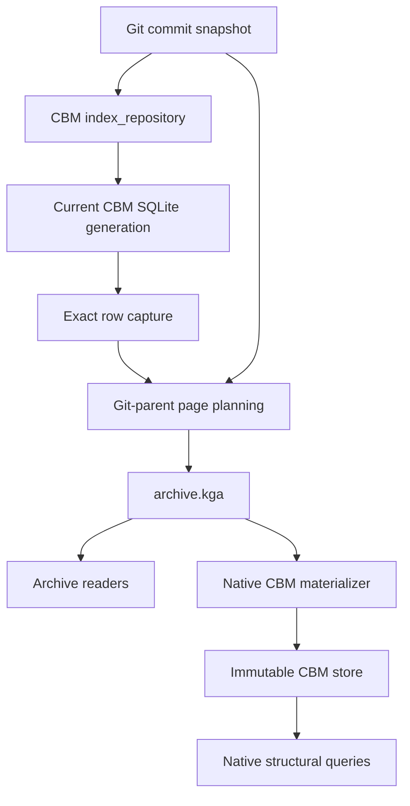

<details>
<summary>Relevant sources</summary>

- [gh_puller/codebase/](../gh_puller/codebase/)
- [tests/codebase/](../tests/codebase/)
- [DeusData/codebase-memory-mcp](https://github.com/DeusData/codebase-memory-mcp)
</details>

# Codebase Graphing: CBM Build, Query, and History Compression

`gh_puller.codebase` converts the commits reachable from Git `HEAD` into a recoverable,
random-access code graph archive. CBM interprets one materialized source tree and publishes
its current SQLite graph. The generation bridge captures complete rows or the exact changes
from the preceding published generation; the KGA recorder then publishes a complete Merkle
root for the commit while reusing pages from its Git parents. A repository build produces
`archive.kga` and `summary.json`.

The system has two historical query paths. `Archive` reads graph and coverage rows directly
from any commit root. `CBMArchiveAdapter` can instead materialize a root as an immutable CBM
store for native structural graph queries. KGA does not contain Git objects, source text,
vectors, or every auxiliary CBM index.

## From commits to current and historical graphs


```mermaid
flowchart TD
    Git["Git commit snapshot"] --> Index["CBM index_repository"]
    Index --> Current["Current CBM SQLite generation"]
    Current --> Capture["Exact row capture"]
    Capture --> Plan["Git-parent page planning"]
    Git --> Plan
    Plan --> KGA["archive.kga"]
    KGA --> HistoryQuery["Archive readers"]
    KGA --> Import["Native CBM materializer"]
    Import --> Store["Immutable CBM store"]
    Store --> NativeQuery["Native structural queries"]
```

| Layer | Owns | Does not own |
| --- | --- | --- |
| Git | Commits, parents, and complete file trees | Semantic relationships in source code |
| CBM | Nodes, edges, properties, and native query indexes for the current source tree | Historical versions across commits |
| Generation bridge | Exact graph and coverage rows or mutations between published CBM generations | Whether one CBM build route is equivalent to another |
| KGA | Complete roots for every commit, with logical pages shared from Git parents | Git objects, source text, or auxiliary CBM indexes |
| `Archive` | Graph rows, coverage rows, and provenance for any archived commit | CBM graph semantics or source-aware queries |
| Native materializer | Importing one KGA root into an immutable CBM store | KGA persistence or source checkout management |

This boundary separates two forms of correctness. The archive layer transports the rows
that CBM published without interpreting CBM-specific graph invariants. The selected CBM
route determines graph semantics, and CBM's native importer validates those semantics when
a KGA root is materialized. KGA itself validates framing, content identities, and roots.

Sources: [gh_puller/codebase/](../gh_puller/codebase/); [DeusData/codebase-memory-mcp](https://github.com/DeusData/codebase-memory-mcp)

## How CBM builds the current graph

### A complete source tree enters one long-lived engine

The builder selects commits reachable from `HEAD` in root-first topological order. It
materializes the complete file tree for each commit into the same scratch directory, then
passes that directory through the transport-neutral `index_repository` API. Full materialization
gives CBM a self-consistent repository snapshot. The Git changeset currently contributes
per-parent changed-file provenance; it is not part of the indexing request sent to CBM.

The default transport starts one persistent native index helper and sends every commit to it
in sequence. MCP and `cli` each start one daemon-backed client process per call. All routes
receive the same indexing arguments: the source-tree path, project,
graph-content mode, `force_full`, and each delta control. The builder reads CBM's atomically
published SQLite generation from its cache.

Sources: [gh_puller/codebase/build.py](../gh_puller/codebase/build.py); [gh_puller/codebase/cbm/runner.py](../gh_puller/codebase/cbm/runner.py); [gh_puller/codebase/cbm/transports/native.py](../gh_puller/codebase/cbm/transports/native.py)

### Graph content and update routing are independent axes

| Axis | Interface | Effect |
| --- | --- | --- |
| Graph content | `mode` | Controls file filtering and whether derived content such as similarity and semantic data participates in the graph |
| Update route | `force_full` and delta controls | Selects full, no-op, closure-repair, or conservative fallback behavior for the current generation |
| Process lifetime | `cbm_transport` | Selects a persistent native helper or a one-shot daemon-backed MCP/CLI client without changing the intended graph semantics |

The default `--mode full` therefore does not mean "force a full build for every commit."
Only `--force-full` asks CBM to bypass no-op and delta routing. The builder checks
`index_execution.route` in the response and rejects a force-full request that CBM did not
confirm. Every other delta control is passed independently to CBM; the Python layer does
not combine them into a hidden policy.

Upstream CBM already has an incremental route, but the explicit `force_full` control,
granular `delta_*` controls, and route reporting used by `gh_puller.codebase` come from the
[Delva0/codebase-memory-mcp fork](https://github.com/Delva0/codebase-memory-mcp). These are
binary compatibility requirements, not part of the KGA format or the general graphing
design.

CBM's returned route, change size, and related execution data are stored in each commit
manifest and in `summary.json`. Every historical graph therefore records the route that
actually produced it instead of requiring readers to infer that route from duration or
graph size.

Sources: [gh_puller/codebase/cbm/plan.py](../gh_puller/codebase/cbm/plan.py); [gh_puller/codebase/cbm/client.py](../gh_puller/codebase/cbm/client.py); [tests/codebase/test_cbm_transport.py](../tests/codebase/test_cbm_transport.py)

### How source code becomes nodes and edges

CBM's stable responsibility can be summarized in four steps:

1. Discover supported source, manifest, and infrastructure files while applying ignore rules
   and mode filters.
2. Use structured front ends such as Tree-sitter to extract candidate definitions, scopes,
   imports, call sites, configuration, and routes.
3. Connect candidates into directed, typed relationships through cross-file name resolution,
   type information, and derived passes.
4. Publish nodes, edges, and the auxiliary indexes required by native queries as one SQLite
   generation.

A node is identified by a qualified name and carries a label, display name, file location,
and properties. An edge connects two nodes and is distinguished by at least
`(source, target, type, local_name)`. Distinct relationships and supported parallel
relationships between the same endpoints are therefore not collapsed before archival.
Common edges represent containment, definitions, imports, calls, types, configuration, data
flow, and similarity. The exact set depends on the CBM binary, mode, and source code.

Sources: [DeusData/codebase-memory-mcp](https://github.com/DeusData/codebase-memory-mcp); [gh_puller/codebase/store.py](../gh_puller/codebase/store.py)

## How CBM queries current and archived graphs

CBM tools operate on an opened CBM store. That store can be a mutable project generation or
an immutable database materialized from one KGA root. The main query forms are:

| Query form | Representative tools | Meaning |
| --- | --- | --- |
| Structured discovery | `search_graph` | Filters nodes by label, name, file, degree, and relationships |
| Relationship traversal | `trace_path` | Traverses callers, callees, and similar edges to a bounded depth |
| Graph patterns | `query_graph` | Runs read-only Cypher-like graph patterns and aggregations |
| Source and architecture | `get_code_snippet`, `get_architecture` | Reads code or summarizes structure using the current source tree and graph |
| Text and semantics | `search_code`, semantic queries | Searches auxiliary source, FTS, and vector state |

Python callers can initialize one frontend and reuse it for multiple queries:

```python
from gh_puller.codebase import CBMClient

with CBMClient() as cbm:
    graph = cbm.project_graph("my-project")
    matches = cbm.search_graph(graph, label="Function", limit=20)
    rows = cbm.query_graph(
        graph,
        query="MATCH (n:Class) RETURN n.qualified_name LIMIT 10",
    )
```

The first operation starts its selected frontend. `search_graph`, `query_graph`, and
`trace_path` take an explicit graph handle. Calls from multiple Python threads are
serialized on the same native session, and leaving the context closes every initialized
backend. `cache_root` selects the CBM project directory; when omitted, the client honors
`CBM_CACHE_DIR` and then CBM's per-user default.

Some queries also depend on FTS, vectors, or source text. KGA records graph and coverage
rows, not those auxiliary inputs. A materialized historical store therefore supports native
structural graph operations, while source-aware operations require a matching checkout via
`source_root` and operations backed by unarchived indexes cannot be reconstructed from KGA
alone.

Sources: [DeusData/codebase-memory-mcp](https://github.com/DeusData/codebase-memory-mcp); [gh_puller/codebase/cbm/client.py](../gh_puller/codebase/cbm/client.py); [gh_puller/codebase/cbm/archive.py](../gh_puller/codebase/cbm/archive.py); [tests/codebase/test_cbm_native.py](../tests/codebase/test_cbm_native.py)

## Deriving exact changes between CBM generations

CBM's SQLite node and edge IDs belong to one generation and cannot serve directly as
cross-commit identities. `gh_puller.codebase` retains full qualified names and uses the
following stable keys:

| Record | Stable key | Stored value |
| --- | --- | --- |
| Node | Full qualified name | Label, name, file path, line range, and complete properties |
| Edge | `(source QN, target QN, type, local_name)` | Complete edge properties |

During a generation switch, a POSIX read transaction pins the old SQLite inode. After CBM
atomically publishes the new path, the same connection attaches the new generation. The
current correctness baseline selects changes as follows:

| Situation | Change source |
| --- | --- |
| No pinned preceding generation, or an explicit snapshot boundary | Read every node, edge, and available coverage row |
| CBM reports no-op | Use an empty changeset and reuse both previous roots |
| Any other pinned transition | Compute an exact row diff between the two complete generations in SQLite |

Capture is a representation bridge, not a CBM graph validator. It requires deterministic
row identities and exact JSON values, but does not check Project roots, dangling edge
endpoints, or CBM-specific recoverability. Those constraints belong to CBM's native importer.
The complete-generation diff only avoids moving unchanged rows into the recorder; it does
not select the KGA delta base.

Sources: [gh_puller/codebase/store.py](../gh_puller/codebase/store.py); [gh_puller/codebase/build.py](../gh_puller/codebase/build.py); [tests/codebase/test_generation_diff.py](../tests/codebase/test_generation_diff.py); [tests/codebase/test_store.py](../tests/codebase/test_store.py)

## How KGA compresses successive graph versions

### Persistent Merkle trees and Git-parent bases

Every commit stores complete node and edge roots plus an optional coverage root. Nodes are
assigned by their own qualified names, edges by their source qualified names, and coverage
by repository-relative path. Graph records use module-local shards based on the first three
dot-separated components, so changes near one module remain concentrated in a small number
of leaves instead of being spread across many pages by global hash sharding.

The row capture is first applied to the preceding physically built root to form the current
complete logical draft. The recorder then plans that draft against every Git parent root.
Logically identical leaves retain parent references; changed leaves and the resulting root
are precompressed so a merge commit can choose the parent with the smallest exact appended
page size. Parent order breaks a remaining tie. Root commits use an empty base, and ordinary
commits use their sole Git parent.

Every manifest still contains complete roots, so random reads never replay a delta chain. A
page's logical hash excludes its physical offset, which makes graph identity independent of
where shared pages occur in the file.

KGA does not store several compressed copies of SQLite. Its main savings come from five
combined mechanisms:

| Mechanism | Avoided cost |
| --- | --- |
| Generation diff | Passing unchanged rows from the current CBM generation to the recorder |
| Git-parent planning | Diffing against an unrelated neighbor in topological build order |
| Persistent structural sharing | Rewriting unchanged shards |
| Module-local sharding | Spreading common local source changes across many pages |
| Per-frame zlib | Storing the raw JSON bytes of pages, manifests, and the final index |

Per-frame zlib streams are independent; there is no cross-frame compression dictionary.
That boundary preserves direct frame reads. Cross-commit deduplication comes from retained
Merkle references, not zlib state. KGA does not search a global page object store: content
that matches a Git parent is reused, while unrelated historical content is not rediscovered.

Sources: [gh_puller/codebase/archive.py](../gh_puller/codebase/archive.py); [tests/codebase/test_archive.py](../tests/codebase/test_archive.py)

### Append-only frames and commit checkpoints

KGA is identified by its magic and frame structure. Manifests and the final index describe
stored content and roots. A file with another structure is rejected rather than migrated in
place.

| Structure | Purpose |
| --- | --- |
| `PAGE` frame | Stores one compressed node or edge page; CRC checks the compressed bytes and SHA-256 checks the decompressed content |
| `COMMIT` frame | Stores the SHA, parents, both roots, counts, route, and provenance |
| Checkpoint trailer | Follows a commit and links to the preceding checkpoint; that commit becomes a recovery boundary only after flush and `fsync` |
| `FINAL_INDEX` and footer | Summarize every commit and let completed-archive readers locate the index from the end of the file |

An interrupted write can leave a partial page after the final checkpoint. On resume, the
builder searches backward from the file's end for the newest valid checkpoint, restores the
manifest chain, and truncates the uncommitted suffix without scanning and decompressing the
complete history. When a completed archive is extended, its old final index and footer
remain as a durable anchor while new commits are appended, until a new final index and
footer are published.

`summary.json` does not participate in KGA's Merkle identity. It is written only after the
current invocation finishes, the appended content passes verification, and CBM cleanup
completes. It records binary provenance, actual routes, phase durations, and resource
observations.

Sources: [gh_puller/codebase/archive.py](../gh_puller/codebase/archive.py); [gh_puller/codebase/build.py](../gh_puller/codebase/build.py); [tests/codebase/test_archive.py](../tests/codebase/test_archive.py)

## Reading a historical commit

```python
from gh_puller.codebase import Archive

archive = Archive("archives/repository-codebase/archive.kga")
commit = archive.latest_commit
rows = archive.load_rows(commit)
coverage = archive.load_coverage(commit)
snapshot = archive.load_raw(commit)
graph = archive.load(commit)
archive.close()
```

| API | Representation boundary |
| --- | --- |
| `commit_ids()`, `parents()` | Read archive order and the original Git parent relationships |
| `manifest()` | Read a commit's roots, counts, route, and provenance copy |
| `load_rows()` | Return nodes and parallel edges stored under stable keys; this is the archive's exact row representation |
| `load_coverage()` | Return archived coverage rows and metadata when present |
| `load_raw()` | Return a `SnapshotGraph` that preserves four-part edge keys and the properties of every edge |
| `load()` | Return a NetworkX `DiGraph`; parallel edges between the same endpoints are aggregated in the `edge_keys` and `data` lists |
| `verify_index()` | Check the final index and the logical root of every manifest |
| `verify()` | Decompress and verify every frame sequentially, then check every graph digest |

A reader captures the commit index that exists when it opens the archive and does not
automatically observe commits appended later by another writer. By default, it accepts only
a completed archive with a valid final footer. Live readers can explicitly use
`Archive(..., allow_incomplete=True)` to read the final durable checkpoint while one
`ArchiveWriter` appends; the writer lock rejects a second writer without blocking readers.
Long-lived readers can raise `cache_bytes` when their repeated snapshot working set exceeds
the default 64 MiB raw-page budget.

The archive does not contain Git blobs. File paths and line ranges on nodes can locate
source code, but reading that code still requires the original Git repository or another
source store.

To run native structural queries instead, materialize the commit and open the resulting
immutable CBM store:

```python
from gh_puller.codebase import CBMArchiveAdapter, CBMClient

adapter = CBMArchiveAdapter(None, "build/cbm-query-cache", timeout=120)
store = adapter.materialize("archives/repository-codebase/archive.kga", commit)

with CBMClient() as cbm:
    target = cbm.open_store(store.database_path, store.project)
    result = cbm.query_graph(target, query="MATCH (n) RETURN count(n)")
```

The materializer passes stored rows to CBM's C importer. Semantic failures, including
dangling edge endpoints, are reported there rather than by `Archive`.

Sources: [gh_puller/codebase/archive.py](../gh_puller/codebase/archive.py); [gh_puller/codebase/graph.py](../gh_puller/codebase/graph.py); [gh_puller/codebase/cbm/archive.py](../gh_puller/codebase/cbm/archive.py); [tests/codebase/test_cbm_native.py](../tests/codebase/test_cbm_native.py)

## Recovery, integrity, and space boundaries

- The archive records a root-first topological prefix of the commits reachable from `HEAD`
  when the build starts. On resume, the existing commit sequence must remain an exact prefix
  of the new selection. An equal count or equal final SHA is insufficient.
- Every commit checkpoint is an archive transaction boundary. CBM may have published the
  next generation when the process fails, but a generation without a written checkpoint is
  not part of the archive.
- If durable CBM work state still names the KGA head, resume pins that published generation
  and continues exact generation diffing. Otherwise the first unarchived commit is captured
  in full; Git-parent planning can still reuse every logically identical parent page.
- Resume requires the same project identity. A changed CBM engine is rejected unless
  `--allow-cbm-upgrade` is explicit, in which case the first new commit is captured in full.
- KGA integrity checks cover its framing, checksums, page identities, counts, and Merkle
  roots. They intentionally do not assert CBM graph semantics. The native CBM importer owns
  semantic validation when a snapshot is materialized.
- A successful run removes the scratch tree and requests deletion of the temporary CBM
  project. During the build, the system still needs one complete source tree, the current
  CBM SQLite database and WAL, and the growing KGA. It does not retain per-commit SQLite
  databases.
- `peak_scratch_bytes` observes the named scratch and current-database paths; it is not a
  disk quota. The current implementation enforces `--memory-limit` only against RSS, so it
  does not guarantee that peak scratch space remains below the final KGA size.
- `summary.json.new_commit_timings` contains only commits added by the current invocation,
  not cumulative timings for the full history.
- KGA records the rows that CBM published. Merkle verification does not correct semantic
  differences between full and delta CBM routes, source relationships that CBM did not
  recognize, or vector and FTS state that was not archived.

Sources: [gh_puller/codebase/build.py](../gh_puller/codebase/build.py); [gh_puller/codebase/archive.py](../gh_puller/codebase/archive.py); [tests/codebase/test_build_options.py](../tests/codebase/test_build_options.py)

## Build entry point and runtime configuration

Build the first 10,000 commits in topological order:

```bash
uv run -m gh_puller.codebase build \
  --repo /path/to/repository \
  --build-dir archives/repository-codebase \
  --max-commits 10000
```

Increasing `--max-commits` for the same `--build-dir` resumes the archive in place. To keep
the original archive and continue from a copy, pass both the original and new directories:

```bash
uv run -m gh_puller.codebase build \
  --repo /path/to/repository \
  --build-dir archives/repository-topo-200 \
  --out-dir archives/repository-topo-300 \
  --max-commits 300
```

On first use, `--out-dir` fully verifies the source archive, copies
`archive.kga` and `summary.json` through temporary files, and atomically renames them. The
target directory cannot contain unrelated files.

The default native route resolves `gh-puller-cbm-index-helper` from
`--native-index-helper`, `GH_PULLER_CODEBASE_CBM_INDEX_HELPER`, the repository's
`build/native/bin`, or `PATH`. MCP and CLI routes instead resolve one CBM frontend binary:

| Priority | Source |
| ---: | --- |
| 1 | Explicit API/CLI `binary` or `--binary` |
| 2 | Explicit API/CLI manifest or `--cbm-manifest` |
| 3 | `GH_PULLER_CODEBASE_CBM_BINARY` |
| 4 | `GH_PULLER_CODEBASE_CBM_MANIFEST` |
| 5 | `${XDG_DATA_HOME:-~/.local/share}/gh-puller/cbm/accepted.json` |
| 6 | `codebase-memory-mcp` on `PATH` |

A manifest names a relative object path in the registry and authenticates its binary with
SHA-256 and byte size. Every executable is also inspected through `--version`, and the
selected transport negotiates its live capabilities. The build always requires granular
delta controls and additionally requires force-full routing when selected. Executable
identity, detected capabilities, and incremental configuration are written into archive
provenance.

Resume requires the same selected commit prefix and project identity. It also requires the
same indexing executable digest unless `--allow-cbm-upgrade` explicitly accepts an engine
change and a full row capture for the first new commit. Build-plan provenance remains stored
per commit, so a caller-supplied plan selector may intentionally change plans between
commits.

The current CLI documents every argument and independent delta control:

```bash
uv run -m gh_puller.codebase build --help
```

The Python build entry point accepts the same explicit configuration:

```python
from gh_puller.codebase import BuildOptions, IncrementalConfig, build_archive

build_archive(
    BuildOptions(
        repo="/path/to/repository",
        build_dir="archives/repository-codebase",
        max_commits=10000,
        incremental=IncrementalConfig(),
    )
)
```

Sources: [gh_puller/codebase/cbm/binary.py](../gh_puller/codebase/cbm/binary.py); [gh_puller/codebase/build.py](../gh_puller/codebase/build.py); [gh_puller/codebase/cbm/plan.py](../gh_puller/codebase/cbm/plan.py); [tests/codebase/](../tests/codebase/)
