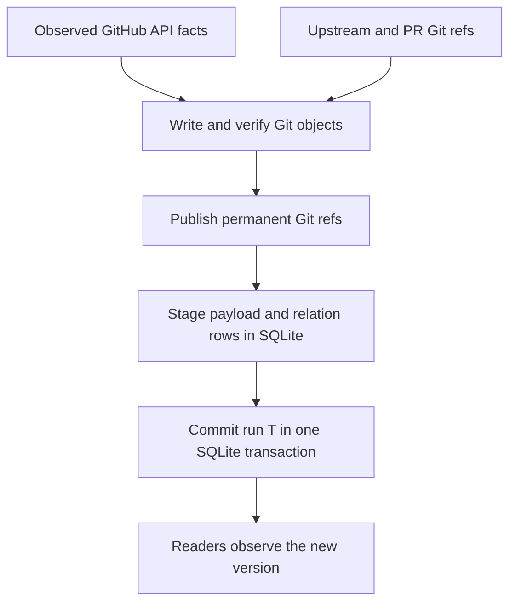

<details>
<summary>Relevant sources</summary>

- [gh_puller/github/v8/schema.py](../gh_puller/github/v8/schema.py)
- [gh_puller/github/archive_format.py](../gh_puller/github/archive_format.py)
- [gh_puller/github/git_store.py](../gh_puller/github/git_store.py)
- [gh_puller/github/store.py](../gh_puller/github/store.py)
- [gh_puller/github/v8/migrate.py](../gh_puller/github/v8/migrate.py)
- [tests/github/test_git_store.py](../tests/github/test_git_store.py)
- [tests/github/test_migration.py](../tests/github/test_migration.py)
</details>

# GitHub archive format

One GitHub repository is represented by a pair:

```text
DATABASE       SQLite observations, versions, and PR-to-commit relations
DATABASE.git   Bare Git repository containing upstream and retained PR objects
```

The pair is the canonical archive. SQLite is the publication boundary and the Git
repository supplies code objects named by published SQLite rows. They must be moved,
backed up, and restored together. Downstream jobs need no project-specific SDK: they
can use SQL and native Git, then create any disposable database or working clone they
need. The canonical pair remains single-writer even though its clones and derived
data are freely writable.

Sources: [gh_puller/github/v8/schema.py](../gh_puller/github/v8/schema.py); [gh_puller/github/git_store.py](../gh_puller/github/git_store.py); [gh_puller/github/store.py](../gh_puller/github/store.py)

## Publication invariant



SQLite never publishes a ref before that ref resolves to its stated object. Permanent
Git refs are monotonic evidence pins: a later branch deletion, force-push, or Git GC
cannot remove an object already referenced by a committed observation. A failed run
may leave additional safe Git objects or refs, but public SQLite readers continue to
see the last committed run.

Sources: [gh_puller/github/git_store.py](../gh_puller/github/git_store.py); [gh_puller/github/store.py](../gh_puller/github/store.py); [tests/github/test_migration.py](../tests/github/test_migration.py)

## SQLite contract

`archive_meta` binds the database to one `owner/repo`. Schema version `8` is paired
with Git layout `0`. Raw summaries and complete selected-parent bundles are canonical
JSON compressed with zlib and addressed by the SHA-256 digest of their uncompressed
bytes.

The stable downstream relations are:

| Relation | Meaning |
| --- | --- |
| `pull_runs` | Committed observation targets `T`, completion times `C`, and run statistics. |
| `resource_heads` | Latest published Issue/PR state, including directly observed tombstones. |
| `resource_versions` | Append-only published changes linked to their run. |
| `payload_blobs` | Lossless observed JSON payloads addressed by digest. |
| `git_pull_snapshots` | One Git evidence manifest for each distinct PR bundle. |
| `git_pull_commits` | Ordered API-observed PR commits; a SHA may belong to several PRs. |
| `current_pull_git` | Current PR head joined to its Git evidence manifest. |
| `current_pull_commits` | Current PR head joined to its ordered commit list. |

`bundle_http_cache`, `pull_passes`, and `pull_tasks` are writer recovery state. They
may be inspected operationally, but downstream mining must not treat them as
published facts.

Git object IDs are content identities, not PR- or repository-scoped identifiers.
Two PRs that name the same SHA share one Git object while retaining two SQL relation
rows and two PR ref paths. An actual hash collision cannot be represented as two
objects under one Git object ID; normal identical-SHA reuse means the commit object
is byte-identical.

Sources: [gh_puller/github/v8/schema.py](../gh_puller/github/v8/schema.py); [gh_puller/github/archive_format.py](../gh_puller/github/archive_format.py); [tests/github/](../tests/github/)

## Git contract

Current upstream refs use Git's native namespaces:

```text
refs/heads/<branch>                         current upstream branch
refs/tags/<tag>                             current upstream tag
```

Consequently, ordinary commands and clones see the current upstream repository
without custom translation. Immutable archive evidence uses a semantic namespace
that is independent of the implementation package name and target repository name:

```text
refs/github-archive/upstream/heads/<sha>     retained observed branch-tip object
refs/github-archive/upstream/tags/<sha>      retained observed tag object

refs/github-archive/pulls/<n>/bases/<sha>        API-observed PR base
refs/github-archive/pulls/<n>/heads/<sha>        API-observed original PR head
refs/github-archive/pulls/<n>/comparisons/<sha>  persisted diff origin
refs/github-archive/pulls/<n>/landings/<sha>     available merged result
```

`refs/github-archive/staging/*` is mutable writer state and is not a public identity.
Layout `0` deliberately has no `v0` path component. A future incompatible namespace
starts at `refs/github-archive/v1/*`; additive changes keep the unversioned layout.

The archive synchronizes all upstream branches and tags before processing a new run.
After reading a PR's API head SHA, it fetches the PR ref only when that commit is not
already in the managed upstream object graph. This avoids redundant transfer for an
ordinary merge while retaining original histories for squash, rebase, open, and
closed-unmerged PRs.

Sources: [gh_puller/github/archive_format.py](../gh_puller/github/archive_format.py); [gh_puller/github/git_store.py](../gh_puller/github/git_store.py); [tests/github/test_git_store.py](../tests/github/test_git_store.py)

## PR history evidence

`git_pull_snapshots.history_preserved` reports only an ancestry proof:

| Value | Proven statement |
| --- | --- |
| `1` | The observed original PR head is an ancestor of the available landing commit. |
| `0` | Both objects are available, but that ancestry does not hold. |
| `NULL` | No landing proof is applicable or enough objects are unavailable. |

This is not a guessed merge-method label. A false value is compatible with squash,
rebase, or another rewritten landing. In those cases the original head DAG and the
landing endpoint remain independently readable; GitHub does not provide enough
evidence to invent an exact original-to-rewritten commit mapping.

`comparison_kind` defines offline diff behavior:

| Value | Diff origin |
| --- | --- |
| `merge_base` | `comparison_ref` is the unique merge base of retained base and head. |
| `empty_tree` | Base and head have unrelated histories, so `comparison_ref` is an empty tree. |
| `unavailable` | A required object was unreachable and no complete code comparison is claimed. |

Sources: [gh_puller/github/git_store.py](../gh_puller/github/git_store.py); [gh_puller/github/archive_format.py](../gh_puller/github/archive_format.py); [tests/github/test_git_store.py](../tests/github/test_git_store.py)

## Native downstream access

List current upstream history:

```bash
git --git-dir archives/repository.sqlite3.git rev-list --branches --tags
```

List every retained object reachable from current upstream and archive evidence:

```bash
git --git-dir archives/repository.sqlite3.git rev-list --all
```

Inspect one PR's current manifest and ordered commits:

```bash
uv run -m sqlite3 archives/repository.sqlite3 \
  'SELECT * FROM current_pull_git WHERE number = 7;'

uv run -m sqlite3 archives/repository.sqlite3 \
  'SELECT ordinal, sha FROM current_pull_commits WHERE number = 7 ORDER BY ordinal;'
```

Use the returned refs directly with Git:

```bash
git --git-dir archives/repository.sqlite3.git diff \
  refs/github-archive/pulls/7/comparisons/COMPARISON_SHA \
  refs/github-archive/pulls/7/heads/HEAD_SHA

git --git-dir archives/repository.sqlite3.git show HEAD_SHA
```

For unrestricted downstream modification, make a full mirror and work on the copy:

```bash
git clone --mirror archives/repository.sqlite3.git derived/repository.git
git --git-dir derived/repository.git branch experiment HEAD_SHA
```

A normal working clone can fetch the archive namespace explicitly:

```bash
git clone archives/repository.sqlite3.git derived/repository
git -C derived/repository fetch origin \
  '+refs/github-archive/*:refs/github-archive/*'
```

Native `log`, `show`, `diff`, `blame`, `merge-base`, branching, worktrees, and normal
object plumbing remain available. Git LFS payloads, submodule repositories, external
attachments, and unavailable remote objects are outside the bare object's contents.

Sources: [gh_puller/github/git_store.py](../gh_puller/github/git_store.py); [tests/github/test_git_store.py](../tests/github/test_git_store.py)

## Format migration

The current explicit migration accepts a stopped schema-7 archive and publishes
schema 8 with Git layout 0. It performs no GitHub API or Git network requests and
preserves pending run cursors, completed tasks, staged versions, and HTTP validators.
The command is idempotent.

```bash
scripts/github-puller-daemon.sh stop archives/repository.sqlite3
uv run -m gh_puller.github migrate archives/repository.sqlite3
scripts/github-puller-daemon.sh start archives/repository.sqlite3
```

Migration fails immediately if another writer holds the archive lock. Its order is
permanent Git refs, SQLite payload and relation transaction, validation, then cleanup
of writer-private source refs. A retry safely completes an interrupted attempt.

Sources: [gh_puller/github/v8/migrate.py](../gh_puller/github/v8/migrate.py); [tests/github/test_migration.py](../tests/github/test_migration.py); [gh_puller/github/__main__.py](../gh_puller/github/__main__.py)
