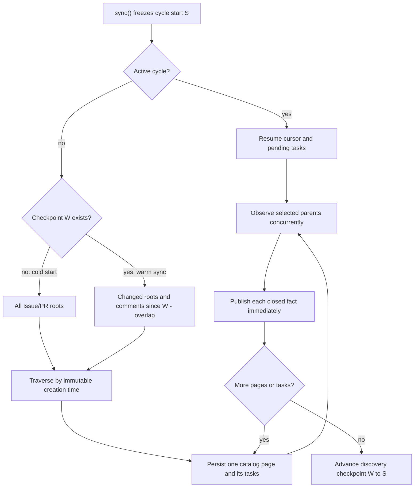

<details>
<summary>Relevant sources</summary>

- [gh_puller/github/](../gh_puller/github/)
- [scripts/](../scripts/)
- [tests/github/](../tests/github/)
</details>

# GitHub observation archive

`gh_puller.github` records the observable Issue, pull-request, and Git state of one
GitHub repository as an offline source of truth. SQLite holds immutable semantic
observations and resumable writer state. A repository-bound bare Git store holds the
code objects named by those observations.

The archive is a faithful record of what its supported source operations observed.
It is not a claim that GitHub exposes every state transition, nor an attempt to
reproduce the GitHub web application.

## Observation model

The public data unit is a **fact observation**: one semantically closed source read
for a stable `(family, subject_key)` identity. Examples include the comments of
Issue 7, the review threads of PR 12, and the native branch/tag map of the repository.
A fact contains:

| Field | Meaning |
| --- | --- |
| `family`, `schema_version`, `subject_key` | Versioned semantic identity. |
| `resource_number` | Related repository Issue/PR number, when applicable. |
| `observed_from`, `observed_until` | Real clock interval enclosing the complete source operation. |
| `coverage` | What conclusion that operation supports. |
| `origin` | `api`, `git`, `derived`, or `import`. |
| `payload_digest`, `payload` | Content-addressed JSON evidence and its decoded value. |
| `source_digest` | Source payload for a derived fact, when applicable. |
| `published_at` | Time the closed observation became durable in SQLite. |

One multi-page collection has one observation window; fields inside the same source
response do not receive invented per-field timestamps. Derived facts inherit the
window of their source. Later observations append rows instead of rewriting history.

`payload["value"]` is the stable operation result. `payload["raw"]` retains the
source-native JSON used to produce it. REST operations therefore retain unprojected
response fields. GraphQL operations retain every selected node and field, but cannot
retain fields absent from their query. `payload["cache"]`, when present, pairs HTTP
validators with the value that they validate; a valid `304` reuses those bytes while
creating a new, honestly timed observation.

Sources: [gh_puller/github/observations.py](../gh_puller/github/observations.py); [gh_puller/github/syncer.py](../gh_puller/github/syncer.py)

### Time and offline queries

There is no repository-wide target timestamp or atomic run snapshot. Facts close and
become readable independently, which preserves the finest time precision available
from the source operation.

The three read views answer different questions:

| Reader | Result |
| --- | --- |
| `iter_observations(..., after=N)` | Immutable publication stream after a stable integer cursor. |
| `iter_current_facts(...)` | Latest actual observation for each selected fact identity. |
| `iter_facts_as_of(..., at=T)` | Latest observation per identity with `observed_until <= T`. |

An as-of result is therefore a time-bounded collection of independently observed
facts, not proof that all returned facts coexisted at one instant. Missing facts mean
“not observed by that boundary,” not an empty GitHub value.

```python
from datetime import UTC, datetime
from pathlib import Path

from gh_puller.github import iter_facts_as_of


async def issue_state_at(database: Path, at: datetime):
    return [
        fact
        async for fact in iter_facts_as_of(
            database,
            at.astimezone(UTC),
            subject_key="issue:7",
        )
    ]
```

### Coverage

Coverage describes one attempted source operation:

| Value | Supported conclusion |
| --- | --- |
| `complete` | The operation closed all declared pages or Git evidence; an empty value may be complete. |
| `null` | The source explicitly returned null for the declared contract. |
| `partial` | The payload identifies a known incomplete subset. |
| `forbidden` | The active GitHub identity could not read the source. |
| `unavailable` | The checked API or Git paths could not supply the source. |

Transport errors and detectably malformed or truncated responses do not produce a
fact. They leave a retryable task instead. By contrast, a conclusive `403` or `404`
can produce a `forbidden` or `unavailable` observation. Current and as-of readers
return the latest conclusion, including a non-complete one; consumers that require
complete data must filter `coverage` explicitly.

## Archived facts

When an Issue or PR is selected, the writer observes every applicable supported
family rather than only the signal that selected it:

| Families | Archived evidence |
| --- | --- |
| `issue` | Issue/PR root fields, actors, labels, milestone, state, counts, and unknown REST fields. |
| `issue-comments`, `issue-events`, `issue-timeline` | Complete supported conversation and event collections. |
| `issue-reactions`, `issue-comment-reactions` | Parent and per-comment reactions. |
| `issue-relations` | Parent, sub-Issues, blocked-by, and blocking GraphQL relations for an Issue. |
| `pull` | PR detail including base/head repositories, branches, SHAs, merge state, and change counts. |
| `pull-reviews`, `pull-review-threads`, `pull-review-comments` | Reviews plus native thread membership, resolution, position, and comments. |
| `pull-review-comment-reactions`, `pull-requested-reviewers` | Review-comment reactions and requested users/teams. |
| `pull-commits`, `pull-closing-issues` | Ordered PR commits and Issues that GitHub says the PR closes. |
| `pull-git` | Retained base/head/comparison/landing Git evidence for one PR observation. |
| `commit-references`, `commit-object` | Exact structured commit-field paths and verified Git-object availability. |
| `git-refs` | Native branch/tag map, default branch, and symbolic `HEAD`. |

`catalog-item` may occur in explicitly imported archives to preserve a source catalog
record that was distinct from its parent detail. It is not a separate live discovery
promise.

Structured commit extraction follows only contract-defined commit fields in PR
commits, reviews, review comments and threads, timeline entries, and events. It does
not guess commit identities from prose, URLs, or arbitrary hexadecimal strings.

### Reconstruction boundary

| Downstream question | What the archive provides | Boundary |
| --- | --- | --- |
| Rebuild an observed Issue/PR discussion | Root, comments, reviews, threads, events, reactions, and relations | Only supported fields and observed states. |
| Find core developers or bug/WIP work | Actor, association, label, review, event, and merge evidence | The mining definition belongs to the downstream job. |
| Relate Issues and PRs | Explicit Issue relations, closing-Issue references, timeline/events, and structured commit links | Unsupported reverse references are not inferred. |
| Recover a PR's source and target | Base/head repository, branch and SHA plus pinned Git evidence | A source object may be explicitly unavailable. |
| Inspect changed code | Normal Git `show`, `diff`, `log`, `merge-base`, and object plumbing | Git LFS bytes, submodule contents, attachments, and unreachable objects are outside the promise. |
| Reproduce a GitHub page exactly | No | Rendering, permission-dependent controls, external assets, and live widgets are not archived. |

## Discovery and synchronization

`sync()` is asynchronous but does not return until one operational cycle completes.
The cycle exists only to recover discovery and work; it is not a public version or a
publication barrier.



### Cold start

With no committed discovery checkpoint, the writer traverses GitHub's combined
Issue/PR catalog in ascending creation order. Each page and its parent tasks are
committed before consumption. The current producer/consumer unit is one page: up to
100 catalog entries become durable, their parent operations run with bounded
concurrency, and then discovery proceeds to the next page.

If the process stops, the next call resumes the stored next-page URL and unfinished
tasks. It does not restart the catalog at page one. Facts whose source operations
already closed remain public and are not fetched again merely because the cycle is
incomplete.

### Warm synchronization

Let `W` be the last completed cycle's discovery checkpoint. A new cycle combines:

- Issue/PR roots last updated since `W - overlap`;
- Issue conversation comments returned since the same boundary;
- PR review comments returned since the same boundary.

GitHub's [repository-Issue endpoint](https://docs.github.com/en/rest/issues/issues#list-repository-issues)
applies the `since` filter to last-update time independently of its `sort` parameter.
The writer therefore uses `since` to select the changed set while traversing that set
by immutable creation time. Updating an existing result cannot move it across page
offsets; candidates entering after cycle start may be observed immediately or in the
next cycle. Comment feeds follow the same stable creation order.

Comment feeds are discovery signals: the writer reobserves the complete supported
parent, not just the returned comment. Timestamp overlap makes equal and
second-resolution boundary values harmless; task and publication identities remove
duplicates within the cycle.

The cycle start `S` is fixed before network work. The checkpoint advances from `W`
to `S` only after discovery reaches its terminal page and every task is complete.
Facts read while a long cycle runs keep their actual later observation windows. The
next cycle still starts from `S`, so work occurring during the preceding cycle is not
discarded by advancing to its completion time.

Sources: [gh_puller/github/syncer.py](../gh_puller/github/syncer.py); [tests/github/test_syncer.py](../tests/github/test_syncer.py)

### Discovery limits

GitHub does not provide a repository-wide change feed for every child collection.
The writer therefore uses a deliberate best-effort boundary:

- a silently deleted Issue or PR may remain at its last observation;
- deleted or edited comments, reactions, reviews, review threads, timeline events,
  requested reviewers, and Issue relations may remain stale when no supported signal
  selects their parent;
- states that appear and disappear between source reads were never observed;
- permission-hidden or API-unsupported fields cannot be reconstructed;
- a durable page cursor records completed work but does not turn GitHub's live listing
  into a repository snapshot.

The writer does not fall back to an expensive full repository scan when counts look
suspicious. Once a parent is selected by a supported signal, however, every promised
family is reobserved and detectable pagination inconsistencies fail the task instead
of silently truncating it.

### Failure, idempotency, and rate limits

A catalog page, task definition, fact batch, and task completion are each committed
at their own safe boundary. Publication keys make a retried source operation return
the original rows or reject a conflicting definition. The archive lock permits one
writer per canonical database; unrelated databases may be written concurrently and
consume independent shares of the same GitHub account quota.

Transient HTTP and Git failures retry with bounded exponential backoff. Primary and
secondary rate limits wait inside the active async call and recheck periodically, so
the caller remains blocked until completion or cancellation. When an atomic client
operation has equivalent REST and GraphQL implementations, the client chooses using
their latest known relative capacity and tries the other transport when appropriate.
Transport-specific operations remain on their required quota.

## SQLite and Git archive pair

For a destination named `DATABASE`, the archive boundary is:

```text
DATABASE       SQLite facts, observation history, and recovery state
DATABASE.git   Repository-bound bare Git object store by default
```

`archive_meta` binds schema version 10, repository identity, Git layout 0, and the
absolute Git-store path. Moving only one member breaks that binding. Back up or move
the pair together, or pass the bound path explicitly with `--git-destination`.

The durable SQLite relations are grouped by responsibility:

| Relations | Responsibility |
| --- | --- |
| `fact_observations`, `fact_batches`, `payload_blobs` | Immutable facts, atomic publication order, and compressed canonical JSON. |
| `fact_heads`, `current_facts`, `fact_records` | Latest-by-observation-time identities and joined encoded payload records. |
| `sync_cycles`, `discovery_items`, `discovery_signals`, `sync_tasks` | Recoverable writer state; not GitHub facts. |
| `fact_schemas`, `archive_meta` | Format registry and archive binding. |

### Git evidence

Current upstream branches and tags use native refs. Before updating them, the writer
pins their old tips so a force-push or deletion cannot erase previously observed
history:

```text
refs/heads/<branch>
refs/tags/<tag>
refs/github-archive/upstream/heads/<sha>
refs/github-archive/upstream/tags/<sha>
```

PR and structured-commit evidence uses repository-name-independent immutable refs:

```text
refs/github-archive/pulls/<n>/bases/<sha>
refs/github-archive/pulls/<n>/heads/<sha>
refs/github-archive/pulls/<n>/comparisons/<sha>
refs/github-archive/pulls/<n>/landings/<sha>
refs/github-archive/commits/<sha>
```

The upstream repository is synchronized once per cycle. If a PR head is already in
that graph, no separate PR fetch is needed. Otherwise the writer fetches the original
PR head, which preserves open and closed-unmerged histories as well as pre-squash or
pre-rebase commits when GitHub still exposes them. Batched PR fetches start at
`--git-batch-size` and recursively split on transient transfer failure.

`comparison_kind=merge_base` names the unique merge base for an offline PR diff.
`empty_tree` represents unrelated histories. `unavailable` records which required
objects could not be obtained without claiming a complete diff. A landing ref is
recorded when GitHub identifies a merged result and that object is available;
`history_preserved` says whether the original head is its ancestor, not which merge
button was used.

The store is ordinary bare Git and uses Git's content-addressed object namespace.
Different PRs that name the same commit share the same object while SQLite preserves
their separate relationships.

Sources: [gh_puller/github/git_store.py](../gh_puller/github/git_store.py); [gh_puller/github/archive_format.py](../gh_puller/github/archive_format.py)

### Direct offline use

The public Python readers decode payloads without network access. SQL and native Git
remain the stable, unrestricted downstream boundary, so specialized mining can build
new databases without a thick project SDK.

```bash
git --git-dir archives/repository.sqlite3.git show COMMIT_SHA
git --git-dir archives/repository.sqlite3.git diff \
  refs/github-archive/pulls/7/comparisons/COMPARISON_SHA \
  refs/github-archive/pulls/7/heads/HEAD_SHA
git --git-dir archives/repository.sqlite3.git rev-list --all
```

Clone the canonical bare store before adding downstream refs or changing Git data:

```bash
git clone --mirror archives/repository.sqlite3.git derived/repository.git
git --git-dir derived/repository.git branch experiment COMMIT_SHA
```

SQLite readers may freely query or copy the database, but only the archive writer
should mutate the canonical pair.

## Running the writer

The CLI loads `.env`, prefers `GH_TOKEN` over `GITHUB_TOKEN`, writes progress to
stderr, and emits completed-cycle JSON to stdout. Use an authenticated token for a
production archive:

```dotenv
GH_TOKEN=github_pat_your_token
```

Run or resume one cycle:

```bash
uv run -m gh_puller.github once \
  vllm-project/vllm archives/vllm.sqlite3
```

The equivalent library call is asynchronous and blocks the task until the cycle
completes:

```python
import asyncio
from pathlib import Path

from gh_puller.github import GitHubSyncConfig, sync


async def main() -> None:
    await sync(GitHubSyncConfig("vllm-project/vllm", Path("archives/vllm.sqlite3")))


asyncio.run(main())
```

`schedule` invokes the same operation immediately, then after each completion waits
for the next UTC Unix-epoch-aligned interval boundary. The boundary controls only
invocation time; it never changes an observation timestamp. Missed boundaries are
not fabricated as empty cycles.

```bash
uv run -m gh_puller.github schedule \
  vllm-project/vllm archives/vllm.sqlite3 \
  --interval 1h
```

The interval is a positive integer followed by `s`, `m`, `h`, or `d`. Other relevant
controls are `--concurrency`, `--git-batch-size`, `--overlap-seconds`,
`--request-timeout`, `--git-url`, `--git-destination`, and `--no-progress`.

### Managed Linux service

The systemd helper binds one service to the canonical database path. Its 12-character
writer ID is the prefix of the SHA-256 digest of that path; the repository is service
configuration, not part of writer identity. Different databases may have independent
writers, including writers for the same repository. The archive lock prevents two
entry points from writing one database.

`install` is privileged because it creates a system unit and a narrowly scoped polkit
rule. It registers the service disabled and inactive. The bound non-root service user
can then start, stop, or restart it without `sudo`:

```bash
sudo scripts/github-puller-daemon.sh install \
  vllm-project/vllm archives/vllm.sqlite3 \
  --interval 1h --concurrency 8

scripts/github-puller-daemon.sh start archives/vllm.sqlite3
scripts/github-puller-daemon.sh stop archives/vllm.sqlite3
scripts/github-puller-daemon.sh restart archives/vllm.sqlite3
```

`GH_PULLER_SERVICE_USER` selects the owner; under ordinary `sudo`, `SUDO_USER` is the
default. Reinstalling updates the unit but leaves it stopped. It rejects repository,
database, or owner rebinding.

List writers in a narrow table, then inspect one database or writer ID in detail:

```bash
scripts/github-puller-daemon.sh status
scripts/github-puller-daemon.sh status archives/vllm.sqlite3
scripts/github-puller-daemon.sh status 0123456789ab
scripts/github-puller-daemon.sh logs archives/vllm.sqlite3
```

The detail view combines systemd and journald with read-only SQLite state. Its quota
values are the latest response headers already observed by the writer; status makes
no GitHub request. Durable discovery, parent, task, fact, checkpoint, and last-error
state remains visible even when no process is running.

`uninstall` removes only the unit and control policy. SQLite, Git objects, `.env`, the
environment, and source tree remain:

```bash
sudo scripts/github-puller-daemon.sh uninstall archives/vllm.sqlite3
```

Sources: [scripts/github-puller-daemon.sh](../scripts/github-puller-daemon.sh); [gh_puller/github/monitor.py](../gh_puller/github/monitor.py)
