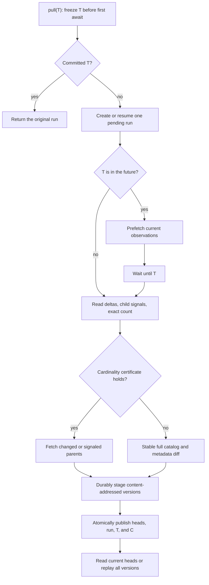
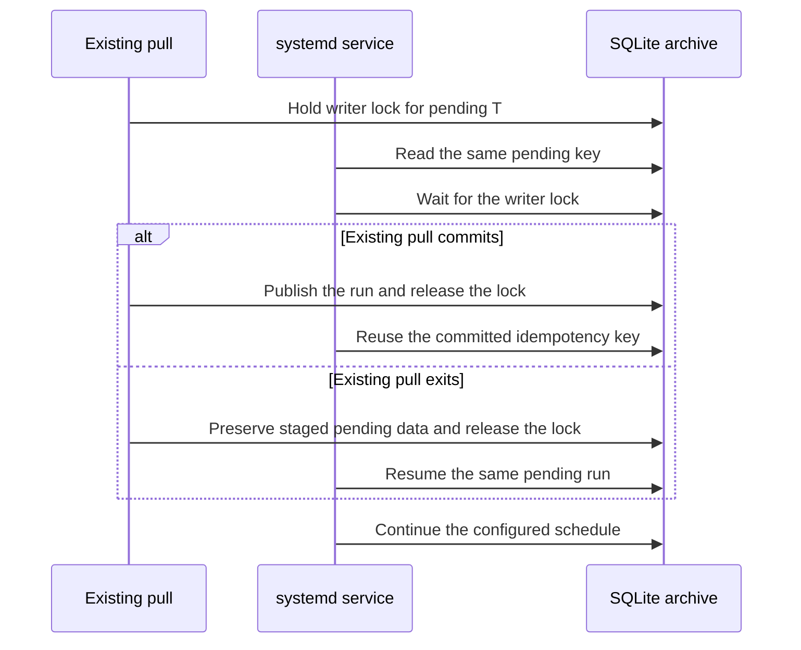

<details>
<summary>Relevant sources</summary>

The following source packages and files were used as context for this document:

- [gh_puller/github/](../gh_puller/github/)
- [scripts/github-puller-daemon.sh](../scripts/github-puller-daemon.sh)
- [tests/test_github_puller.py](../tests/test_github_puller.py)
- [tests/test_github_cli.py](../tests/test_github_cli.py)
- [tests/test_github_daemon.py](../tests/test_github_daemon.py)
- [tests/test_github_monitor.py](../tests/test_github_monitor.py)

</details>

# GitHub raw fact archive

`gh_puller.github` maintains one SQLite database as the durable source of truth for
GitHub Issues, pull requests, and their related resources. A successful pull proves
catalog completeness, retains every distinct raw payload it observes, and publishes
one run for each target T. The same database supports direct
current-state reads and full offline reconstruction without GitHub access.

Sources: [gh_puller/github/](../gh_puller/github/)



Sources: [gh_puller/github/](../gh_puller/github/)

## T is a coverage watermark

`GitHubPuller.pull(T)` is asynchronous and returns only after coverage through T has
been closed and published. T may be any timezone-aware timestamp. If omitted, the
function freezes the call time before its first `await`. If T is in the future, the
puller prefetches available data, waits until T, and performs a final closure pass.

T is not a historical snapshot timestamp. A run may contain facts observed while the
operation was in progress, while the database records the actual completion time C
separately. Normalized UTC T is the complete idempotency key: the first success
publishes one run, and every retry returns that original run without an HTTP request
or logical archive-state change. Cancellation, detectable truncation, or an
unrecoverable API error leaves the run pending and publishes nothing; retrying T
resumes its durable work.

The pull protocol does not round or interpret T. UTC boundary alignment belongs only
to the configurable CLI scheduler.

Sources: [gh_puller/github/](../gh_puller/github/); [tests/test_github_puller.py](../tests/test_github_puller.py); [tests/test_github_cli.py](../tests/test_github_cli.py)

## Certified increments and the exhaustive oracle

Let W be the preceding observation watermark. A certified increment concurrently
reads the root Issue/PR delta since `W - overlap`, the repository Issue-comment
delta, the repository PR-review-comment delta, and the authenticated GraphQL total
count. Root changes and child signals select parent bundles for refresh.

An authenticated full scan uses one GraphQL query with independent, descending
`created_at` cursors for the Issue and pull-request connections. Each active
connection contributes at most 100 nodes to a request; once one connection is
exhausted, later requests omit it and continue the other cursor. The scan accepts a
catalog only when both observed connection lengths equal their first `totalCount`
values and every repository-wide number is unique. A mutation that makes pagination
inconsistent therefore fails or retries the proof instead of publishing a partial
catalog. Anonymous clients fall back to a descending REST catalog scan.

The connection cursors and shared Issue ordering input are part of GitHub's
[Repository GraphQL schema](https://docs.github.com/en/graphql/reference/repos) and
[Issue GraphQL schema](https://docs.github.com/en/graphql/reference/issues).

GraphQL nodes are discovery hints, not archived facts. Every selected parent is read
through the unprojected REST Issue detail before staging. This keeps the compact
catalog proof separate from the raw payload boundary.

For the catalog proof, let N be the preceding number of present objects, A the newly
observed objects with `created_at <= T`, F the objects observed during the request
with `created_at > T`, D the preceding objects now absent, and M the exact current
total. GitHub's current catalog satisfies:

```text
M - F = N - D + A
```

The fast path accepts only `M - F = N + A`; comparison with the identity proves
`D = 0`. Additions cannot conceal deletions because A is counted independently.
Duplicate numbers, changed identities, invalid timestamps, unavailable exact counts,
or a failed equality trigger the stable full path. That path scans until two
consecutive catalog membership signatures agree. The production path then compares
that lightweight catalog with committed heads: absent parents become tombstones;
new parents, changed root metadata, and child-signal parents refresh their complete
bundle; unchanged survivors reuse their existing bundle without a body request.

`catalog_mode="exhaustive"` deliberately refreshes every surviving bundle after the
stable scan and acts as the slower correctness oracle. Differential tests compare
complete committed version streams, not only final heads, over exhaustive small
transitions, 5,000-object catalog churn, and randomized Issue/comment additions and
deletions. They also assert that a deletion-triggered production fallback fetches
only the changed parent set while remaining byte-equivalent to the oracle.

GitHub's repository-wide
[Issue-comment feed](https://docs.github.com/en/rest/issues/comments#list-issue-comments-for-a-repository)
and
[review-comment feed](https://docs.github.com/en/rest/pulls/comments#list-review-comments-in-a-repository)
return existing comments updated after `since`; they do not provide deletion records.
A child deletion is therefore incrementally observable only when GitHub also changes
the parent root or emits another selected child signal. The randomized deletion
workload makes that parent-change precondition explicit. Parent Issue/PR deletion has
no such dependency because stable catalog membership proves the absence directly.
This is an upstream observation boundary, not a property that a polling algorithm
can infer from a missing delta row.

Bundle materialization chooses a transport only when its archived payload is equal
to the per-parent REST result. `bundle_mode="exhaustive"` disables these choices and
is the transport oracle used by differential tests:

| Resource | Optimized transport | Completeness certificate |
| --- | --- | --- |
| Issue comments | One repository feed, grouped by `issue_url` | A one-item request reads the `last` page as a cost hint. Pooling proceeds only when two full feed scans cost fewer than K per-parent requests; the probe therefore does not make the normal path more expensive than K. Scans use ascending creation order and repeat until their complete `created_at <= T` prefixes are byte-identical. Appends after T cannot prevent closure; detectable edits, deletions, duplicate IDs, or malformed parent links cannot publish an uncertified prefix. A persistent feed transport failure falls back to complete per-parent reads in the same run. |
| PR review comments | One repository feed, grouped by `pull_request_url` | The same cost, stable-prefix proof, and exact per-parent fallback, compared with the number of selected PR parents. |
| Issue reactions | No collection request when detail reports `total_count == 0` | Zero is itself the complete collection; every nonzero or absent count still paginates and is checked against the aggregate. |
| PR commits and files | No collection request when PR detail reports an exact zero | Nonzero and absent counts still paginate; a returned collection shorter than `commits` or `changed_files` aborts publication. |
| Per-parent JSON, certified paginated lists, diff, and patch | Conditional GET with the prior ETag | Validators are keyed by API root, API version, media type, path, and parameters, and are stored atomically with the exact bundle digest whose body they validate. A paginated list is reusable only when every page has an ETag and the terminal page has fewer than 100 entries. Every page must return `304 Not Modified`; any changed page restarts complete pagination. A terminal full page has no cache, so 100→101 growth cannot hide on a new page. |
| Timeline, events, diff, and patch aggregation | No repository-wide consolidation | Repository event responses have a different raw shape, while diff and patch have independent lossless fallback rules. Their per-parent responses remain unprojected; eligible responses still use the conditional transport above. |

The stable-prefix comparison does not discard observations after T. Once the prefix
is certified, the second complete response is grouped as returned, so a bundle may
still retain later facts observed while the run was closing. The prefix is the proof
that continuous later appends cannot starve a request whose contract is only coverage
through T.

GitHub documents ascending-ID ordering and identical comment media types for both
the repository and per-parent
[Issue-comment endpoints](https://docs.github.com/en/rest/issues/comments#list-issue-comments)
and both
[review-comment endpoints](https://docs.github.com/en/rest/pulls/comments#list-review-comments-on-a-pull-request).
Authenticated ETag requests that return 304 do not consume primary REST quota; they
remain HTTP attempts and therefore remain included in the run's `requests` counter.
See GitHub's
[conditional-request guidance](https://docs.github.com/en/rest/using-the-rest-api/best-practices-for-using-the-rest-api#use-conditional-requests).

When the three REST discovery streams each fit on one page and nothing changed, an
authenticated closure pass costs three REST calls plus one GraphQL call and does not
depend on archive size. A future-T operation normally performs one prefetch and one
closure pass, so a quiet scheduled run uses six REST calls from the 5,000-request
core budget plus two queries from the separate GraphQL budget. GitHub documents the
two primary budgets independently in its
[REST rate-limit reference](https://docs.github.com/en/rest/using-the-rest-api/rate-limits-for-the-rest-api)
and
[GraphQL rate-limit reference](https://docs.github.com/en/graphql/overview/rate-limits-and-query-limits-for-the-graphql-api).

For I Issues and P pull requests, let N = I + P, CI be the current repository Issue
comment count, and CR be the current review-comment count. A cold authenticated
catalog needs
`max(1, ceil(I / 100), ceil(P / 100))` GraphQL HTTP requests because both connections
advance together. When pooling wins its cost proof, each comment feed costs one size
probe plus at least two scans, or
`1 + 2 * max(1, ceil(C / 100))` requests. This replaces N Issue-comment requests and
P review-comment requests. The formula counts HTTP attempts; on an unchanged
authenticated feed, the second scan's page-level 304 responses consume no primary
REST quota, so the normal primary-budget cost is `1 + max(1, ceil(C / 100))`. With
empty reactions and exact zero PR commits/files, the remaining parent-local floor is
`3N + 5P`: Issue detail, timeline, and events for all parents, plus PR detail,
reviews, requested reviewers, diff, and patch. Non-empty reactions, commits, files,
reviews, media fallbacks, and pagination add their actual pages. If a pooled feed is
not cheaper or persistently fails after its configured retries, each selected parent
uses the exhaustive endpoint instead. Primary and
secondary limits cause asynchronous waits outside the transient retry budget, so a
cold start can span multiple quota windows and still completes the same invocation.

Bundle materialization uses a sliding window of at most `concurrency` tasks and
consumes their results in candidate-number order. The fixed window prevents finished
task results from retaining the full cold archive in memory, while ordered
consumption keeps version insertion deterministic across certified and exhaustive
runs. Completed resources are staged in batches of 32 for crash recovery.

Sources: [gh_puller/github/](../gh_puller/github/); [tests/test_github_puller.py](../tests/test_github_puller.py)

## Progress is out of band

The puller emits immutable `PullProgress` snapshots to an optional synchronous
observer. These events never enter SQLite and are not facts: an observer exception
disconnects that observer without changing fetching, durable staging, recovery, or
publication. This makes the same callback suitable for an embedded monitor while
keeping the archive schema independent of a particular operations stack.

The CLI installs `ConsoleProgress` by default. A TTY receives a throttled single-line
progress bar on stderr. A non-TTY receives throttled JSON Lines on stderr with
`type="github_pull_progress"`; phase changes, waits, completion, and failure are
emitted immediately. The one committed `PullResult` remains JSON on stdout, so a
supervisor can route progress and results independently. `--no-progress` disables
stderr progress.

The catalog counters describe the active closure pass. Bundle counters describe the
current run's materialization plan. While the run is pending, they are restored from
its latest durable SQLite stage when the writer process starts. The observer and
`status` command remain out of band: only the writer performs that local read, then
emits the resulting snapshot through the same progress stream.

| Field | Definition | Relationship to Issue/PR count |
| --- | --- | --- |
| `catalog_seen / catalog_total` | Root rows read during a scan; once certified, both become the current visible catalog size N. | N counts ordinary Issues and PRs because GitHub's Issues catalog contains both. |
| `bundles_completed / bundles_total` | Parent bundles already durable and compatible with the current catalog plan, divided by that carried set plus the remaining candidates K. | K is normally much smaller than N. A cold pull has total N, and a cold restart resumes from its durable numerator instead of restarting at zero. |
| `issues_completed`, `pulls_completed` | Kind split of durable completed bundles in the current plan. | Their sum equals `bundles_completed`. |
| `tombstones` | Durable absences that agree with the current certified catalog plan. | They are reported separately from bundle progress and are excluded from the resulting visible N. |
| `feed_name`, `feed_scan`, `feed_pages_*` | Repository comment feed, repeated certification scan, and verified pages in that scan. The page total is a size estimate and is displayed with `~`. | Feed work replaces many parent-local comment requests but does not advance `bundles_completed`; after a failed optimization the same parents are read exactly and bundle progress resumes. |
| `latest_number`, `latest_kind` | Last compatible parent in durable insertion order, followed by the most recently completed batch. | Gaps represent parents outside the current plan or work that still needs fetching, not missing facts. |
| `requests`, `quota_*` | Attempts accumulated by the run and the latest GitHub quota headers. | They measure API work, not objects; one bundle can require many paginated requests. |

A future-T operation has separate `prefetch_*` and `closing_*` phases. Each pass moves
through catalog proof, optional repository-feed certification, and parent-bundle
materialization. It recomputes its catalog plan, carries forward compatible durable
stage, and reclassifies objects that must be fetched again. The run identity and
accumulated request count continue. A `rate_limit` event reports the wait duration and
any known quota reset time without pretending that object progress moved.

Sources: [gh_puller/github/](../gh_puller/github/); [tests/test_github_puller.py](../tests/test_github_puller.py); [tests/test_github_cli.py](../tests/test_github_cli.py)

## SQLite is the fact boundary

The store separates invocation metadata, payload bytes, object observations, and
current heads:

- `pull_runs` records T, C, first start time, observation watermark, request count,
  and publication status. A unique index makes T the identity of both pending and
  committed runs.
- `payload_blobs` stores canonical JSON compressed with zlib and addressed by its
  SHA-256 digest. Identical summaries and bundles share one payload.
- `resource_versions` is an append-only observation log. Multiple different payloads
  observed during one future-T operation remain distinct versions.
- `resource_heads` is the atomically maintained current state derived from the last
  committed version of each object.
- `bundle_http_cache` stores discardable ETags keyed by the exact content-addressed
  bundle they validate. It is transport state, is ignored by offline readers, and
  can always be reconstructed by unconditional requests.

Versions belonging to a pending run are durable for recovery but invisible to
`iter_runs`, `iter_versions`, and `iter_heads`. Finalization updates heads and changes
the run to `committed` in one SQLite transaction. A process file lock enforces the
single-writer contract; SQLite uses WAL mode, foreign keys, and
`synchronous=FULL`.

Each version retains an unprojected REST summary and a complete Issue or PR bundle;
GraphQL catalog projections are never stored as payloads. Unknown JSON fields are
preserved semantically. Issue bundles include detail, comments, comment reactions,
timeline, events, and reactions. PR bundles additionally include PR detail, reviews,
review comments and reactions, commits, files, requested reviewers, diff, and patch.
If GitHub rejects or persistently fails an aggregate PR diff or patch representation,
the bundle records that failure and requests the same representation for every commit
through GitHub's
[Get a commit](https://docs.github.com/en/rest/commits/commits#get-a-commit)
endpoint. If an individual representation is also unavailable, its error and the
other raw representation are retained instead. Shared results are cached while both
aggregate forms are resolved. The cold pull can then advance without claiming that an
unavailable representation was returned.
Aggregate fields and their enumerated collections remain separate facts. GitHub can
retain an Issue `comments` or PR `review_comments` aggregate after comments are no
longer returned by independent REST and GraphQL enumeration. The archive preserves
these comment aggregates and the complete paginated responses instead of inventing
rows or using the stale comment aggregates as completeness certificates. Enumeration
follows GitHub's
[list Issue comments endpoint](https://docs.github.com/en/rest/issues/comments#list-issue-comments)
and
[list review comments endpoint](https://docs.github.com/en/rest/pulls/comments#list-review-comments-on-a-pull-request).
A tombstone records certified absence without discarding the last bundle. The
boundary excludes linked external attachments and facts that GitHub made unavailable
before the archive first observed them.

Sources: [gh_puller/github/](../gh_puller/github/); [tests/test_github_puller.py](../tests/test_github_puller.py)

## Offline reads

Use `iter_heads` when only the committed current state is needed. It reads
`resource_heads` directly rather than replaying history:

```python
from pathlib import Path

from gh_puller.github import iter_heads


async def current_issues(path: Path) -> dict[int, dict]:
    return {
        head.number: head.bundle
        async for head in iter_heads(path, present_only=True)
    }
```

Use `iter_versions` to rebuild a downstream database or mine changes over time, and
`iter_runs` for T, C, and run-level statistics:

```python
from pathlib import Path

from gh_puller.github import iter_runs, iter_versions


async def rebuild(path: Path) -> None:
    runs = [run async for run in iter_runs(path)]
    heads = {}
    async for version in iter_versions(path):
        heads[version.number] = version
```

Folding versions in iterator order reconstructs every committed state. A
`present=False` version is a tombstone whose retained summary and bundle remain
available for mining.

Sources: [gh_puller/github/](../gh_puller/github/); [tests/test_github_puller.py](../tests/test_github_puller.py)

## Run once or on a UTC-aligned interval

Production operation should provide an authenticated token through the process
environment or the project-root `.env`. `GH_TOKEN` takes precedence over
`GITHUB_TOKEN`:

```dotenv
GH_TOKEN=github_pat_your_token
```

Pull to the call time or any explicit timezone-aware T:

```bash
uv run -m gh_puller.github once vllm-project/vllm archives/vllm.sqlite3
uv run -m gh_puller.github once vllm-project/vllm archives/vllm.sqlite3 \
  --target 2026-09-02T20:07:00+08:00
```

Run a UTC-aligned schedule. The interval is a positive integer followed by `s`, `m`,
`h`, or `d`; its default is `1h`:

```bash
uv run -m gh_puller.github schedule \
  vllm-project/vllm archives/vllm.sqlite3 \
  --interval 1h
```

Targets are multiples of the interval from the UTC Unix epoch: `1h` lands on whole
UTC hours and `30m` lands on `:00` and `:30`. On first start the scheduler selects the
latest reached boundary. It normally advances to the next boundary and can call the
puller before that future T so prefetch and final closure remain part of one blocking
operation. If a run falls behind by several intervals, the next run coalesces the
missed boundaries into the latest reached boundary instead of claiming historical
observations that were never made. A restart finishes the database-wide pending T
before calculating another target. A lifecycle lock rejects a second scheduler for
the same database; `SIGINT` and `SIGTERM` cancel the active operation.

Sources: [gh_puller/github/](../gh_puller/github/); [tests/test_github_cli.py](../tests/test_github_cli.py)

## Unattended Linux service

The repository provides an idempotent installer for a system-level systemd writer.
Run it through `sudo`; the generated service itself runs as the invoking ordinary
user, starts at `multi-user.target`, waits for network readiness, and restarts one
minute after an unexpected exit. It records absolute paths to this checkout, `uv`,
and the SQLite destination. The application therefore reads the project-root `.env`
without placing `GH_TOKEN` in the unit file.

The canonical absolute database path is the writer identity. Its unit is named
`gh-puller-<path-id>.service`, where `<path-id>` is the first 12 hexadecimal digits
of that path's SHA-256 digest. The database filename and repository are intentionally
absent from the name: the repository is configuration bound to the writer and to the
archive metadata, while the compact path digest supplies a stable, database-scoped
systemd key. Unit metadata retains the canonical database path; every mutation checks
it and rejects a truncated-digest collision.

Install and immediately start one writer for a database:

```bash
sudo scripts/github-puller-daemon.sh install \
  vllm-project/vllm archives/vllm.sqlite3
```

Options after the database are passed to the `schedule` command and persist in the
unit. Re-running `install` verifies the binding, reconciles the database's managed
unit to its canonical name, enables it, and restarts it:

```bash
sudo scripts/github-puller-daemon.sh install \
  vllm-project/vllm archives/vllm.sqlite3 \
  --interval 30m --concurrency 8 --request-timeout 60
```

Preview the complete unit without installing it by using `render` in place of
`install`. Reusing a database path with another repository is rejected before the
unit is changed. Different database paths map to independent units, even when they
pull the same repository; a detected digest collision is rejected:

| Repository/database relation | Result |
| --- | --- |
| Same repository, same canonical database path | Same unit; `install` updates and restarts it. |
| Different repository, same canonical database path | Rejected; an archive cannot be rebound. |
| Same repository, different database paths | Independent units and independent GitHub API use. |
| Different repositories, different database paths | Independent units and independent GitHub API use. |

Sources: [scripts/github-puller-daemon.sh](../scripts/github-puller-daemon.sh); [gh_puller/github/](../gh_puller/github/)

Use the same script for routine operations. `status` is a read-only projection of
systemd process state and the latest journald progress event. It neither opens the
SQLite archive nor contacts GitHub. With no database it lists every managed writer;
with a database it renders that writer's full process and pull snapshot:

```bash
scripts/github-puller-daemon.sh status
scripts/github-puller-daemon.sh status archives/vllm.sqlite3
watch -n 1 scripts/github-puller-daemon.sh status archives/vllm.sqlite3
```

The overview always includes the canonical `DATABASE`, current target T, run,
phase, event age, and `ITEMS`. `ITEMS` means the certified current catalog count of
Issues plus pull requests; it is `?` until that count is known. `PROGRESS` reports
the active catalog, repository-feed, or bundle phase and likewise keeps an unknown
denominator as `?`. Feed page totals are size estimates and carry a `~` marker. A
rate-limit event shows its decreasing local wait estimate. API request and quota
counters remain available in raw logs but are intentionally absent from the
operational summary.

Progress JSON Lines, completed-run JSON, exceptions, and service messages are
retained by journald, so no separate log-file rotation is required. `logs` prints
the most recent 100 raw messages and follows new output until interrupted:

```bash
scripts/github-puller-daemon.sh logs archives/vllm.sqlite3
sudo scripts/github-puller-daemon.sh stop archives/vllm.sqlite3
sudo scripts/github-puller-daemon.sh start archives/vllm.sqlite3
sudo scripts/github-puller-daemon.sh restart archives/vllm.sqlite3
```

`stop` ends the current process but leaves the installed unit enabled; `start` resumes
the same database-bound scheduler, including any pending durable run. `restart` is the
corresponding single operation. Read-only observation normally needs no `sudo`;
mutating operations still do.
Supplying an `OWNER/REPO` or a database without a managed unit to `status`, `logs`,
`start`, `stop`, or `restart` fails immediately instead of following an unrelated
hash unit.

Sources: [scripts/github-puller-daemon.sh](../scripts/github-puller-daemon.sh); [gh_puller/github/](../gh_puller/github/); [tests/test_github_monitor.py](../tests/test_github_monitor.py)

The service can be installed while a foreground pull owns the archive lock. It reads
the pending key, waits behind that writer, and then takes one of two equivalent paths:



The archive lock prevents simultaneous writers during takeover, while durable staging
and the idempotency key avoid restarting completed bundles in a cold pull from zero.

Sources: [gh_puller/github/](../gh_puller/github/); [tests/test_github_cli.py](../tests/test_github_cli.py)

Uninstalling is symmetric and idempotent: it stops and disables the service, removes
its unit, reloads systemd, and clears the unit's failed state. It deliberately keeps
the SQLite archive, `.env`, virtual environment, source checkout, and their lock
files:

```bash
sudo scripts/github-puller-daemon.sh uninstall archives/vllm.sqlite3
```

Sources: [scripts/github-puller-daemon.sh](../scripts/github-puller-daemon.sh); [tests/test_github_daemon.py](../tests/test_github_daemon.py)

## Verify the contract

Run the focused suite and lint from the repository root:

```bash
uv run pytest -q \
  tests/test_github_puller.py tests/test_github_cli.py \
  tests/test_github_daemon.py tests/test_github_monitor.py
uvx ruff check \
  gh_puller/github \
  tests/test_github_puller.py tests/test_github_cli.py \
  tests/test_github_daemon.py tests/test_github_monitor.py
bash -n scripts/github-puller-daemon.sh
```

The suite covers raw-field retention, paired GraphQL cursor pagination and truncation
rejection, PR resources, same-second boundaries, future prefetch history,
diff/patch fallback and validator reuse, pass-local progress, zero-request idempotent
reuse, observer failure isolation, TTY and JSON progress, rate-limit waits,
current-head visibility, single- and multi-page conditional validation, 100→101 page
growth, content deduplication, tombstones, cancellation, durable resume, concurrent
duplicate calls, scheduler recovery, and differential equivalence to the exhaustive
oracle.

The daemon tests additionally verify unit rendering, repeatable installation and
uninstallation, archive preservation, database-scoped controls, repository-binding
rejection, independent writers, service reconciliation, multi-writer status,
phase-local progress, exact and unknown item counts, and stable watch output.

Sources: [tests/test_github_puller.py](../tests/test_github_puller.py); [tests/test_github_cli.py](../tests/test_github_cli.py); [tests/test_github_daemon.py](../tests/test_github_daemon.py); [tests/test_github_monitor.py](../tests/test_github_monitor.py)
