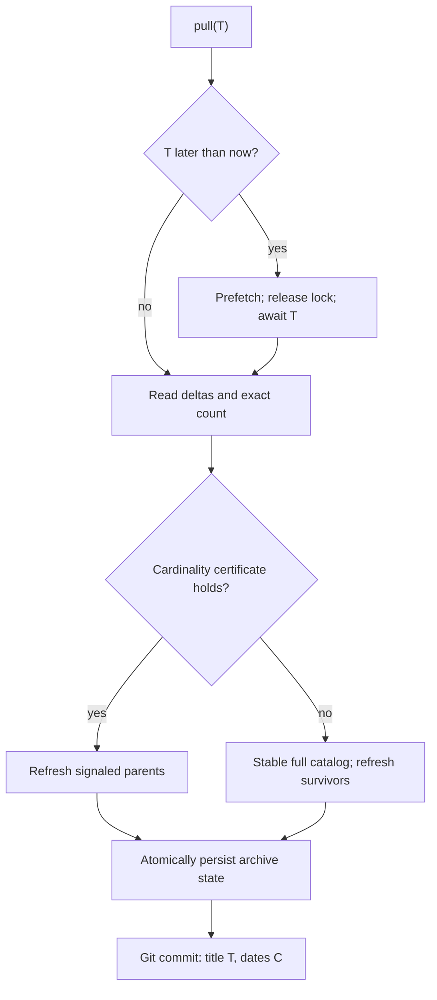

<details>
<summary>Relevant sources</summary>

The following source packages were used as context for this document:

- [gh_puller/github/](../gh_puller/github/)
- [tests/test_github_puller.py](../tests/test_github_puller.py)
- [tests/test_github_cli.py](../tests/test_github_cli.py)
</details>

# GitHub 拉取器：用可验证增量闭合全量水位

`gh_puller.github` 把 GitHub Issue、PR 及其关联资源保存为未经字段投影的原始数据，并让每次成功拉取对应一个 Git 版本。核心问题不是如何少请求几页，而是如何证明增量快路径与稳定全量扫描得到同一份归档；无法建立证明时，拉取器回退到后者。

## T 是覆盖水位

`GitHubPuller.pull(T)` 是异步操作，但只有在覆盖闭合并提交后才返回。省略 T 时，函数在第一次 `await` 之前冻结调用时刻；显式未来 T 会先预取当前数据，释放归档锁并异步等待，到达 T 后再次闭合。T 表示覆盖水位而非历史快照：归档可以包含拉取期间观察到的更新版本，但成功结果必须覆盖协议范围内、在 T 前产生且仍由 GitHub API 暴露的数据。

每次成功调用恰好创建一个提交。提交 title 是 UTC RFC 3339 格式的 T，author date 与 committer date 是实际完成时刻 C，因此未来任务不会伪造完成时间。已覆盖的 T 不再访问 API，但仍用空提交记录这次调用；可检测的分页截断、计数矛盾或取消会阻止提交和水位推进。



Sources: [gh_puller/github/](../gh_puller/github/); [tests/test_github_puller.py](../tests/test_github_puller.py)

## 证书让常态成本与历史规模解耦

设上次观察水位为 W。认证增量同时读取带重叠窗口的 Issue/PR 根对象流、仓库 Issue comment 流、仓库 PR review comment 流，以及 GraphQL 给出的当前 Issue 与 PR 精确总数。根摘要或 comment 信号把父对象标脏；拉取器随后重新抓取父对象的完整 bundle，而不是把发现请求误当成归档内容。

设 N 为旧目录对象数，A 为增量流中首次出现且 `created_at <= T` 的对象数，F 为请求期间观察到但 `created_at > T` 的新对象数，D 为旧目录中当前已消失的对象数，M 为 GraphQL 当前精确总数。当前目录满足：

```text
M - F = N - D + A
```

快路径只在 `M - F = N + A` 时复用旧目录；与上式比较即可推出 `D = 0`。新增对象不能抵消删除对象，因为 A 独立计入等式。重复 number、身份变化、目录 digest 损坏、缺少精确计数或等式失败都会进入稳定全目录扫描；扫描直到连续两次成员签名一致，并强制刷新全部存活 bundle。

认证冷启动并发执行一次完整目录扫描和一次精确计数；证书失败时同样进入稳定扫描，随后抓取所有 bundle。客户端在主限流或二级限流后异步等待恢复并重试，限流不消耗网络错误与 5xx 的重试预算，因此冷启动可以跨配额窗口阻塞直至完成。

当三个增量流各只有一页且没有对象变化时，一次认证增量固定使用三个 REST 请求和一个 GraphQL 请求，成本不随既有目录大小增长；相对每小时 5,000 次配额是 0.08%。增量结果需要分页或证书回退时，请求数按实际工作量增加。

Sources: [gh_puller/github/](../gh_puller/github/); [tests/test_github_puller.py](../tests/test_github_puller.py)

## 原始 bundle 与 Git 共同定义全量

目录摘要保存在 `data/catalog.json`，Issue 与 PR bundle 分别保存在 `data/issues/<number>.json` 和 `data/pulls/<number>.json`。分页响应沿 GitHub `Link` 读取到底；JSON 中未知字段原样保留，PR 的 diff 与 patch 也作为原始文本保存。这里的“全量”边界是拉取协议覆盖且 GitHub API 当前可见的资源，不包括站外附件，也无法重建首次观察前已经不可见的数据。

对象从目录消失时，状态将其标为 tombstone，但既有 bundle 不会删除。JSON 通过同目录临时文件、`fsync` 和原子替换落盘；每个完成的 bundle 立即更新恢复状态，因此中断后的冷启动可以跳过已经闭合的对象。Git 只提交 `data/` 与 `.gh-puller-state.json`，不会吸收归档工作树中的其他暂存内容。

Sources: [gh_puller/github/](../gh_puller/github/); [tests/test_github_puller.py](../tests/test_github_puller.py)

## 每个 UTC 整点执行一次

生产运行应在项目根 `.env` 或进程环境中配置认证 token；进程环境优先，`GH_TOKEN` 优先于 `GITHUB_TOKEN`：

```dotenv
GH_TOKEN=github_pat_your_token
```

在项目根执行一次当前时刻拉取，或显式指定带时区的 T：

```bash
uv run -m gh_puller.github once vllm-project/vllm archives/vllm
uv run -m gh_puller.github once vllm-project/vllm archives/vllm \
  --target 2026-09-02T20:00:00+08:00
```

常驻小时调度器以 UTC 整点为 T：

```bash
uv run -m gh_puller.github hourly vllm-project/vllm archives/vllm
```

首次启动处理最近一个已到达的整点；若冷启动或限流跨过多个整点，调度器按顺序追赶，不跳过水位。重启时，最近一次受管提交的 title 表示已完成 T，工作树状态中更晚的 `last_pull.target_at` 表示尚未提交的 pending T。生命周期文件锁拒绝同一归档的第二个小时调度器，`SIGINT` 与 `SIGTERM` 会取消活动拉取。每次完成向 stdout 输出一行 JSON 结果，便于服务管理器采集。

Sources: [gh_puller/github/](../gh_puller/github/); [tests/test_github_cli.py](../tests/test_github_cli.py)

## 用全量 oracle 检验证书

`catalog_mode=exhaustive` 始终执行稳定全目录扫描并刷新全部存活对象，是不依赖增量证书的正确性 oracle。测试在每个 epoch 后逐字节比较 certified 与 exhaustive 的受管 JSON 和状态：目录合并覆盖所有小规模状态组合以及 5,000 对象、80 个 epoch 的固定种子 churn；端到端场景从 96 个 Issue 开始，在 20 个 epoch 中完成 60 次新增、20 次删除和 240 次旧 Issue comment 新增或删除。时间边界、未来 T、限流等待、中断恢复、tombstone、提交隔离和小时追赶另有协议测试。

```bash
uv run pytest -q tests/test_github_puller.py tests/test_github_cli.py
```

Sources: [gh_puller/github/](../gh_puller/github/); [tests/test_github_puller.py](../tests/test_github_puller.py); [tests/test_github_cli.py](../tests/test_github_cli.py)
