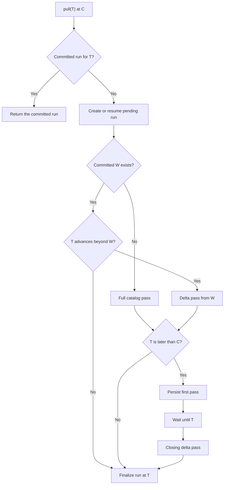

<details>
<summary>Relevant sources</summary>

- [gh_puller/github/](../gh_puller/github/)
- [scripts/github-puller-daemon.sh](../scripts/github-puller-daemon.sh)
- [tests/github/](../tests/github/)
</details>

# GitHub raw fact archive

`gh_puller.github` turns the observable Issue and pull-request state of one GitHub
repository into an offline archive. SQLite retains API facts and their observation
history; a companion bare Git store retains the reachable code objects needed to
reconstruct PR snapshots. The pair is designed for replay and mining, not as a copy
of GitHub's web pages or as a historical snapshot service.

The two stores form one archive boundary: a consumer needs neither GitHub API access
nor live PR branches to read a committed observation.

Sources: [gh_puller/github/](../gh_puller/github/); [tests/github/](../tests/github/)

## Discovery boundary

A full pass traverses GitHub's repository Issue catalog in descending creation
order. That catalog contains both ordinary Issues and pull requests. A delta pass
starts from the previous committed watermark `W` and uses a configurable overlap
around GitHub's second-resolution timestamps.

The catalog is a traversal for one pass, not a permanent directory that every run
must rebuild. It covers the whole repository during a cold pass and only the root
delta during a warm pass. `catalog complete` means that this traversal's terminal
page is durable; it does not mean that the run has published.

Each later pass combines three repository-wide signals:

| Signal | Parent selected for refresh | Detection boundary |
| --- | --- | --- |
| Issue/PR root delta since `W - overlap` | The returned Issue or PR | GitHub must expose the parent through the catalog's `since` behavior. |
| Issue-comment delta since `W - overlap` | The comment's Issue or PR | The complete supported parent record is reread; the comment row is only a signal. |
| PR-review-comment delta since `W - overlap` | The comment's PR | The complete supported PR record is reread; the comment row is only a signal. |
| No repository-wide signal | Nothing | Silent deletion and child-only changes can remain represented by the last observed record. |

The puller does not use a count change to infer membership and does not perform a
warm full traversal. If a selected parent directly returns 404 or 410, the new
version is a tombstone while its last summary and bundle remain available. Changes
that never select a parent—including some deletions, reactions, timeline events, and
other child updates—cannot be invented after the fact.

Once a parent is selected, the puller follows every page of each supported operation
and rejects detectable inconsistencies such as changing totals, duplicate identities,
or cyclic pagination. REST-backed data preserves unprojected response fields.
Operations served through GraphQL retain both a transport-independent mapping and
the exact selected source node under `api_sources`; GraphQL cannot preserve fields
that were not part of its query.

This is therefore lossless storage of facts the puller actually observed, within its
supported operations. It is not a claim that every GitHub state transition is
observable.

Sources: [gh_puller/github/](../gh_puller/github/); [tests/github/](../tests/github/)

## Durable pass

A pass journals each catalog page, its opaque next cursor, and the resulting parent
tasks in one SQLite transaction. A bounded consumer starts after the first page is
durable and stages completed parent records as they finish. The catalog can continue
ahead of slower per-parent reads without making uncommitted work public.

After interruption, the same target restores the active cursor and task queue.
Completed records are reused. If GitHub rejects a resumed catalog cursor with 404,
410, or 422, only that traversal restarts; already completed parent work remains
usable. A pass closes only after the terminal catalog page and every persisted task
are complete.

Git refs required by a PR record are made durable before SQLite stages that record.
Finalization then publishes the run, versions, and current heads in one SQLite
transaction. A process lock allows only one writer for an archive pair, while
readers continue to see the last committed state.

Sources: [gh_puller/github/](../gh_puller/github/); [tests/github/](../tests/github/)

## Archive format

For a destination named `DATABASE`, the canonical archive is one pair:

```text
DATABASE       SQLite observations, versions, and PR-to-commit relations
DATABASE.git   Bare Git repository containing upstream and retained PR objects
```

SQLite is the publication boundary, while the Git repository supplies code objects
named by published SQLite rows. A public row never names a Git ref before that ref
resolves to its stated object. A failed run may leave additional safe Git objects or
refs, but readers continue to see the last committed SQLite run. The pair is
repository-bound and must be moved, backed up, and restored together.

Sources: [gh_puller/github/](../gh_puller/github/); [tests/github/](../tests/github/)

### SQLite relations

`archive_meta` binds the database to one `owner/repo`. Schema version `8` is paired
with Git layout `0`. Raw summaries and complete selected-parent bundles are canonical
JSON compressed with zlib and addressed by the SHA-256 digest of their uncompressed
bytes.

The stable downstream relations are:

| Relation | Meaning |
| --- | --- |
| `pull_runs` | Committed targets, first-call and completion times, and run statistics. |
| `resource_heads` | Latest published Issue/PR state, including directly observed tombstones. |
| `resource_versions` | Append-only published changes linked to their run. |
| `payload_blobs` | Lossless observed JSON payloads addressed by digest. |
| `git_pull_snapshots` | One Git evidence manifest for each distinct PR bundle. |
| `git_pull_commits` | Ordered API-observed PR commits; one SHA may belong to several PRs. |
| `current_pull_git` | Current PR heads joined to their Git evidence manifests. |
| `current_pull_commits` | Current PR heads joined to their ordered commit lists. |

`bundle_http_cache`, `pull_passes`, and `pull_tasks` are writer recovery state. They
may be inspected operationally, but downstream mining must not treat them as
published facts.

Git object IDs are content identities, not PR- or repository-scoped identifiers.
Two PRs that name the same SHA share one byte-identical Git object while retaining
separate SQL relation rows and PR ref paths.

Sources: [gh_puller/github/](../gh_puller/github/); [tests/github/](../tests/github/)

### Git refs

Current upstream refs use Git's native namespaces:

```text
refs/heads/<branch>                         current upstream branch
refs/tags/<tag>                             current upstream tag
```

Immutable archive evidence uses a repository-name-independent namespace:

```text
refs/github-archive/upstream/heads/<sha>     retained observed branch tip
refs/github-archive/upstream/tags/<sha>      retained observed tag

refs/github-archive/pulls/<n>/bases/<sha>        API-observed PR base
refs/github-archive/pulls/<n>/heads/<sha>        API-observed original PR head
refs/github-archive/pulls/<n>/comparisons/<sha>  persisted diff origin
refs/github-archive/pulls/<n>/landings/<sha>     available merged result
```

`refs/github-archive/staging/*` is mutable writer state and is not a public identity.
Layout `0` has no `v0` path component. An incompatible namespace begins at
`refs/github-archive/v1/*`; additive changes retain the unversioned layout.

At the start of each observation pass, the archive synchronizes all upstream
branches and tags. It fetches a selected PR ref only when the API-observed head is
not already in that managed upstream graph. Direct upstream pushes and ordinary
merges therefore arrive through native refs, while original histories for squash,
rebase, open, and closed-unmerged PRs remain separately pinned when reachable.

Sources: [gh_puller/github/](../gh_puller/github/); [tests/github/](../tests/github/)

### PR history evidence

Each selected PR records a manifest under `bundle["pull_request"]["git"]` and a
relational projection in `git_pull_snapshots`. `history_preserved` is an ancestry
proof, not a guessed merge-method label:

| Value | Proven statement |
| --- | --- |
| `1` | The observed original PR head is an ancestor of the available landing commit. |
| `0` | Both objects are available, but that ancestry does not hold. |
| `NULL` | No landing proof applies or enough objects are unavailable. |

A false value is compatible with squash, rebase, or another rewritten landing. The
archive retains the original head DAG and landing endpoint independently; it does
not invent an exact mapping between original and rewritten commits.

`comparison_kind` defines offline diff behavior:

| Value | Diff origin |
| --- | --- |
| `merge_base` | `comparison_ref` is the unique merge base of retained base and head. |
| `empty_tree` | Base and head have unrelated histories, so `comparison_ref` is an empty tree. |
| `unavailable` | A required object was unreachable and no complete code comparison is claimed. |

Snapshot refs protect reachable base, head, comparison, and landing objects from
later branch deletion, force-push, or Git garbage collection. SQLite still retains
API SHAs for unreachable objects. Git LFS data, submodule contents, linked
attachments, and objects outside the repository's reachable Git history are not
downloaded.

Sources: [gh_puller/github/](../gh_puller/github/); [tests/github/](../tests/github/)

## Reconstruction boundary

Offline reconstruction means deriving a fact from committed API responses and pinned
Git objects. It does not mean reproducing GitHub's presentation:

| Question | Available offline | Limit |
| --- | --- | --- |
| Current observed Issue/PR state | Yes, from current heads | A silent absence remains at its last observed state. |
| Observed changes over time | Yes, from committed versions | Intermediate states that disappeared before an API response were never observed. |
| PR changed files and code | Yes for `merge_base` and `empty_tree` manifests | An `unavailable` manifest is explicitly partial. |
| Discussion and supported PR relations | Yes, from stored parent bundles | Unsupported or repository-external reverse references are not crawled. |
| Exact GitHub web page | No | Rendering, permission-dependent controls, live widgets, and external attachment bytes are outside the archive. |

Sources: [gh_puller/github/](../gh_puller/github/); [tests/github/](../tests/github/)

## Offline access

Downstream jobs need no project-specific SDK: the stable boundary is ordinary SQL
and native Git. The package nevertheless provides small read-only iterators for
common scans. `iter_heads` reads committed current state without replaying history:

```python
from pathlib import Path

from gh_puller.github import iter_heads


async def current_titles(database: Path) -> dict[int, str]:
    return {
        head.number: head.summary["title"]
        async for head in iter_heads(database, present_only=True)
    }
```

`iter_versions` yields every committed object change and directly observed
tombstone in deterministic run and parent order. `iter_runs` yields the committed
run metadata, including target, first-call and completion times, request attempts,
and published object counts. All three readers open SQLite read-only.

Inspect one PR's current Git manifest and ordered commits directly:

```bash
uv run -m sqlite3 archives/repository.sqlite3 \
  'SELECT * FROM current_pull_git WHERE number = 7;'

uv run -m sqlite3 archives/repository.sqlite3 \
  'SELECT ordinal, sha FROM current_pull_commits WHERE number = 7 ORDER BY ordinal;'
```

The bare store remains a normal Git repository. List current upstream history or
every retained object reachable through archive evidence:

```bash
git --git-dir archives/repository.sqlite3.git rev-list --branches --tags
git --git-dir archives/repository.sqlite3.git rev-list --all
```

Use refs returned by SQLite directly with Git:

```bash
git --git-dir archives/repository.sqlite3.git diff \
  refs/github-archive/pulls/7/comparisons/COMPARISON_SHA \
  refs/github-archive/pulls/7/heads/HEAD_SHA

git --git-dir archives/repository.sqlite3.git show HEAD_SHA
```

For unrestricted modification, clone the canonical store and work on the copy:

```bash
git clone --mirror archives/repository.sqlite3.git derived/repository.git
git --git-dir derived/repository.git branch experiment HEAD_SHA
```

A normal working clone can import the archive namespace explicitly:

```bash
git clone archives/repository.sqlite3.git derived/repository
git -C derived/repository fetch origin \
  '+refs/github-archive/*:refs/github-archive/*'
```

Native `log`, `show`, `diff`, `blame`, `merge-base`, branching, worktrees, and object
plumbing remain available. The canonical pair remains single-writer; its clones and
derived databases are freely writable.

Sources: [gh_puller/github/](../gh_puller/github/); [tests/github/](../tests/github/)

## Pull operation

The CLI reads `GH_TOKEN`, then `GITHUB_TOKEN`, from the environment or the
project-root `.env`. Use an authenticated token for production pulls; selected PRs
require GraphQL access for their closing-Issue relation.

```dotenv
GH_TOKEN=github_pat_your_token
```

Progress is written to stderr. A TTY receives a compact progress line; redirected
stderr receives JSON Lines. On success, stdout contains one JSON `PullResult`.
`--no-progress` suppresses stderr progress.

Sources: [gh_puller/github/](../gh_puller/github/); [tests/github/](../tests/github/)

### One observation run

An observation run is the pending-or-committed publication unit identified by the
normalized UTC target `T`. A call to `GitHubPuller.pull(T)` creates, resumes, or
returns that unit. The function freezes its call time `C` before the first `await`;
when the target is omitted, `T = C`. An explicit target must include a timezone.

`T` says when the puller must have reached its final observation pass. It is not a
request for GitHub's state as it existed at `T`. Facts returned while the operation
runs may be newer, so the archive records the actual `completed_at` separately.

The previous committed watermark `W` determines the first pass. With no `W`, the
run performs a full catalog pass. When `T` advances beyond an existing `W`, it
performs a delta pass from `W`, including the configured timestamp overlap. A target
at or before `W` is already covered and needs no discovery pass. Whether an advancing
`T` is past or future does not change the full-versus-delta choice.



For a fresh, already reached `T`, the first needed pass is also the closing pass. For
a fresh `T > C`, the first needed pass uses `C` as its cutoff and becomes durable
before the call waits. At `T`, a closing delta pass covers the remaining interval
and finalizes the same run. The asynchronous call does not return during that wait;
a retry first restores any durable pass described above.

The first successful call publishes the run. Another call with the same target
returns that run without making an HTTP request.

A run becomes visible to public readers only after finalization. Cancellation,
detectable truncation, Git failure, or an unrecoverable API response leaves durable
work pending and publishes no partial version. Retrying the same target resumes that
run. Rate limits, network failures, and HTTP 5xx responses wait or retry inside the
active call while remaining cancellable.

Run from the repository root with `T = C`:

```bash
uv run -m gh_puller.github once \
  vllm-project/vllm archives/vllm.sqlite3
```

An explicit target must be an RFC 3339 timestamp with an offset:

```bash
uv run -m gh_puller.github once \
  vllm-project/vllm archives/vllm.sqlite3 \
  --target 2026-09-02T20:07:00+08:00
```

The destination names SQLite; the companion Git path is derived automatically.
`--git-url` can select a GitHub Enterprise or mirror remote when the default
GitHub.com HTTPS URL is unsuitable.

Sources: [gh_puller/github/](../gh_puller/github/); [tests/github/](../tests/github/)

### Scheduled writer

`schedule` is a target-selection loop around [one observation
run](#one-observation-run), not a separate discovery algorithm. It chooses targets
aligned to the UTC Unix epoch. The interval is a positive integer followed by `s`,
`m`, `h`, or `d`, and defaults to `1h`:

```bash
uv run -m gh_puller.github schedule \
  vllm-project/vllm archives/vllm.sqlite3 \
  --interval 1h
```

The next target follows the archive state:

| State | Selected `T` | Consequence |
| --- | --- | --- |
| A pending run exists | Its existing target | Resume its durable pass and tasks. |
| No run has committed | Latest reached boundary | Start the archive with a full pass. |
| The writer is behind | Latest reached boundary | Coalesce missed boundaries without inventing intermediate observations. |
| The writer is caught up | Boundary after the committed target | Start the next run immediately; it waits inside `pull(T)` if the boundary is still in the future. |

After each run commits, the loop makes the same choice again. Consequently, a
healthy hourly writer normally starts the next run before the hour, performs its
initial delta work, and blocks until the boundary for its closing pass. A restart
resumes the archive-wide pending target before selecting a new one. A schedule lock
rejects a second scheduler for the same database, while the archive lock enforces
the single-writer rule across entry points.

Sources: [gh_puller/github/](../gh_puller/github/); [tests/github/](../tests/github/)

### Managed service

`scripts/github-puller-daemon.sh` runs the scheduled writer above as a systemd
service. Systemd supplies installation, process supervision, and restart behavior;
it does not change target selection or observation semantics. Each service manages
one canonical database path. It is Linux-only. Use `render` to inspect the generated
unit without installing it:

```bash
scripts/github-puller-daemon.sh render \
  vllm-project/vllm archives/vllm.sqlite3 \
  --interval 30m
```

`install` requires system privileges. It binds the writer to the repository,
database path, and an ordinary service owner; `GH_PULLER_SERVICE_USER` selects that
owner explicitly, otherwise a sudo invocation uses `SUDO_USER`. It also installs a
per-unit polkit rule that allows only the bound owner to start, stop, or restart that
unit. Registration, removal, and boot enablement remain privileged.

Installation is idempotent but deliberately leaves the unit disabled and inactive.
Options after the database are persisted as `schedule` arguments:

```bash
sudo scripts/github-puller-daemon.sh install \
  vllm-project/vllm archives/vllm.sqlite3 \
  --interval 30m --concurrency 8
scripts/github-puller-daemon.sh start archives/vllm.sqlite3
```

Reinstalling updates the registration and leaves it stopped. It rejects repository,
database-identity, or owner rebinding; changing the owner requires uninstalling and
installing again. Different canonical database paths create independent writers,
even for the same repository.

The bound owner can control the writer without `sudo`; these actions do not enable
it at boot:

```bash
scripts/github-puller-daemon.sh status
scripts/github-puller-daemon.sh status archives/vllm.sqlite3
scripts/github-puller-daemon.sh logs archives/vllm.sqlite3
scripts/github-puller-daemon.sh stop archives/vllm.sqlite3
scripts/github-puller-daemon.sh start archives/vllm.sqlite3
scripts/github-puller-daemon.sh restart archives/vllm.sqlite3
```

`status` without a database lists managed writers; with a database it combines
systemd state with the latest structured progress event from journald. `logs`
prints recent messages and follows new output. A started unit resumes pending work
under the same archive lock and restarts one minute after an unexpected exit.

`uninstall` stops and disables the unit, removes its unit file and control policy,
and leaves the SQLite archive, Git store, `.env`, environments, and source checkout
untouched:

```bash
sudo scripts/github-puller-daemon.sh uninstall archives/vllm.sqlite3
```

Sources: [scripts/github-puller-daemon.sh](../scripts/github-puller-daemon.sh); [gh_puller/github/](../gh_puller/github/); [tests/github/](../tests/github/)

### Format migration

`migrate` upgrades a stopped schema-7 archive pair to schema 8 and Git layout 0.
The operation is local and network-free. It preserves pending pass cursors,
completed tasks, staged versions, and HTTP validators, and it is idempotent when the
archive is already current.

```bash
scripts/github-puller-daemon.sh stop archives/repository.sqlite3
uv run -m gh_puller.github migrate archives/repository.sqlite3
scripts/github-puller-daemon.sh start archives/repository.sqlite3
```

Migration refuses to run while another writer holds the archive lock. It publishes
and validates permanent Git refs before the SQLite transaction exposes their new
payload identities and relational indexes, so an interrupted attempt can be retried.

Sources: [gh_puller/github/](../gh_puller/github/); [tests/github/](../tests/github/)
