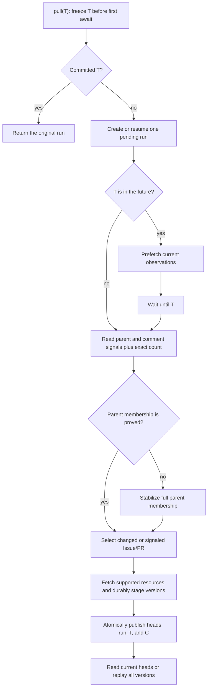
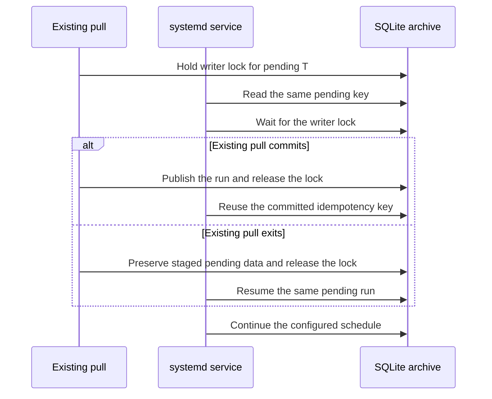

<details>
<summary>Relevant sources</summary>

The following source packages and files were used as context for this document:

- [gh_puller/github/](../gh_puller/github/)
- [scripts/github-puller-daemon.sh](../scripts/github-puller-daemon.sh)
- [tests/test_github_puller.py](../tests/test_github_puller.py)
- [tests/test_github_cli.py](../tests/test_github_cli.py)
- [tests/test_github_daemon.py](../tests/test_github_daemon.py)
- [tests/test_github_monitor.py](../tests/test_github_monitor.py)

</details>

# GitHub raw fact archive

`gh_puller.github` maintains one SQLite database as the durable source of truth for
the GitHub Issue and pull-request facts it observes. A successful pull retains every
distinct raw payload it obtains and publishes one run for each target T. Downstream
jobs can read current state or rebuild the complete observed history without GitHub
access. GitHub states that never reach a supported API response are outside this
contract.

Sources: [gh_puller/github/](../gh_puller/github/)



Sources: [gh_puller/github/](../gh_puller/github/)

## T is an observation watermark

`GitHubPuller.pull(T)` is asynchronous and returns only after its final observation
pass for T has been published. T may be any timezone-aware timestamp. If omitted,
the function freezes the call time before its first `await`. If T is in the future,
the puller prefetches available data, waits until T, and performs a final pass.

T is not a historical snapshot timestamp. A run may contain facts observed while the
operation was in progress, while the database records the actual completion time C
separately. Normalized UTC T is the complete idempotency key: the first success
publishes one run, and every retry returns that original run without an HTTP request
or logical archive-state change. Cancellation, detectable truncation, or an
unrecoverable API error leaves the run pending and publishes nothing; retrying T
resumes its durable work. T does not assert that GitHub exposes every fact through an
incremental signal. The detection boundary is defined below.

The pull protocol does not round or interpret T. UTC boundary alignment belongs only
to the configurable CLI scheduler.

Sources: [gh_puller/github/](../gh_puller/github/); [tests/test_github_puller.py](../tests/test_github_puller.py); [tests/test_github_cli.py](../tests/test_github_cli.py)

## Incremental observation and parent membership

The REST repository-Issues endpoint is the catalog and includes both ordinary Issues
and pull requests. The client requests GitHub's full JSON media type and keeps each
returned object without projecting fields. On a cold authenticated pull, one complete
descending REST scan is accepted when its unique object count equals the sum of the
GraphQL Issue and pull-request `totalCount` values. Without an authenticated count, or
when count and scan disagree, the puller repeats the REST scan until two consecutive
catalog membership signatures agree.

GitHub documents the mixed Issue/PR catalog and `since` filter in
[List repository issues](https://docs.github.com/en/rest/issues/issues#list-repository-issues).
GraphQL supplies only the exact count used by the parent-membership proof; its
projected count is not stored as archive content.

Let W be the preceding completed observation watermark. An incremental pass launches
four discovery operations together:

- the Issue/PR root delta since `W - overlap`;
- the repository Issue-comment delta since the same boundary;
- the repository PR-review-comment delta since the same boundary;
- the authenticated GraphQL Issue-plus-PR count.

The overlap protects changes that share GitHub's second-resolution boundary. Root
rows carry full replacement objects. Comment rows are only dirty-parent signals: the
selected parent is subsequently read through its supported per-parent endpoints.
GitHub defines the two signal endpoints in
[List issue comments for a repository](https://docs.github.com/en/rest/issues/comments#list-issue-comments-for-a-repository)
and
[List review comments in a repository](https://docs.github.com/en/rest/pulls/comments#list-review-comments-for-a-repository).

For the catalog proof, let N be the preceding number of present objects, A the newly
observed objects with `created_at <= T`, F the objects observed during the request
with `created_at > T`, D the preceding objects now absent, and M the exact current
total. GitHub's current catalog satisfies:

```text
M - F = N - D + A
```

The incremental path accepts only `M - F = N + A`; comparison with the identity proves
`D = 0`. Additions cannot conceal deletions because A is counted independently.
Duplicate numbers, changed identities, invalid timestamps, an unavailable exact
count, or a failed equality selects the stable full membership scan. That path
identifies deleted parents without fetching every surviving Issue/PR body. The final
plan writes a tombstone for each absent parent, refreshes each new or changed root and
each comment-signaled parent, and reuses every unchanged survivor.

The puller intentionally does not reread every old Issue/PR merely to search for a
silent child-resource change. Its discovery guarantees and limitations are:

| GitHub change | How it is selected | Boundary |
| --- | --- | --- |
| New Issue/PR or changed parent fields | Repository Issue/PR delta | GitHub must return the parent through its `since` behavior. |
| Deleted Issue/PR previously observed by this database | Exact-count proof falls back to a stable full membership scan | A parent already unavailable before the first observation has no historical row to retain. |
| Added or edited Issue comment | Repository Issue-comment delta | The selected parent is reread from its supported per-parent endpoints. |
| Added or edited PR review comment | Repository PR-review-comment delta | The selected PR is reread from its supported per-parent endpoints. |
| Deleted comment, reaction change, timeline/event change, review change, commit/file change, reviewer change, or PR closing relation change | Parent refresh after another observable signal | There is no deliberate repository-wide scan for these resources, so a change with no parent/comment signal may remain undiscovered. |
| Multiple changes between observations | Latest supported endpoint response after selection | Intermediate states that disappear before an API response are not recoverable. |

Once an Issue/PR is selected, the puller reads every page returned by each supported
per-parent endpoint and checks identities, aggregate counts where meaningful, and
pagination shape. A newly observed response is retained without projecting away
unknown fields. This is lossless storage of observed data, not a claim that GitHub's
APIs expose every web-page fact or every historical state.

## Resource transport and detectable consistency

| Resource | Transport | Detectable consistency check |
| --- | --- | --- |
| Issue root | Reuse the unprojected full-JSON REST catalog row. A signal-only parent uses the individual Issue endpoint. | Identity, kind, and timestamps must agree with the parent catalog state. |
| Issue comments | Read the complete per-parent collection; skip the call only when the root has an exact zero and no repository signal selected the parent. | Comment identities must be unique. A repository signal overrides the zero shortcut. |
| PR review comments | Read the complete per-parent collection; skip only on an exact zero with no repository signal. | Comment identities must be unique; a signal overrides the shortcut. |
| Issue reactions | No collection request when detail reports `total_count == 0` | Zero is itself the complete collection; every nonzero or absent count still paginates and is checked against the aggregate. |
| PR commits and files | No collection request when PR detail reports an exact zero | Nonzero and absent counts still paginate; a returned collection shorter than `commits` or `changed_files` aborts publication. |
| Requested reviewers | Reuse embedded users only when the PR detail contains a valid user list and an empty team list. | Any team or ambiguous embedded value selects the dedicated endpoint, whose team objects carry richer fields. |
| Issues closed by a PR | Batch up to 100 selected PRs into one GraphQL request, include user-linked Issues, and follow every `closingIssuesReferences` cursor. | Each connection's `totalCount` must equal its unique returned nodes. Missing, duplicate, or malformed data aborts the run instead of becoming an empty relation. |
| Per-parent JSON, certified paginated lists, diff, and patch | Conditional GET with the prior ETag | Validators are keyed by API root, API version, media type, path, and parameters, and are stored atomically with the exact bundle digest whose body they validate. A paginated list is reusable only when every page has an ETag and the terminal page has fewer than 100 entries. Every page must return `304 Not Modified`; any changed page restarts complete pagination. A terminal full page has no cache, so 100→101 growth cannot hide on a new page. |
| Timeline, events, diff, and patch aggregation | No repository-wide consolidation | Repository event responses have a different raw shape, while diff and patch have independent lossless fallback rules. Their per-parent responses remain unprojected; eligible responses still use the conditional transport above. |

Authenticated ETag requests that return 304 do not consume primary REST quota; they
remain HTTP attempts and therefore remain included in the run's `requests` counter.
See GitHub's
[conditional-request guidance](https://docs.github.com/en/rest/using-the-rest-api/best-practices-for-using-the-rest-api#use-conditional-requests).

When the three REST discovery streams each fit on one page and nothing changed, one
authenticated pass costs three REST attempts plus one GraphQL query and is independent
of archive size. A future-T operation normally performs both prefetch and closure, so
a quiet hourly writer makes six REST attempts and two GraphQL queries per hour. GitHub
accounts the two primary budgets independently; see its
[REST rate-limit reference](https://docs.github.com/en/rest/using-the-rest-api/rate-limits-for-the-rest-api)
and
[GraphQL rate-limit reference](https://docs.github.com/en/graphql/overview/rate-limits-and-query-limits-for-the-graphql-api).

For I ordinary Issues, P pull requests, and N = I + P, the authenticated cold-path
minimum is easier to compare as separate primary-rate-limit buckets:

```text
REST HTTP requests:    ceil(N / 100) + 2I + 6P
GraphQL HTTP requests: 1 + ceil(P / 100)
```

The REST catalog and GraphQL count contribute the first term of their respective
lines. An empty Issue still reads timeline and events. An empty PR additionally reads
PR detail, reviews, diff, and patch. The PR batch term reads the first page of every
closing relation. A relation beyond 100 nodes adds cursor requests, while non-empty
comments, reactions, commits, files, review teams, pagination, and media fallback add
their actual REST requests. On a warm pass, only selected PRs enter the GraphQL
relation batches. The query uses GitHub's documented maximum page size and stays well
below its node limit; GitHub's response headers remain authoritative for actual point
consumption. See the
[PullRequest GraphQL fields](https://docs.github.com/en/graphql/reference/pulls#pullrequest)
and
[GraphQL resource limits](https://docs.github.com/en/graphql/overview/rate-limits-and-query-limits-for-the-graphql-api).

Primary or secondary limiting follows GitHub's advertised recovery time, so a cold
start may span quota windows while remaining one blocking `pull(T)` call. Network
errors and HTTP 5xx responses retry the same request indefinitely with backoff capped
at 30 seconds; they neither restart a catalog scan nor consume already completed
in-memory pagination. Bundle work uses at most `concurrency` in-flight parent tasks.
Results are consumed in completion order and each completed bundle is staged
immediately, so one slow parent neither holds the concurrency window nor prevents
later work from becoming crash-recoverable. Public version iteration remains
deterministic by run, parent number, and intra-parent observation order.

Sources: [gh_puller/github/](../gh_puller/github/); [tests/test_github_puller.py](../tests/test_github_puller.py)

## Progress is out of band

The puller emits immutable `PullProgress` snapshots to an optional synchronous
observer. These events never enter SQLite and are not facts: an observer exception
disconnects that observer without changing fetching, durable staging, recovery, or
publication. This makes the same callback suitable for an embedded monitor while
keeping the archive schema independent of a particular operations stack.

The CLI installs `ConsoleProgress` by default. A TTY receives a throttled single-line
progress bar on stderr with human-formatted counts and separate REST and GraphQL
quota fields. A non-TTY receives throttled JSON Lines on stderr with
`type="github_pull_progress"`; phase changes, waits, completion, and failure are
emitted immediately. The one committed `PullResult` remains JSON on stdout, so a
supervisor can route progress and results independently. `--no-progress` disables
stderr progress.

The catalog counters describe the active closure pass. Bundle counters describe the
current run's materialization plan. While the run is pending, they are restored from
its latest durable SQLite stage when the writer process starts. The observer and
`status` command remain out of band: only the writer performs that local read, then
emits the resulting snapshot through the same progress stream.

| Field | Definition | Relationship to Issue/PR count |
| --- | --- | --- |
| `catalog_seen / catalog_total` | Root rows read during a scan; once certified, both become the current visible catalog size N. | N counts ordinary Issues and PRs because GitHub's Issues catalog contains both. |
| `bundles_completed / bundles_total` | Parent bundles already durable and compatible with the current catalog plan, divided by that carried set plus the remaining candidates K. | K is normally much smaller than N. A cold pull has total N, and a cold restart resumes from its durable numerator instead of restarting at zero. |
| `issues_completed`, `pulls_completed` | Kind split of durable completed bundles in the current plan. | Their sum equals `bundles_completed`. |
| `tombstones` | Durable absences that agree with the current certified catalog plan. | They are reported separately from bundle progress and are excluded from the resulting visible N. |
| `latest_number`, `latest_kind` | Most recently completed and durably staged parent. | Completion follows response time rather than parent number; gaps are ordinary concurrent work, not missing facts. |
| `requests`, `quotas` | HTTP attempts accumulated by the run and the latest independently sampled GitHub quota buckets. | They measure API work, not objects; REST `core` uses request units while GraphQL uses points, so neither can be derived from the other. |

A future-T operation has separate `prefetch_*` and `closing_*` phases. Each pass moves
through catalog proof and parent-bundle materialization. It recomputes its catalog
plan, carries forward compatible durable stage, and reclassifies objects that must be
fetched again. The run identity and accumulated request count continue. A
`rate_limit` event reports the wait duration and any known quota reset time without
pretending that object progress moved; `retry_wait` distinguishes network and 5xx
backoff from quota exhaustion.

Sources: [gh_puller/github/](../gh_puller/github/); [tests/test_github_puller.py](../tests/test_github_puller.py); [tests/test_github_cli.py](../tests/test_github_cli.py)

## SQLite is the fact boundary

The store separates invocation metadata, payload bytes, object observations, and
current heads:

- `pull_runs` records T, C, first start time, observation watermark, request count,
  and publication status. A unique index makes T the identity of both pending and
  committed runs.
- `payload_blobs` stores canonical JSON compressed with zlib and addressed by its
  SHA-256 digest. Identical summaries and bundles share one payload.
- `resource_versions` is an append-only observation log. Multiple different payloads
  observed during one future-T operation remain distinct versions.
- `resource_heads` is the atomically maintained current state derived from the last
  committed version of each object.
- `bundle_http_cache` stores discardable ETags keyed by the exact content-addressed
  bundle they validate. It is transport state, is ignored by offline readers, and
  can always be reconstructed by unconditional requests.

Versions belonging to a pending run are durable for recovery but invisible to
`iter_runs`, `iter_versions`, and `iter_heads`. Finalization updates heads and changes
the run to `committed` in one SQLite transaction. A process file lock enforces the
single-writer contract; SQLite uses WAL mode, foreign keys, and
`synchronous=FULL`.

Each version retains an unprojected REST summary and one record containing all
supported responses read for that Issue or PR. The GraphQL count projection is not
stored. A selected PR does store the projected `closingIssuesReferences` nodes,
including each target Issue's global ID, repository identity, number, title, state,
and URL. Unknown fields in REST JSON are preserved semantically. Issue records
include detail, comments, comment reactions, timeline, events, and reactions. PR
records additionally include PR detail, reviews, review comments and reactions,
commits, files, requested reviewers, closing-Issue references, diff, and patch.
If GitHub rejects or persistently fails an aggregate PR diff or patch representation,
the bundle records that failure and requests the same representation for every commit
through GitHub's
[Get a commit](https://docs.github.com/en/rest/commits/commits#get-a-commit)
endpoint. If an individual representation is also unavailable, its error and the
other raw representation are retained instead. Shared results are cached while both
aggregate forms are resolved. The cold pull can then advance without claiming that an
unavailable representation was returned.
Aggregate fields and their enumerated collections remain separate facts. GitHub can
retain an Issue `comments` or PR `review_comments` aggregate after comments are no
longer returned by per-parent REST enumeration. The archive preserves
these comment aggregates and the complete per-parent responses instead of inventing
rows. An exact zero avoids an empty collection request unless a repository signal
selects the parent; a nonzero value always triggers enumeration and is not used to
manufacture missing rows. Enumeration follows GitHub's
[list Issue comments endpoint](https://docs.github.com/en/rest/issues/comments#list-issue-comments)
and
[list review comments endpoint](https://docs.github.com/en/rest/pulls/comments#list-review-comments-on-a-pull-request).
A tombstone records certified absence without discarding the last bundle. The
boundary excludes linked external attachments and facts that GitHub made unavailable
before the archive first observed them.

Archive schema 4 pairs this resource set with record schema 2. Opening a database
with another archive schema is rejected before pulling, so one file cannot silently
mix records with different required fields.

Sources: [gh_puller/github/](../gh_puller/github/); [tests/test_github_puller.py](../tests/test_github_puller.py)

## Offline page reconstruction boundary

The database can rebuild the data-oriented part of an observed Issue or PR page, but
it is not a browser-page mirror. “Rebuild” below means an offline model can derive the
fact from stored responses; it does not promise GitHub's exact HTML, ordering, or
presentation.

| Page or mining question | Available offline | Boundary |
| --- | --- | --- |
| Issue/PR title, body, rendered body variants returned by full-JSON REST, author, timestamps, state, labels, assignees, and milestone | Yes | Only versions actually observed are retained; GitHub's complete edit history is not an API response. |
| Conversation comments, reactions, and observed timeline/events | Yes | A deletion or silent child change can remain unknown until another signal selects the parent. |
| PR source and target repository/branch, draft and merge fields | Yes, from PR detail | Branch contents and the rest of the Git repository are outside this database. |
| PR commits, changed files, reviews, review comments, aggregate diff, and patch | Yes, for a selected PR | CI checks, workflow runs, deployments, and review-thread resolution state are not fetched. |
| Issue GitHub marks as closable by a selected PR | Yes, from `closing_issues_references` | The relation is GitHub's closing linkage; whether the PR merged and whether the change semantically fixed the Issue remain separate facts. |
| Forward references written in title/body/comment text | The raw text can be parsed offline | Textual references may be ambiguous or point outside the repository. |
| Reverse references to an Issue/PR | Partly, from observed timeline cross-reference events and locally parsed forward references | There is no repository-external reverse-reference crawl, and silent or unavailable events cannot be invented. |
| Exact GitHub web page | No | Styling, live widgets, permission-dependent controls, avatars and attachment bytes, Projects fields, checks, and other page-only or unsupported API data are outside the archive. |

This supports mining contributor activity from authors, assignees, commenters,
reviewers, and commit identities; deriving explicit Issue-to-PR closing edges; and
classifying bug-fix, draft, or work-in-progress records from labels and text. “Core
developer”, “bug fix”, and similar conclusions remain downstream definitions rather
than facts asserted by the puller.

Sources: [gh_puller/github/](../gh_puller/github/); [tests/test_github_puller.py](../tests/test_github_puller.py)

## Offline reads

Use `iter_heads` when only the committed current state is needed. It reads
`resource_heads` directly rather than replaying history:

```python
from pathlib import Path

from gh_puller.github import iter_heads


async def current_issues(path: Path) -> dict[int, dict]:
    return {
        head.number: head.bundle
        async for head in iter_heads(path, present_only=True)
    }
```

Use `iter_versions` to rebuild a downstream database or mine changes over time, and
`iter_runs` for T, C, and run-level statistics:

```python
from pathlib import Path

from gh_puller.github import iter_runs, iter_versions


async def rebuild(path: Path) -> None:
    runs = [run async for run in iter_runs(path)]
    heads = {}
    async for version in iter_versions(path):
        heads[version.number] = version
```

Folding versions in iterator order reconstructs every committed state. A
`present=False` version is a tombstone whose retained summary and bundle remain
available for mining.

Sources: [gh_puller/github/](../gh_puller/github/); [tests/test_github_puller.py](../tests/test_github_puller.py)

## Run once or on a UTC-aligned interval

Production operation requires an authenticated token through the process environment
or the project-root `.env`. `GH_TOKEN` takes precedence over `GITHUB_TOKEN`. A run
that selects any PR needs GraphQL authentication for its closing-Issue relation;
authentication also provides the production primary-rate-limit budget:

```dotenv
GH_TOKEN=github_pat_your_token
```

Pull to the call time or any explicit timezone-aware T:

```bash
uv run -m gh_puller.github once vllm-project/vllm archives/vllm.sqlite3
uv run -m gh_puller.github once vllm-project/vllm archives/vllm.sqlite3 \
  --target 2026-09-02T20:07:00+08:00
```

Run a UTC-aligned schedule. The interval is a positive integer followed by `s`, `m`,
`h`, or `d`; its default is `1h`:

```bash
uv run -m gh_puller.github schedule \
  vllm-project/vllm archives/vllm.sqlite3 \
  --interval 1h
```

Targets are multiples of the interval from the UTC Unix epoch: `1h` lands on whole
UTC hours and `30m` lands on `:00` and `:30`. On first start the scheduler selects the
latest reached boundary. It normally advances to the next boundary and can call the
puller before that future T so prefetch and final closure remain part of one blocking
operation. If a run falls behind by several intervals, the next run coalesces the
missed boundaries into the latest reached boundary instead of claiming historical
observations that were never made. A restart finishes the database-wide pending T
before calculating another target. A lifecycle lock rejects a second scheduler for
the same database; `SIGINT` and `SIGTERM` cancel the active operation.

Sources: [gh_puller/github/](../gh_puller/github/); [tests/test_github_cli.py](../tests/test_github_cli.py)

## Unattended Linux service

The repository provides an idempotent installer for a system-level systemd writer.
Run it through `sudo`; the generated service itself runs as the invoking ordinary
user, starts at `multi-user.target`, waits for network readiness, and restarts one
minute after an unexpected exit. It records absolute paths to this checkout, `uv`,
and the SQLite destination. The application therefore reads the project-root `.env`
without placing `GH_TOKEN` in the unit file.

The canonical absolute database path is the writer identity. Its unit is named
`gh-puller-<path-id>.service`, where `<path-id>` is the first 12 hexadecimal digits
of that path's SHA-256 digest. The database filename and repository are intentionally
absent from the name: the repository is configuration bound to the writer and to the
archive metadata, while the compact path digest supplies a stable, database-scoped
systemd key. Unit metadata retains the canonical database path; every mutation checks
it and rejects a truncated-digest collision.

Install and immediately start one writer for a database:

```bash
sudo scripts/github-puller-daemon.sh install \
  vllm-project/vllm archives/vllm.sqlite3
```

Options after the database are passed to the `schedule` command and persist in the
unit. Re-running `install` verifies the binding, reconciles the database's managed
unit to its canonical name, enables it, and restarts it:

```bash
sudo scripts/github-puller-daemon.sh install \
  vllm-project/vllm archives/vllm.sqlite3 \
  --interval 30m --concurrency 8 --request-timeout 60
```

Preview the complete unit without installing it by using `render` in place of
`install`. Reusing a database path with another repository is rejected before the
unit is changed. Different database paths map to independent units, even when they
pull the same repository; a detected digest collision is rejected:

| Repository/database relation | Result |
| --- | --- |
| Same repository, same canonical database path | Same unit; `install` updates and restarts it. |
| Different repository, same canonical database path | Rejected; an archive cannot be rebound. |
| Same repository, different database paths | Independent units and independent GitHub API use. |
| Different repositories, different database paths | Independent units and independent GitHub API use. |

Sources: [scripts/github-puller-daemon.sh](../scripts/github-puller-daemon.sh); [gh_puller/github/](../gh_puller/github/)

Use the same script for routine operations. `status` is a read-only projection of
systemd process state and the latest journald progress event. It neither opens the
SQLite archive nor contacts GitHub. With no database it lists every managed writer;
with a database it renders that writer's full process and pull snapshot:

```bash
scripts/github-puller-daemon.sh status
scripts/github-puller-daemon.sh status archives/vllm.sqlite3
watch -n 1 scripts/github-puller-daemon.sh status archives/vllm.sqlite3
```

The overview always includes the canonical `DATABASE`, current target T, run,
phase, event age, and `ITEMS`. `ITEMS` means the certified current catalog count of
Issues plus pull requests; it is `?` until that count is known. `PROGRESS` reports
the active catalog or bundle phase and likewise keeps an unknown denominator as `?`.
`QUOTA` retains every resource bucket observed by the writer and shows each
`remaining/limit` independently. Normal authenticated operation therefore displays
both REST `core` and `graphql` after each has responded. Each bucket occupies one
aligned line with its own advertised reset timestamp. Absolute times in `status` use
the system timezone and systemd-style notation; stored and structured event times
remain UTC. These samples come from response headers, so `status` itself makes no API
call. A rate-limit event shows its decreasing local wait estimate. The per-run
HTTP-attempt counter remains available in raw logs rather than the operational
summary; it must not be treated as either REST units or GraphQL points when comparing
pull strategies.

Progress JSON Lines, completed-run JSON, exceptions, and service messages are
retained by journald, so no separate log-file rotation is required. `logs` prints
the most recent 100 messages with journalctl's local-time `short-full` prefix and
follows new output until interrupted:

```bash
scripts/github-puller-daemon.sh logs archives/vllm.sqlite3
sudo scripts/github-puller-daemon.sh stop archives/vllm.sqlite3
sudo scripts/github-puller-daemon.sh start archives/vllm.sqlite3
sudo scripts/github-puller-daemon.sh restart archives/vllm.sqlite3
```

`stop` ends the current process but leaves the installed unit enabled; `start` resumes
the same database-bound scheduler, including any pending durable run. `restart` is the
corresponding single operation. Read-only observation normally needs no `sudo`;
mutating operations still do.
Supplying an `OWNER/REPO` or a database without a managed unit to `status`, `logs`,
`start`, `stop`, or `restart` fails immediately instead of following an unrelated
hash unit.

Sources: [scripts/github-puller-daemon.sh](../scripts/github-puller-daemon.sh); [gh_puller/github/](../gh_puller/github/); [tests/test_github_monitor.py](../tests/test_github_monitor.py)

The service can be installed while a foreground pull owns the archive lock. It reads
the pending key, waits behind that writer, and then takes one of two equivalent paths:



The archive lock prevents simultaneous writers during takeover, while durable staging
and the idempotency key avoid restarting completed bundles in a cold pull from zero.

Sources: [gh_puller/github/](../gh_puller/github/); [tests/test_github_cli.py](../tests/test_github_cli.py)

Uninstalling is symmetric and idempotent: it stops and disables the service, removes
its unit, reloads systemd, and clears the unit's failed state. It deliberately keeps
the SQLite archive, `.env`, virtual environment, source checkout, and their lock
files:

```bash
sudo scripts/github-puller-daemon.sh uninstall archives/vllm.sqlite3
```

Sources: [scripts/github-puller-daemon.sh](../scripts/github-puller-daemon.sh); [tests/test_github_daemon.py](../tests/test_github_daemon.py)

## Verify the contract

Run the focused suite and lint from the repository root:

```bash
uv run pytest -q \
  tests/test_github_puller.py tests/test_github_cli.py \
  tests/test_github_daemon.py tests/test_github_monitor.py
uvx ruff check \
  gh_puller/github \
  tests/test_github_puller.py tests/test_github_cli.py \
  tests/test_github_daemon.py tests/test_github_monitor.py
bash -n scripts/github-puller-daemon.sh
```

The suite covers raw-field retention, REST parent-membership proof and fallback, PR
resources, batched and paginated closing-Issue relations, same-second boundaries,
future prefetch history, diff/patch fallback and validator reuse, pass-local progress,
zero-request idempotent reuse, observer failure isolation, TTY and JSON progress,
rate-limit waits, current-head visibility, single- and multi-page conditional
validation, 100→101 page growth, content deduplication, tombstones, cancellation,
completion-order durable resume, concurrent duplicate calls, scheduler recovery,
randomized observable Issue/PR and comment churn, parent-deletion fallback, archive
schema rejection, and request-saving shortcuts for selected Issue/PR records.

The daemon tests additionally verify unit rendering, repeatable installation and
uninstallation, archive preservation, database-scoped controls, repository-binding
rejection, independent writers, service reconciliation, multi-writer status,
phase-local progress, exact and unknown item counts, and stable watch output.

Sources: [tests/test_github_puller.py](../tests/test_github_puller.py); [tests/test_github_cli.py](../tests/test_github_cli.py); [tests/test_github_daemon.py](../tests/test_github_daemon.py); [tests/test_github_monitor.py](../tests/test_github_monitor.py)
