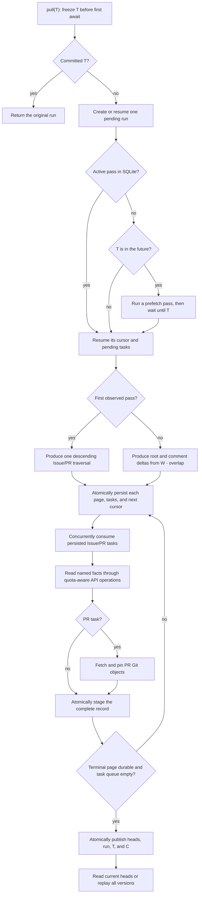
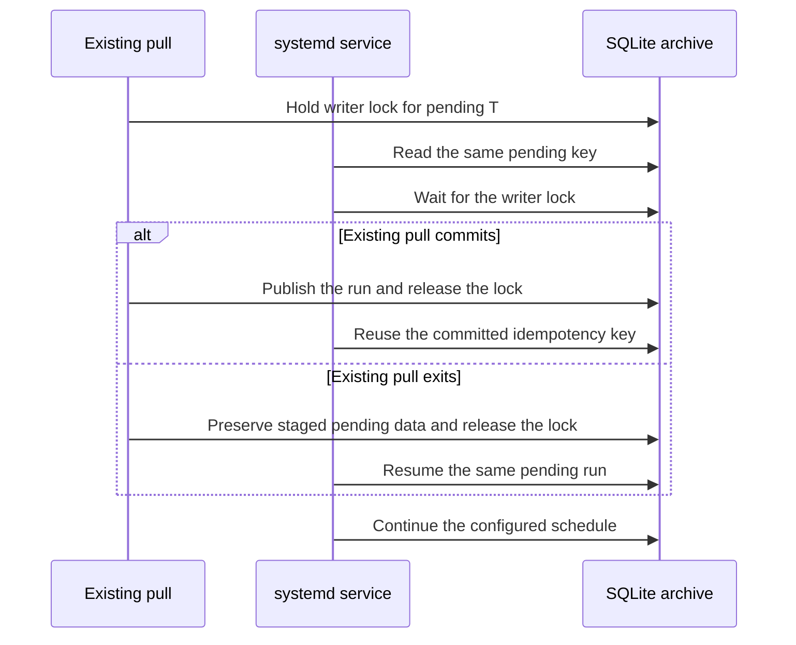

<details>
<summary>Relevant sources</summary>

- [gh_puller/github/](../gh_puller/github/)
- [scripts/github-puller-daemon.sh](../scripts/github-puller-daemon.sh)
- [tests/github/test_git_store.py](../tests/github/test_git_store.py)
- [tests/github/](../tests/github/)
- [tests/github/test_cli.py](../tests/github/test_cli.py)
- [tests/github/test_daemon.py](../tests/github/test_daemon.py)
- [tests/github/test_monitor.py](../tests/github/test_monitor.py)
</details>

# GitHub raw fact archive

`gh_puller.github` maintains an archive pair: one SQLite database for observed GitHub
Issue and pull-request semantics, and a companion bare Git store at `DATABASE.git`
for PR commit, tree, and blob objects. A successful pull publishes one run for each
target T. Downstream jobs can reconstruct every retained API fact and PR code snapshot
without network access. GitHub states that never reach a supported API response are
outside this contract.

Sources: [gh_puller/github/](../gh_puller/github/)



Sources: [gh_puller/github/](../gh_puller/github/)

## T is an observation watermark

`GitHubPuller.pull(T)` is asynchronous and returns only after its final observation
pass for T has been published. T may be any timezone-aware timestamp. If omitted,
the function freezes the call time before its first `await`. If T is in the future,
the puller prefetches available data, waits until T, and performs a final pass.

T is not a historical snapshot timestamp. A run may contain facts observed while the
operation was in progress, while the database records the actual completion time C
separately. Normalized UTC T is the complete idempotency key: the first success
publishes one run, and every retry returns that original run without an HTTP request
or logical archive-state change. Cancellation, detectable truncation, or an
unrecoverable API error leaves the run pending and publishes nothing; retrying T
resumes its durable work. T does not assert that GitHub exposes every fact through an
incremental signal. The detection boundary is defined below.

The pull protocol does not round or interpret T. UTC boundary alignment belongs only
to the configurable CLI scheduler.

Sources: [gh_puller/github/](../gh_puller/github/); [tests/github/](../tests/github/); [tests/github/test_cli.py](../tests/github/test_cli.py)

## Incremental observation and parent membership

The REST repository-Issues endpoint is the catalog and includes both ordinary Issues
and pull requests. A cold archive performs one descending traversal. The authenticated
GraphQL Issue-plus-PR count is an operator-facing progress estimate only: it does not
prove membership, detect deletion, or decide whether another traversal runs.

GitHub documents the mixed Issue/PR catalog and `since` filter in
[List repository issues](https://docs.github.com/en/rest/issues/issues#list-repository-issues).
The count projection is not stored as archive content.

The cold traversal is a durable producer. It follows GitHub's opaque `Link` cursor
from newest to oldest and commits one transaction per page. Catalog requests use
GitHub's raw-JSON representation: it retains the Markdown body and avoids making
directory availability depend on server-side HTML/text rendering. That transaction
stores the unprojected root rows, creates or updates their Issue/PR tasks, and
advances the next cursor. A bounded consumer begins as soon as the first page is
durable and materializes up to `concurrency` Issue/PR records at once. Directory
production can therefore run ahead of expensive per-parent reads without keeping the
traversal only in memory.

The page journal is pass-local execution state rather than a general HTTP response
cache. Later runs have different `since` boundaries and unstable page cursors, so
their expected page hit rate is poor. Cross-run reuse instead occurs at the complete
Issue/PR record and its atomically paired HTTP validators, where identity remains
well defined.

Sources: [gh_puller/github/](../gh_puller/github/); [tests/github/](../tests/github/)

Let W be the preceding completed observation watermark. Every warm pass reads three
incremental streams:

- the Issue/PR root delta since `W - overlap`;
- the repository Issue-comment delta since the same boundary;
- the repository PR-review-comment delta since the same boundary.

The overlap protects changes that share GitHub's second-resolution boundary. Root
rows carry full replacement objects. Comment rows are only dirty-parent signals: the
selected parent is subsequently read through its supported per-parent endpoints.
GitHub defines the two signal endpoints in
[List issue comments for a repository](https://docs.github.com/en/rest/issues/comments#list-issue-comments-for-a-repository)
and
[List review comments in a repository](https://docs.github.com/en/rest/pulls/comments#list-review-comments-for-a-repository).

Each root page uses the same durable page/task/cursor journal as the cold traversal.
The comment streams persist their selected parent numbers before root consumption
starts. A task is complete only after either the existing record is reusable from
the observed root or the replacement record is durable. A pass closes only when the
root stream has reached its terminal page and every persisted task is complete. Only
then can its observation watermark advance.

If the process exits, the same T resumes the active pass from its stored `next_url`;
completed Issue/PR records are not fetched again. GitHub may expire an opaque cursor.
An HTTP 404, 410, or 422 for a resumed cursor restarts only the root traversal and
reuses all completed Issue/PR tasks. A repeated number with the same immutable ID,
kind, and creation time is idempotent. A conflicting immutable identity aborts the
pass instead of silently replacing one object with another.

Sources: [gh_puller/github/](../gh_puller/github/); [tests/github/](../tests/github/)

The puller deliberately does not run a warm full traversal or infer absence from
counts. Its observed-change contract is:

| GitHub change | How it is selected | Boundary |
| --- | --- | --- |
| New Issue/PR or changed parent fields | Repository Issue/PR delta | GitHub must return the parent through its `since` behavior. |
| Deleted Issue/PR | A direct selected-parent 404/410 can become an observed absence | GitHub does not provide a deletion feed. A silent deletion remains represented by the last observed record. |
| Added or edited Issue comment | Repository Issue-comment delta | The selected parent is reread from its supported per-parent endpoints. |
| Added or edited PR review comment | Repository PR-review-comment delta | The selected PR is reread from its supported per-parent endpoints. |
| Deleted comment, reaction change, timeline/event change, review change, commit/file change, reviewer change, or PR closing relation change | Parent refresh after another observed signal | There is no repository-wide child scan, so a change with no parent/comment signal may remain undiscovered. |
| Multiple changes between observations | Latest supported endpoint response after selection | Intermediate states that disappear before an API response are not recoverable. |

Once an Issue/PR is selected, the puller reads every page returned by each supported
per-parent endpoint and checks identities, aggregate counts where meaningful, and
pagination shape. REST-backed facts retain unknown response fields. GraphQL-backed
facts retain both the operation's stable mapping and its exact selected source nodes;
GraphQL cannot expose fields absent from the query. This is lossless storage of data
the operation actually observed, not a claim that GitHub's APIs expose every web-page
fact or every historical state.

This is a best-effort discovery boundary, not a perfect GitHub replica. “Source of
truth” means downstream jobs need only the archive pair to reproduce every fact and
code object the puller successfully observed; it does not upgrade an unobservable
GitHub state into an observed fact.

Sources: [gh_puller/github/](../gh_puller/github/); [tests/github/](../tests/github/)

## Resource transport and detectable consistency

| Resource | Transport | Detectable consistency check |
| --- | --- | --- |
| Issue root | Reuse the unprojected raw-JSON REST catalog row. A signal-only parent uses the individual Issue endpoint. | Identity, kind, and timestamps must agree with the parent catalog state. |
| Issue/PR conversation comments | REST or GraphQL; skip the operation only when the root has an exact zero and no repository signal selected the parent. | Every selected transport closes its own pagination and comment identities must be unique. A repository signal overrides the zero shortcut. |
| PR detail | REST or GraphQL | Both transports produce the stable fields used by the archive and Git snapshot. The GraphQL source node is retained separately from that mapping. |
| PR reviews | REST or GraphQL | Every page is read, `totalCount` is stable, and node identities are unique on GraphQL. |
| PR review comments | REST or GraphQL | REST follows its flat collection. GraphQL closes both `reviewThreads` pagination and each thread's comment pagination before flattening unique comments. |
| Reactions | REST or GraphQL when the reactable has a node ID; otherwise REST | An exact aggregate zero avoids the operation. Nonzero collections close pagination and are checked against the aggregate where available. |
| PR commits | REST or GraphQL; no operation for an exact zero | GraphQL closes the full commit connection without the REST 250-entry cap. REST uses the PR endpoint through 250 and the exact `base.sha...head.sha` comparison above it. Either result must equal the PR-detail count. |
| PR code snapshot | Fetch current repository branches and each selected `refs/pull/<number>/head` into the companion bare Git store. Pin every API-observed object that remains reachable. | A complete snapshot uses the unique merge-base, or Git's empty tree for unrelated histories. If an API-named base/head was already unreachable, `comparison_kind` is `unavailable` and `unavailable_commits` identifies the missing SHA instead of inventing a diff. Multiple available merge-bases still abort as ambiguous. |
| Requested reviewers | Reuse embedded users only when the PR detail contains a valid user list and an empty team list. | Any team or ambiguous embedded value selects the dedicated endpoint, whose team objects carry richer fields. |
| Issues closed by a PR | Batch up to 100 selected PRs into one GraphQL request, include user-linked Issues, and follow every `closingIssuesReferences` cursor. | Each connection's `totalCount` must equal its unique returned nodes. Missing, duplicate, or malformed data aborts the run instead of becoming an empty relation. |
| REST-backed per-parent JSON and complete lists | Conditional GET with the prior ETag | Validators are keyed by API root, API version, media type, path, and parameters, and are stored atomically with the exact record they validate. A reusable list needs an ETag on every page and a terminal page below 100 entries. Any changed page restarts complete pagination; a terminal full page is not cached, so 100→101 growth cannot hide. |
| Timeline and events | Complete per-parent REST collections | Repository event responses have a different raw shape, so repository-wide responses cannot replace them. Their per-parent responses remain unprojected and use the conditional transport above when eligible. |

The selectable rows are named operations in `client.py`; `puller.py` asks for a fact
without choosing an API. With no reusable REST validator, the client compares each
bucket's latest `remaining / limit` fraction and uses the larger one. A valid REST
validator takes precedence while core is available because an authenticated `304`
does not consume primary REST quota. A primary-limit response or an unrecoverable
operation response tries the other implementation. If both primary buckets are
blocked, the operation waits for the earlier reset. Secondary limiting remains a
shared gate because changing API does not escape GitHub's
[secondary rate limits](https://docs.github.com/en/graphql/overview/rate-limits-and-query-limits-for-the-graphql-api#about-secondary-rate-limits).

The client learns quotas from ordinary response headers and does not spend a request
polling `/rate_limit`. REST `core` requests and GraphQL points are different units;
the reported headers, rather than HTTP-attempt count, remain authoritative. GraphQL
connection queries can cost more than one point, and their returned remaining value
feeds the next routing decision.

Sources: [gh_puller/github/](../gh_puller/github/); [tests/github/](../tests/github/)

Authenticated ETag requests that return 304 do not consume primary REST quota; they
remain HTTP attempts and therefore remain included in the run's `requests` counter.
See GitHub's
[conditional-request guidance](https://docs.github.com/en/rest/using-the-rest-api/best-practices-for-using-the-rest-api#use-conditional-requests).

GitHub documents the 250-entry cap on
[List commits on a pull request](https://docs.github.com/en/rest/pulls/pulls#list-commits-on-a-pull-request).
For a larger selected PR routed through REST, the client uses the paginated
[Compare two commits](https://docs.github.com/en/rest/commits/commits#compare-two-commits)
response because its base/head range is exact and its commit list can cross that cap.
The GraphQL commit connection has no corresponding 250-entry branch in the client;
it follows every cursor and verifies the same advertised total.

PR file content and file membership normally come from Git objects rather than GitHub's
[3,000-file-limited PR collection](https://docs.github.com/en/rest/pulls/pulls#list-pull-requests-files).
When `comparison_kind` is `merge_base` or `empty_tree`, the bundle records stable
`base_ref`, `head_ref`, and `comparison_ref` names; running `git diff` between the
comparison and head refs reconstructs the complete code change even beyond 3,000
files. An `unavailable` manifest retains both API SHAs, every ref that could still be
pinned, and the exact missing commit list, but has no `comparison_ref`. Git fetch
traffic consumes repository bandwidth but not the REST `core` or GraphQL
primary-rate-limit buckets. See
[git-fetch](https://git-scm.com/docs/git-fetch),
[git-update-ref](https://git-scm.com/docs/git-update-ref), and
[git-diff](https://git-scm.com/docs/git-diff).

Snapshot pinning first uses the repository branches and PR heads fetched for the
current batch. A head that moved after prefetch receives one targeted refresh. If an
API-named base or head is still absent, the store publishes the explicit partial
manifest rather than blocking unrelated Issue/PR records. The PR detail always
retains GitHub's `merge_commit_sha`; the Git manifest adds `merge_commit_ref` only
when that commit is reachable locally. Deleted or force-pushed history therefore
remains an observed API fact without becoming a dangling Git ref or a fabricated code
snapshot.

Sources: [gh_puller/github/](../gh_puller/github/); [tests/github/test_git_store.py](../tests/github/test_git_store.py)

When the three discovery streams each fit on one page and nothing changed, an
authenticated warm pass makes three REST requests, and the cost is independent of
archive size. A future-T operation that performs both prefetch and closure normally
makes six such requests. Only selected parents enter the per-parent operations;
their reusable REST validators may then produce primary-quota-free `304` responses.

For a cold archive with N Issue/PR parents, the fixed REST floor is the mixed catalog
plus the per-parent timeline and event collections:

```text
fixed REST operations: ceil(N / 100) + 2N
```

PR detail and reviews, nonempty conversation or review comments, reactions, and
nonempty PR commits form the selectable load shared between the two primary buckets.
Requested-reviewer fallback remains REST. Repository count and batched
`closingIssuesReferences` remain GraphQL. Pagination adds work to the bucket selected
for that operation; GraphQL reports points rather than request count. Git traffic is
absent from both API budgets.

This decomposition is intentionally not collapsed into one “requests per PR” number:
the router changes the split as headers change, GraphQL query cost depends on its
connections, and a prior ETag can make a REST validation free of primary quota.
GitHub accounts the two primary budgets independently but applies documented shared
secondary constraints. See the
[REST rate-limit reference](https://docs.github.com/en/rest/using-the-rest-api/rate-limits-for-the-rest-api),
[GraphQL rate-limit reference](https://docs.github.com/en/graphql/overview/rate-limits-and-query-limits-for-the-graphql-api),
and [PullRequest GraphQL fields](https://docs.github.com/en/graphql/reference/pulls#pullrequest).

Primary or secondary limiting follows GitHub's advertised recovery time, so a cold
start may span quota windows while remaining one blocking `pull(T)` call. REST and
GraphQL network errors and HTTP 5xx responses retry the same request indefinitely
with backoff capped at 30 seconds. A failed Git command leaves the run pending; a
service writer restarts it after its configured systemd delay. Every accepted root
page and its next cursor are already durable before the following page begins. Each
selected PR batch fetches Git refs before at most `concurrency` parent tasks run.
Results are consumed in completion order and each completed record is staged
immediately, so one slow parent neither holds the concurrency window nor prevents
later work from becoming crash-recoverable. Public version iteration remains
deterministic by run, parent number, and intra-parent observation order.

Sources: [gh_puller/github/](../gh_puller/github/); [tests/github/](../tests/github/)

## Progress is out of band

The puller emits immutable `PullProgress` snapshots to an optional synchronous
observer. These events never enter SQLite and are not facts: an observer exception
disconnects that observer without changing fetching, durable staging, recovery, or
publication. This makes the same callback suitable for an embedded monitor while
keeping the archive schema independent of a particular operations stack.

The CLI installs `ConsoleProgress` by default. A TTY receives a throttled single-line
progress bar on stderr with human-formatted counts and separate REST and GraphQL
quota fields. A non-TTY receives throttled JSON Lines on stderr with
`type="github_pull_progress"`; phase changes, waits, completion, and failure are
emitted immediately. The one committed `PullResult` remains JSON on stdout, so a
supervisor can route progress and results independently. `--no-progress` disables
stderr progress.

The catalog fields describe the durable producer journal for the active pass. Object
counters describe durable Issue/PR tasks processed by its bounded consumer, including
records fetched, safely reused, observed absent, or excluded because they are later
than T. Both counters resume from SQLite after a writer restart. The observer and
`status` command remain out of band: only the writer performs that local read, then
emits the resulting snapshot through the same progress stream.

| Field | Definition | Relationship to Issue/PR count |
| --- | --- | --- |
| `items` | Current locally observed Issue/PR heads, or the authenticated cold-start estimate before they are all materialized. | This drives `ITEMS` independently of active traversal progress. |
| `catalog_seen`, `catalog_total`, `catalog_complete` | Unique durable root rows, the initial cold-start estimate when available, and whether the terminal page is durable. | The estimate is not a completion condition because a live paginated traversal is not a snapshot. A warm delta has no full-repository estimate. |
| `objects_completed / objects_total` | Durable Issue/PR tasks processed in the active pass. | The exact denominator becomes available when catalog production closes; before then it remains unknown rather than tracking a moving queue. |
| `issues_completed`, `pulls_completed` | Selected records fetched and durably handled by kind. | These drive `STAGED`; their sum can be smaller than `objects_completed` because reusable and later-than-T tasks require no replacement record. |
| `tombstones` | Parent absences directly observed while processing a selected parent. | Silent absence is not counted and does not alter the last observed head. |
| `latest_number`, `latest_kind` | Most recently completed and durably staged parent. | Completion follows response time rather than parent number; gaps are ordinary concurrent work, not missing facts. |
| `requests`, `quotas` | HTTP attempts accumulated by the run and the latest independently sampled GitHub quota buckets. | They measure API work, not objects; REST `core` uses request units while GraphQL uses points, so neither can be derived from the other. |

A future-T operation has separate `prefetch_*` and `closing_*` phases. Each pass moves
through concurrent directory production and Issue/PR materialization. The run
identity, durable page cursor, staged records, and accumulated request count continue
across restarts. `syncing_git` means the consumer is fetching the selected PR refs;
`DETAIL pull_refs=N` is that batch's PR count. Heartbeats keep `UPDATED` current, but
`STAGED pulls` advances only after refs are durable and complete PR records begin to
commit. This phase does not change REST or GraphQL quota.

A `rate_limit` event reports the wait duration and any known quota reset time without
pretending that object progress moved; `retry_wait` distinguishes API network and 5xx
backoff from quota exhaustion. An `error` event retains both the exception class and
its message, so `status` exposes the object and invariant that stopped the writer.

Sources: [gh_puller/github/](../gh_puller/github/); [tests/github/](../tests/github/); [tests/github/test_cli.py](../tests/github/test_cli.py)

## The archive pair is the fact boundary

SQLite separates invocation metadata, payload bytes, object observations, and current
heads:

- `pull_runs` records T, C, first start time, observation watermark, request count,
  and publication status. A unique index makes T the identity of both pending and
  committed runs.
- `payload_blobs` stores canonical JSON compressed with zlib and addressed by its
  SHA-256 digest. Identical summaries and records share one payload.
- `resource_versions` is an append-only observation log. Multiple different payloads
  observed during one future-T operation remain distinct versions.
- `resource_heads` is the atomically maintained current state derived from the last
  committed version of each object.
- `pull_passes` and `pull_tasks` hold the durable traversal cursor, raw root rows, and
  pending parent work until a pass closes.
- `bundle_http_cache` holds discardable HTTP validators paired with the exact record
  they validate. Offline readers ignore it.

The companion `DATABASE.git` directory is a bare repository bound to the same GitHub
repository as SQLite. Archive-owned refs pin each reachable PR base, head, comparison
base, and merge commit, so a complete published snapshot survives later branch
deletion or force-push. The comparison base is the unique merge-base for an ordinary
PR and Git's empty tree for an unrelated-history PR. Objects already unreachable at
observation time produce a partial manifest; their API SHAs remain in SQLite without
archive-owned refs.

Git refs are durable before the referencing SQLite record is staged. A crash between
those steps can leave extra unreachable-from-SQLite archive refs, but cannot publish a
record that names a missing object. Versions in a pending run remain invisible to
`iter_runs`, `iter_versions`, and `iter_heads`. Finalization updates SQLite heads and
changes the run to `committed` in one transaction. A process file lock enforces one
writer for the pair; SQLite uses WAL mode, foreign keys, and `synchronous=FULL`.
Back up, move, or restore the database and its `.git` directory together.

Each version retains an unprojected REST summary and one record containing all
supported facts read for that Issue or PR. The GraphQL count projection is not stored.
For a selectable operation, the ordinary record fields use one stable shape
regardless of transport. `api_sources` records `rest` or `graphql`; a GraphQL-backed
fact additionally retains the exact selected source node under `raw`, while a
REST-backed fact is already the unprojected value in the ordinary field. Tests run
the same simulated state through both transports and require these stable fields to
be equal after source evidence is removed.

This transport equality is a stable-fact contract, not raw-schema identity. REST can
return unknown fields without prior selection and those fields remain preserved when
REST serves the operation. GraphQL returns only fields named by its query, so an
unknown REST field cannot be manufactured on the GraphQL path; the selected GraphQL
node is retained instead. Downstream code that needs source-specific fields must read
`api_sources`, while transport-independent mining should use the stable record fields.

Issue records include detail, comments, comment reactions, timeline, events, and
reactions. PR records additionally include PR detail, reviews, review comments and
reactions, commit metadata, requested reviewers, closing-Issue references, and the
Git manifest.

Aggregate fields and their enumerated collections remain separate facts. GitHub can
retain an Issue `comments` or PR `review_comments` aggregate after comments are no
longer returned by per-parent REST enumeration. The archive preserves these aggregates
and the complete per-parent responses instead of inventing rows. An exact zero avoids
an empty collection request unless a repository signal selects the parent; a nonzero
value always triggers enumeration and is not used to manufacture missing rows.
Enumeration follows GitHub's
[list Issue comments endpoint](https://docs.github.com/en/rest/issues/comments#list-issue-comments)
and
[list review comments endpoint](https://docs.github.com/en/rest/pulls/comments#list-review-comments-on-a-pull-request).

Git stores ordinary blob bytes, executable and symlink modes, tree membership, and
commit topology. A Git LFS path remains its pointer blob unless LFS content is acquired
separately, and a submodule remains a gitlink to an external commit. Linked attachments
and object content that GitHub no longer makes retrievable at observation time remain
outside the archive even when an API response still names their SHA.
A tombstone records a directly observed parent absence without discarding its last
record. Archive schema 7 pairs this resource set with record schema 6.

Sources: [gh_puller/github/](../gh_puller/github/); [tests/github/](../tests/github/); [tests/github/test_git_store.py](../tests/github/test_git_store.py)

## Offline page reconstruction boundary

The archive pair can rebuild the data-oriented part of an observed Issue or PR page,
but it is not a browser-page mirror. “Rebuild” below means an offline model can derive
the fact from stored responses and Git objects; it does not promise GitHub's exact
HTML, ordering, or presentation.

| Page or mining question | Available offline | Boundary |
| --- | --- | --- |
| Issue/PR title, raw Markdown body, author, timestamps, state, labels, assignees, and milestone | Yes | Only versions actually observed are retained; GitHub's complete edit history is not an API response. GitHub's server-generated `body_html` and `body_text` variants are not requested, so offline rendering is not byte-identical to GitHub's. |
| Conversation comments, reactions, and observed timeline/events | Yes | A deletion or silent child change can remain unknown until another signal selects the parent. |
| PR source and target repository/branch, draft and merge fields | Yes, from PR detail | Names and SHAs describe the API observation; immutable snapshot refs exist only for Git objects reachable then. |
| PR commit metadata | Yes, for a selected PR | The API collection is independent of whether every named Git object remains fetchable. |
| Complete changed-file set and code content | When `comparison_kind` is `merge_base` or `empty_tree` | `git diff comparison_ref head_ref` derives the tree change. An `unavailable` manifest identifies missing commits and makes no completeness claim. Rename/copy heuristics and rendered patch layout depend on local Git options and need not be byte-identical to GitHub's web rendering. |
| Reviews and review comments | Yes, for a selected PR | Review-thread resolution, CI checks, workflow runs, and deployments are not fetched. |
| Issue GitHub marks as closable by a selected PR | Yes, from `closing_issues_references` | The relation is GitHub's closing linkage; whether the PR merged and whether the change semantically fixed the Issue remain separate facts. |
| Forward references written in title/body/comment text | The raw text can be parsed offline | Textual references may be ambiguous or point outside the repository. |
| Reverse references to an Issue/PR | Partly, from observed timeline cross-reference events and locally parsed forward references | There is no repository-external reverse-reference crawl, and silent or unavailable events cannot be invented. |
| Exact GitHub web page | No | Styling, live widgets, permission-dependent controls, avatars and attachment bytes, Projects fields, checks, rendered diffs, and other page-only or unsupported API data are outside the archive. |

This supports mining contributor activity from authors, assignees, commenters,
reviewers, and commit identities; deriving explicit Issue-to-PR closing edges; and
classifying bug-fix, draft, or work-in-progress records from labels and text. “Core
developer”, “bug fix”, and similar conclusions remain downstream definitions rather
than facts asserted by the puller.

Sources: [gh_puller/github/](../gh_puller/github/); [tests/github/](../tests/github/)

## Offline reads

Use `iter_heads` when only the committed current state is needed. It reads
`resource_heads` directly rather than replaying history:

```python
from pathlib import Path

from gh_puller.github import iter_heads


async def current_issues(path: Path) -> dict[int, dict]:
    return {
        head.number: head.bundle
        async for head in iter_heads(path, present_only=True)
    }
```

Use `iter_versions` to rebuild a downstream database or mine changes over time, and
`iter_runs` for T, C, and run-level statistics:

```python
from pathlib import Path

from gh_puller.github import iter_runs, iter_versions


async def rebuild(path: Path) -> None:
    runs = [run async for run in iter_runs(path)]
    heads = {}
    async for version in iter_versions(path):
        heads[version.number] = version
```

Folding versions in iterator order reconstructs every committed state. A
`present=False` version is a tombstone whose retained summary and bundle remain
available for mining.

For a PR record, read `bundle["pull_request"]["git"]`. When `comparison_kind` is
`merge_base` or `empty_tree`, pass its stable refs to the companion store:

```bash
comparison_ref='refs/gh-puller/snapshots/pulls/7/comparison/COMPARISON_SHA'
head_ref='refs/gh-puller/snapshots/pulls/7/head/HEAD_SHA'
git --git-dir archives/vllm.sqlite3.git diff \
  --name-status "$comparison_ref" "$head_ref"
```

The same refs work with `git show`, `git ls-tree`, and other plumbing commands. They
are archive identifiers, so consumers need neither the remote PR branch nor GitHub.
For `comparison_kind="unavailable"`, inspect `unavailable_commits` and only use the
base/head refs that are present; no complete changed-file set can be derived.

Sources: [gh_puller/github/](../gh_puller/github/); [tests/github/](../tests/github/); [tests/github/test_git_store.py](../tests/github/test_git_store.py)

## Run once or on a UTC-aligned interval

Production operation requires an authenticated token through the process environment
or the project-root `.env`. `GH_TOKEN` takes precedence over `GITHUB_TOKEN`. A run
that selects any PR needs GraphQL authentication for its closing-Issue relation;
authentication also provides the production primary-rate-limit budget:

```dotenv
GH_TOKEN=github_pat_your_token
```

Pull to the call time or any explicit timezone-aware T:

```bash
uv run -m gh_puller.github once vllm-project/vllm archives/vllm.sqlite3
uv run -m gh_puller.github once vllm-project/vllm archives/vllm.sqlite3 \
  --target 2026-09-02T20:07:00+08:00
```

The destination argument names SQLite; the command derives
`archives/vllm.sqlite3.git` for Git objects. `--git-url` selects a GitHub Enterprise
or mirror remote when the default `https://github.com/OWNER/REPO.git` is unsuitable.

Run a UTC-aligned schedule. The interval is a positive integer followed by `s`, `m`,
`h`, or `d`; its default is `1h`:

```bash
uv run -m gh_puller.github schedule \
  vllm-project/vllm archives/vllm.sqlite3 \
  --interval 1h
```

Targets are multiples of the interval from the UTC Unix epoch: `1h` lands on whole
UTC hours and `30m` lands on `:00` and `:30`. On first start the scheduler selects the
latest reached boundary. It normally advances to the next boundary and can call the
puller before that future T so prefetch and final closure remain part of one blocking
operation. If a run falls behind by several intervals, the next run coalesces the
missed boundaries into the latest reached boundary instead of claiming historical
observations that were never made. A restart finishes the database-wide pending T
before calculating another target. A lifecycle lock rejects a second scheduler for
the same database; `SIGINT` and `SIGTERM` cancel the active operation.

Sources: [gh_puller/github/](../gh_puller/github/); [tests/github/test_cli.py](../tests/github/test_cli.py)

## Unattended Linux service

The repository provides an idempotent installer for a system-level systemd writer.
Run it through `sudo`; the generated service itself runs as the invoking ordinary
user, starts at `multi-user.target`, waits for network readiness, and restarts one
minute after an unexpected exit. It records absolute paths to this checkout, `uv`,
and the SQLite destination. The application therefore reads the project-root `.env`
without placing `GH_TOKEN` in the unit file.

The canonical absolute database path is the writer identity. Its unit is named
`gh-puller-<path-id>.service`, where `<path-id>` is the first 12 hexadecimal digits
of that path's SHA-256 digest. The database filename and repository are intentionally
absent from the name: the repository is configuration bound to the writer and to the
archive metadata, while the compact path digest supplies a stable, database-scoped
systemd key. Unit metadata retains the canonical database path; every mutation checks
it and rejects a truncated-digest collision.

Install and immediately start one writer for a database:

```bash
sudo scripts/github-puller-daemon.sh install \
  vllm-project/vllm archives/vllm.sqlite3
```

Options after the database are passed to the `schedule` command and persist in the
unit. Re-running `install` verifies the binding, reconciles the database's managed
unit to its canonical name, enables it, and restarts it:

```bash
sudo scripts/github-puller-daemon.sh install \
  vllm-project/vllm archives/vllm.sqlite3 \
  --interval 30m --concurrency 8 --request-timeout 60
```

Preview the complete unit without installing it by using `render` in place of
`install`. Reusing a database path with another repository is rejected before the
unit is changed. Different database paths map to independent units, even when they
pull the same repository; a detected digest collision is rejected:

| Repository/database relation | Result |
| --- | --- |
| Same repository, same canonical database path | Same unit; `install` updates and restarts it. |
| Different repository, same canonical database path | Rejected; an archive cannot be rebound. |
| Same repository, different database paths | Independent units and independent GitHub API use. |
| Different repositories, different database paths | Independent units and independent GitHub API use. |

Sources: [scripts/github-puller-daemon.sh](../scripts/github-puller-daemon.sh); [gh_puller/github/](../gh_puller/github/)

Use the same script for routine operations. `status` is a read-only projection of
systemd process state and the latest journald progress event. It neither opens the
SQLite archive nor contacts GitHub. With no database it lists every managed writer;
with a database it renders that writer's full process and pull snapshot:

```bash
scripts/github-puller-daemon.sh status
scripts/github-puller-daemon.sh status archives/vllm.sqlite3
watch -n 1 scripts/github-puller-daemon.sh status archives/vllm.sqlite3
```

The overview always includes the canonical `DATABASE`, companion `GIT STORE`, current
target T, run, phase, event age, and `ITEMS`. `ITEMS` means the locally observed
Issue-plus-PR head count, or the authenticated estimate during cold discovery; it is
`?` until either is known. `CATALOG` distinguishes a live scan from a durably complete
terminal page and labels the cold-start count as an initial estimate. `OBJECTS`
reports durable task completion; its denominator stays `?` until catalog production
closes, then becomes the exact pass task count.
`QUOTA` retains every resource bucket observed by the writer and shows each
`remaining/limit` independently. Normal authenticated operation therefore displays
both REST `core` and `graphql` after each has responded. Each bucket occupies one
aligned line with its own advertised reset timestamp. Absolute times in `status` use
the system timezone and systemd-style notation; stored and structured event times
remain UTC. These samples come from response headers, so `status` itself makes no API
call. A rate-limit event shows its decreasing local wait estimate. The per-run
HTTP-attempt counter remains available in raw logs rather than the operational
summary; it must not be treated as either REST units or GraphQL points when comparing
pull strategies.

Progress JSON Lines, completed-run JSON, exceptions, and service messages are
retained by journald, so no separate log-file rotation is required. `logs` prints
the most recent 100 messages with journalctl's local-time `short-full` prefix and
follows new output until interrupted:

```bash
scripts/github-puller-daemon.sh logs archives/vllm.sqlite3
sudo scripts/github-puller-daemon.sh stop archives/vllm.sqlite3
sudo scripts/github-puller-daemon.sh start archives/vllm.sqlite3
sudo scripts/github-puller-daemon.sh restart archives/vllm.sqlite3
```

`stop` ends the current process but leaves the installed unit enabled; `start` resumes
the same database-bound scheduler, including any pending durable run. `restart` is the
corresponding single operation. Read-only observation normally needs no `sudo`;
mutating operations still do.
Supplying an `OWNER/REPO` or a database without a managed unit to `status`, `logs`,
`start`, `stop`, or `restart` fails immediately instead of following an unrelated
hash unit.

Sources: [scripts/github-puller-daemon.sh](../scripts/github-puller-daemon.sh); [gh_puller/github/](../gh_puller/github/); [tests/github/test_monitor.py](../tests/github/test_monitor.py)

The service can be installed while a foreground pull owns the archive lock. It reads
the pending key, waits behind that writer, and then takes one of two equivalent paths:



The archive lock prevents simultaneous writers during takeover, while durable staging
and the idempotency key avoid restarting completed bundles in a cold pull from zero.

Sources: [gh_puller/github/](../gh_puller/github/); [tests/github/test_cli.py](../tests/github/test_cli.py)

Uninstalling is symmetric and idempotent: it stops and disables the service, removes
its unit, reloads systemd, and clears the unit's failed state. It deliberately keeps
the SQLite database, companion Git store, `.env`, virtual environment, source
checkout, and lock files:

```bash
sudo scripts/github-puller-daemon.sh uninstall archives/vllm.sqlite3
```

Sources: [scripts/github-puller-daemon.sh](../scripts/github-puller-daemon.sh); [tests/github/test_daemon.py](../tests/github/test_daemon.py)

## Verify the contract

Run the focused suite and lint from the repository root:

```bash
uv run pytest -q tests/github
uvx ruff check gh_puller/github tests/github
bash -n scripts/github-puller-daemon.sh
```

The suite covers raw-field retention, durable page/task/cursor recovery, concurrent
directory production and bounded Issue/PR consumption, expired-cursor directory
replay with completed-record reuse, PR resources, batched and paginated closing-Issue
relations, same-second boundaries, future prefetch history, HTTP validator reuse,
independent primary-quota gates, capacity routing and alternate-transport fallback,
REST/GraphQL stable-fact equivalence, complete GraphQL commit pagination, REST
comparison fallback beyond 250 commits, more-than-3,000-file Git snapshots,
unrelated-history PRs, partial snapshots for unreachable historical commits,
force-push retention, pass-local progress, ref/API race recovery, zero-request
idempotent reuse, observer failure isolation, TTY and JSON progress, rate-limit waits,
current-head visibility, single- and multi-page conditional validation, 100→101 page
growth, content deduplication, directly observed tombstones, cancellation,
completion-order durable resume, concurrent duplicate calls, scheduler recovery,
randomized observable Issue/PR and comment churn, silent-deletion best effort, schema
validation, and request-saving shortcuts for selected records.

The daemon tests additionally verify unit rendering, repeatable installation and
uninstallation, archive preservation, database-scoped controls, repository-binding
rejection, independent writers, service reconciliation, multi-writer status,
phase-local progress, exact and unknown item counts, and stable watch output.

Sources: [tests/github/test_git_store.py](../tests/github/test_git_store.py); [tests/github/](../tests/github/); [tests/github/test_cli.py](../tests/github/test_cli.py); [tests/github/test_daemon.py](../tests/github/test_daemon.py); [tests/github/test_monitor.py](../tests/github/test_monitor.py)
