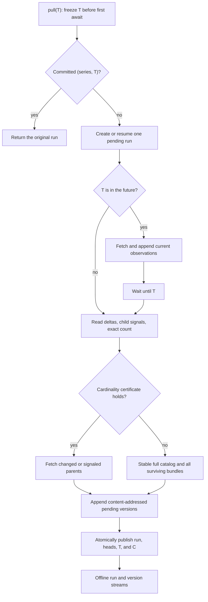

<details>
<summary>Relevant sources</summary>

- [Public archive contract](../gh_puller/github/__init__.py)
- [GitHub API client](../gh_puller/github/client.py)
- [Certified pull algorithm](../gh_puller/github/puller.py)
- [SQLite fact store](../gh_puller/github/store.py)
- [CLI and hourly scheduler](../gh_puller/github/__main__.py)
- [Puller and oracle tests](../tests/test_github_puller.py)
- [Scheduler tests](../tests/test_github_cli.py)

</details>

# GitHub raw fact archive

`gh_puller.github` maintains one SQLite database as the durable source of truth for
GitHub Issues, pull requests, and their related resources. A successful pull proves
catalog completeness, retains every changed raw payload it observes, and publishes
exactly one run for each `(series, T)` idempotency key. Downstream databases can be
rebuilt from that file without GitHub access.



## T is a coverage watermark

`GitHubPuller.pull(T)` is asynchronous and returns only after coverage through T has
been closed and published. T may be any timezone-aware timestamp. If omitted, the
function freezes the call time before its first `await`; if T is in the future, the
puller prefetches available data, waits until T, and performs a final closure pass.

T is not a historical snapshot timestamp. A run may contain facts observed while the
operation was in progress, but it must include every protocol-visible fact produced
through T. The database records actual completion time C separately. The normalized
pair `(series, T)` is the operation's idempotency key: its first success publishes one
run, while every retry returns that original run without an HTTP request or logical
archive-state change. Different series use separate key spaces, so an ad-hoc pull and
the hourly scheduler do not consume each other's invocation record. The returned
`requests` value remains the original run's accumulated request count; the retry
itself adds none. Cancellation, detectable truncation, or an unrecoverable API error
leaves the run pending and publishes nothing; a failed catalog certificate enters the
stable full path.

The pull protocol is independent of hourly scheduling. The optional `series` value is
opaque metadata used to resume a scheduler sequence; neither
[puller.py](../gh_puller/github/puller.py) nor
[client.py](../gh_puller/github/client.py) rounds or otherwise interprets T.

## Certified increments and the exhaustive oracle

Let W be the preceding observation watermark. A certified increment concurrently
reads the root Issue/PR delta since `W - overlap`, the repository Issue-comment delta,
the repository PR-review-comment delta, and the authenticated GraphQL total count.
Root changes and child signals select parent bundles for refresh.

For the catalog proof, let N be the previous number of present objects, A the newly
observed objects with `created_at <= T`, F the objects observed during the request with
`created_at > T`, D the previous objects now absent, and M the exact current total.
GitHub's current catalog satisfies:

```text
M - F = N - D + A
```

The fast path accepts only `M - F = N + A`; comparison with the identity proves
`D = 0`. Additions cannot conceal deletions because A is counted independently.
Duplicate numbers, changed identities, invalid timestamps, unavailable exact counts,
or a failed equality trigger the stable full path. That path scans until two
consecutive catalog membership signatures agree and then refreshes every surviving
bundle.

`catalog_mode="exhaustive"` always uses this stable full path and is the independent
correctness oracle. Tests compare the complete committed version streams produced by
the certified and exhaustive modes after every epoch, not only their final heads. The
coverage includes all small catalog transitions, 5,000-object randomized catalog
churn, and end-to-end randomized Issue/comment additions and deletions. See
[test_github_puller.py](../tests/test_github_puller.py).

When the three REST discovery streams each fit on one page and nothing changed, an
authenticated increment costs three REST calls plus one GraphQL call. Four requests
consume 0.08% of a 5,000-request hourly REST allowance; the cost is independent of
archive size. Cold start concurrently scans the full catalog and obtains its exact
count before fetching all bundles. The API client waits across primary and secondary
rate limits without consuming the network/5xx retry budget, so a cold start may block
across quota windows until it can complete. See
[client.py](../gh_puller/github/client.py) and
[puller.py](../gh_puller/github/puller.py).

## SQLite is the fact boundary

The store separates invocation metadata, payload bytes, object observations, and
current heads:

- `pull_runs` records T, C, first start time, observation watermark, scheduler series,
  request count, and publication status. Partial unique indexes enforce one committed
  row per `(series, T)`, including the unlabeled `series=None` key space.
- `payload_blobs` stores canonical JSON compressed with zlib and addressed by its
  SHA-256 digest. Identical summaries and bundles share one payload.
- `resource_versions` is an append-only observation log. Multiple different payloads
  observed during one future-T operation remain distinct versions.
- `resource_heads` is the atomically maintained current state derived from the last
  committed version of each object.

Version rows belonging to a pending run are durable for crash recovery but excluded
from the public offline iterators. Finalization updates heads and changes the run to
`committed` in one SQLite transaction. A process file lock enforces the single-writer
contract; SQLite uses WAL mode, foreign keys, and `synchronous=FULL`. Interrupted work
resumes the same T and skips bundles already staged with identical content.

Each version retains the unprojected catalog summary and a complete Issue or PR
bundle. Unknown JSON fields are preserved semantically. Issue bundles include detail,
comments, comment reactions, timeline, events, and reactions. PR bundles additionally
include PR detail, reviews, review comments and reactions, commits, files, requested
reviewers, diff, and patch. A tombstone records certified absence without discarding
the last bundle. The protocol boundary excludes linked external attachments and facts
that GitHub had already made unavailable before the archive first observed them.
Storage and decoding are implemented in [store.py](../gh_puller/github/store.py).

Downstream construction requires no token or network access:

```python
from pathlib import Path

from gh_puller.github import iter_runs, iter_versions


async def rebuild(path: Path) -> None:
    runs = [run async for run in iter_runs(path)]
    heads = {}
    async for version in iter_versions(path):
        heads[version.number] = version
```

Folding versions in iterator order reconstructs every committed state. A
`present=False` version is a tombstone; its retained summary and bundle remain
available for mining.

## Run once or on UTC hours

Production operation should provide an authenticated token through the process
environment or the project-root `.env`. `GH_TOKEN` takes precedence over
`GITHUB_TOKEN`:

```dotenv
GH_TOKEN=github_pat_your_token
```

Pull to the call time, or to any explicit timezone-aware T:

```bash
uv run -m gh_puller.github once vllm-project/vllm archives/vllm.sqlite3
uv run -m gh_puller.github once vllm-project/vllm archives/vllm.sqlite3 \
  --target 2026-09-02T20:07:00+08:00
```

Run the built-in UTC hourly sequence:

```bash
uv run -m gh_puller.github hourly vllm-project/vllm archives/vllm.sqlite3
```

Only the `hourly` command chooses whole-hour targets. On first start it selects the
latest reached UTC hour. It then advances by exactly one hour after each committed
run, so rate limiting or cold-start work can delay C without skipping T values. A
restart resumes an hourly pending run before selecting the next hour. A lifecycle
lock rejects a second hourly scheduler for the same database; `SIGINT` and `SIGTERM`
cancel the active operation. Each completion writes one JSON line containing
`run_id`, T, C, lag, request count, and object counts. Scheduler behavior is defined
in [__main__.py](../gh_puller/github/__main__.py) and verified in
[test_github_cli.py](../tests/test_github_cli.py).

## Verify the contract

Run the focused suite from the repository root:

```bash
uv run pytest -q tests/test_github_puller.py tests/test_github_cli.py
uvx ruff check gh_puller/github tests/test_github_puller.py tests/test_github_cli.py
```

The suite also verifies raw-field retention, PR resource coverage, same-second
boundaries, future prefetch history, arbitrary T values, zero-request repeated runs,
rate-limit waits, content deduplication, tombstones, cancellation, durable resume,
concurrent idempotent retries, series isolation, single-writer serialization, and
atomic visibility.
