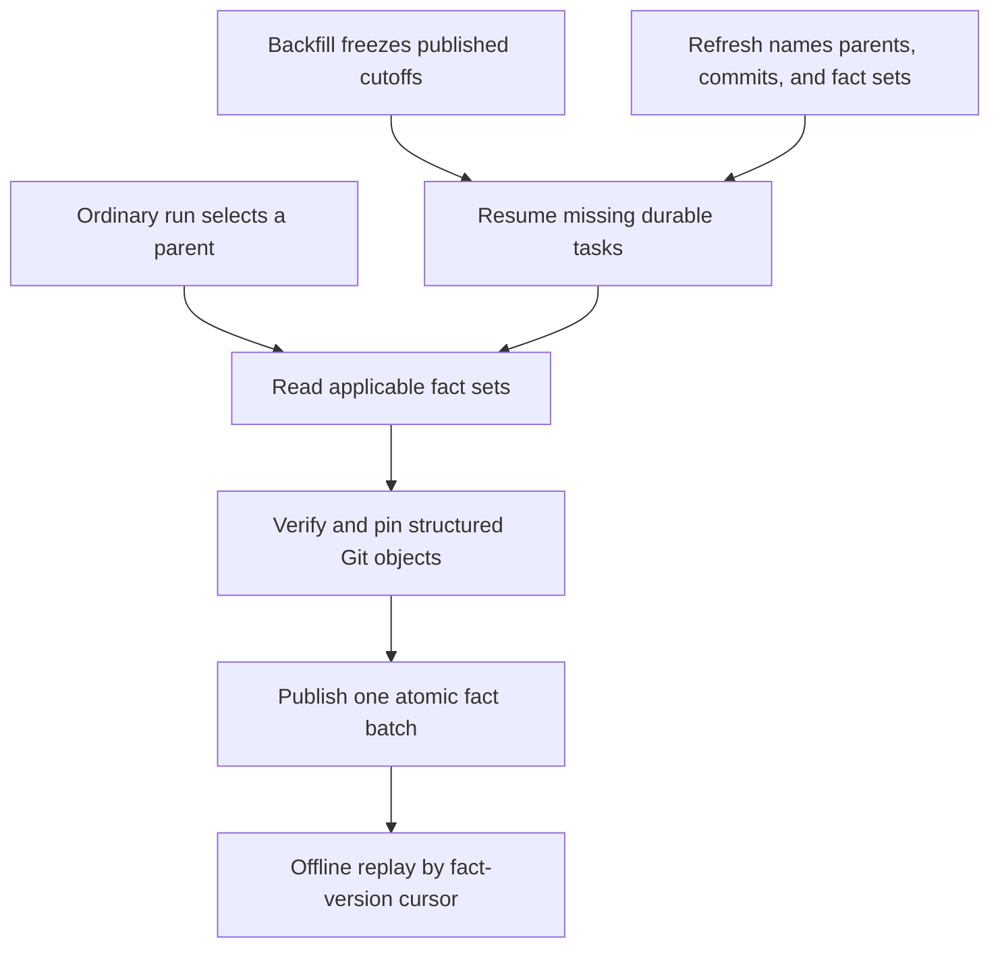

<details>
<summary>Relevant sources</summary>

- [gh_puller/github/](../gh_puller/github/)
- [scripts/](../scripts/)
- [tests/github/](../tests/github/)
</details>

# GitHub supplemental facts

The GitHub archive stores review threads, Issue relations, structured commit
references, Git object availability, and Git ref observations independently from
Issue/PR bundles. This avoids rewriting an old bundle with facts read later while
letting downstream jobs replay every observation without GitHub access.

This page defines that supplemental publication boundary and the two maintenance
operations. The parent-discovery algorithm, ordinary run watermark, bundle format,
and managed service remain defined by the [GitHub raw fact
archive](github-puller.md).

## Independent observations

An Issue/PR bundle and a supplemental fact can have different read times and update
signals. Each fact therefore records its own family, schema version, stable subject,
related parent when applicable, source payload digest, actual read window, coverage
status, and raw evidence. Publishing a new observation appends a version; it does not
change the source bundle or its digest.

The current schema provides these fact families:

| Fact family | Subject | Complete payload means |
| --- | --- | --- |
| `review-threads` | `pull:<number>` | Every GraphQL review thread and nested comment page closed for that PR observation. |
| `issue-relations` | `issue:<number>` | `parent`, `subIssues`, `blockedBy`, and `blocking` were fully read for that Issue observation. |
| `commit-references` | `<source-kind>:<payload-digest>` | Every contract-defined commit field in that immutable source payload was enumerated. |
| `commit-object` | `commit:<oid>` | The named commit and root tree are available in the companion Git store and protected by an immutable ref. |
| `git-refs` | `repository` | One discrete native ref map, symbolic HEAD, default branch, and direct/peeled tag observation. |

`review-threads` retains the native thread-to-comment hierarchy. Thread identity,
subject type, path, diff sides, current and original line ranges, outdated/resolved
state, resolver, and the selected comment fields remain in the GraphQL source nodes.
REST review comments cannot independently prove thread membership or resolution, so
R1 completeness requires the GraphQL operation.

`issue-relations` preserves member order and cross-repository target identity. An
empty connection is a complete empty observation only after its pagination contract
has closed; a missing fact is not an empty relation set.

Structured commit extraction follows only known API fields: PR commit entries,
review and review-comment commit fields, semantically explicit timeline/event commit
fields, and review-thread comment commit fields. It does not guess from prose, URLs,
or arbitrary hexadecimal text. Each occurrence retains the source digest, parent,
field path, source object kind, and source object ID.

Sources: [gh_puller/github/queries.py](../gh_puller/github/queries.py); [gh_puller/github/commit_references.py](../gh_puller/github/commit_references.py)

## Coverage and publication

Coverage belongs to one attempted operation, not to the repository forever:

| Status | Meaning |
| --- | --- |
| `complete` | The declared operation closed completely; a valid empty collection also uses this state. |
| `null` | GitHub explicitly returned null for the declared field contract. |
| `partial` | Only the stated subset is available. |
| `forbidden` | The active identity could not read the target. |
| `unavailable` | The checked upstream paths could not supply the target; a later refresh may retry it. |
| `failed` | The attempt produced no valid fact conclusion. |

Internal work can also be `pending`, but pending work is not a published GitHub fact.
A failed, forbidden, unavailable, or partial attempt remains replayable without
replacing the last `complete` or `null` observation. Fact heads are selected by the
actual observation time, so an older fact staged in a normal run cannot displace a
newer explicit refresh merely because the normal run publishes later.

One `fact_batch` is the atomic replay unit. A durable task publishes its primary
observation and any derived commit-reference or commit-object observations together.
Git objects and their protection refs are verified before the SQLite batch becomes
visible. Batches from a normal pull become visible with that run; maintenance batches
publish independently and do not advance the ordinary discovery watermark `W`.

Task completion and data availability answer different questions. A
`commit-references` task can complete after enumerating every SHA while some related
`commit-object` observations remain `unavailable`. Repository coverage reports must
keep those counts separate.

Sources: [gh_puller/github/store.py](../gh_puller/github/store.py); [gh_puller/github/git_store.py](../gh_puller/github/git_store.py)

## Three ways facts are produced



An ordinary run reads review threads whenever it selects a PR and Issue relations
whenever it selects an Issue. It also scans the selected bundle and a successful new
thread payload for structured commits, then records the native Git ref observation
made by that pass. This preserves the existing discovery boundary: a child-only
change that never selects its parent is not promised to be found.

A backfill creates a one-time coverage baseline over two immutable boundaries:

- the greatest published `resource_versions.id`, which fixes the historical bundle
  population;
- the greatest preexisting `fact_versions.id`, which fixes supplemental sources
  already available when planning begins.

The scope records the requested fact schema versions, population count, canonical
population digest, already-covered count, and scheduled missing-task count. Every
distinct historical bundle is scanned, not only the current resource head. Every
archived PR or Issue missing the requested current fact gets one live R1 or R3
observation. A newly read R1 payload and its structured commit scan publish in the
same task, even though its digest was unknowable when the task population was frozen.

Tasks are consumed in bounded batches. Commit sources in a batch share one unioned
Git verification step; parent GraphQL reads use the configured concurrency. A
cancelled process publishes no half-batch. Repeating the command resumes the pending
job and does not repeat completed tasks. A later archive cutoff can create another
baseline without changing the meaning of an earlier complete scope.

An explicit refresh does not scan the repository. It names the PRs, Issues, commits,
and fact groups to observe. The normalized target `T` plus that canonical selection
is its idempotency identity: retrying the same explicit `T` returns or resumes the
same job, while a new `T` records a new observation. With no target, a pending job
for the same selection is resumed; otherwise the invocation time becomes the new
target. A future target waits until that time before reading.

Sources: [gh_puller/github/maintenance.py](../gh_puller/github/maintenance.py); [tests/github/test_maintenance.py](../tests/github/test_maintenance.py)

## Run maintenance

Schema 9 adds the fact publication and durable-task relations without rewriting old
payloads or clearing a pending normal run. Migrate the stopped writer locally:

```bash
scripts/github-puller-daemon.sh stop archives/repository.sqlite3
uv run -m gh_puller.github migrate archives/repository.sqlite3
```

The initial archive must have published at least one ordinary run before a backfill
can define a resource cutoff. A later pending normal run may remain in SQLite: the
archive lock, rather than the absence of durable pending work, enforces one active
writer. Keeping the service stopped prevents its long-lived scheduled call from
holding that lock while maintenance runs.

Run all four fact groups over the published history:

```bash
uv run -m gh_puller.github backfill \
  owner/repository archives/repository.sqlite3
```

`--fact` is repeatable and accepts `reviews`, `relations`, `commits`, or `refs`.
Omitting it selects all groups. `--batch-size` controls the atomic durable-task batch
and defaults to 8; `--concurrency` controls simultaneous parent API reads and also
defaults to 8.

Refresh selected research objects without repository discovery:

```bash
uv run -m gh_puller.github refresh \
  owner/repository archives/repository.sqlite3 \
  --pull 24324 --issue 4395 \
  --fact reviews --fact relations
```

Retry a structured commit that was previously unavailable:

```bash
uv run -m gh_puller.github refresh \
  owner/repository archives/repository.sqlite3 \
  --commit bacd2c61997591d12d9e5a86ec87c5b0c98e3b3a \
  --fact commits
```

The final stdout object reports the job identity, target, task counts, and completion
time. Progress and API wait events use stderr; `--no-progress` suppresses them. After
maintenance, restart the managed schedule. It resumes the preserved normal target
and tasks:

```bash
scripts/github-puller-daemon.sh start archives/repository.sqlite3
```

`status DATABASE` continues to show the normal run from journald and adds durable
`FACT ...` rows from SQLite: frozen scope, task progress, primary outcomes, per-family
data outcomes, next task, latest attempt, latest success, update time, and retryable
error. The selector-free status table remains narrow.

Sources: [gh_puller/github/__main__.py](../gh_puller/github/__main__.py); [scripts/](../scripts/)

## Offline replay

`fact_versions.id` is the stable global cursor and `fact_batches.id` identifies the
atomic publication unit. `iter_facts` streams only published observations in cursor
order:

```python
from pathlib import Path

from gh_puller.github import iter_facts


async def consume(database: Path, cursor: int = 0) -> int:
    async for fact in iter_facts(database, after=cursor):
        await index(fact)
        cursor = fact.id
    return cursor
```

Restarting from the last committed cursor yields the same suffix as an uninterrupted
scan. Consumers that need transaction-level checkpoints should advance past all rows
with the same `batch_id` together.

The SQL views expose two different heads:

```bash
uv run -m sqlite3 archives/repository.sqlite3 \
  'SELECT * FROM current_facts ORDER BY fact_kind, subject_key;'

uv run -m sqlite3 archives/repository.sqlite3 \
  'SELECT * FROM latest_fact_attempts ORDER BY fact_kind, subject_key;'
```

`current_facts` is the last successful observation for each subject.
`latest_fact_attempts` includes the most recent outcome, so a consumer can report a
failed refresh and the age of the earlier successful fact at the same time. Payloads
remain canonical JSON in `payload_blobs`; join through `payload_digest` when reading
SQL directly.

Available structured commits are protected at
`refs/github-archive/commits/<oid>`. Standard Git commands can read their commit,
tree, blob, parent history, and diffs offline. An `unavailable` observation makes no
claim that every possible upstream identity will remain unable to provide the object;
a later explicit refresh can append a successful result.
