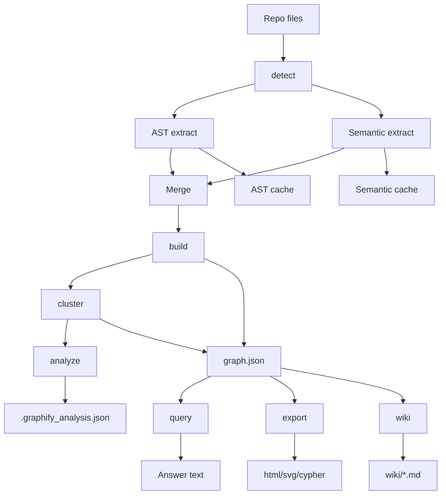
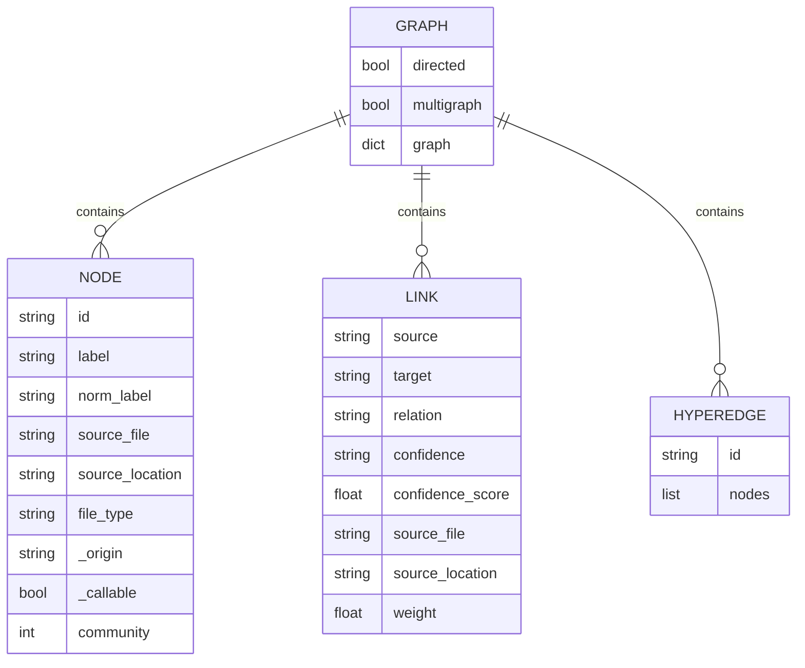
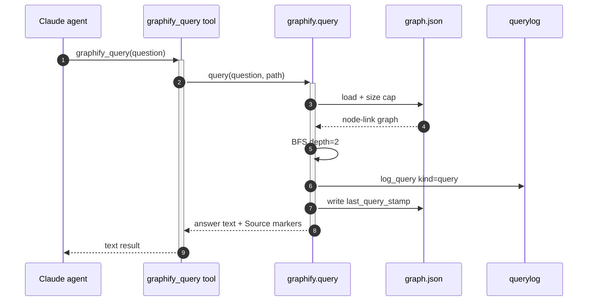
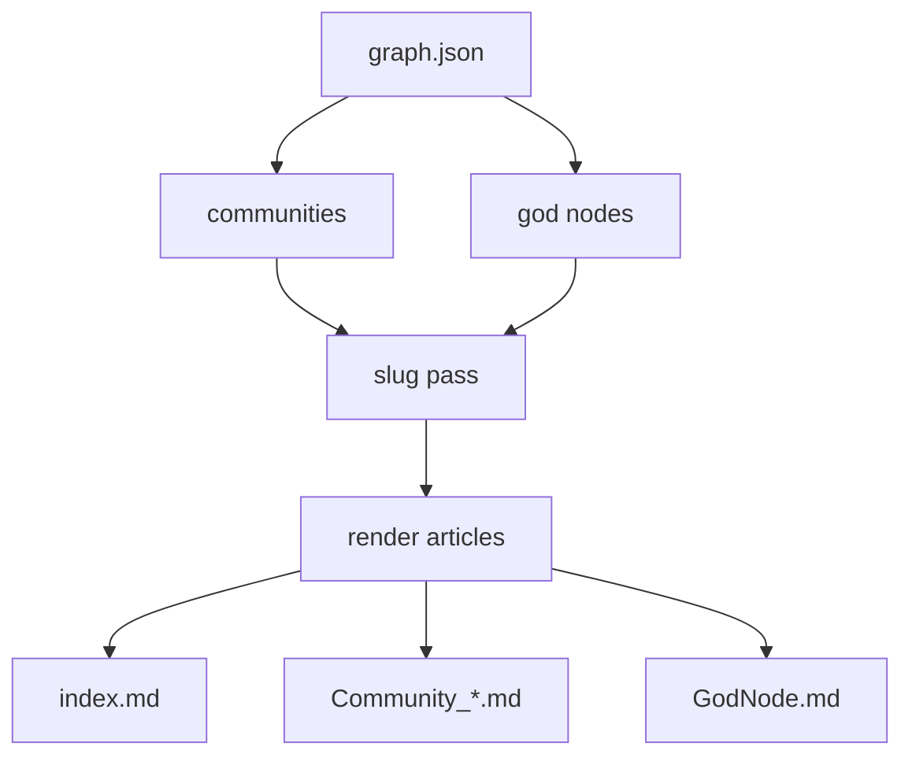
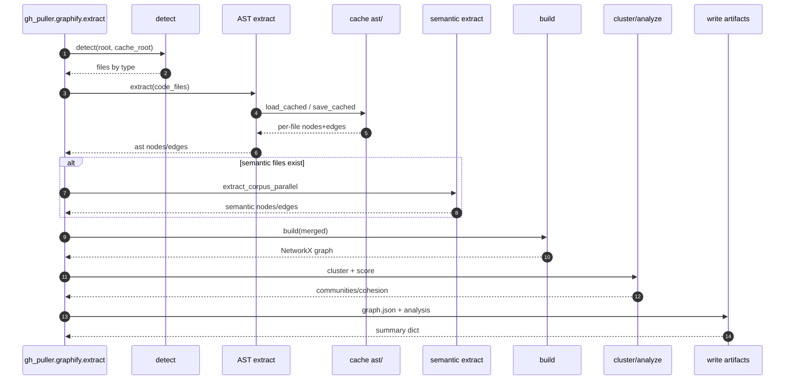

<details>
<summary>Relevant source files</summary>

The following files were used as context for generating this wiki page:

- [app.py](app.py)
- [graphify-out/cache/ast/v0.9.48-s2/2f12b9e11244b05ff1c3e415cbee94f84034b983529d1d8c7161c5456a901eb0.json](graphify-out/cache/ast/v0.9.48-s2/2f12b9e11244b05ff1c3e415cbee94f84034b983529d1d8c7161c5456a901eb0.json)
- [graphify-out/graph.json](graphify-out/graph.json)
- [graphify-out/.graphify_analysis.json](graphify-out/.graphify_analysis.json)
- [gh_puller/graphify.py](gh_puller/graphify.py)
- [gh_puller/deepwiki.py](gh_puller/deepwiki.py)
- [graphify/extract.py](graphify/extract.py)
- [graphify/detect.py](graphify/detect.py)
- [graphify/cache.py](graphify/cache.py)
- [graphify/build.py](graphify/build.py)
- [graphify/export.py](graphify/export.py)
- [graphify/analyze.py](graphify/analyze.py)
- [graphify/cluster.py](graphify/cluster.py)
- [graphify/paths.py](graphify/paths.py)
- [graphify/serve.py](graphify/serve.py)
- [graphify/querylog.py](graphify/querylog.py)
- [graphify/wiki.py](graphify/wiki.py)
- [graphify/ids.py](graphify/ids.py)
- [graphify/cli.py](graphify/cli.py)
</details>

# Graphify Pipeline: Data Flow

The Graphify pipeline turns a repository's raw files into a persistent, queryable code graph (`graphify-out/graph.json`), an analysis file (`.graphify_analysis.json`), and a set of per-file extraction caches, then serves that graph to consumers: pure-local graph traversal queries, rendered exports (HTML/SVG/Cypher/tree/callflow), and a Wikipedia-style wiki. In this project the pipeline is driven in-process by `gh_puller/graphify.py`, a thin wrapper over the `graphify` library that reproduces the three CLI commands (`extract` / `export` / `query`) as callable module functions, with `graphify/cli.py` as the authority for defaults and output file sequences. Sources: [gh_puller/graphify.py:1-19](), [graphify/extract.py:1]()

The pipeline is exercised end-to-end on a tiny corpus whose every artifact is part of this page's evidence: `app.py` (a single-file corpus containing `main()`), its AST cache entry, `graphify-out/graph.json` (2 nodes, 1 `contains` edge, 1 community), and `graphify-out/.graphify_analysis.json`. The product path uses the graph as the index behind a DeepWiki-compatible backend — see [DeepWiki-Compatible Backend](#deepwiki-compatible-backend), [REST Protocol v1](#rest-protocol-v1), and [Configuration Reference](#configuration-reference) for the surrounding system. Sources: [app.py](), [graphify-out/graph.json](), [graphify-out/.graphify_analysis.json](), [gh_puller/deepwiki.py:1-9]()

## 1. Pipeline Overview

The pipeline is a fixed sequence of stages: **detect → AST extract → semantic extract (optional) → merge → build → cluster/analyze → persist → consume**. The first six stages are pure functions over the repository; only semantic extraction touches an LLM; and everything downstream of `graph.json` (query, export, wiki) is local and key-free. Sources: [gh_puller/graphify.py:180-186]()



The wrapper's `extract()` mirrors this exactly and returns a JSON-serializable summary carrying the artifact paths, node/edge/community counts, token accounting, semantic-cache hit/miss counts, an `incomplete` flag, elapsed time, and an `error` slot that degrades instead of raising. Sources: [gh_puller/graphify.py:201-213]()

### Entry points

| Entry point | Command / function | Notes |
|---|---|---|
| CLI | `graphify extract [<path>]` | Full pipeline; supports incremental mode via `manifest.json`, `detect_incremental` and `build_merge`. Sources: [graphify/cli.py:3128-3160]() |
| In-process | `gh_puller.graphify.extract(path, ...)` | Full-scan only (no incremental); explicit path args everywhere; same defaults as the CLI branches. Sources: [gh_puller/graphify.py:13-19](), [gh_puller/graphify.py:158-186]() |
| CLI | `graphify export <format>` / `graphify tree` | HTML, SVG, FalkorDB (local `cypher.txt` or push), tree HTML, callflow HTML. Sources: [gh_puller/graphify.py:463-485]() |
| In-process | `gh_puller.graphify.export(format, ...)` | One library function per format; exceptions degrade to an `{"error": ...}` dict. Sources: [gh_puller/graphify.py:480-484]() |
| CLI | `graphify query "<question>"` | Undirected BFS/DFS traversal, local, no API key. Sources: [gh_puller/graphify.py:553-566]() |
| In-process | `gh_puller.graphify.query(question, ...)` | Same traversal, wrapped as a `graphify_query` MCP tool for Claude agents. Sources: [gh_puller/deepwiki.py:1071-1091]() |

## 2. Stage 1: Detection and Classification

`detect()` walks the repository with `os.walk` and classifies every file into `FileType` buckets (code / document / paper / image / video), producing the per-type file lists that drive the rest of the pipeline. Sources: [graphify/detect.py:1515-1546]()

Key behaviors, all visible in the scan loop:

- **Ignore rules**: `.graphifyignore` and `.gitignore` patterns are loaded per directory (a nested ignore file governs its own subtree), `--exclude` patterns are anchored at the scan root and win last, and git-tracked-path keys are consulted only when gitignore patterns actually contribute. Sources: [graphify/detect.py:1565-1583]()
- **Noise pruning**: framework caches and noise directories are pruned in place before `os.walk` descends; the configured output dir itself is carved out of the scan and recorded as `pruned_noise`. Source: [graphify/detect.py:1648-1681]()
- **Error visibility**: `os.walk` errors (permission, racing writes) are recorded into `walk_errors` instead of silently dropping subtrees — a partial enumeration downstream becomes a partial graph, so it must be visible. Sources: [graphify/detect.py:1606-1622]()
- **Classification**: `classify_file()` decides code vs. document/paper/image; unknown extensions land in `unclassified` and are skipped with a count logged. Sources: [graphify/detect.py:504](), [gh_puller/graphify.py:236-239]()
- **Word-count caching**: word counts for PDF/docx/text files (used to size the semantic corpus) go through the same stat-index fastpath as file hashes, so unchanged binaries are not re-parsed per run. Sources: [graphify/detect.py:1549-1555](), [graphify/cache.py:519-555]()

The detect result feeds `extract()`'s classification, which splits code files (AST-bound) from semantic files (docs/papers/images) and logs an `--code-only` skip count when non-code files exist. Sources: [gh_puller/graphify.py:219-235]()

## 3. Stage 2: AST Extraction

AST extraction is the deterministic, pure-local half of the pipeline: tree-sitter-based per-file parsing that emits nodes and edges, plus cross-file import/type resolution. Sources: [graphify/extract.py:1](), [graphify/extract.py:5470-5486]()

### 3.1 Cache-first, keyed by content hash

Every file is checked against the per-file cache before parsing. The cache key is:

```python
h = hashlib.sha256()
h.update(content)        # file bytes (frontmatter-stripped for .md)
h.update(b"\x00")
h.update(salt.encode())  # path relative to scan root
digest = h.hexdigest()
```

Sources: [graphify/cache.py:414-504]()

The corpus artifact confirms the derivation exactly: hashing `app.py`'s bytes (`def main():\n    print("hello e2e")\n`) plus `app.py` as the salt yields `2f12b9e1…a901eb0`, the cache filename. Sources: [graphify-out/cache/ast/v0.9.48-s2/2f12b9e11244b05ff1c3e415cbee94f84034b983529d1d8c7161c5456a901eb0.json](), [app.py]()

Because AST entries are the output of graphify's own extractor code, they are namespaced by package version and key schema: `graphify-out/cache/ast/v{version}-s{schema}/`, and sibling version dirs are swept on first use. Semantic entries are deliberately **not** versioned (they are LLM output, and re-billing on every release is unacceptable); they live under `cache/semantic/`, with a `p{prompt-fingerprint}/` namespace when the extraction prompt is known, and `cache/semantic-deep/` for deep mode. Sources: [graphify/cache.py:21-38](), [graphify/cache.py:71-81](), [graphify/cache.py:892-921]()

The corpus's `v0.9.48-s2` directory is exactly this encoding: graphifyy version `0.9.48`, cache schema `2`. Sources: [graphify/cache.py:30-38]()

### 3.2 The cached entry stores portable, placeholder IDs

The cache entry holds nodes with storage-encoded ids — absolute-root-derived prefixes are collapsed to a `$graphify-root$` marker on write and re-anchored to the **current** root on read, so a replay reproduces what a cold run under the current root would mint. Sources: [graphify/cache.py:677-685](), [graphify/cache.py:714-774]()

The corpus entry shows both ids in marker form:

```json
{"nodes": [{"id": "$graphify-root$_app_py", "label": "app.py", "file_type": "code",
  "source_file": "app.py", "source_location": "L1"},
  {"id": "$graphify-root$_app_main", "label": "main()", "file_type": "code",
  "source_file": "app.py", "source_location": "L1", "_callable": true}],
 "edges": [{"source": "$graphify-root$_app_py", "target": "$graphify-root$_app_main",
  "relation": "contains", "confidence": "EXTRACTED", "source_file": "app.py",
  "source_location": "L1", "weight": 1.0}],
 "raw_calls": []}
```

Sources: [graphify-out/cache/ast/v0.9.48-s2/2f12b9e11244b05ff1c3e415cbee94f84034b983529d1d8c7161c5456a901eb0.json]()

After merging, `extract()` remaps those ids to the canonical spec form `{parent_dir}_{stem}` (top-level files collapse to a bare stem), which is why the final graph has `app` and `app_main` rather than the marker forms. Sources: [graphify/extract.py:5794-5800](), [graphify/extract.py:182-189](), [graphify/ids.py:86-93]()

### 3.3 Dispatch, parallelism, and failure surfacing

The extractor for each file is chosen by `_get_extractor()`: filename-first routing for MCP configs and package manifests, ambiguous-suffix sniffing for ObjC/C++ headers and `.m`, shebang dispatch for extensionless files, then the per-suffix dispatch table. Sources: [graphify/extract.py:5195-5264]()

Uncached files are extracted either in a `ProcessPoolExecutor` (when `max_workers` is unset it scales to the full CPU, bounded by `len(uncached_work)`, and honors `GRAPHIFY_MAX_WORKERS`) or sequentially for small batches; below the `_PARALLEL_THRESHOLD = 20` cut-off the sequential path is used. Each worker checks the cache first, never caches a zero-node result for an extractable file, and wraps extraction in `_safe_extract` so a recursive/parse failure degrades to a per-file `{"nodes": [], "edges": [], "error": ...}` rather than aborting the batch. Sources: [graphify/extract.py:5298-5318](), [graphify/extract.py:5431-5440](), [graphify/extract.py:5467](), [graphify/extract.py:5251-5297](), [graphify/extract.py:168-179]()

The batch then surfaces every silent-loss mode explicitly, grouped and counted: files with no extractor despite a code extension (#1689), extractors whose optional dependency is missing (#1745), extractors that returned zero nodes (#1666), and files with syntax errors that may be partially extracted (#2551). Sources: [graphify/extract.py:5608-5626](), [graphify/extract.py:5657-5677](), [graphify/extract.py:5687-5713](), [graphify/extract.py:5716-5768]()

## 4. Stage 3: Semantic Extraction (LLM, optional)

When document/paper/image files exist and `code_only` is not set, the pipeline runs an LLM-backed semantic pass on the uncached files:

1. A backend is resolved (`backend` argument, else `detect_backend()`), validated against the known `BACKENDS`, and its API key check runs before any work. Sources: [gh_puller/graphify.py:270-283]()
2. The extraction prompt is fingerprinted — the prompt is part of the semantic cache key, so reads and writes must use the same prompt or entries never match. Sources: [graphify/cache.py:71-81](), [graphify/cache.py:100-120](), [gh_puller/graphify.py:284-296]()
3. `check_semantic_cache()` splits files into cached (merged directly) and uncached (need LLM) sets; partial entries (truncated LLM responses) are treated as misses so they self-heal. Sources: [graphify/cache.py:1187-1201](), [graphify/cache.py:984-994]()
4. Uncached files go through `extract_corpus_parallel()` under a token budget; results are stamped into `save_semantic_cache()` **before** partial markers are stripped, so internal markers never leak into `graph.json`. Sources: [gh_puller/graphify.py:305-354]()
5. Failure accounting: a fully-failed semantic pass marks the run `incomplete`; a run where every chunk failed raises; partial chunk failure is recorded, and the write-guard then refuses to overwrite a complete graph with a partial one unless `allow_partial`. Sources: [gh_puller/graphify.py:327-338](), [gh_puller/graphify.py:418-428]()

The corpus run is `code_only`, so the semantic set is empty, the cache reports `0 hits / 0 misses`, and both token counters stay at zero — the cheapest possible pipeline pass. Sources: [gh_puller/graphify.py:228-235](), [graphify-out/.graphify_analysis.json]()

## 5. Stage 4: Merge and Build

Merging concatenates AST results first and semantic results second (semantic node attributes win on conflicts), then `build()` turns the merged dictionaries into a NetworkX graph. Sources: [gh_puller/graphify.py:356-363](), [graphify/build.py:1340-1370]()

The build does, in order:

- **Dedup**: with `dedup=True` (default), entity deduplication runs before graph construction — numeric ids are string-coerced, legacy field aliases folded, then `deduplicate_entities()` picks a deterministic survivor per shared id and retains missing attributes across duplicates; an optional LLM backend resolves ambiguous Jaro-Winkler pairs in the 75–92 score zone. Sources: [graphify/build.py:1371-1389](), [graphify/build.py:1353-1361]()
- **Node/edge construction**: `build_from_json()` coerces ids, normals source files against the scan root, resolves alias competition between IDs, and validates hyperedge members against the built node set (dropping dangling members, or the whole hyperedge when nothing survives). Sources: [graphify/build.py:798](), [graphify/build.py:1270-1331]()
- **Label disambiguation**: colliding-basename file nodes get a directory-qualified display label; ids and edges are untouched. Sources: [graphify/build.py:402-421](), [graphify/build.py:1332-1337]()
- **Direction preservation**: though the default graph is undirected, the true endpoint order is stashed in `_src`/`_tgt` so `to_json` can restore real call direction on export. Sources: [gh_puller/graphify.py:92-122](), [graphify/export.py:343-351]()

A raw path exists when `no_cluster=True`: it applies `dedupe_nodes`/`dedupe_edges`, label disambiguation and `source_file` back-fill directly, then writes `graph.json` with the same shrink guard. Sources: [gh_puller/graphify.py:375-399]()

## 6. Stage 5: Clustering and Analysis

`cluster()` partitions the graph into communities; the wrapper then computes cohesion, god nodes, and surprising connections. Sources: [gh_puller/graphify.py:407-417]()

- **Partitioning**: Leiden (graspologic) when installed, falling back to Louvain (networkx); output is deterministic (`random_seed=42`, one trial), resolution above 1.0 yields more/smaller communities, and library stdout/stderr is suppressed to keep ANSI escape codes out of terminals. Sources: [graphify/cluster.py:22-77]()
- **Structural handling**: oversized communities (>25% of nodes, min 10) are re-split with a second pass; isolates become single-node communities; optional hub exclusion removes super-hubs from partitioning and reattaches them by majority-vote neighbour community. Sources: [graphify/cluster.py:80-83](), [graphify/cluster.py:195-230]()
- **Cohesion**: `score_all()` returns a per-community cohesion score mapped by community id. Sources: [graphify/cluster.py:268-269]()
- **God nodes**: the top-N most-connected real entities, excluding synthetic file/method-stub nodes, JSON key nodes, and a builtin-noise label set (stdlib types, mock names, framework symbols). Sources: [graphify/analyze.py:109-130](), [graphify/analyze.py:63-89](), [graphify/analyze.py:11-29]()
- **Surprising connections**: cross-file edges between real entities (sorted ambiguous → inferred → extracted) for multi-file corpora; cross-community bridges via betweenness for single-file corpora — concept nodes are excluded since they are intentional, not discovered. Sources: [graphify/analyze.py:133-162](), [graphify/analyze.py:165-181]()

The analysis artifacts are non-fatal: failures degrade to empty lists, matching the CLI. The corpus shows a one-community graph with perfect cohesion and no gods/surprises:

```json
{
  "communities": {"0": ["app", "app_main"]},
  "cohesion": {"0": 1.0},
  "gods": [],
  "surprises": [],
  "tokens": {"input": 0, "output": 0}
}
```

Sources: [graphify-out/.graphify_analysis.json](), [gh_puller/graphify.py:409-417](), [gh_puller/graphify.py:441-451]()

## 7. Stage 6: Persistence — the `graphify-out/` Artifacts

### 7.1 Output directory

The output directory is `graphify-out` by default, overridable with `GRAPHIFY_OUT` (relative name or absolute path), and its name is read once at import time — callers must set the env var before the process starts. The wrapper anchors output at `<path>/<GRAPHIFY_OUT>` (the `--out` semantics), never at the shell's cwd. Sources: [graphify/paths.py:1-26](), [graphify/paths.py:292-301](), [gh_puller/graphify.py:190-193]()

All writes are atomic: a temp file is created in the same directory, `os.replace`d into place, mode-matched to the destination, and cleaned up on failure — a mid-write kill never truncates a good `graph.json`. Sources: [graphify/paths.py:29-88](), [graphify/paths.py:96-101]()

### 7.2 `graph.json` schema (node-link format)

`to_json()` serializes the NetworkX graph in node-link form with community ids stamped onto every node, `norm_label` derived for search, `confidence_score` filled from defaults, canonical key ordering, and `built_at_commit` attached when a git commit is resolvable (absent for the non-git corpus). Sources: [graphify/export.py:323-341](), [graphify/export.py:366-411]()



The corpus graph is the minimal instantiation of that schema: two nodes — the file node `app` and callable `main()` (`app_main`) — joined by one `contains` edge, with an empty `hyperedges` list. Sources: [graphify-out/graph.json]()

```json
{
  "directed": false,
  "multigraph": false,
  "graph": {},
  "nodes": [
    {"id": "app_main", "label": "main()", "_callable": true, "_origin": "ast",
     "community": 0, "file_type": "code", "norm_label": "main()",
     "source_file": "app.py", "source_location": "L1"},
    {"id": "app", "label": "app.py", "_origin": "ast", "community": 0,
     "file_type": "code", "norm_label": "app.py",
     "source_file": "app.py", "source_location": "L1"}
  ],
  "links": [
    {"source": "app", "target": "app_main", "relation": "contains",
     "_origin": "ast", "confidence": "EXTRACTED", "confidence_score": 1.0,
     "source_file": "app.py", "source_location": "L1", "weight": 1.0}
  ],
  "hyperedges": []
}
```

Sources: [graphify-out/graph.json]()

### 7.3 Shrink guard and side files

Before overwriting, the pipeline refuses to let a partial result replace a larger complete graph: `to_json()` compares node counts (fail-safe on an unparseable existing file), and the raw path checks `existing_graph_node_count` with the same intent — `allow_partial` is the only escape hatch. A `.graphify_root` marker records the scan root for later relative deletion, and a `.graphify_semantic_marker` records semantic output tokens. The corpus carries both `graph.json`/`.graphify_analysis.json` and the `.graphify_root` + `cache/last_query_stamp` side files. Sources: [graphify/export.py:266-321](), [gh_puller/graphify.py:385-396](), [gh_puller/graphify.py:432-440](), [gh_puller/graphify.py:589-594]()

## 8. Stage 7: Query — Consuming the Graph

`query()` loads `graph.json` (existence → `.json` suffix → size cap → `links`/`edges` normalization) and runs an **undirected** traversal, so both callers and callees are explored and call-side results are never lost. Sources: [gh_puller/graphify.py:92-122](), [gh_puller/graphify.py:553-566]()

The graphify_query tool output for this corpus shows the exact answer envelope:

```
Graph: /tmp/e2e-corpus/graphify-out/graph.json (2 nodes) | Traversal: BFS depth=2 | Start: ['main()'] | 2 nodes found
...
```

Sources: [graphify/serve.py:1218-1240]()

Internally, `_query_graph_text()` scores the graph once for the combined ranking and per-term winners, drops relational-intent verbs from the per-term seed guarantee, picks seeds by gap-based selection, applies resolved context filters, traverses with `_bfs`/`_dfs` to the requested depth, and renders the subgraph under the token budget with seeds first so they survive truncation. Sources: [graphify/serve.py:1205-1240]()



Each query is logged best-effort as one JSONL line — opt-in only, because a default-on record of proprietary queries contradicts graphify's on-device, no-telemetry posture — and the `cache/last_query_stamp` is touched so watchers can tell the graph is warm. Sources: [graphify/querylog.py:1-31](), [graphify/querylog.py:43-80](), [gh_puller/graphify.py:582-594]()

In the product backend, this function is exposed to Claude Code agents as an in-process MCP server tool (`graphify_query`) whose closure binds the repo's graph path, and whose answer carries `Source: <file path> L<line number>` citations the agent can reason over. Sources: [gh_puller/deepwiki.py:1071-1091]()

## 9. Stage 8: Exports and Wiki

The same graph fans out into human-facing renderings and wiki articles. Each format maps to one library function and requires `graph.json` to already exist; failures degrade to `{"error": ...}` dictionaries. Sources: [gh_puller/graphify.py:480-484]()

| Format | Function | Default output | Notes |
|---|---|---|---|
| `html` | `to_html` | `graph.html` | Aggregated view; oversized graphs degrade to community view instead of failing. Sources: [gh_puller/graphify.py:521-529]() |
| `svg` | `to_svg` | `graph.svg` | Requires graph + communities. Sources: [gh_puller/graphify.py:531-534]() |
| `falkordb` | `push_to_falkordb` | — | With `push_uri`: push to FalkorDB; without: local `cypher.txt` via `to_cypher`. Sources: [gh_puller/graphify.py:536-546]() |
| `tree` | `write_tree_html` | `GRAPH_TREE.html` | Tree view; library defaults for `max_children`. Sources: [gh_puller/graphify.py:498-504]() |
| `callflow-html` | `write_callflow_html` | derived from `GRAPH_REPORT.md` | Call-flow diagram with section limits. Sources: [gh_puller/graphify.py:505-515]() |

Communities and labels are reconstructed from `.graphify_analysis.json` (the normative source), with node-level `community` attributes as a fallback for post-commit/watch rebuild paths that do not regenerate it, and `.graphify_labels.json` for labels. Sources: [gh_puller/graphify.py:125-155]()

`to_wiki()` generates a Wikipedia-style wiki into `graphify-out/wiki/`: `index.md` (entry point catalog) plus one article per community and one per god node. It refuses to run on an empty community set, filters stale node IDs that drifted out of the graph, clears stale `.md` files from previous runs (LLM-generated community labels are non-deterministic), slugs every article before rendering so articles can link to one another, and returns the article count. Sources: [graphify/wiki.py:264-320](), [graphify/wiki.py:361-396]()



## 10. Orchestration: Wrapper vs. CLI

`gh_puller/graphify.py` is a thin wrapper that ports the three CLI commands to module functions; parameter defaults, the output directory, and the file sequence all follow the matching `dispatch_command` branches in `graphify/cli.py`. Every library call uses explicit path arguments so no function depends on cwd or the import-time `GRAPHIFY_OUT` snapshot; LLM credentials come entirely from environment variables and are never accepted or persisted by the wrapper. Sources: [gh_puller/graphify.py:1-11](), [graphify/cli.py:832-838]()

Documented simplifications vs. the CLI: full-scan only (no `detect_incremental`/`build_merge`/`save_manifest`), no postgres/cargo/google-workspace/`--global`/`--dedup-llm` support, no `GRAPH_REPORT.md` or `.graphify_labels.json` generation. Sources: [gh_puller/graphify.py:13-19]()



### Environment variables

| Variable | Default | Effect |
|---|---|---|
| `GRAPHIFY_OUT` | `graphify-out` | Output directory name (relative or absolute), read at import time. Sources: [graphify/paths.py:26]() |
| `GRAPHIFY_MAX_WORKERS` / `GRAPHIFY_API_TIMEOUT` | unset | AST worker count / semantic API timeout, re-exported to the library layer by the wrapper. Sources: [gh_puller/graphify.py:196-200]() |
| `GRAPHIFY_QUERY_LOG` / `_ENABLE` / `_RESPONSES` | off | Opt-in JSONL query log; `_DISABLE=1` forces it off. Sources: [graphify/querylog.py:15-35]() |
| `GRAPHIFY_MTIME_GRANULARITY_MS` | 2000 | Stat-index racy-clean guard granularity. Sources: [graphify/cache.py:209-236]() |
| `FALKORDB_PASSWORD` | unset | Password for `export("falkordb", push_uri=...)`. Sources: [gh_puller/graphify.py:477-479]() |

Backend/model keys (`OPENAI_API_KEY`, `OPENAI_BASE_URL`, `OPENAI_MODEL`, …) are read by the graphify library layer; the wrapper neither receives nor stores them. Sources: [gh_puller/graphify.py:8-10]()

## Summary

The Graphify pipeline is a linear, cache-sandwiched data flow: `detect` classifies the corpus → per-file AST extraction (content-hash-keyed, version-namespaced caches) → optional LLM semantic extraction (prompt-fingerprinted caches) → merge → build into a NetworkX graph → Leiden/Louvain clustering plus god-node and surprise analysis → atomic persistence of `graph.json` and `.graphify_analysis.json` under `graphify-out/`. From there, local consumers take over: undirected BFS/DFS queries with source citations, deterministic exports (HTML/SVG/Cypher/tree/callflow), and wiki article generation — with the in-process wrapper in `gh_puller/graphify.py` making the whole pipeline callable without a CLI subprocess and exposing it to Claude agents as the `graphify_query` tool. Sources: [gh_puller/graphify.py:180-186](), [gh_puller/graphify.py:463-485](), [gh_puller/graphify.py:553-566](), [gh_puller/deepwiki.py:1071-1091](), [graphify/wiki.py:264-280]()
