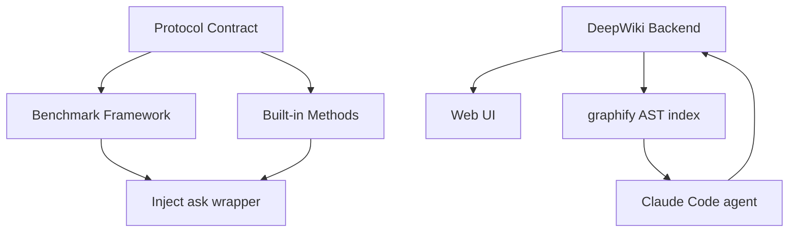
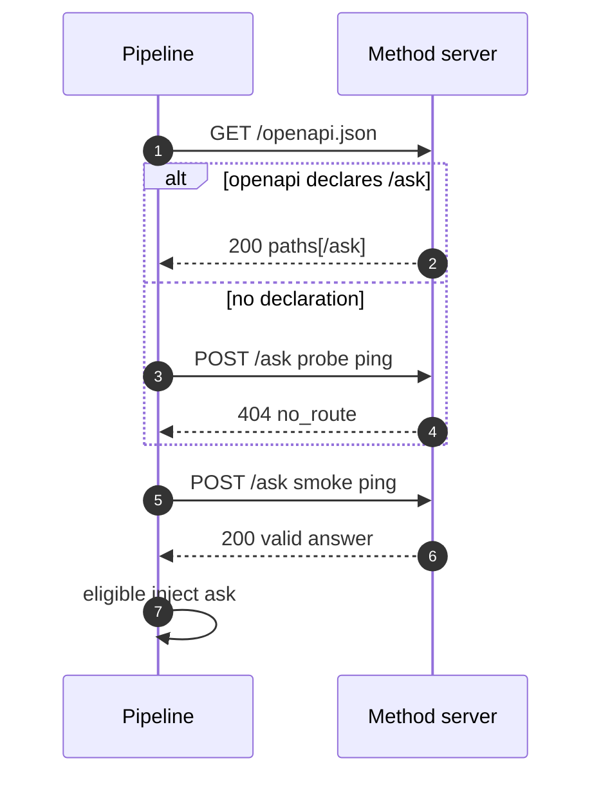
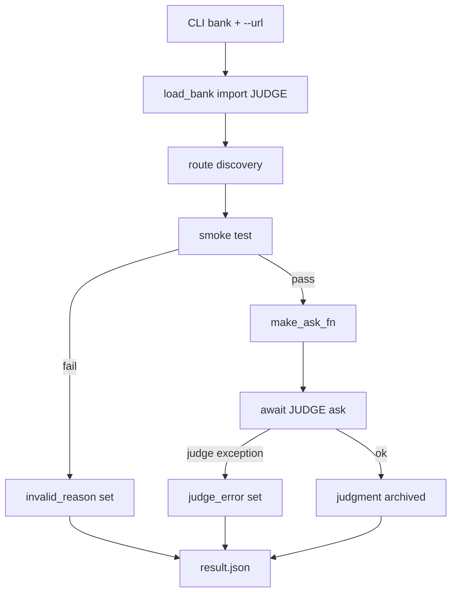
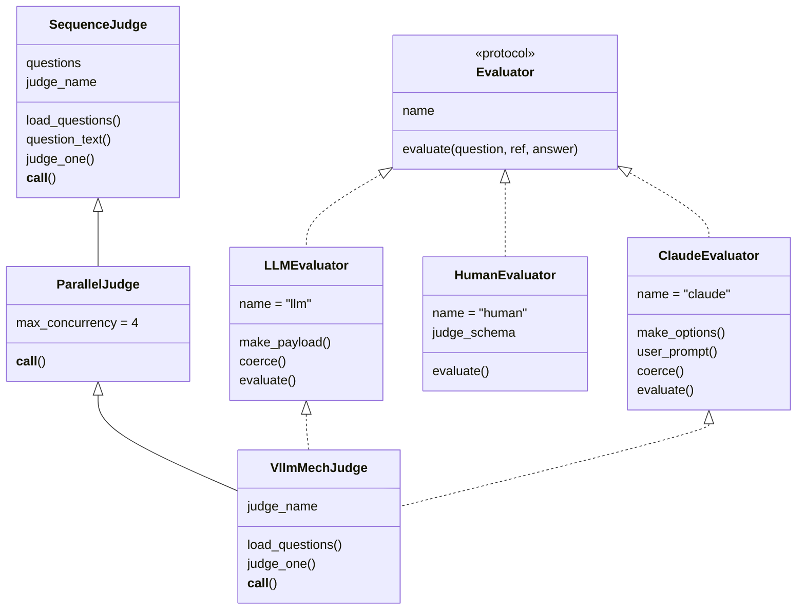
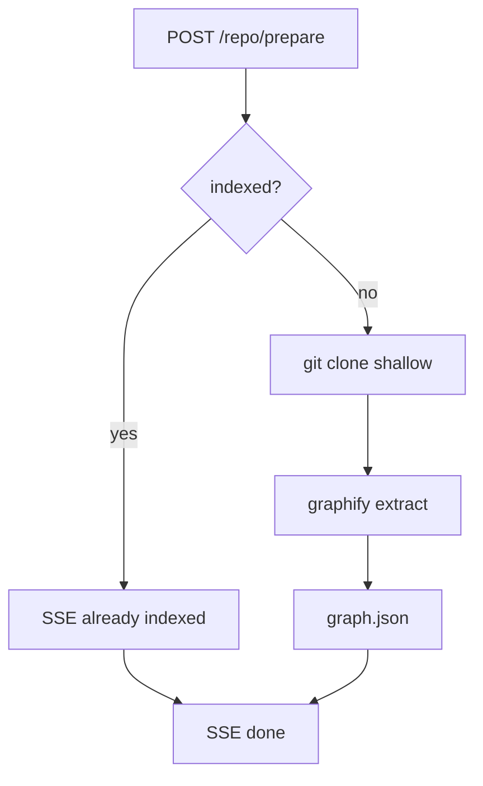
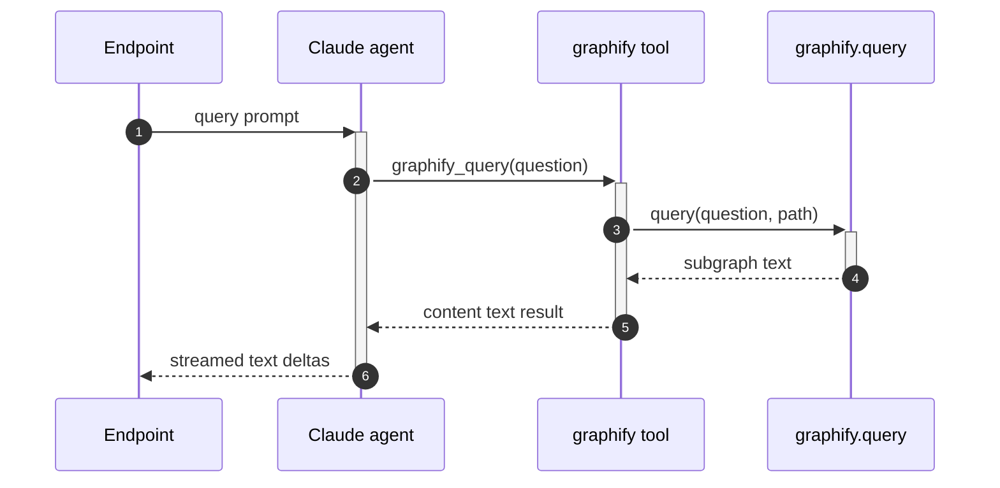
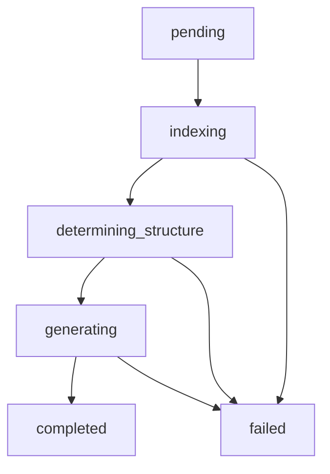

<details>
<summary>Relevant source files</summary>

The following files were used as context for generating this wiki page:

- [README.md](README.md)
- [CONTRIBUTING.md](CONTRIBUTING.md)
- [pyproject.toml](pyproject.toml)
- [gh_puller/protocol.md](gh_puller/protocol.md)
- [gh_puller/protocol.py](gh_puller/protocol.py)
- [gh_puller/types.py](gh_puller/types.py)
- [gh_puller/envs.py](gh_puller/envs.py)
- [gh_puller/graphify.py](gh_puller/graphify.py)
- [gh_puller/deepwiki.py](gh_puller/deepwiki.py)
- [gh_puller/benchmark/env.py](gh_puller/benchmark/env.py)
- [gh_puller/benchmark/pipeline.py](gh_puller/benchmark/pipeline.py)
- [gh_puller/benchmark/protocol.md](gh_puller/benchmark/protocol.md)
- [gh_puller/benchmark/judges/sequence.py](gh_puller/benchmark/judges/sequence.py)
- [gh_puller/benchmark/judges/parallel.py](gh_puller/benchmark/judges/parallel.py)
- [gh_puller/benchmark/judges/vllm_mech/bank.py](gh_puller/benchmark/judges/vllm_mech/bank.py)
- [gh_puller/benchmark/judges/vllm_mech/utils.py](gh_puller/benchmark/judges/vllm_mech/utils.py)
- [gh_puller/benchmark/judges/vllm_mech/questions.json](gh_puller/benchmark/judges/vllm_mech/questions.json)
- [gh_puller/benchmark/evaluators/base.py](gh_puller/benchmark/evaluators/base.py)
- [gh_puller/benchmark/evaluators/llm.py](gh_puller/benchmark/evaluators/llm.py)
- [gh_puller/benchmark/evaluators/claude.py](gh_puller/benchmark/evaluators/claude.py)
- [gh_puller/benchmark/evaluators/human.py](gh_puller/benchmark/evaluators/human.py)
- [tests/llm_ask/server.py](tests/llm_ask/server.py)
- [tests/llm_ask/env.py](tests/llm_ask/env.py)
- [tests/benchmark/fixtures/dummy_server.py](tests/benchmark/fixtures/dummy_server.py)
- [tests/test_graphify.py](tests/test_graphify.py)
- [tests/test_deepwiki.py](tests/test_deepwiki.py)
- [apps/webui/package.json](apps/webui/package.json)
- [apps/webui/src/app/page.tsx](apps/webui/src/app/page.tsx)
- [apps/webui/next.config.ts](apps/webui/next.config.ts)
- [apps/webui/.env.example](apps/webui/.env.example)
</details>

# Home / Overview

**gh-puller** builds GitHub open-source repositories (including their PRs and issues) into a code knowledge base equipped with an agent, and exposes REST interfaces that answer any question about the codebase. The project is currently at the **benchmark evaluation framework** stage: a test pipeline that scores the answer quality of contestant backends ("methods"). Sources: [README.md:3](), [README.md:5]()

The repository is deliberately split into independently evolving halves that interoperate only through a neutral REST contract: a **benchmark framework** (`gh_puller/benchmark/`) that grades contestant endpoints, and **built-in methods** that implement the same protocol as services. A separate **product side** — a DeepWiki-compatible backend (FastAPI endpoint layer in `apps/webui/app.py`, engine + task layer in `gh_puller/deepwiki.py`) with a Next.js front end (`apps/webui/`) — builds agent-driven wikis, chat and codemaps from a code graph produced by a local `graphify` pipeline. This page maps the whole system; detailed pages are available for [REST Protocol v1](#rest-protocol-v1), [Benchmark Evaluation Pipeline](#benchmark-evaluation-pipeline), [DeepWiki-Compatible Backend](#deepwiki-compatible-backend), and [Configuration Reference](#configuration-reference).

## Project Mission & Current Stage

- **Ultimate goal:** turn a GitHub repository (PR/Issue included) into a knowledge base with an agent, answering any codebase question over a REST interface. Sources: [README.md:3]()
- **Current stage:** the benchmark evaluation framework — a testing pipeline for scoring the answer quality of contestant backends. Sources: [README.md:5]()
- **Core design (one sentence):** question-bank autonomy plus interface injection — the pipeline wraps the contestant's interface as `ask(question) -> Answer`, injects it into `judge.__call__(ask)`, the judge loads its own question data, questions the contestant, grades it and arranges its own output; the pipeline only archives the judgment and never interprets it. Sources: [README.md:37]()

The README quick start is an end-to-end self test: start a method server, then run one evaluation (one question bank + one endpoint), producing `outputs/<timestamp>/result.json`. Sources: [README.md:20-28]()

## Repository Layout

| Path | Description |
|---|---|
| `gh_puller/benchmark/` | Evaluation framework (formal code): pipeline scheduling + REST protocol + protocol-layer types |
| `gh_puller/benchmark/judges/` | Question-bank directory (reserved): real banks written by question authors live here; authoring conventions in `protocol.md` |
| `gh_puller/protocol.md` / `protocol.py` / `types.py` | Protocol contract (sole authority): documentation + constants + types, referenced by both caller and service sides |
| `gh_puller/llm_ask/` etc. | Built-in methods: services implementing the protocol at the top level of `gh_puller/` (self-contained, evolve independently from the benchmark) |
| `gh_puller/deepwiki.py` / `envs.py` / `graphify.py` | DeepWiki-compatible backend engine + task layer (no FastAPI), global runtime parameters, in-process graphify wrapper |
| `apps/webui/app.py` | FastAPI endpoint layer (HTTP/WS/SSE 适配), separate uv project depending on `gh-puller` |
| `apps/webui/` | Next.js front end (DeepWiki-compatible UI contract) |
| `tests/` | Tests + fixtures, including the protocol-conformant methods and the dummy contestant |
| `archive/` | Old code archive (do not touch) |

Sources: [README.md:7-14](), [CONTRIBUTING.md:3-11]()

> Note: README and CONTRIBUTING describe built-in methods as living at the top level of `gh_puller/` (e.g. `gh_puller/llm_ask/`); in the current tree the `llm_ask` implementation is found under `tests/llm_ask/` (`server.py` + `env.py`). The method's own docstring states it is fully self-contained, importing only its own env module. Sources: [README.md:13](), [tests/llm_ask/server.py:1-9](), [tests/llm_ask/env.py:1-2]()

## High-Level Architecture

The system consists of three cooperating parts bound by a shared contract, plus a separate product backend:

- **Protocol contract** — the neutral, single authority for REST protocol v1 (unique route `POST /ask`); nobody holds a private copy. Sources: [gh_puller/protocol.md:3-5]()
- **Benchmark framework** — the caller side: schedules one bank + one endpoint per run, performs eligibility checks, injects `ask`, archives judgments. Sources: [gh_puller/benchmark/pipeline.py:1-5]()
- **Built-in methods (contestants)** — the service side: any server exposing `base_url/ask` per the contract, e.g. the `llm_ask` method (pure LLM Q&A) or the dummy test fixture. Sources: [tests/llm_ask/server.py:1-3](), [tests/benchmark/fixtures/dummy_server.py:1-13]()
- **DeepWiki backend + Web UI** — the knowledge-base product: index + agent + wiki/codemap generation, contracting with the deepwiki-open front end. Sources: [gh_puller/deepwiki.py:1-9]()



The architecture separates the **evaluation** concern (benchmark ↔ protocol ↔ methods) from the **product** concern (DeepWiki backend ↔ web UI); the two sides share only the protocol types and otherwise evolve independently. Sources: [README.md:18](), [CONTRIBUTING.md:11]()

### The Protocol Contract

The contract is the single source of truth for how callers and services talk:

- `gh_puller/protocol.md` — the normative document (REST protocol v1). Sources: [gh_puller/protocol.md:1-4]()
- `gh_puller/protocol.py` — the code form: route-path constants + the JSON response schema. Sources: [gh_puller/protocol.py:1-10]()
- `gh_puller/types.py` — protocol-layer datatypes shared by both sides (currently just `Answer`). Sources: [gh_puller/types.py:1-12]()

Either side may define its own extra needs (question shapes, reference answers) — the contract deliberately stays minimal. Sources: [gh_puller/types.py:3-4]()

### The Benchmark Framework

`gh_puller/benchmark/` is the formal evaluation code: `pipeline.py` (scheduling + CLI), `env.py` (shared benchmark parameters), `judges/` (question-bank infrastructure and the built-in `vllm_mech` bank), and `evaluators/` (automatic/human scoring infrastructure). The framework knows only three things: the `ask` interface signature, the `JUDGE` exported by the bank, and the judgment (archived verbatim). Sources: [gh_puller/benchmark/pipeline.py:4-5]()

### The DeepWiki Backend and Web UI

`gh_puller/deepwiki.py` is a "DeepWiki-compatible backend": the front-end contract and prompts come from deepwiki-open (MIT), but the runtime engine is replaced by a **Claude Code agent + graphify**. The original RAG (adalflow + FAISS chunk/embed retrieval) is removed entirely:

- **Index** = `graphify.extract(code_only=True)` pure-local AST graph build → `<repo>/graphify-out/graph.json`. Sources: [gh_puller/deepwiki.py:5-7]()
- **Retrieval** = `graphify.query()` wrapped as a `graphify_query` tool the agent calls on demand. Sources: [gh_puller/deepwiki.py:8](), [gh_puller/deepwiki.py:1071-1091]()
- **Chat / wiki generation / codemap** never call an LLM API directly; everything goes through the `claude_agent_sdk` Claude Code agent, with prompts (chat / deep_research / codemap / wiki page and structure) taken verbatim from deepwiki-open. Sources: [gh_puller/deepwiki.py:8-9]()

Known v1 simplifications: git CLI clone (no gitpython), char/4 token estimation (no tiktoken), languages only `en`/`zh`, a single `claude` model provider, embedded simplified file-filtering rules, and chat memory carried within a single agent session (no persistent session store). Sources: [gh_puller/deepwiki.py:11-21]()

The front end lives in `apps/webui/` — a Next.js 15 / React 19 app (with Mermaid, next-intl, next-themes, react-markdown, katex) whose home page takes a repository URL and streams generated wiki content. Sources: [apps/webui/package.json:11-26](), [apps/webui/src/app/page.tsx:393-440]()

### Built-in Methods (Contestants)

A method is any server exposing the protocol's single route. Two concrete implementations exist in the tree:

- **`llm_ask`** — the simplest method: on `POST /ask` it forwards the question to a vLLM OpenAI-compatible endpoint and returns the answer, attaching a `model` field to demonstrate protocol tolerance of extra fields. Sources: [tests/llm_ask/server.py:36-40]()
- **`dummy_server`** — a protocol-conformant fake contestant used for end-to-end self tests of the pipeline (echo-style answers so heuristic judges can hit key points); setting `DUMMY_NO_ASK=1` simulates a missing `/ask` route to exercise the negative path. Sources: [tests/benchmark/fixtures/dummy_server.py:1-14]()

### Independence Boundary

The benchmark framework and built-in methods develop independently and interoperate **only** through the protocol contract; protocol changes affect both sides and must be committed separately. Sources: [CONTRIBUTING.md:11]()

## REST Protocol v1

The contract document is the sole authority: the service side (methods) implements it, the caller side (evaluation pipeline) invokes it, and neither holds its own definition. A service only needs to provide a `base_url` (e.g. `http://localhost:8001`) to join; the caller tests exactly the one specified route and nothing else on the endpoint. Sources: [gh_puller/protocol.md:5-7]()

### POST `{base_url}/ask`

| Part | Field | Type | Required | Notes |
|---|---|---|---|---|
| Request | `question` | string | yes | Non-empty |
| Request | `*` (e.g. `context`) | any | no | Extra fields tolerated (forward compatibility) |
| Response | `answer` | string | yes | Non-empty |
| Response | `*` (e.g. `sources`) | any | no | Extra fields preserved |

Sources: [gh_puller/protocol.md:13-17](), [gh_puller/protocol.md:24-28]()

The code-form schema pins the response shape: an object with a required non-empty `answer` string, with `additionalProperties: True` for forward compatibility. Sources: [gh_puller/protocol.py:5-10]()

```python
RESPONSE_SCHEMA = {
    "type": "object",
    "required": ["answer"],
    "properties": {"answer": {"type": "string", "minLength": 1}},
    "additionalProperties": True,  # 容忍未知字段,保证协议前向兼容
}
```

Sources: [gh_puller/protocol.py:5-10]()

**Timeout & retry:** a single request times out after 3600 seconds; connection-class errors are retried automatically 3 times, HTTP errors are never retried. Sources: [gh_puller/protocol.md:35]()

### GET `{base_url}/openapi.json`

Declaring `POST /ask` in the OpenAPI paths is recommended so callers can probe the route; the caller prefers this declaration and falls back to a probe request. Sources: [gh_puller/protocol.md:37-40]()

### Route Discovery & Eligibility Check

A contestant passes only if both gates succeed; a failure in either disqualifies the endpoint. Sources: [gh_puller/protocol.md:41]()

| Step | Mechanism | Failure signal |
|---|---|---|
| 1. Route discovery | Prefer `GET /openapi.json` → `paths["/ask"]["post"]`; fallback to a probe `POST /ask` (404 ⇒ route missing; other 4xx ⇒ route present but rejecting probes) | `no_route` / `unreachable` |
| 2. Smoke test | `POST /ask` with a trivial `ping` question | Non-200, or body failing the response schema |

Sources: [gh_puller/protocol.md:41-45](), [gh_puller/benchmark/pipeline.py:69-104]()



Sources: [gh_puller/benchmark/pipeline.py:69-104]()

## Benchmark Evaluation Pipeline

One run = **one question-bank file** (`--bank`) + **one contestant endpoint** (`--url`). The framework loads the bank module, checks eligibility, injects the `ask` wrapper, collects the judgment, and writes a single-file archive. Sources: [gh_puller/benchmark/pipeline.py:3-6]()

### Single Run Flow



Sources: [gh_puller/benchmark/pipeline.py:138-153](), [gh_puller/benchmark/pipeline.py:159-164]()

Key pipeline functions:

| Function | Role |
|---|---|
| `load_bank(path)` | Plugin-style import of any bank file; requires a callable `JUDGE` export, never touches question data. Sources: [gh_puller/benchmark/pipeline.py:50-63]() |
| `_discover_route(client, base_url)` | Probe `/ask`, returns `ok` / `no_route` / `unreachable`. Sources: [gh_puller/benchmark/pipeline.py:69-85]() |
| `check_eligibility(client, base_url)` | Two-gate check → `EligibilityResult(valid, detail)`. Sources: [gh_puller/benchmark/pipeline.py:88-104]() |
| `_post_ask(client, base_url, question)` | One question request; `tenacity` retry (3 attempts, exponential backoff) for `httpx.TransportError` only. Sources: [gh_puller/benchmark/pipeline.py:26](), [gh_puller/benchmark/pipeline.py:110-121]() |
| `make_ask_fn(client, base_url)` | Builds `async ask(question) -> Answer`; validates the body against `RESPONSE_SCHEMA`. Sources: [gh_puller/benchmark/pipeline.py:124-132]() |
| `run_benchmark(module, url, name)` | Orchestrates eligibility → JUDGE call → `BenchResult`. Sources: [gh_puller/benchmark/pipeline.py:138-153]() |
| `write_result(result, out_dir)` | Single-object JSON archive; non-serializable judgments fall back to `repr`. Sources: [gh_puller/benchmark/pipeline.py:159-164]() |

### CLI & Output

| Argument | Type | Default | Meaning |
|---|---|---|---|
| `bank` (positional) | `Path` | — | Bank file exporting `JUDGE` (any path, plugin-style) |
| `--url` | str | required | Contestant `base_url` |
| `--name` | str | url | Optional contestant alias |
| `--out-dir` | `Path` | `outputs/<YYYYmmdd_HHMMSS>` | Output directory (evaluated once at parse time) |

Sources: [gh_puller/benchmark/pipeline.py:170-179]()

```bash
uv run benchmark gh_puller/benchmark/judges/vllm_mech/bank.py --url http://localhost:8001
```

Sources: [README.md:25]()

### Data Models

`BenchResult` is the archived object: `name`, `url`, `valid`, `invalid_reason` (non-empty only when disqualified), `judgment` (judge output verbatim; empty on judge failure), `judge_error` (non-empty only on judge exception). Its fields are also specified in the authoring protocol. Sources: [gh_puller/benchmark/pipeline.py:37-44](), [gh_puller/benchmark/protocol.md:45]()

### Judges: Sequence & Parallel

`SequenceJudge` is a half-abstract base: a subclass *is* a question sequence (a list of dicts with `id` / `question` / `ref_answer`), with optional hooks. The built-in `__call__` loops question by question: `ask(question_text(q))` → `judge_one(q, answer)` → aggregate. Sources: [gh_puller/benchmark/judges/sequence.py:13-18](), [gh_puller/benchmark/judges/sequence.py:41-51]()

| Extension point | Default | Override when |
|---|---|---|
| `questions` / `load_questions()` | class attribute list | Questions come from a JSON file (e.g. `vllm_mech`) |
| `question_text(q)` | `q["question"]` | Question shape is not a dict |
| `judge_one(q, a)` | Keyword-hit score against `ref_answer` (case-insensitive) | Grading needs an evaluator, human review, etc. |
| `judge_name` | `"sequence"` | Output label |

Sources: [gh_puller/benchmark/judges/sequence.py:13-39]()

`ParallelJudge` keeps the same extension points and output contract but runs questions concurrently under a `Semaphore(max_concurrency)`, with per-question fault tolerance (a failing question becomes an `error` placeholder result; `gather` preserves order). `max_concurrency=1` degrades to strict serial execution; concurrency is only for stateless automatic evaluators (LLM / Claude) — `HumanEvaluator` (shared mutable state) must be used with `SequenceJudge`. Sources: [gh_puller/benchmark/judges/parallel.py:1-7](), [gh_puller/benchmark/judges/parallel.py:14-44]()

### Evaluators: LLM / Claude / Human

Evaluators are low-level static tools with only an `evaluate` interface and no lifecycle; question banks call them as needed. Sources: [gh_puller/benchmark/evaluators/base.py:1-9]()



Sources: [gh_puller/benchmark/evaluators/base.py:14-26](), [gh_puller/benchmark/judges/sequence.py:13-18](), [gh_puller/benchmark/judges/parallel.py:14-18](), [gh_puller/benchmark/judges/vllm_mech/bank.py:68-111]()

- **`LLMEvaluator`** — automatic multi-dimension scoring via a vLLM OpenAI-compatible API. The mechanism (HTTP call, one retry with a "JSON only" nudge on parse failure, degraded output) lives in the base; the payload and verdict coercion are bank-provided extension points. Sources: [gh_puller/benchmark/evaluators/llm.py:1-7](), [gh_puller/benchmark/evaluators/llm.py:39-54]()
- **`ClaudeEvaluator`** — automatic scoring via a headless `claude_agent_sdk` agent; agent options (system prompt / tools / model), query text and coercion are extension points; failures degrade instead of raising. Sources: [gh_puller/benchmark/evaluators/claude.py:1-7](), [gh_puller/benchmark/evaluators/claude.py:36-48]()
- **`HumanEvaluator`** — per-question human review on a web page: three-string input (question/ref/answer), form output whose structure is defined by the constructor's `judge_schema`; the review server is started lazily on first `evaluate` and reused afterwards. Sources: [gh_puller/benchmark/evaluators/human.py:112-139](), [gh_puller/benchmark/evaluators/human.py:141-154]()

### Authoring a Question Bank (vllm_mech example)

A bank = **one Python file** (exporting `JUDGE`) + **several JSON datasets** that the judge loads itself; the file may live at any path and stays usable after packaging. Sources: [gh_puller/benchmark/protocol.md:8-10]()

```python
# my_bank.py —— 题库文件
from gh_puller.types import Answer

class MyJudge:
    async def __call__(self, ask) -> dict:
        # 自行 load 自己的 JSON 数据集（题目/参考答案，格式自己定）
        # 自行调用服务方接口，自行评判，自行组织输出
        ...

JUDGE = MyJudge()
```

Sources: [gh_puller/benchmark/protocol.md:12-23]()

The `JUDGE` contract: `async def __call__(self, ask) -> Any`; `ask` is the injected wrapper `async def ask(question: str) -> Answer` (already timeout-bounded and retried for connection errors; other exceptions propagate to the judge); the return value is any JSON-serializable judgment, archived verbatim; a judge exception marks the run as "judge failure" but still produces an archive. Sources: [gh_puller/benchmark/protocol.md:25-31]()

The built-in `vllm_mech` bank is the reference application: `questions.json` supplies questions (each `ref_answer` being 3–4 assert-style key points), and grading is multi-dimensional via the automatic evaluators. Sources: [gh_puller/benchmark/judges/vllm_mech/bank.py:1-8](), [gh_puller/benchmark/judges/vllm_mech/bank.py:77-90]()

```json
[
  {
    "id": "m01",
    "question": "PagedAttention 解决了什么问题?其核心思想是什么?",
    "ref_answer": [
      "KV cache 按固定大小的块(block)分页管理,而非整段连续分配",
      "解决显存内部碎片化与过度预留问题,提高 KV cache 显存利用率",
      "通过 block table 维护逻辑块到物理块的映射",
      "支持块级共享,多输出序列可共享相同前缀块"
    ]
  }
]
```

Sources: [gh_puller/benchmark/judges/vllm_mech/questions.json:1-13]()

The bank's scoring rules hang off the evaluator extension points:

| Extension | Definition (bank-specific) |
|---|---|
| `DIMENSIONS` | Seven 0–10 dimensions: `code_essence`, `detail`, `file_links`, `time_precision`, `accuracy`, `logic_depth`, `latent_need` |
| `auto_system_prompt()` | Scoring-rules prompt for the evaluator |
| `auto_user_prompt(q, ref, answer)` | One-question request (question + key points + contestant answer + JSON spec) |
| `coerce_verdict(data)` | Normalization: dimension fill / clamp 0–10, `overall` clamp, `reason` fallback |
| `MCP_SERVERS` / `SKILLS` | Tool authorization for the Claude evaluator (empty for pure scoring) |

Sources: [gh_puller/benchmark/judges/vllm_mech/utils.py:7-16](), [gh_puller/benchmark/judges/vllm_mech/utils.py:18-59]()

The judge is `VllmMechJudge(ParallelJudge)`: it chooses `VllmMechClaudeEvaluator` when `JUDGE_EVALUATOR=claude`, otherwise `VllmMechLLMEvaluator` (default), and finalizes by aggregating a `summary` of `overall_mean` and per-dimension means across questions. Sources: [gh_puller/benchmark/judges/vllm_mech/bank.py:73-75](), [gh_puller/benchmark/judges/vllm_mech/bank.py:92-108]()

## DeepWiki-Compatible Backend

The backend is a single FastAPI app (`apps/webui/app.py`) whose endpoint contract matches deepwiki-open; the engine is a Claude Code agent + graphify, kept in `gh_puller/deepwiki.py` (no FastAPI dependency, reusable by CLI apps such as a future `apps/tui`). Sources: [gh_puller/deepwiki.py:1-9](), [apps/webui/app.py:85-93](), [apps/webui/app.py:96]()

### Repository Handling

`Repo` is the uniform handle for remote repositories and local paths: a URL is cloned with the git CLI into `<root>/<name>`, a local path is read directly. Cloning is shallow (`--depth=1 --single-branch`, 600 s timeout); errors hide the access token in both raw and percent-encoded forms. Sources: [gh_puller/deepwiki.py:804-875]()

File traversal is rule-based: `iterate_files` walks the repo applying a processable extension set plus include/exclude rules (directory name matching on any path segment; file name exact match or `endswith`); `read_repo_file_tree` returns the file list and the README text. Sources: [gh_puller/deepwiki.py:883-971]()

### Repository Indexing via Graphify

`graphify.py` is an in-process wrapper over the graphify CLI's three commands (`extract` / `export` / `query`), ported as callable module functions with the CLI's defaults as the authority. Sources: [gh_puller/graphify.py:1-19]()

| Function | CLI equivalence | Notes |
|---|---|---|
| `extract(path, ...)` | `graphify extract` | detect → AST (local) → semantic (cache-first, LLM on miss) → merge → build → cluster → write `graph.json` + `.graphify_analysis.json`; returns a JSON-serializable summary or an error-state dict. Sources: [gh_puller/graphify.py:158-186]() |
| `export(format, ...)` | `graphify export` / `tree` | html / svg / falkordb (or local `cypher.txt`) / tree / callflow-html; errors degrade to `{"error": ...}`. Sources: [gh_puller/graphify.py:463-485]() |
| `query(question, ...)` | `graphify query` | Undirected graph traversal (BFS/DFS, depth 2 default) producing a Q&A-oriented subgraph text; purely local, no API key. Sources: [gh_puller/graphify.py:553-604]() |

The backend wraps this in three helpers: `_graph_path` (canonical `graph.json` location), `_index_ready` (existence check), and `_run_extract` (runs `graphify.extract(code_only=True)` in a thread — pure-local AST, no key required). Sources: [gh_puller/deepwiki.py:1047-1068]()



Sources: [apps/webui/app.py:134-165](), [gh_puller/deepwiki.py:846-862]()

### Claude Agent Integration

Every LLM-touching feature goes through a Claude Code agent; when a repo handle is present, the agent receives an in-process MCP server exposing `graphify_query`, which calls `graphify.query()` on the repo's graph and returns a text result with `Source: <file path> L<line number>` markers. Sources: [gh_puller/deepwiki.py:1071-1091]()



Sources: [gh_puller/deepwiki.py:1071-1091](), [gh_puller/deepwiki.py:1114-1140]()

Model precedence in `_agent_options`: `envs.CLAUDE_AGENT_MODEL` > request `model` > SDK default; with a repo attached the agent is granted the `graphify_query` / `mcp__graphify__graphify_query` tools. Sources: [gh_puller/deepwiki.py:1099-1111]()

### Chat & Codemap Streaming

- **Chat** (`/ws/chat`, `/chat/completions/stream`): the request must be for an indexed repo (`RepoNotIndexedError` otherwise; HTTP 425 for the REST variant); `chat_stream` picks the prompt by message mode — simple chat, or `deep_research` with per-iteration prompts (first / intermediate / final at ≥ 5 iterations), with "continue + research" fallback to the first user message. Sources: [gh_puller/deepwiki.py:1578-1589](), [gh_puller/deepwiki.py:1602-1631](), [apps/webui/app.py:222-236]()
- **Codemap** (`/ws/codemap`, `/codemap/stream`): two-phase generation (skeleton → guide/diagrams) emitted as NDJSON events; phase-2 failure degrades to the skeleton; citations are then grounded against real source files via snippet search. Sources: [gh_puller/deepwiki.py:1740-1805](), [gh_puller/deepwiki.py:1001-1039]()

### Wiki Generation State Machine

A submitted wiki task walks a tracked state machine, driven by `generate_repo_wiki`: index (once) → determine structure → generate pages → save cache → completed; any exception marks the task `FAILED` with an `error` message. Sources: [gh_puller/deepwiki.py:1933-1961]()



Sources: [gh_puller/deepwiki.py:634-644](), [gh_puller/deepwiki.py:1933-1961]()

`TaskRegistry` implements get-or-create submission semantics: an active task joins (`joined=True`), an existing cache short-circuits as `from_cache=True`, otherwise a new task runs under a semaphore-limited concurrency and is lazily removed after a TTL once terminal. Sources: [gh_puller/deepwiki.py:1877-1930]()

### Cache & Export

Wiki cache is one JSON file per `(type, owner, repo, language)` under `<DEEPWIKI_ROOT>/wikicache/`, named `deepwiki_cache_<repo_type>_<owner>_<repo>_<language>.json`; cache entries list as completed task summaries, and the processed-projects list is derived from them (sorted by submission time, descending). Sources: [gh_puller/deepwiki.py:55-59](), [gh_puller/deepwiki.py:1438-1444](), [gh_puller/deepwiki.py:1481-1525]()

`export_wiki` serializes a wiki to markdown (TOC + per-page sections with related-page links) or JSON (metadata + pages); the `/export/wiki` endpoint returns it as a downloadable attachment. Sources: [gh_puller/deepwiki.py:1528-1570](), [apps/webui/app.py:290-308]()

### HTTP Endpoint Reference

| Method & Path | Purpose |
|---|---|
| `GET /` | Liveness welcome. Sources: [apps/webui/app.py:96-99]() |
| `GET /health` | Health check. Sources: [apps/webui/app.py:102-104]() |
| `GET /lang/config` | Supported languages + default (`en`). Sources: [apps/webui/app.py:107-109]() |
| `GET /models/config` | Model providers (single `claude` provider). Sources: [apps/webui/app.py:113-115]() |
| `GET /auth/status`, `POST /auth/validate` | Wiki-delete authorization. Sources: [apps/webui/app.py:117-124]() |
| `POST /repo/prepare` | Clone + index with SSE progress (heartbeat every 10 s). Sources: [apps/webui/app.py:134-165]() |
| `GET /repo/index/status` | Cheap readiness probe. Sources: [apps/webui/app.py:178-183]() |
| `WS /ws/chat`, `POST /chat/completions/stream` | Streamed chat. Sources: [apps/webui/app.py:190-236]() |
| `WS /ws/codemap`, `POST /codemap/stream`, `GET /codemap/file` | Codemap generation / raw file. Sources: [apps/webui/app.py:243-281]() |
| `POST /export/wiki` | Download wiki as markdown/JSON. Sources: [apps/webui/app.py:290-308]() |
| `GET /local_repo/structure` | Local repo file tree + README. Sources: [apps/webui/app.py:310-321]() |
| `GET/DELETE /api/wiki_cache` | Read/delete wiki cache. Sources: [apps/webui/app.py:324-355]() |
| `GET /api/processed_projects` | Processed projects list. Sources: [apps/webui/app.py:358-361]() |
| `POST/GET /wiki/tasks`, `GET /wiki/tasks/{id}`, `GET /wiki/tasks/{id}/stream` | Wiki task submission, listing, status, SSE stream. Sources: [apps/webui/app.py:366-417]() |

The backend embeds default file-filtering rules (excluded dirs like `node_modules`, `__pycache__`, `dist`; excluded files like lockfiles and `README.md`; a processable extension set) mirroring a simplified version of the original `repo.json` rules. Sources: [gh_puller/deepwiki.py:2058-2079]()

## Front End (apps/webui)

The front end is a Next.js app (`gh-puller-frontend` v0.1.0, Next 15 / React 19 / Tailwind 4) that consumes the backend through a home-page experience: repository URL input (owner/repo, GitHub/GitLab/BitBucket URL, or a local folder path), a configuration modal (language, comprehensive view, provider/model, access token, file filters), the processed-projects list, and Mermaid-based demo visualizations. Sources: [apps/webui/src/app/page.tsx:177-246](), [apps/webui/src/app/page.tsx:393-440](), [apps/webui/src/app/page.tsx:488-593]()

Submitting the form navigates to the dynamic route `/{owner}/{repo}` with query parameters (token, type, repo_url/local_path, provider/model, file filters, language, comprehensive); per-repo configuration is cached in `localStorage`. Sources: [apps/webui/src/app/page.tsx:292-391]()

Next.js route handlers under `apps/webui/src/app/api/` mirror the backend endpoints (`auth/status`, `auth/validate`, `chat/stream`, `models/config`, `repo/prepare`, `wiki/projects`, `wiki/tasks`, …), and `next.config.ts` rewrites `/api/*` calls to the backend `SERVER_BASE_URL` (default `http://localhost:8001`), while browsers connect directly to the backend WS port derived from `NEXT_PUBLIC_API_PORT` (default 8001). Sources: [apps/webui/next.config.ts:4-60](), [apps/webui/.env.example]()

## Configuration Reference

### Backend Runtime Parameters

All deepwiki-backend parameters are read from a single entry point (`gh_puller/envs.py`) — the backend and its subprocesses never read `os.environ` directly. Sources: [gh_puller/envs.py:1-6]()

| Environment variable | Default | Meaning |
|---|---|---|
| `ANTHROPIC_API_KEY` | `""` | Claude agent (SDK) key |
| `CLAUDE_AGENT_MODEL` | `""` (SDK default) | Agent model |
| `DEEPWIKI_ROOT` | `~/.adalflow` | Artifact root: `repos/` clones, `graphify-out/` index, `wikicache/` cache |
| `DEEPWIKI_AUTH_MODE` / `DEEPWIKI_AUTH_CODE` | `False` / `""` | Wiki-delete authorization (string-truthy check) |
| `DEEPWIKI_MAX_CONCURRENT_WIKI_TASKS` | `max(1, cpu//2)` | Wiki task concurrency |
| `DEEPWIKI_WIKI_PAGE_CONCURRENCY` | `1` | Per-task page generation concurrency |
| `DEEPWIKI_WIKI_PAGE_RETRIES` | `2` | Per-page retry budget |
| `DEEPWIKI_WIKI_TASK_TTL_SECONDS` | `300` | Terminal task retention |
| `PORT` | `8001` | uvicorn port (linked to front-end `NEXT_PUBLIC_API_PORT`) |
| `GRAPHIFY_OUT` | `graphify-out` | Index output dir name |
| `DEEPWIKI_CHAT_TOKEN_LIMIT` | `7500` | Chat input token estimate (chars/4) |

Sources: [gh_puller/envs.py:11-35]()

### Benchmark Parameters

Shared benchmark values live in `gh_puller/benchmark/env.py` — the single entry point for the whole framework. Sources: [gh_puller/benchmark/env.py:1-2]()

| Name | Default | Meaning |
|---|---|---|
| `TIMEOUT` | `3600.0` s | Per-question timeout: contestant ask and evaluator scoring share the cap |
| `JUDGE_EVALUATOR` | `llm` | `claude` switches banks to the Claude Code evaluator |
| `LLM_JUDGE_URL` | `http://localhost:8000/v1` | vLLM OpenAI-compatible endpoint, `.../chat/completions` |
| `LLM_JUDGE_MODEL` | `Qwen2.5-7B-Instruct` | Scoring model |
| `LLM_JUDGE_API_KEY` | `""` | Endpoint auth; empty ⇒ no `Authorization` header |
| `CLAUDE_JUDGE_MODEL` | `""` (SDK default) | Claude evaluator model (needs `ANTHROPIC_API_KEY`) |

Sources: [gh_puller/benchmark/env.py:5-16]()

The `llm_ask` method keeps its own independent env module (`tests/llm_ask/env.py`) with the same shape: `TIMEOUT` (3600 s), `LLM_ASK_URL` (`http://localhost:8000/v1`), `LLM_ASK_MODEL` (`Qwen2.5-7B-Instruct`), `LLM_ASK_API_KEY`. Sources: [tests/llm_ask/env.py:5-10]()

### Project Dependencies & Entry Points

The package is `gh-puller` v0.1.0, Python ≥ 3.13, with a `uv`-managed editable dependency on the local `graphifyy` package. Core dependencies include `fastapi`, `uvicorn`, `httpx`, `jsonschema`, `tenacity`, `claude-agent-sdk`, `openai`, `graphifyy`, `dash`/`dash-cytoscape`, `aiosqlite`, `websockets`, `scipy`, `python-dotenv`. Sources: [pyproject.toml:1-26](), [pyproject.toml:52-54]()

The single console script is the benchmark CLI:

```toml
[project.scripts]
benchmark = "gh_puller.benchmark.pipeline:main"
```

Sources: [pyproject.toml:28]()

The backend is started via uvicorn from the project dir (`cd apps/webui && uv run uvicorn app:app --port 8001`, port from `envs.PORT`) or by running `app.py` directly. Sources: [apps/webui/app.py:421-427](), [apps/webui/README.md](apps/webui/README.md)

## Testing

- `tests/test_graphify.py` — local integration tests of the `gh_puller.graphify` wrapper: no mocking of the graphify library, a real `code_only` run on a tiny tmp corpus (no LLM cost, no network), covering the extract main path and degradation, all five export formats, query, and CLI-normalization helpers. Sources: [tests/test_graphify.py:1-8]()
- `tests/test_deepwiki.py` — backend engine/task tests without calling a Claude agent: pure functions (structure parsing, citation post-processing, snippet location, JSON repair) and Repo clone semantics (token hiding). Sources: [tests/test_deepwiki.py:1-14]()
- `apps/webui/tests/test_app.py` — HTTP endpoint contract tests (the API project's own suite): endpoint smokes, unindexed error semantics (chat 425), prepare runs real `graphify.extract` (`code_only`). Sources: [apps/webui/tests/test_app.py:1-6]()
- `tests/benchmark/fixtures/dummy_server.py` — protocol-conformant fake contestant for end-to-end pipeline tests (negative path via `DUMMY_NO_ASK=1`). Sources: [tests/benchmark/fixtures/dummy_server.py:6-13]()

## Development Workflow

- `master` is the only long-lived branch (stable baseline); each piece of work gets a short-lived topic branch named `feat/benchmark-*`, `feat/methods-*`, `feat/protocol-*`, `fix/*`, `docs/*`, merged back and deleted when done; one branch never mixes changes from two sub-packages. Sources: [CONTRIBUTING.md:15-17]()
- Commit format `<type>: <中文描述>` where type ∈ `protocol` (top-level contract), `benchmark` (framework), `methods` (built-in methods), `docs`, `chore`; one commit touches one sub-package, and protocol changes are committed separately. Sources: [CONTRIBUTING.md:21-31]()

## Summary

gh-puller is a two-sided system held together by one minimal REST contract. On the evaluation side, a bank-agnostic pipeline grades contestant methods by injecting an `ask(question) -> Answer` wrapper into a bank-authored `JUDGE`, keeping the framework ignorant of question shapes, reference answers, and grading logic. On the product side, a DeepWiki-compatible backend (FastAPI endpoint layer in `apps/webui/app.py`, engine + task layer in `gh_puller/`) replaces the original RAG with a local `graphify` AST index and a Claude Code agent that retrieves code subgraphs through the `graphify_query` tool — powering chat, code maps, and agent-generated wikis served to a Next.js front end. The contract (document + constants + types) is the single authority both sides share, and the two halves evolve independently by design. Sources: [README.md:3-5](), [README.md:37](), [gh_puller/deepwiki.py:1-9](), [apps/webui/app.py:1-5](), [CONTRIBUTING.md:11]()
